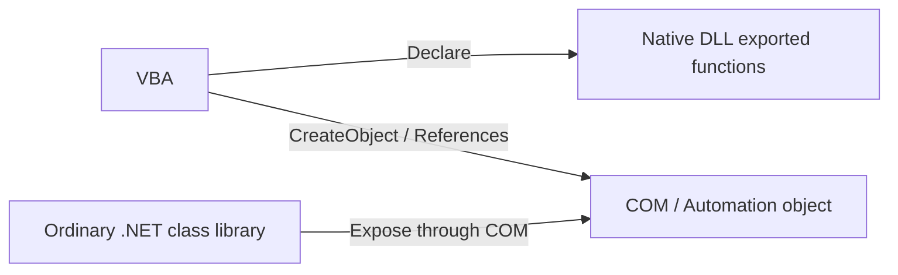
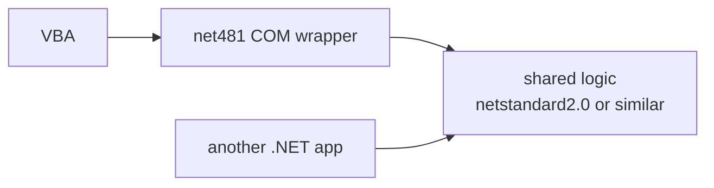

It is a very ordinary request:

"We have Excel or Access VBA, and we want to call existing C# logic from it."

Typical reasons are:

- move string processing or crypto work out of VBA
- stop doing JSON, HTTP, or XML handling directly in macros
- reuse a C# library that already exists in-house

The first place people usually slip is this expectation:

"Maybe VBA can just reference the .NET DLL directly."

That is where the road gets muddy.

For ordinary C# class libraries, the standard way to make them usable from VBA is to **expose them through COM**.  
This article focuses first on the least-friction route, **.NET Framework 4.8.x plus COM exposure**, and then explains what changes if you want to do something similar with **.NET 8 or later**.

To avoid a common misunderstanding up front:

this is **not** an argument that every new system should be built on .NET Framework.  
It is a much narrower point:

**if the problem is specifically the VBA-facing boundary, .NET Framework 4.8.x is still the more straightforward COM bridge in practice.**

## 1. The short version

- VBA cannot **directly call an arbitrary .NET DLL**
- `Declare` in VBA is for **native exported DLL functions**
- if you want to use an ordinary C# class library from VBA, you typically expose it as **COM / Automation**
- the path of least resistance is often a **small `net481` COM wrapper**
- you can do COM exposure from **.NET 8+**, but the type-library story for comfortable VBA early binding is heavier
- once 32-bit and 64-bit Office enter the picture, **Office bitness and dependency bitness** should be aligned early

In practice, when people say "use a .NET DLL from VBA," they are usually mixing together two different things:

1. **calling a native DLL through `Declare`**
2. **using a managed DLL by exposing it through COM**

This article is mainly about the second path.

## 2. What this article is and is not about

This article is for situations like:

- calling custom C# logic from Excel, Access, or Word VBA
- reusing an existing internal .NET library from macros
- failing to add a DLL through VBE **References**
- wanting a `CreateObject`-style entry point
- wanting comfortable early binding with object-browser visibility and completion

It is not mainly about:

- VSTO add-ins or Office add-ins that live inside Office
- XLLs for worksheet-function scenarios
- calling a native C / C++ DLL through `Declare`

## 3. Why VBA cannot just use a normal .NET DLL directly

From VBA, the practical entry points are usually one of these:

- `Declare Function ... Lib "xxx.dll"` for **native exported functions**
- `CreateObject` or **References** for **COM objects**

A normal C# class library does **not** look like a native DLL export surface.  
So if VBA is going to use it, the ordinary path is to make it visible as a **COM object**.



The core idea is simple:

- `Declare` is for native DLL entry points
- VBA is very comfortable with COM / Automation
- a normal .NET library therefore needs a **COM face**

Once you frame it that way, the topic becomes much easier to reason about.

## 4. The most practical route: a thin `net481` COM wrapper

If the real problem is only the VBA boundary, the most straightforward option is still often:

**a .NET Framework 4.8.1 class library exposed through COM**

Why this remains practical:

- `RegAsm.exe` makes registration and type-library generation straightforward
- the result fits well with VBA **References**
- the surrounding Office / VBA / COM ecosystem still understands this path very naturally

### 4.1 The design that usually stays sane

Exposing all of your business logic directly through COM is usually heavier than it first sounds.  
A much calmer design is to keep the COM boundary thin.


That usually means:

- VBA sees only a small, stable surface
- implementation details stay in .NET
- COM-visible types stay deliberately simple

That boundary is much easier to keep stable over time.

### 4.2 Example structure

For the sample, imagine a small class called `TextTools` that you want VBA to use.

The three main files are:

- `KomuraSoft.VbaBridge.csproj`
- `Properties/AssemblyInfo.cs`
- `TextTools.cs`

### 4.3 `KomuraSoft.VbaBridge.csproj`

```xml
<Project Sdk="Microsoft.NET.Sdk">
  <PropertyGroup>
    <TargetFramework>net481</TargetFramework>
    <AssemblyName>KomuraSoft.VbaBridge</AssemblyName>
    <RootNamespace>KomuraSoft.VbaBridge</RootNamespace>
    <GenerateAssemblyInfo>false</GenerateAssemblyInfo>
    <Nullable>disable</Nullable>
    <LangVersion>latest</LangVersion>
  </PropertyGroup>
</Project>
```

### 4.4 `Properties/AssemblyInfo.cs`

```csharp
using System.Reflection;
using System.Runtime.InteropServices;

[assembly: AssemblyTitle("KomuraSoft.VbaBridge")]
[assembly: AssemblyDescription("COM bridge for VBA")]
[assembly: AssemblyCompany("KomuraSoft")]
[assembly: AssemblyProduct("KomuraSoft.VbaBridge")]
[assembly: AssemblyVersion("1.0.0.0")]
[assembly: AssemblyFileVersion("1.0.0.0")]

// Keep the assembly closed by default and open only the types you intend to expose.
[assembly: ComVisible(false)]
[assembly: Guid("2E9A38C7-7E9B-4E0D-8A9F-6C7DAB0A6101")]
```

### 4.5 `TextTools.cs`

```csharp
using System;
using System.IO;
using System.Runtime.InteropServices;
using System.Security.Cryptography;
using System.Text;

namespace KomuraSoft.VbaBridge
{
    [ComVisible(true)]
    [Guid("E1B2D8C2-9A8A-4D5C-A7A3-0E8F4D690102")]
    [InterfaceType(ComInterfaceType.InterfaceIsDual)]
    public interface ITextTools
    {
        [DispId(1)]
        int Add(int a, int b);

        [DispId(2)]
        string JoinPath(string basePath, string childName);

        [DispId(3)]
        string NormalizeLineEndings(string value);

        [DispId(4)]
        string Sha256Hex(string value);
    }

    [ComVisible(true)]
    [Guid("8E0F14F9-6F0F-4F1A-9C2D-1A8D8E4F0103")]
    [ProgId("KomuraSoft.VbaBridge.TextTools")]
    [ClassInterface(ClassInterfaceType.None)]
    public sealed class TextTools : ITextTools
    {
        public int Add(int a, int b) => checked(a + b);

        public string JoinPath(string basePath, string childName)
        {
            if (basePath == null) throw new ArgumentNullException(nameof(basePath));
            if (childName == null) throw new ArgumentNullException(nameof(childName));
            return Path.Combine(basePath, childName);
        }

        public string NormalizeLineEndings(string value)
        {
            if (value == null) throw new ArgumentNullException(nameof(value));
            string normalized = value.Replace("\r\n", "\n").Replace("\r", "\n");
            return normalized.Replace("\n", Environment.NewLine);
        }

        public string Sha256Hex(string value)
        {
            if (value == null) throw new ArgumentNullException(nameof(value));

            byte[] bytes = Encoding.UTF8.GetBytes(value);
            using (SHA256 sha = SHA256.Create())
            {
                byte[] hash = sha.ComputeHash(bytes);
                StringBuilder sb = new StringBuilder(hash.Length * 2);

                foreach (byte b in hash)
                {
                    sb.Append(b.ToString("x2"));
                }

                return sb.ToString();
            }
        }
    }
}
```

The important design choices here are:

- define an interface explicitly
- set the class to **`ClassInterfaceType.None`**
- expose only the members you really want VBA to see
- assign a fixed `ProgId` so `CreateObject` stays predictable

### 4.6 Why `ClassInterfaceType.None` matters

One of the easiest COM mistakes is to expose the class too casually and let the class interface shape itself.

That can work at first, but it becomes fragile when members are added or reorganized later.

A safer posture is:

- the public COM contract is the interface
- the class uses **`ClassInterfaceType.None`**
- avoid relying on `AutoDual`

COM boundaries become much harder to change safely once other code depends on them.

### 4.7 Build and registration

After building, use `RegAsm.exe` from the output folder.

#### For 32-bit Office

```bat
C:\Windows\Microsoft.NET\Framework\v4.0.30319\RegAsm.exe KomuraSoft.VbaBridge.dll /codebase /tlb:KomuraSoft.VbaBridge.tlb
```

#### For 64-bit Office

```bat
C:\Windows\Microsoft.NET\Framework64\v4.0.30319\RegAsm.exe KomuraSoft.VbaBridge.dll /codebase /tlb:KomuraSoft.VbaBridge.tlb
```

Three practical points matter here:

- use the side that matches **Office bitness**
- `/tlb` makes life easier for VBA **References**
- `/codebase` is convenient, but it records the file location; if the DLL moves later, activation can fail

### 4.8 Start with late binding to prove the path

The easiest first verification is late binding without adding a reference:

```vb
Option Explicit

Public Sub Sample_UseDotNetDll_LateBinding()
    Dim tools As Object
    Set tools = CreateObject("KomuraSoft.VbaBridge.TextTools")

    Debug.Print tools.Add(10, 20)
    Debug.Print tools.JoinPath("C:\Work", "report.csv")
    Debug.Print tools.NormalizeLineEndings("A" & vbLf & "B")
    Debug.Print tools.Sha256Hex("hello")
End Sub
```

If that works, the big pieces are already in place:

- COM registration
- `ProgId`
- object activation

### 4.9 Then move toward early binding

The next step is to add the generated `KomuraSoft.VbaBridge.tlb` through **Tools -> References** in the VBE.

Then you can write code in the style below:

```vb
Option Explicit

Public Sub Sample_UseDotNetDll_EarlyBinding()
    Dim tools As TextTools
    Set tools = New TextTools

    Debug.Print tools.Add(3, 4)
    Debug.Print tools.JoinPath("C:\Temp", "sample.txt")
End Sub
```

A very practical rhythm is:

- late binding first, to prove the plumbing
- early binding later, to make the long-term developer experience better

## 5. What changes on .NET 8 and later

You can expose COM components from .NET 8+.  
The important point is that the VBA-facing workflow becomes heavier.

### 5.1 Minimal project shape

```xml
<Project Sdk="Microsoft.NET.Sdk">
  <PropertyGroup>
    <TargetFramework>net8.0-windows</TargetFramework>
    <EnableComHosting>true</EnableComHosting>
    <Nullable>disable</Nullable>
  </PropertyGroup>
</Project>
```

This produces a normal DLL plus a **`ProjectName.comhost.dll`**.  
Registration is then performed against the COM host:

```bat
regsvr32 ProjectName.comhost.dll
```

### 5.2 The practical VBA limitation

This is the part that matters most for Office and VBA.

Compared with .NET Framework, the **type-library story is not as straightforward** for .NET 5 / 6 / 8 style COM exposure.

From a VBA perspective, the practical summary is:

- **late binding is still realistic on .NET 8+**
- **comfortable early binding is much easier with `net481`**

That is not because .NET 8 is bad.  
It is because VBA still wants the world to look like COM plus type libraries.

### 5.3 So which one should you choose?

In practice:

- **Need the VBA-facing path to become stable quickly**  
  -> use a small `net481` COM wrapper

- **Want the actual business logic to live in modern .NET**  
  -> keep the COM boundary thin and move the real logic into shared libraries

That usually leads to a structure like this:



That way:

- the VBA bridge stays predictable
- the core logic can still be reused from other .NET applications
- the COM layer remains a replaceable boundary instead of becoming the whole design

## 6. Common traps

### 6.1 Do not postpone 32-bit versus 64-bit thinking

This matters a lot.

- **64-bit Office cannot load 32-bit binaries in-proc**
- **32-bit Office cannot load 64-bit binaries in-proc**
- if you need to cross that boundary, you are usually moving toward **out-of-process COM** or another bridging design

It is much safer to start with a simple alignment:

- 32-bit Office -> 32-bit path
- 64-bit Office -> 64-bit path

### 6.2 Keep COM-visible types simple

COM boundaries are much happier with types like:

- `string`
- `int`
- `double`
- `bool`
- one-dimensional arrays
- simple arguments and return values

Things that are much less pleasant at the COM boundary include:

- `Task`
- `List<T>`
- `Dictionary<TKey, TValue>`
- casual overload sets
- indexers
- deep object graphs

The rule of thumb is:

**keep the COM surface coarse-grained and simple.**

### 6.3 `/codebase` is easy until the file moves

`/codebase` is convenient for development, but it is path-sensitive.  
If the DLL is moved later, the registration becomes stale and activation can fail.

That is manageable in development.  
For deployment, it is much healthier to decide one of these explicitly:

- fixed installation location
- re-registration during setup
- a documented registration step in deployment

### 6.4 "Cannot add reference" usually means the COM entry point is missing

If VBE refuses to add the DLL through **References**, the usual causes are:

- it is just a normal .NET assembly and was never exposed through COM
- registration is missing
- the type library is missing
- bitness does not match
- the file moved and `/codebase` no longer points to the right place

The practical lesson is that VBA does not want ".NET metadata" directly.  
It wants a COM-shaped entrance.

## 7. Choosing the route

The quick practical split is:

### 7.1 If the main goal is to get it working quickly

Use a **`net481` COM wrapper**.

- `RegAsm`
- `/tlb`
- VBA References
- `CreateObject`

That path is still the most straightforward.

### 7.2 If the core should live in modern .NET

Keep the COM boundary thin and keep the real logic elsewhere.

- stable VBA entry point
- reusable internals
- easier long-term replacement

### 7.3 If bitness does not line up

You are usually no longer in "tweak one setting" territory.  
That is where **out-of-process COM** or another process boundary becomes the right conversation.

## 8. Wrap-up

The real key to "use a .NET DLL from VBA" is to separate **what VBA can actually call**.

- `Declare` is for **native DLLs**
- an ordinary C# class library needs **COM exposure**
- for VBA compatibility, a **thin `net481` COM wrapper** is still the easiest route
- .NET 8+ can work, but the **early-binding / type-library experience is heavier**
- the painful parts are usually not the business logic, but **bitness, registration, deployment, and boundary design**

In practice, keeping the COM boundary small is what keeps the whole design healthy.  
Expose a few coarse-grained APIs, not the whole world.

## Related Topics

- [What COM Is and Why the Design Still Matters](https://comcomponent.com/en/blog/2026/01/25/001-why-com-is-beautiful/)
- [Calling a 64-bit DLL from a 32-bit App via a COM Bridge](https://comcomponent.com/en/blog/2026/01/25/002-com-case-study-32bit-to-64bit/)
- [STA vs MTA in COM](https://comcomponent.com/en/blog/2026/01/31/000-sta-mta-com-relationship/)
- [What COM / ActiveX / OCX Really Mean](https://comcomponent.com/en/blog/2026/03/13/000-what-is-com-activex-ocx/)

## References

- [Regasm.exe (Assembly Registration Tool) - .NET Framework](https://learn.microsoft.com/en-us/dotnet/framework/tools/regasm-exe-assembly-registration-tool)
- [Registering Assemblies with COM - .NET Framework](https://learn.microsoft.com/en-us/dotnet/framework/interop/registering-assemblies-with-com)
- [Expose .NET Core Components to COM](https://learn.microsoft.com/en-us/dotnet/core/native-interop/expose-components-to-com)
- [Qualify .NET Types for Interoperation](https://learn.microsoft.com/en-us/dotnet/standard/native-interop/qualify-net-types-for-interoperation)
- [ClassInterfaceType Enum](https://learn.microsoft.com/en-us/dotnet/api/system.runtime.interopservices.classinterfacetype)
- [Example COM Class - C#](https://learn.microsoft.com/en-us/dotnet/csharp/advanced-topics/interop/example-com-class)
- [Access DLLs in Excel](https://learn.microsoft.com/en-us/office/client-developer/excel/how-to-access-dlls-in-excel)
- [Calling DLL Functions from Visual Basic Applications](https://learn.microsoft.com/en-us/cpp/build/calling-dll-functions-from-visual-basic-applications?view=msvc-170)
- [Compatibility Between the 32-bit and 64-bit Versions of Office](https://learn.microsoft.com/en-us/office/client-developer/shared/compatibility-between-the-32-bit-and-64-bit-versions-of-office)
