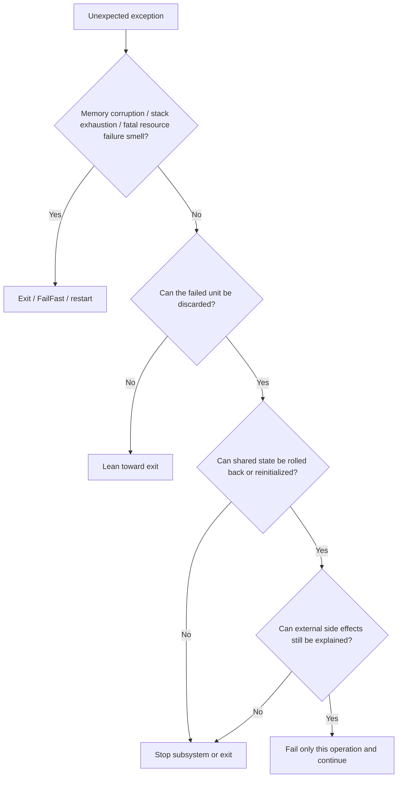

[Download the Excel checklist with Japanese and English sheets](/assets/downloads/2026-03-16-unexpected-exception-exit-or-continue-checklist.xlsx)

When an unexpected exception appears, the conversation often collapses too quickly into a shallow binary:

"Should we crash, or should we catch it and continue?"

In real systems, that framing is usually too blunt.

The more useful question is:

**Can the potentially damaged part be contained?**

- Is this only a failed operation?
- Can one screen, one connection, or one worker be reinitialized?
- Or is the integrity of the whole process now questionable?

That sequence leads to better decisions much more often.

This article is written with C# / .NET Windows applications, resident tools, Windows services, and device-integration utilities in mind. The goal is to provide a practical decision table for when an unexpected exception can be survived and when the application should exit instead.

## 1. The short version

- `catch (Exception)` and keep going is usually dangerous.
- Continuing is only defensible when **the failed unit can be discarded**, **shared state can be repaired or recreated**, and **external side effects can still be explained**.
- A single UI action, a single input item, or a single job boundary may allow continuation.
- Shared mutable state, parent loops, startup code, native boundaries, and memory-corruption signals push the decision toward exit.
- Exceptions such as `StackOverflowException`, `AccessViolationException`, and serious `OutOfMemoryException` are not good places to start from a "continue" assumption.
- WPF and Windows Forms can sometimes be configured to appear to continue after an unhandled exception, but **can continue** and **safe to continue** are not the same thing.
- For long-running services and monitors, crashing and restarting is often safer than staying half-broken.

In short, the real axis is not "Can we catch it?" but:

**Can we restore the invariants that were supposed to stay true?**

## 2. What this article means by an "unexpected exception"

### 2.1 Planned failures are not the same thing

A rare exception is not automatically an unexpected exception.

Examples that may still be **planned** include:

- the user picked a file that no longer exists
- a remote endpoint timed out temporarily
- one line in an imported CSV was malformed
- `OperationCanceledException` occurred because the user canceled
- a business-rule violation should fail only that operation

Even if they do not happen often, these are still conditions you can design for.

The main topic here is different:

- a core code assumption collapsed and caused `NullReferenceException` or `InvalidOperationException`
- shared state was being updated and it is unclear how far the update got
- a parent monitoring or message loop fell out through an unexpected exception
- something failed at a COM / P/Invoke / vendor SDK boundary
- the exception itself suggests the process may no longer be trustworthy

In other words:

**after the exception, can the application state still be believed?**

### 2.2 The choice is not really binary

One of the biggest sources of confusion is treating "continue" as only one thing.

In practice, there are often three levels:

| Choice | Meaning |
| --- | --- |
| fail only the current operation and continue | the process lives, but this save / import / request fails |
| isolate and reinitialize a subsystem | reconnect one service, recreate one screen, restart one worker |
| terminate the process | the damage boundary is no longer trustworthy |

"Continue the application" can mean very different things.  
Continuing by discarding one failed unit is very different from pretending nothing happened.

## 3. First decision table

### 3.1. The quick overall view

This table is often enough to set the initial direction.

| Situation | Initial direction | Why |
| --- | --- | --- |
| one input, one UI action, or one job failed and the state can be discarded | continue-leaning | the failure can be contained |
| the affected object or connection can be destroyed and recreated | subsystem-restart leaning | the damage can be localized |
| shared state was updated partway and the end state is unclear | exit-leaning | invariants may already be broken |
| external side effects are partial or ambiguous | exit-leaning | the outside world can no longer be explained clearly |
| a parent monitoring or processing loop leaked an unexpected exception | exit-leaning | zombie behavior is likely if the process keeps running |
| startup, configuration load, DI wiring, or required dependency initialization failed | startup failure, then exit | partial startup is usually worse |
| `AccessViolationException`, `StackOverflowException`, severe `OutOfMemoryException`, or native corruption smell | immediate exit leaning | process-wide health is questionable |
| risky work is isolated in another process and the parent remains intact | keep parent alive, restart child | the failure domain is already separated |

### 3.2 What to inspect before the exception type

Exception type matters, but it should not be the first and only lens.

The more important questions are:

| What to inspect | Practical question |
| --- | --- |
| where it happened | UI event, one job, parent loop, startup, native boundary |
| how far it got | did memory state, DB state, file state, or device state already change? |
| possible blast radius | one object, one screen, one subsystem, or the whole process? |
| rollback or recreation path | can the damaged thing be discarded and rebuilt? |
| external side effects | did something already get sent, moved, charged, or committed? |
| restart / supervision path | is there a clean restart story if you choose to exit? |

### 3.3 Exceptions that deserve stronger suspicion

You do not need a giant taxonomy to make good decisions, but some cases deserve stronger caution.

| Exception / smell | Initial direction | Why |
| --- | --- | --- |
| `StackOverflowException` | immediate exit leaning | the call stack itself is compromised |
| `AccessViolationException` | immediate exit leaning | native memory corruption or invalid access is in play |
| `OutOfMemoryException` | exit leaning | recovery logic itself may need allocations it can no longer rely on |
| unexpected `NullReferenceException` / `InvalidOperationException` | context-dependent but exit leaning | your own assumptions broke, possibly mid-update |
| unexpected exception escaping a parent loop | exit leaning | core lifetime management may already be broken |
| failures coming from COM / P/Invoke / vendor callbacks | strong exit leaning | managed-side evidence may be too incomplete to trust continuation |

## 4. Judge partly by where it happened

### 4.1 UI events

Button clicks, screen transitions, searches, and file-selection actions often leave more room for continuation than people think, but only under conditions.

Continuing becomes more plausible when:

- the failure happened before business state was changed
- only temporary dialog state is damaged and can be thrown away
- the ViewModel or connection can be recreated
- the user can be told honestly that this one action failed

Continuation becomes much weaker when:

- UI state and domain state were both modified partway
- shared caches, singletons, or other cross-screen mutable state were touched
- the post-exception UI still exposes controls without trustworthy state behind them

In UI applications, the instinct to avoid crashing is strong.  
But a broken save button can be worse than a clean exit.

### 4.2 One-item jobs or request boundaries

This is one of the healthiest places to contain failure:

- one message
- one file
- one HTTP request
- one import job
- one batch item

If that unit is explicit, you may be able to fail only that unit and continue with the next one.

But continuation still depends on things like:

- the failed unit is clearly visible from outside
- partial changes can be rolled back or compensated
- rerunning the same unit is safe enough
- failed items can be diverted to logs or dead-letter handling

### 4.3 Resident loops, monitors, and queue processors

This is where fake continuation becomes especially dangerous.

Examples:

- reconnect loops
- monitor loops
- queue-consumer loops
- periodic polling loops
- resident tray-app workers

The worst failure mode is:

the parent loop dies once, the process remains alive, and the application silently stops doing its real job.

This is why the split matters:

- catch expected failures at the **item boundary**
- if an **unexpected** exception escapes the parent loop, lean toward exiting the process

Especially in services and long-running applications, being cleanly restarted by a supervisor is often healthier than living in a half-dead state.

### 4.4 Startup

"Let it start anyway and see what happens" is usually not a good startup policy.

Examples that should often fail startup and exit:

- required configuration cannot be loaded
- a migration failed
- a required folder or certificate is missing
- core infrastructure initialization failed
- dependency configuration is broken

Partial startup is often more confusing and more dangerous than a clear startup failure.

### 4.5 Native boundaries: COM, P/Invoke, unsafe

These deserve a stricter lens.

- COM
- P/Invoke
- C++/CLI beyond the boundary
- vendor SDKs
- callbacks from native code
- `unsafe` code paths

In those cases, the managed exception is often only the surface symptom.  
The real damage may already exist on the native side, where the runtime can no longer tell a clean story.

## 5. Conditions that support continuation

Continuation becomes much more reasonable when these line up:

| Condition | Meaning |
| --- | --- |
| the failed unit is explicit | one operation, one screen, one job, one connection |
| the damaged state can be thrown away | discard and recreate, or treat as not committed |
| shared state remains protected | the damage does not spread through the rest of the app |
| external side effects are understandable | you know whether something was sent, committed, or needs retry |
| the user can be told the truth | "this operation failed" is a valid message |
| the failure can be observed later | logs, metrics, dumps, or other diagnostics exist |

This kind of continuation is not "pretend it never happened."  
It is:

- fail this unit honestly
- discard or rebuild the damaged object
- reconnect or recreate if necessary
- let the next operation begin from a known-good state

## 6. Conditions that support exit

Exit becomes the safer direction when:

- you do not know what changed partway
- shared mutable state may already be inconsistent
- locks, queues, threads, or loop lifetimes may be broken
- external side effects are partial or ambiguous
- startup or core infrastructure failed
- the exception suggests memory or native-boundary corruption

At that point, efforts to make continuation look elegant usually help less than efforts to make failure and restart easier.

That is where design choices like these begin to matter more:

- automatic restart
- session recovery
- autosave
- replayable queues
- idempotent re-execution
- crash dumps and failure logging

## 7. Typical cases and practical direction

| Pattern | Suggested direction | Why |
| --- | --- | --- |
| user picked a missing file | fail that operation and continue | damage is localized |
| one CSV row is malformed | fail one row or one file and continue | the failure unit is containable |
| unexpected `NullReferenceException` during save | rebuild screen or lean toward exit | state may already be partially mutated |
| one queue item violated a business rule | fail that item and continue | dead-letter style handling is possible |
| unexpected exception escaped the queue-consumer parent loop | exit the process | lifetime management may already be broken |
| required config missing at startup | fail startup and exit | partial startup is worse |
| `AccessViolationException` near a vendor callback | immediate exit leaning | native memory safety is now questionable |
| optional telemetry upload failed | disable only that path and continue | the failure domain is separate from the core work |

## 8. Common bad patterns

### 8.1 Catch everything, log it, and continue

This hides the cause and extends a potentially broken state.  
It is one of the most expensive forms of false safety.

### 8.2 Treat the final unhandled-exception hook as a recovery point

Hooks such as:

- `AppDomain.UnhandledException`
- `Application.ThreadException`
- `DispatcherUnhandledException`

are useful as **last recording points**.  
They are usually not good magic recovery points.

### 8.3 Retry blindly when external side effects already happened

If the action may already have sent a command, charged something, moved a file, or committed a record, blind retry can turn one failure into a duplicate-action incident.

### 8.4 Leave the UI alive after the real worker died

An application that still looks open but no longer does its real work is usually worse than one that exits clearly.

### 8.5 Say "we must not crash" without designing for crash

If the application truly must survive failure gracefully, then the design work has to exist first:

- restart strategy
- session recovery
- saved progress
- replay safety
- failure-domain separation

Otherwise "do not crash" is only a wish.

## 9. Implementation guidance

### 9.1 Catch at boundaries, not everywhere

Catching by meaningful boundaries is much healthier than catching in every deep layer:

- UI action boundaries
- request boundaries
- job boundaries
- connection boundaries
- process boundaries

### 9.2 Separate expected failures from unexpected failures

- expected: validation, not-found, timeout, cancellation, business-rule rejection
- unexpected: assumption collapse, parent-loop escape, native-boundary failure, corruption smell

Once everything flows into one broad `catch (Exception)`, the decision quality drops quickly.

### 9.3 Make shared mutable state smaller

The larger the shared writable state, the harder safe continuation becomes.  
The more you can contain state to one screen, one session, or one worker, the more you can contain the failure too.

### 9.4 Isolate dangerous work in another process

COM, ActiveX, vendor SDKs, unsafe code, external device control, and similar risky surfaces become much easier to reason about when the blast radius is moved into another process.

### 9.5 Treat unhandled-exception hooks as recording hooks

Focus them on:

- exception information
- operation context
- important preceding logs
- version and environment data
- dump capture paths

That usually helps more than trying to pretend the application is now healthy again.

### 9.6 Do not over-trust WPF / WinForms unhandled-exception hooks

WPF can continue after `DispatcherUnhandledException` if `Handled = true` is set.  
Windows Forms can also alter handling behavior for the UI thread.

But the real question is never "can it continue?"  
It is always:

**is the post-exception state trustworthy enough to continue?**

## 10. Wrap-up

After an unexpected exception, the real question is not:

"Can we catch it?"

The real question is:

**Can we still trust the state of the application afterward?**

A useful order of thought is:

1. Can the failed unit be discarded?
2. Can shared state be repaired or rebuilt?
3. Can the external side effects still be explained?
4. Can memory, threads, and native boundaries still be trusted?

If the answer is yes across those points, continuation may be safe.  
If the answer is unclear, exit is often the more honest and safer path.

Exception handling is not mainly a technique for "never crashing."  
It is a design discipline for containing damage, failing honestly, and recovering cleanly.

## 11. References

- [.NET: Best practices for exceptions](https://learn.microsoft.com/en-us/dotnet/standard/exceptions/best-practices-for-exceptions)
- [.NET: System.Exception](https://learn.microsoft.com/en-us/dotnet/fundamentals/runtime-libraries/system-exception)
- [.NET: StackOverflowException](https://learn.microsoft.com/en-us/dotnet/api/system.stackoverflowexception?view=net-10.0)
- [.NET: System.AccessViolationException](https://learn.microsoft.com/en-us/dotnet/fundamentals/runtime-libraries/system-accessviolationexception)
- [.NET: Environment.FailFast](https://learn.microsoft.com/en-us/dotnet/api/system.environment.failfast?view=net-10.0)
- [.NET: AppDomain.UnhandledException](https://learn.microsoft.com/en-us/dotnet/fundamentals/runtime-libraries/system-appdomain-unhandledexception)
- [WPF: Application.DispatcherUnhandledException](https://learn.microsoft.com/en-us/dotnet/api/system.windows.application.dispatcherunhandledexception?view=windowsdesktop-10.0)
- [Windows Forms: Application.SetUnhandledExceptionMode](https://learn.microsoft.com/en-us/dotnet/api/system.windows.forms.application.setunhandledexceptionmode?view=windowsdesktop-10.0)
- [.NET: Exceptions in Managed Threads](https://learn.microsoft.com/en-us/dotnet/standard/threading/exceptions-in-managed-threads)
