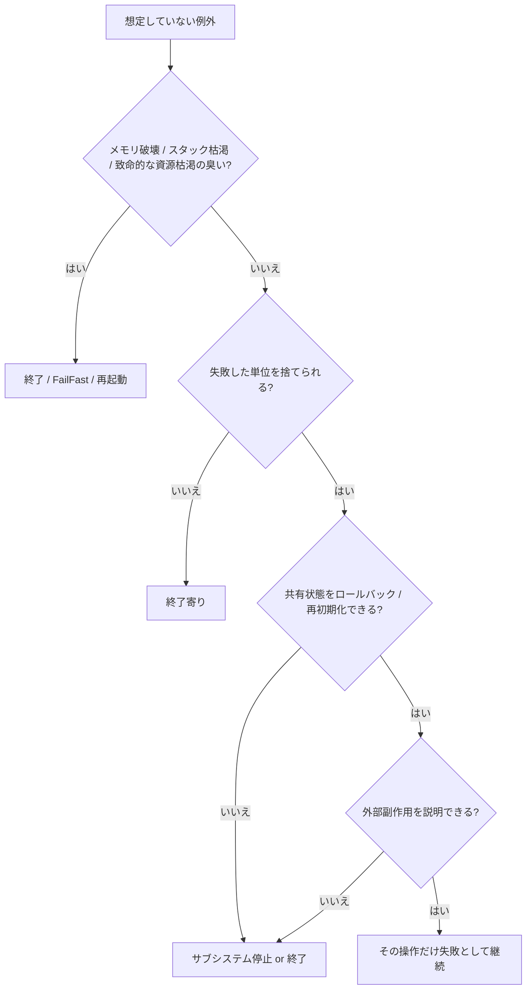

[日英シート付きの Excel チェックリストをダウンロード](/assets/downloads/2026-03-16-unexpected-exception-exit-or-continue-checklist.xlsx)

想定していない例外の話になると、つい「落とすか、catch して続けるか」の二択で考えがちです。  
ただ、実務ではこの二択の置き方が少し乱暴です。

本当に見たいのは、**壊れた可能性がある範囲を閉じ込められるか** です。

- その操作だけ失敗で終えられるのか
- その画面 / 接続 / ワーカーだけ再初期化すればよいのか
- もうプロセス全体の整合性が怪しいのか

この順で見ると、かなり整理しやすくなります。

この記事では、C# / .NET の Windows アプリ、常駐アプリ、Windows サービス、装置連携ツールなどを前提に、**想定していない例外が起きたときに継続してよい条件と、終了したほうがよい条件**を判断表としてまとめます。

## 1. まず結論

- `catch (Exception)` で握りつぶして続行、はだいたい危険です。
- 継続してよいのは、**失敗した単位を捨てられる**、**共有状態を元に戻せる**、**外部副作用を説明できる**、の 3 つが揃うときです。
- UI の 1 操作、1 件の入力、1 件のジョブなど、処理境界が明確なら継続できることがあります。
- 逆に、共有の書き換え可能な状態、常駐ループ、メインスレッド、起動処理、ネイティブ境界、メモリ破壊臭が絡むなら終了寄りです。
- `StackOverflowException`、`AccessViolationException`、`OutOfMemoryException` のような「プロセス全体の健全性」を疑う例外は、継続前提で考えないほうが安全です。
- WPF や Windows Forms には未処理例外を拾って見かけ上続ける道もありますが、**続けられること**と**続けて安全なこと**は別です。
- 長時間動くサービスや監視アプリは、半分壊れたまま生き延びるより、落ちて再起動されたほうが診断もしやすく安全なことが多いです。

要するに、判断の軸は「catch できるか」ではなく、**不変条件を回復できるか**です。

## 2. この記事でいう「想定していない例外」

### 2.1 想定内と想定外を分ける

まず、珍しい例外と想定外の例外は同じではありません。

たとえば次は、頻度が低くても **想定内**にできます。

- ユーザーが存在しないファイルを選んだ
- 通信先が一時的にタイムアウトした
- 取り込み CSV の 1 行が壊れていた
- キャンセル操作で `OperationCanceledException` が出た
- 業務ルール違反でその処理だけ失敗にしたい

これらは、**その失敗をどう扱うかを設計で先に決められる**種類です。

一方で、この記事で主に扱う **想定していない例外**は、たとえば次です。

- 自分のコードの前提が崩れて `NullReferenceException` や `InvalidOperationException` が出た
- 共有状態の更新途中で例外が飛び、どこまで反映されたか怪しい
- 監視ループやメッセージ処理の親ループが落ちた
- COM / P/Invoke / vendor SDK 境界で異常が出た
- `AccessViolationException` や `StackOverflowException` のように、そもそもプロセスの健康診断が赤い

つまり、**「この例外が起きたあとに、アプリの状態をまだ信用してよいか分からない」**ものです。

### 2.2 二択に見えて本当は三択ある

この話をややこしくする犯人は、継続を 1 種類で考えてしまうことです。

実務では、だいたい次の 3 段階に分かれます。

| 選択 | 意味 |
| --- | --- |
| その操作だけ失敗させて継続 | 画面は残すが、今回の保存や取り込みだけ失敗扱いにする |
| サブシステムだけ止めて継続 | 接続、画面、ワーカー、子プロセスだけ再初期化する |
| プロセスを終了する | 状態破壊の範囲が読めないので、再起動前提にする |

「アプリを継続する」と言っても、**何もなかった顔でそのまま続ける**のと、**壊れた部分を切り離して継続する**のでは重みが違います。

## 3. まず見る判断表

### 3.1 全体像

まずはこの表から見ると、だいたいの方針が決まります。

| 状況 | まずの選択 | 理由 |
| --- | --- | --- |
| 1 つの入力、1 つの画面操作、1 つのジョブだけが失敗し、状態を捨てられる | 継続寄り | 失敗単位を閉じ込められるから |
| 例外後に対象オブジェクトや接続を破棄し、作り直せる | サブシステム再初期化寄り | 壊れた範囲を局所化できるから |
| 共有状態を途中まで更新したが、どこまで反映されたか分からない | 終了寄り | 不変条件が崩れている可能性があるから |
| DB / ファイル / 装置コマンドなど外部副作用が半端で、重複や未反映を説明できない | 終了寄り | 外の世界との整合が読めないから |
| 監視ループ、再接続ループ、メッセージ処理の親ループが想定外例外で落ちた | 終了寄り | 黙って一部機能だけ死ぬとゾンビ化しやすいから |
| 起動処理、設定読み込み、DI 構成、必須依存の初期化で失敗した | 起動失敗で終了寄り | 半端に起動するほうが危険だから |
| `AccessViolationException`、`StackOverflowException`、深刻な `OutOfMemoryException`、native 側の破壊臭がある | 即終了寄り | プロセス全体の健全性が怪しいから |
| 危険な処理が別プロセスに隔離されていて、親プロセスは無傷 | 親は継続、子を再起動 | 障害領域を分離できているから |

### 3.2 例外型より先に見ること

例外型だけで即決しないほうがよいです。  
最初に見るべきなのは次です。

| 見る点 | 何を確認するか |
| --- | --- |
| どこで起きたか | UI イベント、1 件ジョブ、親ループ、起動処理、ネイティブ境界のどこか |
| どこまで進んだか | 途中でメモリ状態、DB、ファイル、装置状態が変わっていないか |
| 壊れうる範囲 | そのオブジェクトだけか、画面全体か、プロセス全体か |
| ロールバック可能か | 破棄して作り直せるか、トランザクションで戻せるか |
| 外部副作用 | 送信済みか未送信か、二重実行が安全か、補償処理できるか |
| 監視・再起動 | 落としたあと自動再起動や復旧導線があるか |

### 3.3 危険度の高い例外

細かい例外型の話を全部する必要はありませんが、継続前提で見ないほうがよいものはあります。

| 例外 / 兆候 | まずの選択 | 見る理由 |
| --- | --- | --- |
| `StackOverflowException` | 即終了寄り | 呼び出しスタックが破綻しており、通常の回復を前提にしにくい |
| `AccessViolationException` | 即終了寄り | 保護メモリへの不正アクセスで、ネイティブ境界やメモリ破壊が疑われる |
| `OutOfMemoryException` | 終了寄り | 追加割り当て前提の回復処理自体が不安定になりやすい |
| unexpected な `NullReferenceException` / `InvalidOperationException` | 文脈次第だが終了寄り | 自分の前提崩れであり、途中変更が残っている可能性がある |
| 親ループから漏れた想定外例外 | 終了寄り | 機能の中核が死んでいるのにプロセスだけ残る危険がある |
| COM / P/Invoke / vendor SDK callback 起点の異常 | 即終了〜強めの終了寄り | managed だけ見ても安全性を判断しづらい |

## 4. どこで起きたかで判断する

### 4.1 UI イベント

ボタンクリック、画面遷移、検索、ファイル選択のような UI イベントは、継続できる余地が比較的大きいです。  
ただし、条件があります。

継続しやすいのは、たとえば次です。

- 読み込み前に失敗し、業務状態をまだ触っていない
- ダイアログ内の一時状態だけ壊れており、画面を閉じれば捨てられる
- 例外後に ViewModel や接続を作り直せる
- 利用者へ「今回の操作は失敗した」と正直に伝えられる

逆に、終了寄りになるのは次です。

- 画面とドメイン状態の両方を途中まで更新した
- static / singleton / キャッシュなど、他画面も見る共有状態を触った
- 例外が起きたあと、ボタン活性や選択状態だけ残って整合が分からない
- UI スレッド上で unexpected な例外が起き、どこまで描画や通知が進んだか怪しい

### 4.2 1 件ずつ処理するジョブ / リクエスト

ここは、継続しやすい境界です。

- 1 メッセージ
- 1 ファイル
- 1 HTTP リクエスト
- 1 取り込みジョブ
- 1 バッチ対象

こうした単位が明確なら、**その 1 件だけ失敗**にして次へ進めます。

ただし、次が必要です。

- 失敗単位が外から見て明確
- 途中変更がトランザクションや補償で整う
- 同じ処理をもう一度流しても結果が壊れない性質がある
- 失敗を隔離キューやエラー記録へ逃がせる

### 4.3 常駐ループ / 監視 / キュー処理

ここは、雑に継続すると一番まずい場所です。

たとえば:

- 再接続ループ
- 監視ループ
- キュー消費ループ
- 定期ポーリング
- 装置状態監視
- トレイアプリの常駐処理

この手の処理で怖いのは、**親ループが 1 回の想定外例外で死に、プロセスだけ生き残る**ことです。

ここでは方針を分けたほうがよいです。

- **各アイテム処理の境界**で想定内例外を捕まえる
- **親ループ**から想定外例外が漏れたら、プロセス終了寄りにする

### 4.4 起動処理

起動時の失敗を「とりあえず起動してから考える」にすると、たいてい後で泣きます。

- 必須設定が読めない
- バージョン移行 / マイグレーションに失敗した
- 必須フォルダや証明書がない
- 中核サービスの初期化に失敗した
- 依存関係の構成が壊れている

こういう場合は、**起動失敗として終了**のほうが分かりやすいです。

### 4.5 ネイティブ境界 / COM / P/Invoke / unsafe

ここは別枠で少し厳しめに見たほうがよいです。

- COM
- P/Invoke
- C++/CLI の先
- vendor SDK
- callback で戻ってくる native 側コード
- `unsafe` を含む処理

特に次は終了寄りです。

- `AccessViolationException`
- ヒープ破壊やダブル free を疑う症状
- ハンドル異常、解放後アクセスの臭い
- callback 境界で突然死ぬ

## 5. 継続してよい条件

継続してよいのは、だいたい次が揃うときです。

| 条件 | 意味 |
| --- | --- |
| 失敗単位が明確 | 1 操作、1 画面、1 ジョブ、1 接続など、捨てる単位が分かる |
| 状態を捨てられる | 破棄して作り直せる、または未反映として扱える |
| 共有状態が守られる | 他の機能へ汚染が広がらない |
| 外部副作用を説明できる | 送った / 送っていない / 再送してよい、が分かる |
| 利用者へ正直に伝えられる | 「今回の処理は失敗した」と表示できる |
| 監視できる | ログ、メトリクス、ダンプで後追い調査できる |

## 6. 終了したほうがよい条件

逆に、次に当てはまるなら終了寄りです。

- 途中まで何を変更したか分からない
- 共有の書き換え可能な状態を触っていて、整合が読めない
- ロック、キュー、スレッド、監視ループの寿命管理が壊れた
- 外部副作用の重複 / 欠落 / 半端が説明できない
- 起動処理や中核インフラの初期化で失敗した
- ネイティブ境界やメモリ破壊を疑う

このレベルなら、**きれいに継続する工夫**より、**落として復旧しやすくする工夫**のほうが効きます。

## 7. 典型パターン別のおすすめ

| パターン | おすすめ | 理由 |
| --- | --- | --- |
| ファイルを開くボタンで存在しないパスを指定した | その操作だけ失敗で継続 | 状態破壊が局所的だから |
| CSV 取り込みの 1 行だけ壊れていた | 1 行失敗 or 1 ファイル失敗で継続 | 失敗単位を閉じ込めやすいから |
| 画面保存の途中で unexpected な `NullReferenceException` が出た | 画面再作成〜終了寄り | どこまで ViewModel / 業務状態が変わったか怪しいから |
| キューの 1 メッセージが業務ルール違反だった | そのメッセージだけ失敗で継続 | 隔離キューへ逃がせるから |
| キュー消費の親ループが想定外例外で落ちた | プロセス終了寄り | ワーカー全体の寿命が壊れているから |
| 起動時に必須設定が読めない | 起動失敗で終了 | 半端起動のほうが危険だから |
| vendor SDK callback まわりで `AccessViolationException` | 即終了寄り | メモリ破壊の可能性を無視できないから |
| 非本質なテレメトリ送信だけ失敗した | その機能だけ無効化して継続 | 主機能と障害領域を分けられるから |

## 8. よくある NG

### 8.1 `catch (Exception)` でログだけ出して続ける

これはかなり危険です。  
原因を隠すうえに、壊れた状態を延命しやすいからです。

### 8.2 最後の未処理例外ハンドラで回復しようとする

`AppDomain.UnhandledException`、`Application.ThreadException`、`DispatcherUnhandledException` などは、**最後に記録する場所**としては有用ですが、**魔法の回復ポイント**ではありません。

### 8.3 外部副作用があるのに安易に retry する

装置コマンド、メール送信、課金、ファイル移動、DB 更新などで同じ処理の再実行安全性がないまま retry すると、今度は二重実行事故が主役になります。

### 8.4 監視ループが死んだのに UI だけ残す

見た目だけ生きていて、仕事をしていないアプリはかなり迷惑です。

### 8.5 落とす設計をしていないのに「落としたくない」と言う

落としたくないなら、先に次を入れる必要があります。

- 自動再起動
- セッション復元
- 途中成果の保存
- 再実行安全性
- 障害領域の分離

## 9. 実装時の整理ポイント

### 9.1 catch する場所を境界に寄せる

深い層で何でも catch するより、

- UI 操作境界
- 1 リクエスト境界
- 1 ジョブ境界
- 1 接続境界
- プロセス境界

のように、**失敗単位が定義できる場所**で受けるほうが整理しやすいです。

### 9.2 想定内例外と想定外例外を分ける

- 想定内: validation、not found、timeout、cancel、業務ルール違反
- 想定外: 前提崩れ、親ループ漏れ、ネイティブ境界異常、メモリ破壊臭

### 9.3 共有状態を小さくする

共有の書き換え可能な状態が大きいほど、継続判断は難しくなります。  
逆に、1 画面 1 セッション 1 ワーカーの中へ閉じ込められるほど、失敗も閉じ込めやすくなります。

### 9.4 危険な処理は別プロセスへ逃がす

COM / ActiveX / vendor SDK / unsafe / 重い画像処理 / 外部機器制御など、落ちたときの被害を広げたくないものは、別プロセス化がかなり効きます。

### 9.5 未処理例外ハンドラは「回復」より「記録」

- 例外情報
- 操作文脈
- 直前の重要ログ
- 設定 / バージョン / 接続先
- dump 採取導線

このあたりを揃えて、**落ちたあとに詰められる**形を優先したほうが、結果として安定します。

### 9.6 WPF / WinForms の未処理例外イベントを過信しない

WPF では `DispatcherUnhandledException` で `Handled = true` にすると、未処理例外後も続けること自体はできます。  
Windows Forms でもメイン UI スレッドでは `Application.ThreadException` や `SetUnhandledExceptionMode` の設定次第で止め方を選べます。

ただ、ここで大事なのは **続けられること**ではなく **回復条件が揃っているか**です。

## 10. まとめ

想定していない例外が起きたときに見るべきなのは、「この例外は catch できるか」ではなく、**このあともアプリの状態を信用できるか**です。

判断の順番としては、だいたい次で十分です。

1. 失敗した単位を捨てられるか
2. 共有状態を戻せるか、作り直せるか
3. 外部副作用を説明できるか
4. メモリ / スレッド / ネイティブ境界の健全性は信用できるか

この 4 つに自信があるなら継続できます。  
自信がないなら、終了寄りです。

特に、長時間動くアプリ、監視アプリ、サービス、装置連携では、**壊れたまま生きる**ことのほうが、**素直に落ちる**ことより危険な場面がかなりあります。

例外処理は「落とさない技術」ではありません。  
**壊れ方を小さくし、壊れたら正直に止まり、復旧しやすくする設計**です。

## 11. 参考資料

- [.NET: Best practices for exceptions](https://learn.microsoft.com/en-us/dotnet/standard/exceptions/best-practices-for-exceptions)
- [.NET: System.Exception](https://learn.microsoft.com/en-us/dotnet/fundamentals/runtime-libraries/system-exception)
- [.NET: StackOverflowException](https://learn.microsoft.com/en-us/dotnet/api/system.stackoverflowexception?view=net-10.0)
- [.NET: System.AccessViolationException](https://learn.microsoft.com/en-us/dotnet/fundamentals/runtime-libraries/system-accessviolationexception)
- [.NET: Environment.FailFast](https://learn.microsoft.com/en-us/dotnet/api/system.environment.failfast?view=net-10.0)
- [.NET: AppDomain.UnhandledException](https://learn.microsoft.com/en-us/dotnet/fundamentals/runtime-libraries/system-appdomain-unhandledexception)
- [WPF: Application.DispatcherUnhandledException](https://learn.microsoft.com/en-us/dotnet/api/system.windows.application.dispatcherunhandledexception?view=windowsdesktop-10.0)
- [Windows Forms: Application.SetUnhandledExceptionMode](https://learn.microsoft.com/en-us/dotnet/api/system.windows.forms.application.setunhandledexceptionmode?view=windowsdesktop-10.0)
- [.NET: Exceptions in Managed Threads](https://learn.microsoft.com/en-us/dotnet/standard/threading/exceptions-in-managed-threads)
