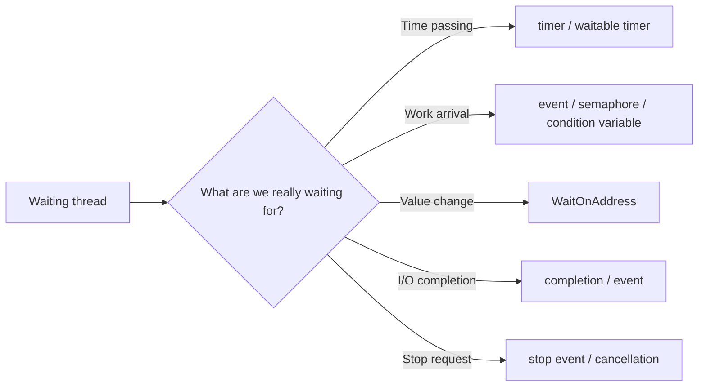

In the previous article on practical Windows soft real-time work, I wrote about avoiding loops that depend on `Sleep` as if it were a timing guarantee.  
This time I want to narrow that down to one specific design rule:

**why Windows code should usually prefer event waits over short timer polling.**

On Windows, designs that keep doing things like `Sleep(1)` or short timeout waits to "check again soon" are pushed around by two things:

- **system clock granularity**
- **the scheduler delay after the timeout has already expired**

On many ordinary systems, that means a short timed wait is much rougher than it first looks.  
If what you really want to wait for is not "time passing" but "work arriving," "I/O completing," "a stop request being signaled," or "a state change happening," then periodic polling is usually the wrong shape.

The cleaner model is:

- the side where the event happens signals
- the waiting side waits on an event-like object

That is usually better for latency, CPU use, and power use.

## 1. The short version

- If you are waiting for **work arrival or I/O completion**, prefer an **event-driven wait** over timer polling.
- Windows timed waits are affected by system clock granularity.
- `Sleep(1)` does **not** mean "wake up accurately after 1 ms."
- Even after a timeout expires, the thread only becomes **ready**; immediate execution is not guaranteed.
- That means designs that are really waiting for an event but keep checking with timers are usually bad for both latency and power.
- Timers are best kept for cases where **time itself is the real condition**.

In practical terms:

- "send metrics every 5 seconds"  
  -> timer work
- "start processing when an item arrives in the queue"  
  -> event / semaphore / condition variable / `WaitOnAddress`
- "continue when I/O completes"  
  -> completion or event work
- "stop when asked to stop"  
  -> stop event or cancellation

The key step is to separate:

- waiting for **time**
- waiting for **an event**

## 2. What the real problem is

### 2.1 Timed waits are constrained by system clock granularity

The timeout precision of Windows wait functions depends on system clock resolution.  
`Sleep` is the same kind of story: passing a millisecond value does not mean the operating system will honor that exact duration as a precise wake point.

The practical consequence is simple:

**asking for 1 ms does not guarantee waking in 1 ms.**

### 2.2 Even when the timeout has expired, execution is not immediate

There is a second source of delay after the timeout itself.

Once a timed wait finishes, the thread generally becomes **ready**, but that is not the same as:

"the CPU is yours right now."

Other runnable threads, priorities, power states, lock contention, DPC / ISR activity, and general scheduling pressure can still delay actual execution.

So short timer waits are exposed to two layers of uncertainty:

1. the timeout itself is rounded or delayed by timer granularity
2. after that, the scheduler still decides when the thread actually runs

### 2.3 `Sleep(1)` does not mean a 1 ms loop

This matters a lot because code like this often looks more precise than it is:

```cpp
while (!g_stop)
{
    Step();
    Sleep(1);
}
```

That loop actually includes:

- the time taken by `Step()`
- the inexact wait behavior of `Sleep(1)`
- scheduler delay after waking

So the loop period drifts immediately.  
`Sleep(1)` is better read as "pause for at least a little while" than as "run every 1 ms."

The same practical truth applies to `.NET` forms such as `Thread.Sleep(1)`.

## 3. Why event waits are better for event-driven work

### 3.1 The completion condition becomes "signal," not "time expired"

This is the heart of the design improvement.

With timer polling:

- nothing may have happened
- the timeout still wakes the thread
- the code wakes up only to ask, "did something happen yet?"

With event waits:

- the producer or completion side signals
- the wait completes because there is a reason
- when the thread wakes, the condition it cared about already exists



That difference is enormous in practice.

Polling means:

**wake up without a real reason, then check.**

Event-driven waiting means:

**wake up because the reason now exists.**

### 3.2 Pick the primitive based on what you are actually waiting for

This simple table is usually enough:

| What you are waiting for | Weak design | Better first choice |
| --- | --- | --- |
| work arriving in a queue | `Sleep(1)` plus `TryPop` | event or semaphore |
| I/O completion | timer-based status checking | completion or event |
| stop request | polling a flag every 100 ms | stop event or cancellation |
| shared in-process value change | `while (flag == 0) Sleep(1)` | `WaitOnAddress` |
| actual time passing | forcing everything through events | timer or waitable timer |

The key is to name the wait reason correctly before naming the API.

### 3.3 Event waits are not magic either

Event waits are better because they do not need to wait for the next timer tick.  
They are not magic because they still depend on:

- scheduler latency
- thread priority
- CPU power state
- lock contention
- page faults
- DPC / ISR activity

So an event signal is not "zero-latency execution."  
But it does remove the extra and unnecessary delay of "sleep until the next polling check."

## 4. Common anti-patterns

### 4.1 Polling a queue with `Sleep(1)`

This is one of the most common examples:

```cpp
for (;;)
{
    if (g_stop)
    {
        break;
    }

    WorkItem item;
    if (TryPop(item))
    {
        Process(item);
        continue;
    }

    Sleep(1);
}
```

This has three practical problems:

1. the thread still wakes up even when the queue is empty
2. response latency is pulled around by timer granularity
3. power behavior gets worse because the CPU is woken up periodically for no reason

If you increase the sleep, latency gets worse.  
If you shorten it, CPU and power behavior get worse.  
That is a sign of the wrong design shape.

### 4.2 Polling state with `Thread.Sleep(1)` or `Task.Delay(1)`

The same smell appears in managed code:

```csharp
while (!stoppingToken.IsCancellationRequested)
{
    if (_queue.TryDequeue(out WorkItem? item))
    {
        await ProcessAsync(item, stoppingToken);
        continue;
    }

    await Task.Delay(1, stoppingToken);
}
```

Even though it uses async syntax, the design is still polling.

## 5. What to do instead

### 5.1 Let the producer signal when work arrives

For queue arrival, the cleaner shape is:

- producer enqueues work
- producer signals immediately after enqueue
- consumer waits on the signal
- consumer drains the queue when woken

That gives you:

- no periodic wakeup when nothing exists
- wakeup tied to real work arrival

### 5.2 Wait for work and stop in the same wait

For simple workers, `WaitForMultipleObjects` often makes the design very explicit:

```cpp
HANDLE waits[2] = { _stopEvent, _workEvent };

for (;;)
{
    DWORD rc = WaitForMultipleObjects(2, waits, FALSE, INFINITE);

    if (rc == WAIT_OBJECT_0)
    {
        return;
    }

    if (rc != WAIT_OBJECT_0 + 1)
    {
        throw std::runtime_error("WaitForMultipleObjects failed.");
    }

    DrainQueue();
}
```

The important points are:

- no `Sleep(1)`
- producer signals when work appears
- the worker can wait for both **stop** and **work** in one place

### 5.3 `WaitOnAddress` is a strong option inside one process

If the problem is simply "wait until a small shared value changes," `WaitOnAddress` can be much cleaner than a spin-plus-sleep loop.

The rough split is:

- **cross-process or general waitable objects**  
  -> event / semaphore / standard waitables
- **small in-process value changes**  
  -> `WaitOnAddress`

## 6. Cases where timers are still correct

### 6.1 When time itself is the condition

Timers absolutely still have a real role.

Examples:

- send metrics every 5 seconds
- retry after 200 ms
- clean a cache once per minute
- wait until a timeout deadline

In those cases, the thing you are waiting for really is **time**.

### 6.2 Prefer a waitable timer over stacking `Sleep`

If you truly need to wait for time on Windows, a waitable timer is usually a clearer abstraction than chaining together ad hoc sleeps.

### 6.3 Do not reach for `timeBeginPeriod` as the first answer

When timer precision becomes irritating, the temptation is to reach for `timeBeginPeriod(1)`.

That should usually **not** be the first answer.

Why:

1. it has real power and efficiency cost
2. modern Windows behavior around timer resolution is more nuanced than it used to be
3. it often papers over a design that should have been event-driven in the first place

If what you really need is an event-driven wakeup, increasing timer resolution is often solving the wrong problem.

## 7. A practical review checklist

When reviewing code, the first questions I would ask are:

- is there a loop based on `Sleep(1)`, `Thread.Sleep(1)`, or `Task.Delay(1)`?
- is the code really waiting for work arrival, I/O completion, or a stop request while pretending it is waiting for time?
- can the producer or completion side signal directly?
- can stop and work be waited on together?
- if the wait is inside one process, would `WaitOnAddress` be a better fit?
- where timers are used, is time really the condition?

Even that small checklist catches a surprising amount of accidental polling.

## 8. Wrap-up

On Windows, short timed waits are pushed around by timer granularity and scheduling delay.  
That makes designs based on "wake up soon and check again" much rougher than they first appear.

If what you are really waiting for is:

- work arrival
- I/O completion
- stop request
- state change

then event-driven waiting is usually the better model.

The clean summary is:

**wait for time with timers; wait for events with events.**

That single separation improves:

- latency clarity
- CPU efficiency
- power behavior
- readability of intent

On Windows, that is usually the right default.

## 9. References

- [Sleep function (Win32)](https://learn.microsoft.com/en-us/windows/win32/api/synchapi/nf-synchapi-sleep)
- [Wait Functions](https://learn.microsoft.com/en-us/windows/win32/sync/wait-functions)
- [WaitForSingleObject function](https://learn.microsoft.com/en-us/windows/win32/api/synchapi/nf-synchapi-waitforsingleobject)
- [Event Objects (Synchronization)](https://learn.microsoft.com/en-us/windows/win32/sync/event-objects)
- [Using Event Objects](https://learn.microsoft.com/en-us/windows/win32/sync/using-event-objects)
- [WaitOnAddress function](https://learn.microsoft.com/en-us/windows/win32/api/synchapi/nf-synchapi-waitonaddress)
- [WakeByAddressSingle function](https://learn.microsoft.com/en-us/windows/win32/api/synchapi/nf-synchapi-wakebyaddresssingle)
- [timeBeginPeriod function](https://learn.microsoft.com/en-us/windows/win32/api/timeapi/nf-timeapi-timebeginperiod)
- [CreateWaitableTimerExW function](https://learn.microsoft.com/en-us/windows/win32/api/synchapi/nf-synchapi-createwaitabletimerexw)
- [SetWaitableTimer function](https://learn.microsoft.com/en-us/windows/win32/api/synchapi/nf-synchapi-setwaitabletimer)
- [Thread.Sleep Method (.NET)](https://learn.microsoft.com/en-us/dotnet/api/system.threading.thread.sleep)
- [Results for the Idle Energy Efficiency Assessment](https://learn.microsoft.com/en-us/windows-hardware/test/assessments/results-for-the-idle-energy-efficiency-assessment)
