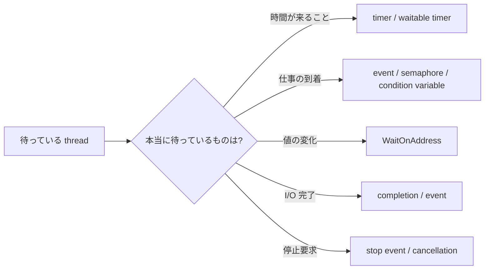

前回の[Windows ソフトリアルタイムの実践ガイド](https://comcomponent.com/blog/2026/03/09/000-windows-soft-realtime-practical-guide-natural/)では、`Sleep` 任せの周期ループを避ける話を書きました。  
今回はその中でも、なぜ **短い timer wait より event wait を優先したいのか**を 1 点に絞って整理します。

Windows では、`Sleep(1)` や短い timeout 付きの wait を使って「一定時間ごとに様子を見る」設計をすると、どうしても **system clock の粒度**と **その後のスケジューリング遅延**の影響を受けます。  
普通の設定では 15.6ms 級の platform timer resolution が前提になることが多いので、「1ms 後にもう一回見よう」というつもりでも、実際にはかなり雑な待ちになりやすいです。

一方で、仕事の到着、I/O 完了、停止要求、状態変化のように、本当に待ちたいものが「時間」ではなく「出来事」なら、一定間隔で見に行く必要はありません。  
**イベントが起きた側が signal し、待つ側は event を待つ**ほうが、遅延にも CPU にも電力にも素直です。

この記事では、次の問いに答える形で整理します。

- `Sleep(1)` や短い timer wait が、なぜ思ったより正確でないのか
- なぜ event wait はその制限を受けにくいのか
- どういう場面で timer ではなく event を選ぶべきか
- それでも timer を使うべき場面は何か

## 1. まず結論

- **仕事の到着や I/O 完了を待つなら、timer ではなく event を待つ**ほうがよいです。
- Windows の timed wait は、どうしても system clock の粒度の影響を受けます。
- `Sleep(1)` は「1ms 後に正確に起きる」意味ではありません。
- しかも timeout が過ぎても、thread はまず ready になるだけで、即実行は保証されません。
- だから **「本当は出来事を待っているのに、timer で様子を見に行く」設計は、遅延にも電力にも不利**です。
- timer を使うのは、**本当に時間そのものが条件**のときだけに絞ったほうがきれいです。

実務での言い方にすると、ほぼこれです。

- 「5 秒おきに metrics を送る」 -> timer の仕事
- 「キューに仕事が入ったらすぐ動く」 -> event / semaphore / condition variable / `WaitOnAddress` の仕事
- 「I/O が終わったら続きを実行する」 -> completion / event の仕事
- 「停止要求が来たら止まる」 -> stop event / cancellation の仕事

## 2. 何が問題なのか

### 2.1 timed wait は system clock の粒度に縛られる

Windows の wait functions の timeout 精度は、system clock resolution に依存します。  
`Sleep` も同じで、指定したミリ秒がそのまま「その通りの長さ」で保証されるわけではありません。

ここで大事なのは、**1ms を指定したから 1ms 後に起きるとは限らない**という点です。

### 2.2 期限が来ても、すぐ実行されるとは限らない

さらにややこしいのは、timeout が過ぎた瞬間に thread が即実行されるわけではないことです。

`Sleep` の説明にもある通り、待ち時間が終わったあと thread は **ready**にはなりますが、**今すぐ CPU をもらって走れる保証はありません**。  
ほかの thread、priority、CPU の idle state、DPC / ISR、lock 競合などの影響を受けます。

つまり、短い timer wait には少なくとも 2 段階の不確実さがあります。

1. そもそも timeout の判定自体が timer 粒度に引っ張られる
2. timeout 後も、実行開始は scheduler 次第になる

### 2.3 `Sleep(1)` は 1ms 周期の意味にならない

`Sleep(1)` を見ると、つい「1ms ごとに回る loop」っぽく見えます。  
でも実際には、そう読んではいけません。

```cpp
while (!g_stop)
{
    Step();
    Sleep(1);
}
```

この loop は、実際には次のようなものです。

- `Step()` の実行時間が毎回足される
- `Sleep(1)` の待ち時間自体が粒度に引っ張られる
- 目が覚めても、すぐ走れるとは限らない

## 3. なぜイベント待機が有利なのか

### 3.1 待ちの終了条件が「時間切れ」ではなく「signal」になる

event wait が有利なのは、待ちの意味が変わるからです。

timer wait は、こうです。

- まだ何も起きていなくても
- 一定時間が来たら起きる
- 起きてから「何か起きたか」を確認する

event wait は、こうです。

- 何かが起きた側が signal する
- signal されたら待ちが満たされる
- 起きた時点で、もう理由がある



### 3.2 何を待ちたいのかで道具を分ける

まずの判断は、だいたい次の表で足ります。

| 待ちたいもの | よくない例 | まずの選択 |
| --- | --- | --- |
| キューに仕事が入ること | `Sleep(1)` で `TryPop` する | event / semaphore |
| I/O が完了すること | timer で状態を見に行く | overlapped I/O の event / IOCP |
| 停止要求が来ること | 100ms ごとに stop flag を見る | stop event / cancellation |
| 同一プロセス内の値変化 | `while (flag == 0) Sleep(1)` | `WaitOnAddress` |
| 時刻が来ること | event に無理やり寄せる | timer / waitable timer |

### 3.3 event も魔法ではない

event wait は、**timer 粒度で起きる必要がない**という意味で有利ですが、**signal された瞬間に絶対ゼロ遅延で走る**わけではありません。

event wait でも、実際には次の影響は受けます。

- scheduler latency
- thread priority
- CPU の power state
- lock 競合
- page fault
- DPC / ISR

ただし少なくとも、**「次の timer tick まで寝ている」という余計な待ち方は外せます**。

## 4. 典型的なアンチパターン

### 4.1 `Sleep(1)` でキューをポーリングする

いちばんよく見るのはこれです。

```cpp
for (;;)
{
    if (g_stop)
    {
        break;
    }

    WorkItem item;
    if (TryPop(item))
    {
        Process(item);
        continue;
    }

    Sleep(1);
}
```

この書き方は、一見単純ですが、問題が 3 つあります。

1. **queue が空でも定期的に起きる**
2. **latency が timer 粒度に引っ張られる**
3. **power 的にも損**

### 4.2 `Thread.Sleep(1)` / `Task.Delay(1)` で状態を監視する

C# / .NET でも同じ匂いは出ます。

```csharp
while (!stoppingToken.IsCancellationRequested)
{
    if (_queue.TryDequeue(out WorkItem? item))
    {
        await ProcessAsync(item, stoppingToken);
        continue;
    }

    await Task.Delay(1, stoppingToken);
}
```

見た目は async で穏やかでも、設計の本質は polling です。

## 5. こう直す

### 5.1 producer が到着時に signal する

queue 到着待ちなら、polling ではなく **producer が signal する**形に変えます。

- producer が queue に item を入れる
- item を入れた直後に `SetEvent` する
- consumer は `WaitForSingleObject` または `WaitForMultipleObjects` で待つ
- 起きたら queue を drain する

### 5.2 `WaitForMultipleObjects` で work と stop を同時に待つ

単純な worker なら、次の形が分かりやすいです。

```cpp
HANDLE waits[2] = { _stopEvent, _workEvent };

for (;;)
{
    DWORD rc = WaitForMultipleObjects(2, waits, FALSE, INFINITE);

    if (rc == WAIT_OBJECT_0)
    {
        return;
    }

    if (rc != WAIT_OBJECT_0 + 1)
    {
        throw std::runtime_error("WaitForMultipleObjects failed.");
    }

    DrainQueue();
}
```

この例のポイントは 3 つです。

- `Sleep(1)` が消えている
- item 到着時に producer が `SetEvent` している
- worker は `stop` と `work` を同時に待っている

### 5.3 同一プロセスなら `WaitOnAddress` も候補

同じプロセス内で、単に「ある値が変わるまで待ちたい」だけなら、`WaitOnAddress` もかなり有力です。

使い分けの感覚としては、だいたいこうです。

- **プロセス間や一般的な待機対象** -> event / semaphore / waitable object
- **同一プロセスの軽い値変化** -> `WaitOnAddress`

## 6. それでも timer を使う場面

### 6.1 時間そのものが条件のとき

もちろん、timer を使う場面はちゃんとあります。

- 5 秒ごとに metrics を送る
- 200ms 後に retry する
- 1 分ごとにキャッシュを掃除する
- 期限時刻まで待って timeout にする

ここでは待ちたいものが **本当に時間**です。

### 6.2 waitable timer を使う

Windows で「時間そのもの」を待つなら、`Sleep` を雑に積むより、waitable timer を使ったほうが意味がはっきりします。

### 6.3 `timeBeginPeriod` を常用しない

短い timer wait の精度が気になると、つい `timeBeginPeriod(1)` を足したくなります。  
でも、これは常用の第一選択にしないほうがよいです。

理由は 3 つあります。

1. **power / performance のコストがある**
2. **最近の Windows では挙動が少し複雑**
3. **根本原因を直していないことが多い**

## 7. レビュー時のチェックリスト

- `Sleep(1)` / `Thread.Sleep(1)` / `Task.Delay(1)` で様子見 loop を作っていないか
- 本当は queue 到着、I/O 完了、停止要求を待っているのに timer poll していないか
- producer / completion 側から signal できる設計になっているか
- `stop` と `work` を 1 回の wait でまとめて待てないか
- 同一プロセスの値変化なら `WaitOnAddress` で書けないか
- timer を使っている場所で、本当に待ちたいものが「時間」なのか

## 8. まとめ

Windows で短い timer wait を使って「一定時間ごとに様子を見る」設計は、どうしても timer 粒度と scheduler の影響を受けます。  
そのため、`Sleep(1)` や短い timeout は、見た目ほど正確な待ちではありません。

一方で、仕事の到着、I/O 完了、停止要求、状態変化のように、本当に待ちたいものが「出来事」なら、event wait のほうが自然です。

まとめると、次の 1 行です。

**時間を待つなら timer、出来事を待つなら event。**

この線引きがはっきりするだけで、

- latency が読みやすくなる
- 無駄な periodic wakeup が減る
- power 的にもましになる
- コードの意図が分かりやすくなる

という形で効いてきます。

## 9. 参考資料

- [Sleep function (Win32)](https://learn.microsoft.com/en-us/windows/win32/api/synchapi/nf-synchapi-sleep)
- [Wait Functions](https://learn.microsoft.com/en-us/windows/win32/sync/wait-functions)
- [WaitForSingleObject function](https://learn.microsoft.com/en-us/windows/win32/api/synchapi/nf-synchapi-waitforsingleobject)
- [Event Objects (Synchronization)](https://learn.microsoft.com/en-us/windows/win32/sync/event-objects)
- [Using Event Objects](https://learn.microsoft.com/en-us/windows/win32/sync/using-event-objects)
- [WaitOnAddress function](https://learn.microsoft.com/en-us/windows/win32/api/synchapi/nf-synchapi-waitonaddress)
- [WakeByAddressSingle function](https://learn.microsoft.com/en-us/windows/win32/api/synchapi/nf-synchapi-wakebyaddresssingle)
- [timeBeginPeriod function](https://learn.microsoft.com/en-us/windows/win32/api/timeapi/nf-timeapi-timebeginperiod)
- [CreateWaitableTimerExW function](https://learn.microsoft.com/en-us/windows/win32/api/synchapi/nf-synchapi-createwaitabletimerexw)
- [SetWaitableTimer function](https://learn.microsoft.com/en-us/windows/win32/api/synchapi/nf-synchapi-setwaitabletimer)
- [Thread.Sleep Method (.NET)](https://learn.microsoft.com/en-us/dotnet/api/system.threading.thread.sleep)
- [Results for the Idle Energy Efficiency Assessment](https://learn.microsoft.com/en-us/windows-hardware/test/assessments/results-for-the-idle-energy-efficiency-assessment)
