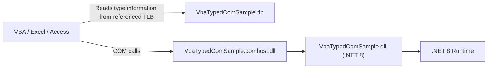

There are still plenty of ordinary cases where VBA needs to call .NET 8 code.

That is especially true when an Excel or Access solution is staying in place, but the team wants to move heavier logic into C#:

- expensive processing
- string handling
- HTTP work
- cryptography
- business logic that no longer belongs in macro code

If everything stays late-bound through `CreateObject`, VBA quickly turns into a swamp of `Object` variables and string-based assumptions. IntelliSense becomes weak, method-name mistakes survive until runtime, and the code gets harder to trust.

So this article narrows the problem deliberately:

**Expose a .NET 8 DLL through COM, generate a type library with dscom, and use it from VBA with early binding.**

This is not about the older `.NET Framework + RegAsm` path, handwritten IDL plus MIDL, or Reg-Free COM. The focus here is one specific route:

**.NET 8 / COM host / dscom / VBA early binding**

## 1. The short version

The practical flow is:

- build the .NET 8 class library with `EnableComHosting=true`
- define explicit COM-visible interfaces and classes
- keep the classes at `ClassInterfaceType.None` instead of leaning on `AutoDual`
- use `InterfaceIsDual` for the interfaces VBA will consume
- run `dscom tlbexport` against the built assembly to produce a `*.tlb`
- register the generated `*.comhost.dll` with `regsvr32`
- register the generated `*.tlb` with `dscom tlbregister`
- add the reference in VBA and use the library through early binding

The clean mental model is:

**the COM entry point is the SDK-generated `*.comhost.dll`, while the VBA-visible type information lives in the `*.tlb` generated by dscom.**

## 2. The whole shape of the solution

Here is the full picture first.



Each file has a different job:

| File | Role |
| --- | --- |
| `VbaTypedComSample.dll` | the actual .NET 8 implementation |
| `VbaTypedComSample.comhost.dll` | the COM activation entry point |
| `VbaTypedComSample.tlb` | the type information VBA reads for early binding |
| `VbaTypedComSample.deps.json` | dependency resolution data |
| `VbaTypedComSample.runtimeconfig.json` | .NET runtime startup configuration |

That distinction matters a lot.

VBA does **not** get its friendly type information from the implementation DLL by magic.  
It gets that from the type library.  
And COM activation itself goes through the COM host, not directly through the implementation assembly.

## 3. Decide bitness first

If this part is postponed, the project often drifts straight toward:

"ActiveX component can't create object."

The Office / VBA side and the COM server side should match in bitness.

| Consumer | .NET side target | TLB tool | Registration path |
| --- | --- | --- | --- |
| 64-bit Office | `x64` / `win-x64` | `dscom` | `C:\Windows\System32\regsvr32.exe` |
| 32-bit Office on 64-bit Windows | `x86` / `win-x86` | `dscom32.exe` | `C:\Windows\SysWOW64\regsvr32.exe` |

With modern .NET COM hosting, leaving the project at `AnyCPU` is often not the safest choice for Office interoperability. If the target Office installation is known, being explicit with `x86` or `x64` is usually calmer.

The examples below assume **64-bit Office**.  
For 32-bit Office, replace the `x64` examples with `x86`, and `win-x64` with `win-x86`.

## 4. Build the .NET 8 side

For the sample, imagine a tiny library that exposes three methods to VBA:

- `Add`
- `Divide`
- `Hello`

### 4.1 Project file

```xml
<Project Sdk="Microsoft.NET.Sdk">
  <PropertyGroup>
    <TargetFramework>net8.0-windows</TargetFramework>
    <Nullable>enable</Nullable>
    <ImplicitUsings>enable</ImplicitUsings>

    <!-- Generate the COM host -->
    <EnableComHosting>true</EnableComHosting>

    <!-- 64-bit Office example -->
    <PlatformTarget>x64</PlatformTarget>
    <NETCoreSdkRuntimeIdentifier>win-x64</NETCoreSdkRuntimeIdentifier>
  </PropertyGroup>
</Project>
```

The key property is `EnableComHosting`.  
That is what causes the SDK to produce the `*.comhost.dll`.

### 4.2 Keep the assembly closed by default

It is usually cleaner to keep the assembly non-COM-visible by default and open only the specific types you want to expose.

```csharp
using System.Runtime.InteropServices;

[assembly: ComVisible(false)]
```

### 4.3 Define the interface and class explicitly

```csharp
using System.Runtime.InteropServices;

namespace VbaTypedComSample;

[ComVisible(true)]
[Guid("2A1BBEDE-DE6E-4C34-AD60-2E9E0E33E999")]
[InterfaceType(ComInterfaceType.InterfaceIsDual)]
public interface ICalculator
{
    [DispId(1)]
    int Add(int x, int y);

    [DispId(2)]
    double Divide(double x, double y);

    [DispId(3)]
    string Hello(string name);
}

[ComVisible(true)]
[Guid("FAD1C752-0BB6-4DDD-889F-FE446350847A")]
[ClassInterface(ClassInterfaceType.None)]
[ComDefaultInterface(typeof(ICalculator))]
public class Calculator : ICalculator
{
    public Calculator()
    {
    }

    public int Add(int x, int y) => checked(x + y);

    public double Divide(double x, double y)
    {
        if (y == 0)
        {
            throw new ArgumentOutOfRangeException(nameof(y), "Cannot divide by zero.");
        }

        return x / y;
    }

    public string Hello(string name)
    {
        if (string.IsNullOrWhiteSpace(name))
        {
            return "Hello";
        }

        return $"Hello, {name}";
    }
}
```

The practical points here are:

- give the **interface** and the **class** their own GUIDs
- keep the class at **`ClassInterfaceType.None`**
- use `InterfaceIsDual` so VBA can consume the interface comfortably
- assign `DispId` values to reduce avoidable breakage
- provide a public parameterless constructor for COM activation

`AutoDual` can look tempting because it feels fast and convenient.  
It is also an easy way to make the exposed shape brittle later. Explicit contracts age better.

## 5. Build the project

Use a Release build:

```powershell
dotnet build -c Release
```

After the build, the output directory should contain at least:

```text
bin/
  Release/
    net8.0-windows/
      VbaTypedComSample.dll
      VbaTypedComSample.comhost.dll
      VbaTypedComSample.deps.json
      VbaTypedComSample.runtimeconfig.json
```

This output directory is the real deployment unit.  
If you later move the files somewhere else, registration generally needs to be revisited too.

## 6. Generate the TLB with dscom

### 6.1 For 64-bit Office

Install dscom first:

```powershell
dotnet tool install --global dscom
```

Then export a type library from the built assembly:

```powershell
dscom tlbexport .\bin\Release\net8.0-windows\VbaTypedComSample.dll --out .\bin\Release\net8.0-windows\VbaTypedComSample.tlb
```

### 6.2 For 32-bit Office

This is a small but important trap.

If the target is 32-bit Office, using **`dscom32.exe`** is the safer route for the TLB workflow.

```powershell
.\tools\dscom32.exe tlbexport .\bin\Release\net8.0-windows\VbaTypedComSample.dll --out .\bin\Release\net8.0-windows\VbaTypedComSample.tlb
```

## 7. Register the COM host and the TLB

These commands should be run from an **elevated** command prompt or PowerShell.

### 7.1 64-bit Office / 64-bit COM case

```powershell
$out = Resolve-Path .\bin\Release\net8.0-windows

C:\Windows\System32\regsvr32.exe "$out\VbaTypedComSample.comhost.dll"
dscom tlbregister "$out\VbaTypedComSample.tlb"
```

### 7.2 32-bit Office on 64-bit Windows

```powershell
$out = Resolve-Path .\bin\Release\net8.0-windows

C:\Windows\SysWOW64\regsvr32.exe "$out\VbaTypedComSample.comhost.dll"
.\tools\dscom32.exe tlbregister "$out\VbaTypedComSample.tlb"
```

There are two separate registrations happening here:

- `regsvr32` registers the **COM server entry point**
- `tlbregister` registers the **type library**

You need both if you want:

- COM activation
- plus typed VBA early binding

### 7.3 Unregistering during development

During iteration, it is often useful to unregister before rebuilding or changing the binary layout.

For the 64-bit case:

```powershell
$out = Resolve-Path .\bin\Release\net8.0-windows

C:\Windows\System32\regsvr32.exe /u "$out\VbaTypedComSample.comhost.dll"
dscom tlbunregister "$out\VbaTypedComSample.tlb"
```

For 32-bit Office, swap `System32` for `SysWOW64` and use `dscom32.exe`.

## 8. Add the reference in VBA and use it with types

Once the type library is registered:

1. open Excel or Access
2. open the VBA editor
3. go to `Tools -> References`
4. check the registered library if it appears in the list
5. if needed, browse to the generated `VbaTypedComSample.tlb`

Then VBA can use the types directly:

```vb
Option Explicit

Public Sub UseCalculator()
    Dim calc As VbaTypedComSample.ICalculator
    Set calc = New VbaTypedComSample.Calculator

    Debug.Print calc.Add(10, 20)
    Debug.Print calc.Divide(10, 4)
    Debug.Print calc.Hello("VBA")
End Sub
```

This brings back the things late binding loses:

- IntelliSense
- easier typo detection
- browsable API surface
- code that reads like a contract instead of a pile of `Object`

### 8.1 Exceptions surface as COM errors in VBA

If the .NET side throws, VBA will usually see a COM error.

```vb
Option Explicit

Public Sub UseCalculatorWithErrorHandling()
    On Error GoTo EH

    Dim calc As VbaTypedComSample.ICalculator
    Set calc = New VbaTypedComSample.Calculator

    Debug.Print calc.Divide(10, 0)
    Exit Sub

EH:
    Debug.Print Err.Number
    Debug.Print Err.Description
End Sub
```

That is one reason it helps to keep the exception messages on the .NET side understandable.

## 9. Deployment thinking

Do not think of deployment as "copy one DLL."

The practical deployment unit is more like:

```text
VbaTypedComSample.dll
VbaTypedComSample.comhost.dll
VbaTypedComSample.deps.json
VbaTypedComSample.runtimeconfig.json
VbaTypedComSample.tlb
(and any dependency DLLs)
```

The target machine also needs the matching **.NET 8 runtime**.  
This COM-hosting path is generally framework-dependent rather than self-contained.

A sane order is:

1. decide the target folder
2. place the full output set there
3. ensure the .NET 8 runtime is installed
4. register the COM host and TLB
5. add the VBA reference

Registering first and then moving the files later is a good way to create confusing activation failures.

## 10. Common traps

### 10.1 Do not leave the project at `AnyCPU`

If Office bitness and COM host bitness do not line up, the failures become unpleasant quickly.

- 64-bit Office -> `x64` / `win-x64`
- 32-bit Office -> `x86` / `win-x86`

### 10.2 Do not use `ClassInterfaceType.AutoDual`

It looks easier, but it makes the exposed contract much easier to break later.

If the goal is stable, typed VBA consumption, explicit interfaces plus `ClassInterfaceType.None` are the healthier design.

### 10.3 Do not regenerate GUIDs casually

In COM, GUIDs are part of the contract:

- interface IDs
- class IDs

Changing them carelessly after consumers already exist will break registrations and VBA references.

### 10.4 Do not casually break published interfaces

COM does not always forgive "small" changes.

If you need significant interface evolution, it is often safer to think in terms like:

- keep `ICalculator`
- add `ICalculator2` for incompatible expansion
- let the class implement both if needed

### 10.5 Keep the boundary types simple

At the VBA-facing boundary, boring types are usually your friends.

Commonly safe choices include:

- `int`
- `double`
- `bool`
- `string`
- `DateTime`
- `decimal`
- `enum`

Very clever type surfaces tend to age poorly at COM boundaries.

### 10.6 Do not rebuild while Office is holding the DLL

Excel or Access can keep the DLL loaded, which makes rebuilds and re-registration more frustrating than they need to be.

A calmer development rhythm is:

- close Office
- unregister if necessary
- rebuild
- register again

## 11. Wrap-up

If you limit the problem to:

**COM exposure + dscom-generated TLB + typed VBA early binding**

then the .NET 8 story is actually fairly structured.

- use `EnableComHosting=true`
- define explicit COM interfaces
- keep classes at `ClassInterfaceType.None`
- use `InterfaceIsDual` for the VBA-facing interface
- generate the TLB with `dscom tlbexport`
- register the `*.comhost.dll`
- register the `*.tlb`
- add the VBA reference and use the library with real types

The key mental split is:

- `*.comhost.dll` -> COM activation entry
- `*.tlb` -> type information for VBA
- `*.dll` -> implementation

Once that separation is clear, the path from VBA to .NET 8 becomes much easier to reason about.

## 12. References

- [Expose .NET components to COM - Microsoft Learn](https://learn.microsoft.com/en-us/dotnet/core/native-interop/expose-components-to-com)
- [Qualify .NET Types for Interoperation - Microsoft Learn](https://learn.microsoft.com/en-us/dotnet/standard/native-interop/qualify-net-types-for-interoperation)
- [ComInterfaceType enum - Microsoft Learn](https://learn.microsoft.com/en-us/dotnet/api/system.runtime.interopservices.cominterfacetype?view=net-8.0)
- [ClassInterfaceType enum - Microsoft Learn](https://learn.microsoft.com/en-us/dotnet/api/system.runtime.interopservices.classinterfacetype?view=net-8.0)
- [COM Callable Wrapper - Microsoft Learn](https://learn.microsoft.com/en-us/dotnet/standard/native-interop/com-callable-wrapper)
- [DispIdAttribute - Microsoft Learn](https://learn.microsoft.com/en-us/dotnet/api/system.runtime.interopservices.dispidattribute?view=net-10.0)
- [dscom - NuGet Gallery](https://www.nuget.org/packages/dscom)
- [How to use the Regsvr32 tool and troubleshoot Regsvr32 error messages - Microsoft Support](https://support.microsoft.com/en-us/topic/how-to-use-the-regsvr32-tool-and-troubleshoot-regsvr32-error-messages-a98d960a-7392-e6fe-d90a-3f4e0cb543e5)
- [.NET 8 downloads](https://dotnet.microsoft.com/en-us/download/dotnet/8.0)
