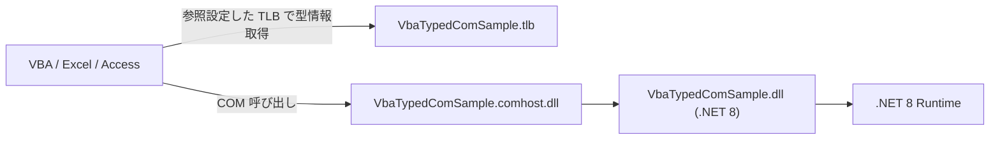

VBA から .NET 8 の処理を呼びたい場面はまだ普通にあります。特に、Excel や Access の既存資産はそのまま残しつつ、重い処理、文字列処理、HTTP、暗号、業務ロジックのような部分だけを C# に逃がしたいときです。

ただ、`CreateObject` で遅延バインディングに寄せると、VBA 側では `Object` だらけになります。IntelliSense は弱くなり、メソッド名の打ち間違いは実行時まで見つからず、だんだん文字列頼みのぬかるみに沈みます。

そこで今回は、**.NET 8 の DLL を COM 公開し、dscom でタイプライブラリ（TLB）を生成し、VBA から早期バインディングで型付き利用する**ところに絞って整理します。

`.NET Framework + RegAsm` の昔話、IDL を手書きして MIDL で固める話、Reg-Free COM の話は今回は横に置きます。ここでは、**.NET 8 / COM host / dscom / VBA early binding** の一本道だけを扱います。

## 1. まず結論

先に結論だけ並べると、流れはこうです。

- .NET 8 のクラスライブラリを `EnableComHosting=true` でビルドする
- COM に見せる **明示的なインターフェイス** と **クラス** を作る
- クラスは `ClassInterfaceType.None` にして、`AutoDual` に逃げない
- VBA から使うインターフェイスは `InterfaceIsDual` にする
- ビルド後にできた `*.dll` から、`dscom tlbexport` で `*.tlb` を作る
- `regsvr32` で `*.comhost.dll` を登録する
- `dscom tlbregister` で `*.tlb` を登録する
- VBA で参照設定を追加し、`Dim x As ライブラリ名.IYourInterface` のように型付きで使う

要するに、**COM の入口は .NET SDK が作る `*.comhost.dll`、型情報は dscom が作る `*.tlb`、VBA はその TLB を見て早期バインディングする**、という構成です。

## 2. この構成の全体像

まず、何が何の役目なのかを 1 枚で見ます。



それぞれの役割は次のとおりです。

| ファイル | 役割 |
| --- | --- |
| `VbaTypedComSample.dll` | .NET 8 の実装本体 |
| `VbaTypedComSample.comhost.dll` | COM から呼ばれる入口 |
| `VbaTypedComSample.tlb` | VBA が見る型情報 |
| `VbaTypedComSample.deps.json` | 依存関係の解決情報 |
| `VbaTypedComSample.runtimeconfig.json` | .NET ランタイム起動情報 |

ここで大事なのは、**VBA が型を知るために必要なのは TLB** で、**COM の起動入口として必要なのは comhost** だという点です。

`.dll` 単体を渡して終わり、ではありません。COM の世界はここが素直ではありません。

## 3. 最初に決めること - 32bit / 64bit を揃える

ここを外すと、かなりの確率で `ActiveX コンポーネントはオブジェクトを作成できません。` 方面へ転がります。

Office / VBA と COM サーバーの bitness は揃えてください。

| 利用側 | .NET 側の目安 | TLB 生成 | 登録コマンド |
| --- | --- | --- | --- |
| 64bit Office | `x64` / `win-x64` | `dscom` | `C:\Windows\System32\regsvr32.exe` |
| 32bit Office（64bit Windows 上） | `x86` / `win-x86` | `dscom32.exe` | `C:\Windows\SysWOW64\regsvr32.exe` |

`.NET 5+` 以降の COM host では、`AnyCPU` のままにすると `*.comhost.dll` が 64bit 側に寄りやすく、32bit Office と噛み合わないことがあります。なので、**Office に合わせて x86 / x64 を明示**したほうが安全です。

この記事のコードは **64bit Office 向け**を例にします。32bit Office なら、後で出てくる `x64` を `x86`、`win-x64` を `win-x86` に読み替えてください。

## 4. .NET 8 側を作る

ここでは、VBA から `Add`、`Divide`、`Hello` を呼べる最小サンプルにします。

### 4.1 `.csproj`

```xml
<Project Sdk="Microsoft.NET.Sdk">
  <PropertyGroup>
    <TargetFramework>net8.0-windows</TargetFramework>
    <Nullable>enable</Nullable>
    <ImplicitUsings>enable</ImplicitUsings>
    <EnableComHosting>true</EnableComHosting>
    <PlatformTarget>x64</PlatformTarget>
    <NETCoreSdkRuntimeIdentifier>win-x64</NETCoreSdkRuntimeIdentifier>
  </PropertyGroup>
</Project>
```

ポイントは `EnableComHosting` です。これを付けると、ビルド時に `VbaTypedComSample.comhost.dll` が生成されます。

### 4.2 アセンブリ全体はデフォルトで COM 非公開にしておく

COM に見せる型だけ `ComVisible(true)` にしたいので、アセンブリ全体は `false` にしておくのが楽です。

```csharp
using System.Runtime.InteropServices;

[assembly: ComVisible(false)]
```

### 4.3 公開するインターフェイスとクラスを書く

```csharp
using System.Runtime.InteropServices;

namespace VbaTypedComSample;

[ComVisible(true)]
[Guid("2A1BBEDE-DE6E-4C34-AD60-2E9E0E33E999")]
[InterfaceType(ComInterfaceType.InterfaceIsDual)]
public interface ICalculator
{
    [DispId(1)]
    int Add(int x, int y);

    [DispId(2)]
    double Divide(double x, double y);

    [DispId(3)]
    string Hello(string name);
}

[ComVisible(true)]
[Guid("FAD1C752-0BB6-4DDD-889F-FE446350847A")]
[ClassInterface(ClassInterfaceType.None)]
[ComDefaultInterface(typeof(ICalculator))]
public class Calculator : ICalculator
{
    public Calculator()
    {
    }

    public int Add(int x, int y) => checked(x + y);

    public double Divide(double x, double y)
    {
        if (y == 0)
        {
            throw new ArgumentOutOfRangeException(nameof(y), "0 では割れません。");
        }

        return x / y;
    }

    public string Hello(string name)
    {
        if (string.IsNullOrWhiteSpace(name))
        {
            return "Hello";
        }

        return $"Hello, {name}";
    }
}
```

このコードで押さえておきたい点は次です。

- `Guid` は **インターフェイス**と **クラス**に別々に振る
- `ClassInterfaceType.None` にして、**自動生成クラスインターフェイスに依存しない**
- VBA で扱いやすいように `InterfaceIsDual` にする
- `DispId` を振っておくと、公開後にメソッド順をいじったときの事故を減らしやすい
- COM から `New` されるので、**public な引数なしコンストラクター**を用意する

## 5. ビルドする

Release ビルドします。

```powershell
dotnet build -c Release
```

ビルド後、出力フォルダには少なくとも次のようなファイルが並びます。

```text
bin/
  Release/
    net8.0-windows/
      VbaTypedComSample.dll
      VbaTypedComSample.comhost.dll
      VbaTypedComSample.deps.json
      VbaTypedComSample.runtimeconfig.json
```

配布や登録で使うのはこのフォルダです。**あとで配置場所を変えるなら、登録もやり直し**になります。

## 6. dscom で TLB を生成する

### 6.1 64bit の場合

まずは dscom を入れます。

```powershell
dotnet tool install --global dscom
```

次に、ビルドしたアセンブリから TLB を生成します。

```powershell
dscom tlbexport .\bin\Release\net8.0-windows\VbaTypedComSample.dll --out .\bin\Release\net8.0-windows\VbaTypedComSample.tlb
```

### 6.2 32bit Office 向けの場合

ここは少しだけ罠です。**32bit Office 向けに TLB を作るなら `dscom32.exe` を使う**のが安全です。

```powershell
.\tools\dscom32.exe tlbexport .\bin\Release\net8.0-windows\VbaTypedComSample.dll --out .\bin\Release\net8.0-windows\VbaTypedComSample.tlb
```

## 7. COM host と TLB を登録する

ここは **管理者権限のコマンドプロンプト / PowerShell**で実行してください。

### 7.1 64bit Office / 64bit COM の場合

```powershell
$out = Resolve-Path .\bin\Release\net8.0-windows

C:\Windows\System32\regsvr32.exe "$out\VbaTypedComSample.comhost.dll"
dscom tlbregister "$out\VbaTypedComSample.tlb"
```

### 7.2 32bit Office（64bit Windows 上）の場合

```powershell
$out = Resolve-Path .\bin\Release\net8.0-windows

C:\Windows\SysWOW64\regsvr32.exe "$out\VbaTypedComSample.comhost.dll"
.\tools\dscom32.exe tlbregister "$out\VbaTypedComSample.tlb"
```

ここでやっていることは 2 つです。

- `regsvr32` で `*.comhost.dll` を COM サーバーとして登録する
- `tlbregister` で `*.tlb` をタイプライブラリとして登録する

## 8. VBA で参照設定して、型付きで使う

1. Excel または Access を開く
2. VBA エディタを開く
3. `ツール` -> `参照設定`
4. 一覧にライブラリが出ていればチェックを入れる
5. 一覧に見えなければ `参照...` から `VbaTypedComSample.tlb` を選ぶ

```vb
Option Explicit

Public Sub UseCalculator()
    Dim calc As VbaTypedComSample.ICalculator
    Set calc = New VbaTypedComSample.Calculator

    Debug.Print calc.Add(10, 20)
    Debug.Print calc.Divide(10, 4)
    Debug.Print calc.Hello("VBA")
End Sub
```

これで、VBA 側では次の恩恵があります。

- IntelliSense が効く
- メソッド名の typo が実行前に見つけやすい
- Object Browser で公開 API を確認できる
- `Object` ベタ書きより読みやすい

### 8.1 例外は VBA 側では COM エラーになる

たとえば `Divide(10, 0)` のように .NET 側で例外が投げられると、VBA 側では COM エラーとして見えます。

```vb
Option Explicit

Public Sub UseCalculatorWithErrorHandling()
    On Error GoTo EH

    Dim calc As VbaTypedComSample.ICalculator
    Set calc = New VbaTypedComSample.Calculator

    Debug.Print calc.Divide(10, 0)
    Exit Sub

EH:
    Debug.Print Err.Number
    Debug.Print Err.Description
End Sub
```

## 9. 配布するときの考え方

配布時に大事なのは、**DLL 単体を配るのではなく、出力一式を置く**ことです。

```text
VbaTypedComSample.dll
VbaTypedComSample.comhost.dll
VbaTypedComSample.deps.json
VbaTypedComSample.runtimeconfig.json
VbaTypedComSample.tlb
(必要なら依存 DLL 一式)
```

さらに、クライアント PC には **対応する .NET 8 ランタイム**が必要です。COM host は self-contained 配布ではなく、基本的に framework-dependent な運用になります。

## 10. はまりどころ

### 10.1 `AnyCPU` のまま放置しない

VBA / Office の bitness と COM host の bitness がズレると、かなり気持ち悪い失敗のしかたをします。

- 64bit Office なら `x64` / `win-x64`
- 32bit Office なら `x86` / `win-x86`

### 10.2 `ClassInterfaceType.AutoDual` を使わない

一見ラクです。ですが、公開後にメンバー順や構成を触ると壊しやすいです。

VBA から型付きで安定して使いたいなら、**明示インターフェイスを定義し、クラスは `ClassInterfaceType.None`**にしておくのが定石です。

### 10.3 GUID を軽率に再生成しない

COM では GUID が契約そのものです。

- IID
- CLSID

を、公開後に軽率に入れ替えると、既存の VBA 参照や登録が壊れます。

### 10.4 公開済みインターフェイスを壊さない

COM は「後から 1 個メソッド足しただけ」でも平和に済まないことがあります。

- `ICalculator` は残す
- 変更が大きいなら `ICalculator2` を新設する
- クラスは両方実装してもよい

### 10.5 型は地味に寄せる

VBA に見せる境界では、あまり格好をつけないほうが安全です。

相性が良いのは、まずはこのへんです。

- `int`
- `double`
- `bool`
- `string`
- `DateTime`
- `decimal`
- `enum`

### 10.6 Office を開いたまま更新しない

Excel や Access が DLL を掴んだままになり、ビルドや再登録で面倒が起きることがあります。

- Office を閉じる
- 必要なら登録解除する
- ビルドし直す
- もう一度登録する

## 11. まとめ

`.NET 8 の DLL を型付きで VBA から使う`という話を、**COM 公開 + dscom で TLB 生成**に絞ると、やることは意外と整理できます。

- .NET 8 側では `EnableComHosting=true`
- COM に見せる **明示インターフェイス**を作る
- クラスは `ClassInterfaceType.None`
- VBA 向けインターフェイスは `InterfaceIsDual`
- `dscom tlbexport` で TLB を作る
- `regsvr32` で `*.comhost.dll` を登録する
- `dscom tlbregister` で `*.tlb` を登録する
- VBA で参照設定を入れて早期バインディングする

要するに、**.NET 8 時代の VBA 連携は、COM host と TLB を分けて考える**のがコツです。

- 起動入口は `*.comhost.dll`
- 型情報は `*.tlb`
- 実装本体は `*.dll`

## 12. 参考資料

- [Expose .NET components to COM - Microsoft Learn](https://learn.microsoft.com/en-us/dotnet/core/native-interop/expose-components-to-com)
- [COM 相互運用のために .NET 型を修飾する - Microsoft Learn](https://learn.microsoft.com/ja-jp/dotnet/standard/native-interop/qualify-net-types-for-interoperation)
- [ComInterfaceType 列挙型 - Microsoft Learn](https://learn.microsoft.com/ja-jp/dotnet/api/system.runtime.interopservices.cominterfacetype?view=net-8.0)
- [ClassInterfaceType 列挙型 - Microsoft Learn](https://learn.microsoft.com/ja-jp/dotnet/api/system.runtime.interopservices.classinterfacetype?view=net-8.0)
- [COM 呼び出し可能ラッパー - Microsoft Learn](https://learn.microsoft.com/ja-jp/dotnet/standard/native-interop/com-callable-wrapper)
- [DispIdAttribute クラス - Microsoft Learn](https://learn.microsoft.com/ja-jp/dotnet/api/system.runtime.interopservices.dispidattribute?view=net-10.0)
- [dscom - NuGet Gallery](https://www.nuget.org/packages/dscom)
- [How to use the Regsvr32 tool and troubleshoot Regsvr32 error messages - Microsoft Support](https://support.microsoft.com/en-us/topic/how-to-use-the-regsvr32-tool-and-troubleshoot-regsvr32-error-messages-a98d960a-7392-e6fe-d90a-3f4e0cb543e5)
- [.NET 8 downloads](https://dotnet.microsoft.com/en-us/download/dotnet/8.0)
