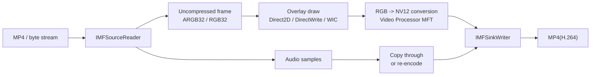

Overlaying logos, timestamps, inspection results, device IDs, or operator names onto MP4 video frames is a very ordinary requirement in surveillance, inspection, evidence capture, and analysis UI work.

But once you step into Media Foundation, the API surface quickly becomes a wall of names:

- `IMFSourceReader`
- `IMFSample`
- `IMFMediaBuffer`
- `IMFTransform`
- `IMFSinkWriter`

And then the practical question becomes:

**where do you actually draw the text?**

The key mental split is this:

**Media Foundation is mainly responsible for decode, encode, and sample flow.  
The actual drawing of text and images belongs much more naturally to Direct2D / DirectWrite / WIC.**

This article focuses on the practical path:

**decode the MP4, overlay per-frame text or graphics, convert the frame format if needed, and write the result back as video.**

## 1. The short version

- The usual shape is: `Source Reader -> uncompressed frame -> draw overlay -> convert format if needed -> Sink Writer`
- The actual image and text composition is usually better thought about in **Direct2D / DirectWrite / WIC**, not in Media Foundation itself
- If the output is `MP4(H.264)`, you often have to bridge between a draw-friendly format like `RGB32 / ARGB32` and an encoder-friendly format like `NV12 / I420 / YUY2`
- If audio is unchanged, it is often practical to **re-encode only the video and keep the audio stream as-is**
- For a first implementation, a manual pipeline around `IMFSourceReader` and `IMFSinkWriter` is usually easier to reason about than jumping straight into a custom MFT

## 2. Why this feels more complicated than it first sounds

"Put text on the video" actually mixes together four different problems:

1. **Container and codec**  
   `mp4` is a container, not a raw frame format. The video inside is often compressed H.264 or H.265.

2. **Decode and encode**  
   You cannot generally draw directly on compressed video bitstreams. The frames need to become uncompressed first.

3. **Drawing**  
   Text rendering, PNG blending, and antialiased graphics are not what Media Foundation is primarily for. That is where Direct2D / DirectWrite / WIC belong.

4. **Color space and pixel format**  
   The format that is convenient for drawing is often not the format the encoder wants.

That is why the cleaner mental model is not:

"draw text with Media Foundation"

but rather:

"use Media Foundation to move frames through the pipeline, use drawing APIs to overlay, then convert back into something the encoder likes."

## 3. A practical comparison table

| Approach | Shape | Best fit | Main caution |
| --- | --- | --- | --- |
| get it correct first | `Source Reader -> RGB32 / ARGB32 -> overlay -> Video Processor MFT -> NV12 -> Sink Writer` | batch processing, internal tools, first implementation | more copies and format transitions |
| optimize for throughput | `D3D11 / DXGI surface -> Direct2D / DirectWrite -> Video Processor MFT -> Sink Writer` | long clips, high resolution, large throughput | more D3D11 / DXGI complexity |
| build a reusable effect component | implement a custom `MFT` and insert it into the pipeline | reusable media effects across multiple apps | much higher implementation and debugging cost |

## 4. The most practical first architecture

### 4.1 Use `IMFSourceReader` for input

If the input is a file path, `MFCreateSourceReaderFromURL` is straightforward.  
If the input is already in memory, creating an `IMFByteStream` and using `MFCreateSourceReaderFromByteStream` keeps the same overall shape.

The first real design choice is:

- receive frames in a draw-friendly format
- or receive them in an encoder-friendly format

For implementation clarity, `RGB32` or `ARGB32` is usually the better first step.

### 4.2 Source Reader conversion is useful, but not magic

`MF_SOURCE_READER_ENABLE_VIDEO_PROCESSING` can help the Source Reader hand you `RGB32` plus deinterlacing.  
That is genuinely convenient when the immediate goal is to pull frames into a form you can work with.

But it is still mostly a convenience step, not a full rendering strategy.

### 4.3 Think about image and text overlay as a drawing problem

This is the core of the article.

Once you have an uncompressed frame, you need to composite:

- logos
- PNGs with alpha
- timestamps
- labels
- operator or inspection text

Two broad implementation styles are common.

#### A. CPU / system-memory-oriented path

- get the `IMFMediaBuffer` from the sample
- use `ConvertToContiguousBuffer` if needed
- `Lock` it or use `IMF2DBuffer::Lock2D`
- blend images and text into the pixel buffer
- use Direct2D / DirectWrite offscreen drawing, or your own blend logic

This path is easier to understand and often good enough for a first implementation.

#### B. GPU / DXGI-surface-oriented path

- decode into D3D11 / DXGI surfaces
- draw directly with Direct2D and DirectWrite
- pass the result forward toward format conversion and encoding

This path can scale better, but it also brings much more D3D11 and synchronization management with it.

### 4.4 `ARGB32` is not necessarily what the H.264 encoder wants

This is one of the most common gotchas.

When writing `MP4(H.264)`, the Microsoft H.264 encoder usually prefers YUV-family input such as:

- `NV12`
- `I420`
- `YUY2`
- related formats

That means:

**draw-friendly RGB is often not write-friendly encoder input.**

So after drawing in `RGB32 / ARGB32`, you usually need a format-conversion stage.

In practice, the common choices are:

- insert the **Video Processor MFT** for `ARGB32 / RGB32 -> NV12`
- or write your own conversion path

The first option is usually much easier to live with.

### 4.5 Use `IMFSinkWriter` for output

For output, `IMFSinkWriter` is usually the easiest place to land.

The key is to separate:

- the **output stream type**  
  for example `MFVideoFormat_H264`
- the **input stream type** you feed into the writer  
  for example `MFVideoFormat_NV12`

So from the writer's point of view:

- your app supplies uncompressed `NV12`
- the writer encodes it to H.264 and stores it in MP4

### 4.6 Audio is often best left alone

If the requirement is only to burn text or graphics into the video, audio often does not need to change.

In that case, a very practical architecture is:

- decode / overlay / convert / re-encode the **video**
- keep the **audio** compressed and pass it through if the container and stream conditions allow

That keeps the first implementation much simpler.

## 5. A practical execution flow

The high-level flow usually looks like this:

1. `CoInitializeEx` and `MFStartup`
2. create the `Source Reader`
3. request video in `RGB32 / ARGB32`
4. keep audio compressed if possible
5. create Direct2D / DirectWrite / WIC resources
6. configure the Video Processor MFT for `RGB -> NV12`
7. configure the `Sink Writer` for H.264 output with NV12 input
8. add audio if needed
9. loop with `ReadSample`, overlay, convert, and `WriteSample`
10. `Finalize`
11. `MFShutdown` and `CoUninitialize`

The important thing this reveals is that:

**drawing and color conversion are separate stages.**

Trying to treat them as one fuzzy step is where the implementation usually starts to become confusing.

## 6. Common traps to recognize early

### 6.1 `ReadSample` can succeed with `sample == nullptr`

That can happen for cases such as:

- end of stream
- stream tick
- other stream events

So the code needs to look at:

- the `HRESULT`
- the stream flags
- and whether the sample pointer is actually present

### 6.2 Timestamps are 100 ns units, and duration is separate

The timestamp returned from Media Foundation is in 100-nanosecond units.  
Duration is typically a separate value from the sample.

If the output is a straightforward one-input-frame to one-output-frame transformation, propagating input timestamp and duration is usually the safest first approach.

### 6.3 Do not assume one sample means one simple buffer

An `IMFSample` may have multiple buffers.  
That is why `ConvertToContiguousBuffer` is often the safer starting point before touching pixel memory directly.

### 6.4 Do not hardcode stride as `width * bytesPerPixel`

This is a classic footgun.

- row padding may exist
- pitch may be wider than expected
- 2D buffers can behave differently than naive assumptions

If `IMF2DBuffer::Lock2D` is available, using it is usually a safer path.

### 6.5 "It draws fine in ARGB32" does not mean the encoder will accept it

This is one of the most ordinary debugging dead ends:

- drawing works
- the H.264 stage fails or refuses the format

And the reason is simply that drawing-friendly RGB and encoder-friendly YUV are not the same thing.

## 7. When a custom MFT makes sense

At some point it is natural to ask:

"Shouldn't this really be a custom MFT?"

That is not a wrong instinct.  
Media Foundation absolutely allows transform components in that style.

A custom MFT starts making more sense when:

- the effect should be reused across multiple apps
- it should fit naturally into a richer MF topology
- the overlay logic should become a media component of its own

But for a first implementation it is usually heavier because it adds:

- full `IMFTransform` contract behavior
- input/output type negotiation
- MFT registration and enumeration concerns
- more complicated debugging around timestamps and stream changes

That is why a practical first move is often:

**manual pipeline first, custom MFT later if the component proves it deserves to exist.**

## 8. Wrap-up

If you break the problem into the right pieces, the path becomes much easier to see:

- use `Source Reader` to turn compressed video into frames
- use Direct2D / DirectWrite / WIC to draw overlays
- use something like the Video Processor MFT to bridge RGB back to NV12 or another encoder-friendly format
- use `Sink Writer` to encode back into MP4 / H.264

That is much more practical than trying to think of the task as:

"put text into video with Media Foundation."

The most important mismatch to understand is this:

- overlays are easiest to draw in RGB
- H.264 encoding is often happiest with YUV

Once that clicks, the rest of the architecture becomes much easier to reason about.

## 9. References

- Microsoft Learn: [Using the Source Reader to Process Media Data](https://learn.microsoft.com/en-us/windows/win32/medfound/processing-media-data-with-the-source-reader)
- Microsoft Learn: [MFCreateSourceReaderFromByteStream](https://learn.microsoft.com/en-us/windows/win32/api/mfreadwrite/nf-mfreadwrite-mfcreatesourcereaderfrombytestream)
- Microsoft Learn: [MFCreateMFByteStreamOnStream](https://learn.microsoft.com/en-us/windows/win32/api/mfidl/nf-mfidl-mfcreatemfbytestreamonstream)
- Microsoft Learn: [IMFSourceReader::SetCurrentMediaType](https://learn.microsoft.com/en-us/windows/win32/api/mfreadwrite/nf-mfreadwrite-imfsourcereader-setcurrentmediatype)
- Microsoft Learn: [MF_SOURCE_READER_ENABLE_VIDEO_PROCESSING](https://learn.microsoft.com/en-us/windows/win32/medfound/mf-source-reader-enable-video-processing)
- Microsoft Learn: [MF_SOURCE_READER_ENABLE_ADVANCED_VIDEO_PROCESSING](https://learn.microsoft.com/en-us/windows/win32/medfound/mf-source-reader-enable-advanced-video-processing)
- Microsoft Learn: [IMFSourceReader::ReadSample](https://learn.microsoft.com/en-us/windows/win32/api/mfreadwrite/nf-mfreadwrite-imfsourcereader-readsample)
- Microsoft Learn: [Working with Media Samples](https://learn.microsoft.com/en-us/windows/win32/medfound/working-with-media-samples)
- Microsoft Learn: [IMF2DBuffer::Lock2D](https://learn.microsoft.com/en-us/windows/win32/api/mfobjects/nf-mfobjects-imf2dbuffer-lock2d)
- Microsoft Learn: [Video Subtype GUIDs](https://learn.microsoft.com/en-us/windows/win32/medfound/video-subtype-guids)
- Microsoft Learn: [H.264 Video Encoder](https://learn.microsoft.com/en-us/windows/win32/medfound/h-264-video-encoder)
- Microsoft Learn: [Video Processor MFT](https://learn.microsoft.com/en-us/windows/win32/medfound/video-processor-mft)
- Microsoft Learn: [Using the Sink Writer](https://learn.microsoft.com/en-us/windows/win32/medfound/using-the-sink-writer)
- Microsoft Learn: [Tutorial: Using the Sink Writer to Encode Video](https://learn.microsoft.com/en-us/windows/win32/medfound/tutorial--using-the-sink-writer-to-encode-video)
- Microsoft Learn: [Interoperability Overview (Direct2D)](https://learn.microsoft.com/en-us/windows/win32/direct2d/interoperability-overview)
- Microsoft Learn: [Text Rendering with Direct2D and DirectWrite](https://learn.microsoft.com/en-us/windows/win32/direct2d/direct2d-and-directwrite)
- Microsoft Learn: [Writing a Custom MFT](https://learn.microsoft.com/en-us/windows/win32/medfound/writing-a-custom-mft)
