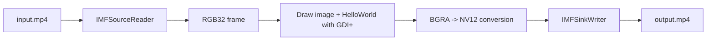

Adding logos, timestamps, inspection results, device IDs, or operator names onto every frame of an MP4 file is a very ordinary requirement in surveillance, inspection, evidence capture, and analysis tools.

In the previous article, I explained the problem as a pipeline split across `Source Reader`, drawing, color conversion, and `Sink Writer`. This time the focus is narrower and more practical:

**a single C++ source file that you can paste into a Visual Studio console application and run.**

The sample is intentionally shaped around these goals:

- one `.cpp` file only
- `#pragma comment(lib, ...)` included to reduce manual project setup
- read a video file
- overlay a specified image
- draw `HelloWorld` on every frame
- write a new MP4 file

To keep the sample readable, it only re-encodes the video stream. Audio remux is absolutely possible, but the point here is to make the per-frame drawing path understandable first.

## 1. The short version

The sample takes this route:

1. open the MP4 through `IMFSourceReader`
2. read frames as `RGB32`
3. draw the image and `HelloWorld` with `GDI+`
4. convert the drawn frame into `NV12`
5. write the result as `H.264 + MP4` through `IMFSinkWriter`

That shape is useful because it makes the responsibilities easy to see:

- Media Foundation handles decode, sample flow, and encode
- GDI+ handles the actual overlay drawing
- explicit RGB-to-NV12 conversion bridges the sample into the encoder-friendly format

## 2. The basic shape of the pipeline

The important point is that the drawing itself is not really a Media Foundation job. Media Foundation is what moves and encodes the frames. The overlay logic is much easier to think about as a drawing step.

## 3. Why this sample uses GDI+

Earlier I discussed Direct2D, DirectWrite, and the Video Processor MFT as very strong building blocks for a production-oriented pipeline.

For a **paste-and-run one-file sample**, though, GDI+ is often the calmer choice because:

- it can load common image formats
- it can draw text
- it is easy to initialize in a small console sample
- it keeps the code in one translation unit without pulling in a wider rendering setup immediately

That is not the same thing as saying GDI+ is always the long-term answer. It simply means it is a practical answer for a one-file demonstration.

## 4. Why the sample converts to NV12 explicitly

This is the part that surprises many first implementations.

Drawing is easiest in `RGB32` or a closely related BGRA layout. But the Microsoft H.264 encoder usually wants YUV-family input such as:

- `NV12`
- `I420`
- `YUY2`

So the sample makes the trade-off explicit:

- **draw in RGB** because that is convenient
- **encode from NV12** because that is what the writer side likes

That is why the sample includes its own BGRA-to-NV12 conversion step instead of pretending the encoder will simply accept the draw-friendly surface format.

## 5. Practical assumptions in the sample

The sample assumes:

- Windows 10 or 11
- a Visual Studio 2022 C++ console project
- `x64` build
- no precompiled headers for that `.cpp`
- input width and height are even
- ordinary MP4 input
- video-only output MP4
- overlay images are in a format GDI+ can load, such as PNG or JPEG

The even-dimension rule matters because `NV12` is a 4:2:0 format.

## 6. Common traps this sample tries to avoid

### 6.1 `ReadSample` can succeed with a null sample

Success from `ReadSample` does not always mean an actual video sample was returned. You still need to interpret stream flags such as end-of-stream or stream ticks.

### 6.2 Timestamp and duration are separate ideas

Media Foundation timestamps are in 100-nanosecond units, and sample duration is a separate value. If one input frame becomes one output frame, preserving input timing is usually the safest first move.

### 6.3 `IMFSample` may not contain one simple buffer

That is why `ConvertToContiguousBuffer` is such a common first step when you want a predictable memory layout for drawing.

### 6.4 Do not hardcode stride as `width * 4`

Padding, pitch, and 2D buffer behavior can break that assumption. If `IMF2DBuffer::Lock2D` is available, it is usually safer to use it and honor the returned pitch.

### 6.5 Audio is intentionally left out

This sample does not ignore audio because audio is impossible. It omits audio because the goal is to make the per-frame overlay path easy to understand first. In real projects, a very practical next step is often:

- re-encode video
- remux audio if it can stay as-is

## 7. When to move past the one-file sample

Once the sample is working, the natural next steps are usually:

1. add audio remux
2. replace GDI+ with Direct2D / DirectWrite when rendering quality or throughput matters more
3. move the RGB-to-NV12 stage toward the Video Processor MFT or GPU-oriented processing
4. graduate to D3D11 / DXGI surfaces for higher-throughput pipelines

That is also where a custom MFT begins to make more sense, but usually not for the very first implementation.

## 8. Wrap-up

The practical split is still the same as in the conceptual article, but the one-file sample makes it concrete:

- `Source Reader` gets the frames out
- GDI+ draws image and text overlays
- explicit conversion bridges into `NV12`
- `Sink Writer` writes the new MP4

If you want something you can paste into a `.cpp` file and run, that is a very workable first architecture. It is not the final architecture for every production system, but it is an honest one.

## 9. References

- Microsoft Learn: [Using the Source Reader to Process Media Data](https://learn.microsoft.com/en-us/windows/win32/medfound/processing-media-data-with-the-source-reader)
- Microsoft Learn: [MFCreateSourceReaderFromByteStream](https://learn.microsoft.com/en-us/windows/win32/api/mfreadwrite/nf-mfreadwrite-mfcreatesourcereaderfrombytestream)
- Microsoft Learn: [MFCreateMFByteStreamOnStream](https://learn.microsoft.com/en-us/windows/win32/api/mfidl/nf-mfidl-mfcreatemfbytestreamonstream)
- Microsoft Learn: [IMFSourceReader::SetCurrentMediaType](https://learn.microsoft.com/en-us/windows/win32/api/mfreadwrite/nf-mfreadwrite-imfsourcereader-setcurrentmediatype)
- Microsoft Learn: [MF_SOURCE_READER_ENABLE_VIDEO_PROCESSING](https://learn.microsoft.com/en-us/windows/win32/medfound/mf-source-reader-enable-video-processing)
- Microsoft Learn: [IMFSourceReader::ReadSample](https://learn.microsoft.com/en-us/windows/win32/api/mfreadwrite/nf-mfreadwrite-imfsourcereader-readsample)
- Microsoft Learn: [Working with Media Samples](https://learn.microsoft.com/en-us/windows/win32/medfound/working-with-media-samples)
- Microsoft Learn: [IMF2DBuffer::Lock2D](https://learn.microsoft.com/en-us/windows/win32/api/mfobjects/nf-mfobjects-imf2dbuffer-lock2d)
- Microsoft Learn: [H.264 Video Encoder](https://learn.microsoft.com/en-us/windows/win32/medfound/h-264-video-encoder)
- Microsoft Learn: [Using the Sink Writer](https://learn.microsoft.com/en-us/windows/win32/medfound/using-the-sink-writer)