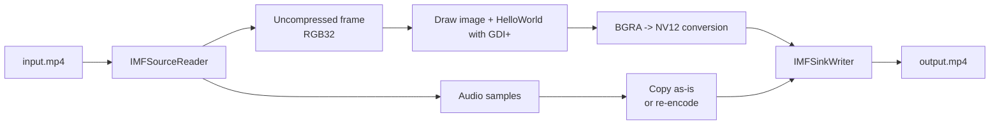

Watermarks, inspection results, device IDs, operator names, and timestamps.  
Requirements like these, where you need to **burn information into every frame of an MP4 and produce a new MP4**, are very common in surveillance, inspection, traceability, and analysis tools.

But once you start touching Media Foundation, you quickly run into `IMFSourceReader`, `IMFSample`, `IMFMediaBuffer`, `IMFTransform`, and `IMFSinkWriter`, and it suddenly becomes much less obvious **where image and text overlay logic should actually live**.

This article first organizes the overall shape as **`Source Reader -> drawing -> color conversion -> Sink Writer`**, then shows **a one-file sample you can paste directly into a Visual Studio C++ console application**.  
The sample reads a given MP4, draws a specified image and `HelloWorld` on every frame, and writes a new output MP4.

To keep the sample easy to paste and run, it is intentionally structured to **re-encode video only**.  
You can absolutely extend the approach to include audio remux, but the central topic here is per-frame image and text overlay, so that is where the sample stays focused.

## 1. The short answer

- The basic shape for adding images or text to every MP4 frame is **`decode with Source Reader -> composite on uncompressed frames -> convert color if needed -> re-encode with Sink Writer`**.
- **The actual act of drawing images and text is not Media Foundation's job.** That part is usually easier to think about with drawing APIs such as `GDI+`, `Direct2D`, `DirectWrite`, or `WIC`.
- If the final target is `MP4 (H.264)`, you often need a bridge between draw-friendly formats such as `RGB32 / ARGB32` and encoder-friendly formats such as `NV12 / I420 / YUY2`.
- If your main goal is simply to get the first version working, `Source Reader -> RGB32 -> draw with GDI+ -> NV12 -> Sink Writer` is a very understandable route.
- If your main goal is performance and long-term extensibility, a design closer to `D3D11 / DXGI surface -> Direct2D / DirectWrite -> Video Processor MFT -> Sink Writer` has more headroom.

## 2. Why this is a little more confusing than it first sounds

The sentence "put text on a video" actually mixes together four different concerns.

1. **Container vs. codec**  
   `mp4` is a container, not a frame format. Inside it, the video is usually compressed as `H.264` or `H.265`.

2. **Decode and encode**  
   You generally cannot take compressed video data and draw text or PNG content onto it directly with an ordinary 2D API. First you need decoded, uncompressed frames.

3. **Drawing**  
   Text rendering, logo placement, alpha blending, and anti-aliased text are not really core Media Foundation responsibilities. That is where `GDI+` or `Direct2D / DirectWrite / WIC` come in.

4. **Color space and pixel format**  
   The format that is pleasant to draw on is often not the same format the encoder prefers. This is where many first implementations start to get sticky.

In practice, it is easier to think of the problem not as "add text with Media Foundation" but as **"move frames through Media Foundation, draw with a rendering API, then convert as needed before encoding."**

## 3. A quick comparison table

| Direction | Shape | Good fit | Main caution |
|---|---|---|---|
| Get it working first | `Source Reader -> RGB32 -> composite -> NV12 -> Sink Writer` | Batch jobs, internal tools, first implementation | CPU-side copies and conversions can add up |
| Push performance | `D3D11 / DXGI surface -> Direct2D / DirectWrite -> Video Processor MFT -> Sink Writer` | Long videos, high resolution, large volumes | D3D11 and DXGI resource management become part of the job |
| Build a reusable video effect | Implement a custom `MFT` and insert it into a topology | Shared effects across multiple apps or pipelines | Implementation, registration, and debugging become harder |

This article stays with the first row on purpose: **the clearest path to a correct first implementation**.

### 3.1 Processing image

The important point is that **drawing itself is not really a Media Foundation responsibility**.  
Media Foundation is the frame transport and encoding side. The overlay step belongs much more naturally to a rendering API.

## 4. How to think about the pipeline in pieces

### 4.1 Use `IMFSourceReader` for input

If the input is a file path, `MFCreateSourceReaderFromURL` is a straightforward starting point. If the input is video data already in memory, creating an `IMFByteStream` and using `MFCreateSourceReaderFromByteStream` is a natural variation.

The first major choice is whether you want to receive frames in a **draw-friendly format** or an **encoder-oriented format**.

- If you want simpler overlay logic, use `RGB32` or `ARGB32`
- If you want to optimize around encode efficiency, use a YUV format such as `NV12`

But because **text and PNG composition are dramatically easier to reason about on RGB-style frames**, starting with `RGB32 / ARGB32` is often the calmest first move.

If you enable `MF_SOURCE_READER_ENABLE_VIDEO_PROCESSING`, the `Source Reader` can help by converting `YUV -> RGB32` and handling deinterlacing.  
That is convenient when the goal is simply to get usable frames out, though for long or high-resolution video it can become one of the places to revisit later for performance.

### 4.2 Think about image and text composition as `GDI+` or `Direct2D / DirectWrite`

Once you pull the buffer from the `IMFSample`, you can place a logo image and draw text on top of it.

In this sample, I use `GDI+` because the priority is **a one-file example that is easy to paste and run**.

- it can load images
- it can draw text
- it has a relatively small amount of setup
- it fits comfortably inside one console-app `.cpp`

For long videos or 4K-heavy workloads, `D3D11 + Direct2D + DirectWrite` has more room to grow.  
So a very practical progression is: start with `GDI+`, then move toward `Direct2D / DirectWrite` when performance or rendering requirements justify it.

### 4.3 `RGB32` usually is not the final input your H.264 encoder wants

When you write back to `MP4 (H.264)`, the Microsoft H.264 encoder often expects a YUV-family input format such as **`I420 / IYUV / NV12 / YUY2 / YV12`**.  
So it is not always enough to draw in `RGB32 / ARGB32` and then pass that frame straight into `IMFSinkWriter`.

That means you usually need one of these two routes:

- insert a `Video Processor MFT` and convert `RGB32 / ARGB32 -> NV12`
- add your own `RGB -> NV12` conversion step

This sample chooses the second route, explicit self-contained conversion, because the priority is a one-file sample.  
In production, a `Video Processor MFT` can be very attractive because it can centralize color conversion, resizing, and deinterlacing as well.

### 4.4 Use `IMFSinkWriter` for output

The key idea is to configure two different views of the stream:

- **output stream type**: the format you want written to the file  
  Example: `MFVideoFormat_H264`
- **input stream type**: the format your application will feed into the writer  
  Example: `MFVideoFormat_NV12`

From the writer's perspective, that means:

- your application provides uncompressed `NV12` frames
- the writer encodes them as H.264 and stores them in MP4

### 4.5 Audio is easier if you separate it conceptually at first

Very often, the real requirement is "add a logo and text to the video" while leaving the audio unchanged.

In practical work, a very usable shape is:

- process only the video stream through `Source Reader -> composite -> Sink Writer`
- keep the audio stream compressed and remux it

This sample intentionally focuses on **burning images and text into video frames**, so the output is **video-only MP4**.  
If you want to preserve audio, that is usually best added in the next step rather than mixed into the very first example.

## 5. Assumptions and usage

The sample assumes:

- Windows 10 or 11
- a Visual Studio 2022 C++ console project
- `x64` build
- no precompiled headers for that `.cpp`
- input width and height are even
- ordinary MP4 input
- video-only output MP4
- overlay images are in a format GDI+ can load, such as PNG / JPEG / BMP / GIF

Because `NV12` is a 4:2:0 format, **width and height need to be even**.

## 6. What matters when you read the implementation

### 6.1 `ReadSample` can succeed with a null sample

`ReadSample` can return `S_OK` and still give you `sample == nullptr`. Typical cases include `MF_SOURCE_READERF_STREAMTICK`, `MF_SOURCE_READERF_ENDOFSTREAM`, and other stream events.

### 6.2 Preserving input timestamps and durations is usually safer

Media Foundation timestamps are in 100-nanosecond units, and duration is a separate value. If one input frame becomes one output frame, it is usually safer to carry input timing forward as much as possible.

### 6.3 `IMFSample` may not contain one simple buffer

That is why `ConvertToContiguousBuffer` is such a common first step when you want a predictable memory layout for drawing.

### 6.4 Do not hardcode stride as `width * 4`

Padding, pitch, and 2D buffer behavior can break that assumption. If `IMF2DBuffer::Lock2D` is available, it is usually safer to use it and honor the returned pitch.

### 6.5 Audio is intentionally left out

The sample omits audio not because audio is impossible, but because the goal is to make the per-frame overlay path easy to understand first. In real projects, a very practical next step is often to re-encode video and remux audio if it can stay as-is.

## 7. Where to grow this for production

1. Add audio remux.
2. Replace `GDI+` with `Direct2D / DirectWrite` when rendering quality or throughput matters more.
3. Move the RGB-to-NV12 stage toward `Video Processor MFT` or GPU-oriented processing.
4. Graduate to `D3D11 / DXGI` surfaces for higher-throughput pipelines.
5. Consider a custom `MFT` if the effect needs to be reused across apps or pipelines.

## 8. Wrap-up

The practical split is:

- `Source Reader` gets the frames out
- `GDI+` or `Direct2D / DirectWrite` handles overlay drawing
- explicit conversion bridges into `NV12`
- `Sink Writer` writes the new MP4

If you want something you can paste into a `.cpp` file and run, that is a very workable first architecture. It is not the final architecture for every production system, but it is an honest and practical one.

## 9. Related articles

- [What Media Foundation Actually Is - Why It Feels So Closely Tied to COM and Windows Media APIs](https://comcomponent.com/blog/2026/03/09/002-media-foundation-why-it-feels-like-com/)
- [How to Extract a Still Image from an MP4 at a Specific Time with Media Foundation - a One-File C++ Sample](https://comcomponent.com/blog/2026/03/15/000-media-foundation-extract-still-image-from-mp4-at-specific-time/)

## 10. References

- Microsoft Learn: [Using the Source Reader to Process Media Data](https://learn.microsoft.com/en-us/windows/win32/medfound/processing-media-data-with-the-source-reader)
- Microsoft Learn: [MFCreateSourceReaderFromByteStream](https://learn.microsoft.com/en-us/windows/win32/api/mfreadwrite/nf-mfreadwrite-mfcreatesourcereaderfrombytestream)
- Microsoft Learn: [MFCreateMFByteStreamOnStream](https://learn.microsoft.com/en-us/windows/win32/api/mfidl/nf-mfidl-mfcreatemfbytestreamonstream)
- Microsoft Learn: [IMFSourceReader::SetCurrentMediaType](https://learn.microsoft.com/en-us/windows/win32/api/mfreadwrite/nf-mfreadwrite-imfsourcereader-setcurrentmediatype)
- Microsoft Learn: [MF_SOURCE_READER_ENABLE_VIDEO_PROCESSING](https://learn.microsoft.com/en-us/windows/win32/medfound/mf-source-reader-enable-video-processing)
- Microsoft Learn: [MF_SOURCE_READER_ENABLE_ADVANCED_VIDEO_PROCESSING](https://learn.microsoft.com/en-us/windows/win32/medfound/mf-source-reader-enable-advanced-video-processing)
- Microsoft Learn: [IMFSourceReader::ReadSample](https://learn.microsoft.com/en-us/windows/win32/api/mfreadwrite/nf-mfreadwrite-imfsourcereader-readsample)
- Microsoft Learn: [Working with Media Samples](https://learn.microsoft.com/en-us/windows/win32/medfound/working-with-media-samples)
- Microsoft Learn: [IMF2DBuffer::Lock2D](https://learn.microsoft.com/en-us/windows/win32/api/mfobjects/nf-mfobjects-imf2dbuffer-lock2d)
- Microsoft Learn: [Video Subtype GUIDs](https://learn.microsoft.com/en-us/windows/win32/medfound/video-subtype-guids)
- Microsoft Learn: [H.264 Video Encoder](https://learn.microsoft.com/en-us/windows/win32/medfound/h-264-video-encoder)
- Microsoft Learn: [Video Processor MFT](https://learn.microsoft.com/en-us/windows/win32/medfound/video-processor-mft)
- Microsoft Learn: [Using the Sink Writer](https://learn.microsoft.com/en-us/windows/win32/medfound/using-the-sink-writer)
- Microsoft Learn: [Tutorial: Using the Sink Writer to Encode Video](https://learn.microsoft.com/en-us/windows/win32/medfound/tutorial--using-the-sink-writer-to-encode-video)
- Microsoft Learn: [Interoperability Overview (Direct2D)](https://learn.microsoft.com/en-us/windows/win32/direct2d/interoperability-overview)
- Microsoft Learn: [Text Rendering with Direct2D and DirectWrite](https://learn.microsoft.com/en-us/windows/win32/direct2d/direct2d-and-directwrite)
- Microsoft Learn: [Writing a Custom MFT](https://learn.microsoft.com/en-us/windows/win32/medfound/writing-a-custom-mft)
