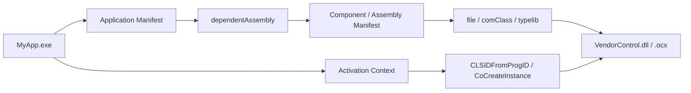

In COM / ActiveX / OCX projects, the same deployment mud tends to come back every time you ship or update.

- `regsvr32` becomes part of the process
- administrator rights tend to creep in
- another application's installed version can collide with yours
- uninstall can damage components that other products still need
- it works on the developer machine, but fails on a clean environment

**Reg-Free COM** can remove a surprisingly large part of that mess.

But despite the name, it is not magic that makes every COM problem disappear. What it mainly removes is the pain that comes from **global registration as the main activation model**. It does not make bitness issues, dependent DLLs, type libraries, or threading model concerns go away.

This article focuses on Reg-Free COM mainly in the context of **keeping COM DLLs or OCXs application-local inside Windows desktop applications**.

## 1. The short answer

Here is the rough but useful version first.

- **Reg-Free COM stores COM activation metadata in manifests instead of relying on the registry**
- At runtime, calls such as `CoCreateInstance` and `CLSIDFromProgID` can be resolved through the **activation context** first
- That makes it possible to keep COM DLLs / OCXs **private to an application**
- The main benefits are easier XCOPY-style deployment, fewer version collisions, and less fragile uninstall behavior
- But **32-bit / 64-bit problems do not disappear**
- And **dependent DLLs, type libraries, design-time references, and nonstandard registration dependencies** still need separate attention
- In practice, it is especially useful when you want to ship **COM components that belong only to one application**

The simplest way to say it is this:

**Reg-Free COM pulls COM activation back toward the application boundary.**

## 2. What this article means by Reg-Free COM

Reg-Free COM is short for Registration-Free COM.

The word "registration-free" does **not** mean COM itself disappears, and it does **not** mean GUIDs become unnecessary.

It means that using COM no longer depends entirely on global registry data such as `HKCR`, `CLSID`, and `InprocServer32`.

This article mainly targets cases like:

- native COM DLLs
- ATL-based COM servers
- ActiveX / OCX controls
- .NET Framework based COM interop
- COM exposure from .NET 5+ / .NET 8 through COM host support

Two distinctions matter a lot here:

1. **Reg-Free COM is mainly about activation**
2. **Type-information distribution and design-time reference setup can remain separate problems**

If those two points get mixed together, the whole conversation becomes unnecessarily muddy.

## 3. The whole picture on one page



In ordinary COM activation, `CoCreateInstance` walks registry information to decide which DLL should be loaded.

With Reg-Free COM, the runtime can first consult the **currently active activation context**, then resolve the component from manifest data instead of the registry.

That is what makes it easier for application A and application B on the same machine to carry **different versions of similar COM components** without stepping on each other so easily.

## 4. Why ordinary COM deployment becomes heavy so easily

Ordinary COM deployment is painful less because COM itself is inherently bad, and more because **global registration is built into the operating model**.

To activate a COM class, you usually need information such as:

| Information | Role |
| --- | --- |
| CLSID | A GUID that uniquely identifies the class |
| ProgID | A human-friendly name |
| InprocServer32 | Which DLL should be loaded |
| ThreadingModel | Apartment / Both and related assumptions |
| TypeLib | Type information |

Putting this in the registry is convenient for machine-wide sharing.

But in practical work, that same sharing is often what causes trouble.

- one product's installer overwrites another product's COM registration
- an uninstaller removes something it thought was private, but was actually shared
- the developer machine has registrations the deployment machine does not
- 32-bit and 64-bit registrations drift apart in strange ways

Very often, **the distribution model hurts more than COM itself**.
Reg-Free COM exists largely to reduce that pain.

## 5. How Reg-Free COM works

### 5.1 The application manifest declares the dependency

On the application side, you describe **which side-by-side assembly the application depends on** in the application manifest.

That manifest can be:

- placed next to the EXE, such as `MyApp.exe.manifest`
- embedded into the EXE as a resource

In practice, an external file can be easier to inspect and swap, while embedding can be more robust and simpler for deployment.

Also, when both an embedded and a file-system version exist, the **file-system manifest takes precedence**.

### 5.2 The component manifest carries the COM metadata

On the component side, the metadata that would normally live in the registry is expressed in the component manifest instead.

That can include entries such as:

- `comClass`
- `clsid`
- `progid`
- `threadingModel`
- `typelib`
- and sometimes proxy / stub details or window classes if needed

So the mental model is simple:

**instead of describing the COM component through registry keys, you describe its COM identity in XML manifest form.**

The component manifest itself can also be:

- a separate file placed next to the DLL
- embedded into the DLL as a resource

In real projects, embedding it into the DLL as a private assembly often reduces mistakes, because separate-file operation makes it easier to trip over naming mismatches, placement rules, or copy omissions.

### 5.3 The activation context is the real center of gravity

This is the heart of the whole mechanism.

When the application calls `CLSIDFromProgID` or `CoCreateInstance`, the COM runtime can consult the **active activation context**.

If the necessary ProgID-to-CLSID and CLSID-to-DLL information exists there, the runtime can resolve the component **without using registry registration**.

If the necessary information is missing, resolution can fall back to the normal registry-based path.

That fallback behavior is exactly why one of the nastiest traps appears:

**it seems to work on the developer machine, but only because local registration was silently helping.**

## 6. What the practical benefits are

In real Windows application work, the benefits are fairly concrete.

### 6.1 Easier XCOPY-style deployment

You can keep the necessary files together inside the application folder, which often makes installers and registration steps much lighter.

That does not remove every permission concern in the world, but it often removes the need for **administrator work that exists only for COM registration**.

### 6.2 Fewer version collisions

Even if several versions of a COM component exist on the same machine, it becomes much easier to keep each application tied to the version it expects.

That reduces the classic accident of:

"another product's setup changed behavior in my app."

### 6.3 Existing call sites often do not need major changes

Reg-Free COM changes **how components are resolved**, not necessarily how existing code calls them.

So if the component fits the model cleanly, you can sometimes introduce it while barely touching the `CoCreateInstance` side of the application code.

### 6.4 Rollback and deletion become cleaner

Because the component is kept closer to the application boundary, updates and rollback can become much simpler.

In some cases, it becomes realistic to think in terms of:

**replace the whole folder**

instead of "run uninstall, repair registration, and hope nothing shared got broken."

## 7. Where it fits and where it does not

### 7.1 Good fit

Reg-Free COM is especially attractive in cases like these.

| Situation | Fit |
| --- | --- |
| You want to ship COM DLLs / OCXs that belong only to one application | Very good |
| You need several versions to coexist on the same PC | Very good |
| You want to avoid vendor registration collisions | Good |
| You want to keep ActiveX / OCX private inside an existing desktop app | Good |
| You want lighter deployment without rewriting existing COM call sites | Good |

It tends to pair especially well with line-of-business desktop apps, device-integration tools, and existing assets from environments like VB6, MFC, or WinForms.

### 7.2 Weak fit or at least something to evaluate carefully

Some cases need more caution.

| Situation | Comment |
| --- | --- |
| You actually want machine-wide shared COM | Much less benefit from Reg-Free COM |
| Bitness does not line up | Reg-Free COM does not solve that |
| The component depends heavily on nonstandard registry state or custom setup | Harder to express cleanly in manifests |
| Dependent DLLs or VC++ runtime distribution are not already under control | Failure just moves somewhere else |
| Design-time tooling or IDE references assume registry presence | Needs separate operational design |

That last point matters a lot.

Reg-Free COM helps **runtime activation**.
It does not automatically redesign what your **design-time reference tooling** assumes.

## 8. Common misconceptions

### 8.1 Reg-Free COM removes bitness problems

It does not.

A 32-bit process can only load a 32-bit in-proc COM DLL, and a 64-bit process can only load a 64-bit DLL.

That rule stays exactly the same.

### 8.2 Reg-Free COM means the registry is never consulted

Not necessarily.

If the manifest data is incomplete, normal registration-based resolution can still be used.

That is why:

**"it worked on the developer machine" does not prove the Reg-Free setup was actually correct.**

### 8.3 Reg-Free COM automatically solves the type library problem too

Only partly.

The manifest can describe `typelib` information, but things like VBA references, C++ `#import`, or design-time interop generation on the .NET side still often need explicit planning.

Reg-Free COM is first about:

**making activation work**

How you want to work with strong typing at development time is often the next separate decision.

### 8.4 Any ActiveX / OCX can simply be made Reg-Free

That is risky to assume.

If the component fits normal COM registration patterns, you have a much better chance.

But if it depends heavily on custom registry state, licensing logic, extra setup work, or a larger dependent module set, the Reg-Free path can become much less straightforward.

### 8.5 Reg-Free COM means roughly the same thing across .NET Framework and .NET 8

There are similarities, but the toolchains are not the same.

The `.NET Framework + RegAsm` world and the `.NET 5+ / .NET 8 + comhost` world are related, but they are not interchangeable just because both say "COM".

## 9. Native COM vs .NET Framework vs .NET 5+ / .NET 8

This is one of the easiest places for conversations to blur together, so it helps to separate the families explicitly.

| Family | Rough model |
| --- | --- |
| Native COM DLL / OCX | Usually think in terms of application manifest + component manifest |
| .NET Framework based COM interop | Often needs both the Win32-style application manifest and a manifest for the managed component side |
| .NET 5+ / .NET 8 COM exposure | Can use `EnableComHosting` to create the COM host and `EnableRegFreeCom` to generate Reg-Free manifests |

### 9.1 .NET Framework based COM

With .NET Framework based COM, the setup is often a little more complex than native COM because you may need both:

- the Win32-style application manifest on the client side
- the component manifest on the managed component side

That is the point where many discussions become muddy again:

"I understood Reg-Free COM, but now the managed component path adds another manifest."

### 9.2 .NET 5+ / .NET 8 COM exposure

In .NET 5+ / .NET 8, the entry point for COM exposure becomes the `*.comhost.dll`.

And if you enable `EnableRegFreeCom=true`, you can have the build produce a side-by-side manifest for Reg-Free COM.

But one distinction still matters:

**Reg-Free COM strategy and TLB strategy are separate topics.**

In .NET 5+ and later, you are no longer in the older .NET Framework world where a type library naturally feels like it falls out of the same tool path.

If strongly typed consumption matters, it is safer to plan TLB generation, embedding, and distribution as an explicit concern.

## 10. A minimum mental model

Suppose `MyApp.exe` uses `Vendor.CameraControl.dll` through Reg-Free COM.

### 10.1 File layout image

```text
MyApp.exe
MyApp.exe.manifest
Vendor.CameraControl.dll
Vendor.Helper.dll
```

In this picture, the component manifest is assumed to be **embedded into the DLL**.

You can keep it as a separate file too, but embedding is usually the calmer first model.

### 10.2 Application manifest image

```xml
<?xml version="1.0" encoding="UTF-8" standalone="yes"?>
<assembly xmlns="urn:schemas-microsoft-com:asm.v1" manifestVersion="1.0">
  <assemblyIdentity
    type="win32"
    name="KomuraSoft.MyApp"
    version="1.0.0.0"
    processorArchitecture="amd64" />

  <dependency>
    <dependentAssembly>
      <assemblyIdentity
        type="win32"
        name="Vendor.CameraControl.Asm"
        version="1.0.0.0"
        processorArchitecture="amd64" />
    </dependentAssembly>
  </dependency>
</assembly>
```

### 10.3 Component manifest image

```xml
<?xml version="1.0" encoding="UTF-8" standalone="yes"?>
<assembly xmlns="urn:schemas-microsoft-com:asm.v1" manifestVersion="1.0">
  <assemblyIdentity
    type="win32"
    name="Vendor.CameraControl.Asm"
    version="1.0.0.0"
    processorArchitecture="amd64" />

  <file name="Vendor.CameraControl.dll">
    <comClass
      clsid="{01234567-89AB-CDEF-0123-456789ABCDEF}"
      progid="Vendor.CameraControl.1"
      threadingModel="Apartment"
      tlbid="{89ABCDEF-0123-4567-89AB-CDEF01234567}" />

    <typelib
      tlbid="{89ABCDEF-0123-4567-89AB-CDEF01234567}"
      version="1.0"
      helpdir="" />
  </file>
</assembly>
```

The most important thing in this example is not the exact XML syntax. It is that the application's `dependentAssembly` and the component's `assemblyIdentity` actually match.

When those drift apart, the failure can be very quiet and very time-consuming.

## 11. Common traps

### 11.1 It works on the dev machine, but not on the deployment machine

The first thing to suspect is:

**the application was still being helped by local registry registration.**

That is why Reg-Free COM validation is much safer on a truly clean environment.

### 11.2 "side-by-side configuration is incorrect"

That family of failure often points to manifest mismatch, missing dependent DLLs, missing VC++ runtime pieces, or architecture mismatch.

The surface error text is not especially kind, so the usual next tools are:

- Event Log
- `sxstrace`

### 11.3 The application manifest and component manifest drift apart

Common small-but-fatal mismatches include:

- different names
- different versions
- different `processorArchitecture`
- copying an older manifest by mistake

### 11.4 Dependent DLLs were forgotten

It is easy to look only at `Vendor.CameraControl.dll` and miss what it loads afterward, such as:

- `Vendor.Helper.dll`
- VC++ runtime pieces
- proxy / stub DLLs

Reg-Free COM reduces **COM registration problems**.
It does not remove ordinary native dependency resolution problems.

### 11.5 Type library and reference strategy gets postponed too long

You can get runtime activation working and still not be done if you need:

- early binding from VBA
- `#import` from C++
- design-time interop generation on the .NET side

That is why it helps to consciously separate:

- runtime activation
- design-time type-information strategy

## 12. Wrap-up

In one sentence, Reg-Free COM is **a way to move COM activation metadata from the whole machine back toward the application boundary**.

That gives you practical advantages such as:

- easier application-local packaging of COM DLLs / OCXs
- fewer version collisions
- simpler deployment and rollback

But these still matter just as much as before:

- 32-bit / 64-bit compatibility
- dependent DLLs
- TLB / reference strategy
- nonstandard registration dependencies
- validation on clean environments

So the basic posture for adopting Reg-Free COM is:

1. treat it as an **activation** topic first
2. separate **runtime** concerns from **design-time** concerns
3. validate on a **clean environment**
4. line up bitness and dependent DLLs early

If you keep that order, the approach becomes much less fragile.

## 13. Related articles

- [What COM / ActiveX / OCX Are - Differences and Relationships in One Place](/en/blog/2026/03/13/000-what-is-com-activex-ocx/)
- [How to Handle ActiveX / OCX Today - A Decision Table for Keep, Wrap, or Replace](/en/blog/2026/03/12/001-activex-ocx-keep-wrap-replace-decision-table/)
- [How to Use a .NET 8 DLL from VBA with Strong Typing - COM Exposure and TLB Generation with dscom](/en/blog/2026/03/16/007-dotnet8-dll-typed-vba-com-dscom-tlb/)

## 14. References

- Microsoft Learn: [Creating Registration-Free COM Objects](https://learn.microsoft.com/en-us/windows/win32/sbscs/creating-registration-free-com-objects)
- Microsoft Learn: [Application Manifests](https://learn.microsoft.com/en-us/windows/win32/sbscs/application-manifests)
- Microsoft Learn: [Assembly Manifests](https://learn.microsoft.com/en-us/windows/win32/sbscs/assembly-manifests)
- Microsoft Learn: [Manifest File Schema](https://learn.microsoft.com/en-us/windows/win32/sbscs/manifest-file-schema)
- Microsoft Learn: [Registration-Free COM Interop (.NET Framework)](https://learn.microsoft.com/en-us/dotnet/framework/interop/registration-free-com-interop)
- Microsoft Learn: [Expose .NET components to COM](https://learn.microsoft.com/en-us/dotnet/core/native-interop/expose-components-to-com)
- Microsoft Learn: [sxstrace](https://learn.microsoft.com/en-us/windows-server/administration/windows-commands/sxstrace)
