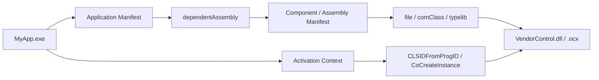

COM / ActiveX / OCX の案件では、配布と更新のたびに同じ泥が出てきます。

- `regsvr32` が必要
- 管理者権限が必要になりがち
- 他アプリが入れた別バージョンとぶつかる
- アンインストール後に別製品まで巻き込む
- 開発機では動くのに、クリーン環境で動かない

このぬかるみをかなり減らせるのが **Reg-Free COM** です。
ただし、名前のわりに「COM の面倒が全部なくなる魔法」ではありません。なくなるのは主に **グローバル登録に引きずられる面倒** です。bitness、依存 DLL、型ライブラリ、スレッド モデルの難しさまでは消えてくれません。

この記事では、Reg-Free COM を **Windows デスクトップアプリで COM DLL / OCX をアプリ ローカルに閉じ込めて使う文脈** を中心に整理します。

## 1. まず結論（ひとことで）

先に雑だけれど役に立つ言い方をすると、こうです。

- **Reg-Free COM は、COM の登録情報をレジストリではなくマニフェストで持つやり方** です
- 実行時には、`CoCreateInstance` や `CLSIDFromProgID` の解決で **アクティベーション コンテキスト** が先に見られます
- そのため、COM DLL / OCX を **アプリごとに private に持てる** ようになります
- 主な利点は、**XCOPY 配布しやすいこと**、**バージョン衝突を避けやすいこと**、**アンインストールが壊れにくいこと** です
- ただし、**32bit / 64bit 問題は消えません**。ここは気合いでは越えられません
- また、**依存 DLL、型ライブラリ、設計時参照、非標準な登録依存** は別途考える必要があります
- 実務では、**アプリ専用の COM 部品を横に置きたいとき** にかなり相性がよいです

要するに、Reg-Free COM は **COM のアクティベーションをアプリ単位へ引き戻す仕組み** です。

## 2. この記事でいう Reg-Free COM

Reg-Free COM は、Registration-Free COM の略です。日本語だと「登録不要 COM」と書かれることもあります。

ここでいう「登録不要」は、**COM を使うために HKCR / CLSID / InprocServer32 などのグローバル レジストリ登録へ全面依存しない** という意味です。
`COM そのものが消える` わけでも、`GUID が不要になる` わけでもありません。

この記事では、主に次のようなものを対象にしています。

- ネイティブ COM DLL
- ATL ベースの COM サーバー
- ActiveX / OCX
- .NET Framework ベースの COM 相互運用
- .NET 5+ / .NET 8 の COM host を使った公開

逆に、この記事で強調したいのは次の 2 点です。

1. **Reg-Free COM は「アクティベーション」の話** である
2. **型情報の配布や設計時の参照設定は、別の論点として残ることがある**

ここを混ぜると、話がかなり濁ります。

## 3. まず一枚で整理

まずは全体像を 1 枚で見たほうが早いです。



普通の COM では、`CoCreateInstance` するときにレジストリをたどって `どの DLL を読み込むか` を決めます。
Reg-Free COM では、その前に **いま有効なアクティベーション コンテキスト** を見て、そこに書かれたマニフェスト情報から解決します。

このため、同じマシン上でもアプリ A とアプリ B が **別バージョンの同系統 COM 部品** を抱えて動きやすくなります。
COM の共有文化を、少しだけアプリ ローカル寄りへ戻す感じです。

## 4. なぜ普通の COM 配布は重くなりやすいのか

普通の COM 配布が重いのは、COM 自体が悪いというより、**グローバル登録の前提** があるからです。

ざっくり言うと、COM クラスを使うには次のような情報が必要です。

| 情報 | 役割 |
| --- | --- |
| CLSID | クラスを一意に識別する GUID |
| ProgID | 人が扱いやすい名前 |
| InprocServer32 | どの DLL を読み込むか |
| ThreadingModel | Apartment / Both などの前提 |
| TypeLib | 型情報 |

これらがレジストリへ入ると、マシン全体では便利です。複数アプリから共有しやすいからです。

ただ、実務ではこの共有が裏目に出ます。

- ある製品のセットアップが別製品の COM 登録を上書きする
- アンインストーラーが「自分のものだけ消したつもり」で共有 COM を壊す
- 開発機にたまたま入っている登録が、本番機にはない
- 32bit と 64bit の登録が噛み合わず、現象だけが不気味にずれる

つまり、**COM 本体より、配布モデルのほうが人を困らせる** ことがかなり多いです。
Reg-Free COM は、この配布モデルのつらさを減らすための仕組みです。

## 5. Reg-Free COM の仕組み

### 5.1 アプリケーション マニフェストで依存関係を書く

まず、アプリ側は **自分がどの side-by-side assembly に依存しているか** をアプリケーション マニフェストへ書きます。

このマニフェストは、

- `MyApp.exe.manifest` のように EXE の横へ置く
- EXE にリソースとして埋め込む

のどちらでも扱えます。
実務では、配布や差し替えを見やすくしたいなら外部ファイル、壊れにくさや配布の単純さを優先するなら埋め込み、という使い分けが多いです。

なお、外部ファイル版と埋め込み版の両方がある場合は、**ファイル システム上のマニフェストが優先** されます。

### 5.2 コンポーネント マニフェストで COM 情報を書く

次に、COM 側は **本来レジストリに入っていた情報** をコンポーネント マニフェストへ持ちます。

ここにはたとえば次のような情報が入ります。

- `comClass`
- `clsid`
- `progid`
- `threadingModel`
- `typelib`
- 必要なら proxy / stub や window class など

つまり、レジストリの代わりに **XML で COM の顔つきを記述する** イメージです。

このマニフェストは、

- DLL と別ファイルで置く
- DLL にリソースとして埋め込む

のどちらでも構成できます。

実務では、**private assembly として DLL へ埋め込む** ほうが事故りにくいことが多いです。別ファイル運用は分かりやすい反面、ファイル名と assemblyIdentity の対応、配置場所、コピー漏れで足を引っかけやすいからです。

### 5.3 実行時はアクティベーション コンテキストが先に見られる

Reg-Free COM の肝はここです。

アプリが `CLSIDFromProgID` や `CoCreateInstance` を呼ぶと、COM ランタイムは **アクティブなアクティベーション コンテキスト** を見ます。
そこに必要な ProgID → CLSID、CLSID → DLL の情報があれば、レジストリを使わずに解決できます。

逆に、必要な情報がマニフェストに足りなければ、通常の登録ベース解決へ落ちます。
この挙動のせいで、**開発機ではたまたま動く** という罠が起きます。Reg-Free にできたと思っていたのに、実際にはローカル登録へ助けられている、というやつです。

ここが Reg-Free COM のいちばんいやらしい落とし穴です。

## 6. 何がうれしいのか

Reg-Free COM の利点は、実務ではかなりはっきりしています。

### 6.1 XCOPY 配布しやすい

アプリ フォルダーへ必要なファイルをまとめて置けるので、インストーラーや登録処理が軽くなります。
もちろん、`Program Files` 配下へ書くなら権限は別の話ですが、少なくとも **COM 登録のための管理者作業** は減らしやすいです。

### 6.2 バージョン衝突を減らしやすい

同じマシン上に複数バージョンの COM 部品があっても、アプリごとに使う版を分けやすくなります。
`他製品のセットアップで急に挙動が変わった` という事故をかなり避けやすくなります。

### 6.3 既存コードを大きく変えなくて済むことが多い

Reg-Free COM は、既存コードの呼び出し方を根本から変えるより、**解決のしかた** を変える仕組みです。
そのため、うまくはまれば `CoCreateInstance` 側のコードをほとんど触らずに導入できます。

### 6.4 削除とロールバックが楽になる

アプリ単位で閉じ込められているので、更新やロールバックがかなり素直になります。
極端に言えば、**フォルダーごと差し替える** 発想がとりやすくなります。

## 7. 向いている場面・向いていない場面

### 7.1 向いている場面

次のようなケースでは、Reg-Free COM はかなり有力です。

| 状況 | 相性 |
| --- | --- |
| アプリ専用の COM DLL / OCX を同梱したい | とてもよい |
| 同一 PC に複数バージョンを共存させたい | とてもよい |
| ベンダー部品の登録事故を避けたい | よい |
| ActiveX / OCX を既存デスクトップアプリで private に使いたい | よい |
| 配布を軽くしつつ、既存呼び出しは大きく変えたくない | よい |

典型的には、**業務デスクトップアプリ、装置連携ツール、VB6 / MFC / WinForms の既存資産** との相性がよいです。

### 7.2 向いていない、または慎重に見るべき場面

一方で、次のようなケースは慎重に見たほうがよいです。

| 状況 | コメント |
| --- | --- |
| COM をマシン全体で共有したい | Reg-Free のうま味が薄い |
| bitness が噛み合っていない | Reg-Free では解決しない |
| 非標準な登録情報や独自セットアップへ強く依存している | マニフェスト化しづらい |
| 依存 DLL や VC++ ランタイムの配布が整理できていない | 結局別の場所でこける |
| 設計時ツールや IDE の参照設定がレジストリ前提 | 別の運用設計が必要 |

特に最後の点は大事です。
Reg-Free COM は **実行時のアクティベーション** を助けますが、**設計時の参照設定 UI が何を前提にしているか** までは一発で変えてくれません。

## 8. よくある誤解

### 8.1 Reg-Free COM なら bitness 問題は消える

消えません。
32bit プロセスには 32bit の in-proc COM DLL しか読み込めませんし、64bit プロセスには 64bit の DLL しか入りません。
ここは Reg-Free でも従来通りです。

### 8.2 Reg-Free COM ならレジストリを一切見ない

これも違います。
マニフェストに必要情報が足りなければ、通常の登録ベース解決へ落ちます。
このため、**開発機で成功 = Reg-Free 構成が正しい** とは限りません。

### 8.3 Reg-Free COM なら型ライブラリの話も自動で片付く

ここは半分だけ正しいです。
マニフェストには `typelib` 情報も書けますが、**VBA の参照設定、C++ の `#import`、.NET 側の設計時参照生成** など、型情報の扱いは別途設計が必要なことが普通にあります。

Reg-Free COM は、まず **起動できるようにする話** です。
**どう型付きで開発するか** は、その次の論点です。

### 8.4 Reg-Free COM ならどんな ActiveX / OCX でもそのままいける

ここも危険です。
コンポーネントが標準的な COM 登録情報に乗っているなら進めやすいですが、独自のレジストリ設定、追加セットアップ、ライセンス処理、別モジュール群への依存が濃いと、Reg-Free 化は急に渋くなります。

### 8.5 Reg-Free COM と .NET Framework / .NET 8 はだいたい同じ

似ているところはありますが、ツールチェーンはかなり違います。
`.NET Framework + RegAsm` の文脈と、`.NET 5+ / .NET 8 + comhost` の文脈は、同じ COM でも足場が別です。

## 9. ネイティブ / .NET Framework / .NET 5+ / .NET 8 の違い

ここは混ざりやすいので、一度分けて見ます。

| 系統 | ざっくり整理 |
| --- | --- |
| ネイティブ COM DLL / OCX | アプリケーション マニフェスト + コンポーネント マニフェストで考えるのが基本 |
| .NET Framework ベースの COM 相互運用 | Win32 スタイルのアプリケーション マニフェストに加えて、マネージド コンポーネント側のマニフェストも必要 |
| .NET 5+ / .NET 8 で COM 公開 | `EnableComHosting` で COM host を作り、`EnableRegFreeCom` で Reg-Free 用 manifest を生成できる |

### 9.1 .NET Framework ベースの COM

.NET Framework ベースの COM では、**COM アプリ側の Win32 スタイル application manifest** と、**マネージド コンポーネント側の component manifest** の 2 段構えになります。

このあたりは、ネイティブ COM より少しだけややこしいです。
「Reg-Free COM は分かったが、managed component が絡むと急にもう 1 枚 manifest が増える」という地点で会話の路面がまた少しぬかるみます。

### 9.2 .NET 5+ / .NET 8 での COM 公開

.NET 5+ / .NET 8 では、COM 公開の入口が `*.comhost.dll` になります。
さらに `EnableRegFreeCom=true` を入れると、**Reg-Free COM 用の side-by-side manifest** が出力されます。

ただし、ここでも大事なのは、**Reg-Free COM と TLB 戦略は別** という点です。
.NET Core / .NET 5+ では、.NET Framework のころのように `アセンブリから TLB が自然に出てくる世界` ではありません。型付き利用が必要なら、TLB の生成・埋め込み・登録の話を別に整理したほうが安全です。

## 10. 最小構成イメージ

ここでは、`MyApp.exe` が `Vendor.CameraControl.dll` を Reg-Free COM で使う最小イメージを示します。

### 10.1 ファイル構成イメージ

```text
MyApp.exe
MyApp.exe.manifest
Vendor.CameraControl.dll
Vendor.Helper.dll
```

上の例では、**コンポーネント マニフェストは DLL 側へ埋め込んでいる想定** です。
別ファイルにしてもよいですが、まずは埋め込みのほうが整理しやすいです。

### 10.2 アプリケーション マニフェストのイメージ

```xml
<?xml version="1.0" encoding="UTF-8" standalone="yes"?>
<assembly xmlns="urn:schemas-microsoft-com:asm.v1" manifestVersion="1.0">
  <assemblyIdentity
    type="win32"
    name="KomuraSoft.MyApp"
    version="1.0.0.0"
    processorArchitecture="amd64" />

  <dependency>
    <dependentAssembly>
      <assemblyIdentity
        type="win32"
        name="Vendor.CameraControl.Asm"
        version="1.0.0.0"
        processorArchitecture="amd64" />
    </dependentAssembly>
  </dependency>
</assembly>
```

### 10.3 コンポーネント マニフェストのイメージ

```xml
<?xml version="1.0" encoding="UTF-8" standalone="yes"?>
<assembly xmlns="urn:schemas-microsoft-com:asm.v1" manifestVersion="1.0">
  <assemblyIdentity
    type="win32"
    name="Vendor.CameraControl.Asm"
    version="1.0.0.0"
    processorArchitecture="amd64" />

  <file name="Vendor.CameraControl.dll">
    <comClass
      clsid="{01234567-89AB-CDEF-0123-456789ABCDEF}"
      progid="Vendor.CameraControl.1"
      threadingModel="Apartment"
      tlbid="{89ABCDEF-0123-4567-89AB-CDEF01234567}" />

    <typelib
      tlbid="{89ABCDEF-0123-4567-89AB-CDEF01234567}"
      version="1.0"
      helpdir="" />
  </file>
</assembly>
```

この例で本当に大事なのは、XML の細部より **アプリ側の `dependentAssembly` と、コンポーネント側の `assemblyIdentity` が一致すること** です。
ここがずれると、かなり静かに苦しみます。

なお、上の GUID や名前は説明用の例です。実際には、コンポーネントが公開している CLSID / TLBID / ProgID / threading model に合わせて正しく書く必要があります。

## 11. はまりどころ

### 11.1 開発機では動くのに、配布先で動かない

まず疑うべきは、**実はレジストリ登録に助けられていた** パターンです。
Reg-Free COM の検証は、できれば **クリーン環境** でやったほうが安全です。

### 11.2 「side-by-side configuration is incorrect」で起動しない

この系は、manifest の不整合、依存 DLL の不足、VC++ ランタイム不足、アーキテクチャ違いなどで起きます。
表面のエラー文だけではかなり不親切なので、**イベント ログ** と **`sxstrace`** で追うのが定番です。

### 11.3 component manifest と application manifest の対応がずれる

- name が違う
- version が違う
- processorArchitecture が違う
- コピーしたつもりの manifest が古い

このへんは、見た目にはすごく小さい差ですが、起動時にはかなり大きく効きます。

### 11.4 依存 DLL を置き忘れる

`Vendor.CameraControl.dll` だけ見て満足していると、その先で読まれる `Vendor.Helper.dll`、VC++ ランタイム、proxy / stub DLL が抜けます。
Reg-Free COM は **COM 登録の問題** を減らしますが、**ネイティブ依存解決の問題** まで消してくれるわけではありません。

### 11.5 type library や参照設定の運用を後回しにする

ランタイム activation だけ通しても、

- VBA から早期バインディングしたい
- C++ で `#import` したい
- .NET 側で設計時に interop を作りたい

となると、型情報の配り方が必要です。
Reg-Free COM はここを自動で全部整えてくれるわけではないので、**runtime と design-time を分けて考える** のが大事です。

## 12. まとめ

Reg-Free COM をひとことで言うなら、**COM の登録情報をマシン全体からアプリ単位へ寄せる仕組み** です。

これによって、

- COM DLL / OCX をアプリ ローカルに閉じ込めやすい
- バージョン衝突を減らしやすい
- 配布やロールバックを単純化しやすい

という利点があります。

一方で、

- 32bit / 64bit
- 依存 DLL
- TLB / 参照設定
- 非標準な登録依存
- クリーン環境での検証

は依然として重要です。

なので、Reg-Free COM を導入するときの基本姿勢はこうです。

1. **これは activation の話である** と割り切る
2. **runtime と design-time の論点を分ける**
3. **クリーン環境で確認する**
4. **bitness と依存 DLL を先に揃える**

この順番で見ると、かなり事故りにくくなります。

## 13. 関連記事

- [COM / ActiveX / OCX とは何か - 違いと関係をまとめて解説](/blog/2026/03/13/000-what-is-com-activex-ocx/)
- [ActiveX / OCX を今どう扱うか - 残す・包む・置き換える判断表](/blog/2026/03/12/001-activex-ocx-keep-wrap-replace-decision-table/)
- [.NET 8 の DLL を型付きで VBA から使う方法 - COM 公開 + dscom で TLB を生成する](/blog/2026/03/16/007-dotnet8-dll-typed-vba-com-dscom-tlb/)

## 14. 参考資料

- [Microsoft Learn - Registration-Free COM オブジェクトの作成](https://learn.microsoft.com/ja-jp/windows/win32/sbscs/creating-registration-free-com-objects)
- [Microsoft Learn - アプリケーション マニフェスト](https://learn.microsoft.com/ja-jp/windows/win32/sbscs/application-manifests)
- [Microsoft Learn - Assembly Manifests](https://learn.microsoft.com/en-us/windows/win32/sbscs/assembly-manifests)
- [Microsoft Learn - Manifest File Schema](https://learn.microsoft.com/en-us/windows/win32/sbscs/manifest-file-schema)
- [Microsoft Learn - 登録を必要としない COM 相互運用機能 (.NET Framework)](https://learn.microsoft.com/ja-jp/dotnet/framework/interop/registration-free-com-interop)
- [Microsoft Learn - COM への .NET Core コンポーネントの公開](https://learn.microsoft.com/ja-jp/dotnet/core/native-interop/expose-components-to-com)
- [Microsoft Learn - sxstrace](https://learn.microsoft.com/ja-jp/windows-server/administration/windows-commands/sxstrace)

