> This article stays at the level of general practice rather than a single site or industry.  
> The diagrams are conceptual. In a Mermaid-capable Markdown environment, they render as charts.

SEO and Google Ads are often handled as separate disciplines.  
From the user's side, though, the journey is simpler:

- they search
- they notice an organic result or an ad
- they click
- they compare
- they decide whether to contact, buy, book, or request information

That is why SEO and Google Ads are better treated as **two routes inside one search-to-conversion system**.  
Google's own guidance reflects that view. On the SEO side, the recurring themes are **helpful, reliable, people-first content**, crawlable links, search appearance, and Search Console monitoring. On the Ads side, the recurring themes are **goal-based campaign structure, accurate conversion measurement, enhanced conversions, Consent Mode, and Smart Bidding**.[^helpful-content][^search-essentials][^links][^search-console][^ads-account-best][^ads-enhanced][^ads-consent][^ads-smart]

## 1. The overall picture first

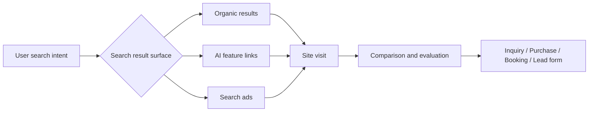

The important point is that **the entry points differ, but the destination is shared**.  
SEO builds visibility through organic search and AI-linked surfaces. Google Ads captures urgent, high-intent demand immediately. Both eventually send users to the same landing pages, service pages, product pages, or forms. In practice, it is more efficient to design them together than to run them as disconnected programs.[^ai-features][^ads-account-best]

Here is the quick comparison.

| Aspect | SEO | Google Ads |
| --- | --- | --- |
| Time to impact | Slower | Faster |
| Persistence | Compounds over time | Drops quickly when spend stops |
| Typical battleground | Research, comparison, discovery, problem solving | High intent, immediate demand, near-decision searches |
| Main success factors | Useful pages, internal links, discoverability, technical foundation, continuous improvement | Measurement, landing pages, account structure, search-term control, bidding |
| Best suited for | Long-term assets, topical depth, comparison capture | Speed, demand validation, expansion on profitable terms |

## 2. SEO best practices

### 2.1 Start by matching page type to search intent

Google is explicit about prioritizing content that is helpful, reliable, and created for people. Search Essentials also recommends placing the terms users actually search for into prominent locations such as the **title, headings, alt text, and link text**.[^helpful-content][^search-essentials]

That is not just a keyword insertion exercise.  
It is a page-design exercise.

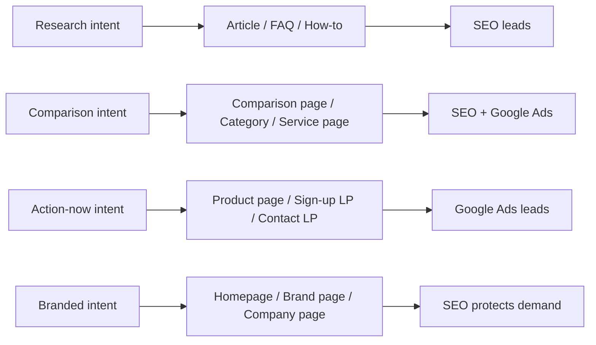

This makes the usual page roles clearer:

- research: glossary pages, how-to content, FAQs, troubleshooting
- comparison: selection guides, comparison tables, category pages, service introductions, case studies
- action-now: product pages, pricing pages, request forms, sign-up flows
- branded: homepage, company page, support, product or brand pages

Many weak SEO programs are not failing because of one technical issue.  
They are failing because **the page type does not match the intent behind the query**.

### 2.2 Think in order: discovery, crawlability, understanding

Even a strong page cannot rank if Google cannot discover it, crawl it, render it, or consolidate duplicates correctly.  
This is why SEO technical work becomes easier to prioritize when you look at it as a sequence. Google also uses links for both discovery and relationship understanding, which is why internal linking matters so much.[^links]

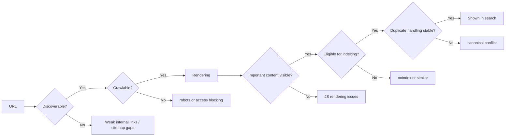

From that flow, a few basics become non-negotiable.

#### Take internal linking seriously

Google recommends crawlable links and meaningful anchor text.  
In practice that means real **`<a href="...">` links** and anchors that explain what the destination is, rather than vague text like "click here." Google also notes that important pages should be linked from somewhere else on the site.[^links]

#### Keep the sitemap current

Google can discover many URLs on its own, but XML sitemaps still help, especially for new content, deeper sections, large sites, and active sites. The Search Console Sitemaps report also makes fetch timing and processing issues easier to monitor.[^sitemap][^sitemaps-report]

#### Consolidate duplicates with canonical signals

Duplicate URL patterns are common: sort variants, filter parameters, campaign parameters, alternative category paths, and so on. Google provides several ways to indicate the preferred canonical URL, including `rel="canonical"`.[^canonical]

#### Do not confuse robots control with indexing control

Search-result control uses tools such as `robots meta`, `X-Robots-Tag`, `nosnippet`, `data-nosnippet`, and `max-snippet`.  
Those are not interchangeable with robots.txt. If the goal is "do not show this in search," the answer is not simply "block everything in robots.txt."[^robots][^snippets]

### 2.3 Design search appearance, not just rankings

SEO is not only about where a page ranks.  
**The way a result looks changes whether it gets clicked.**

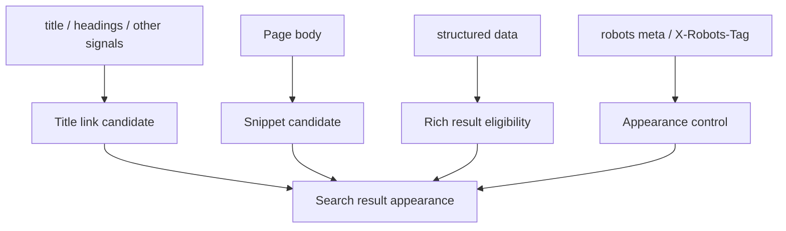

#### Title links

Google forms title links from multiple signals. The `<title>` element matters, but it is not the only input. That makes clear, page-specific titles even more important, not less.[^title-links]

#### Snippets and meta descriptions

Snippets are often generated from the page body, but Google may use a meta description when it better represents the page. Concise, page-specific descriptions are still useful.[^snippets]

#### Structured data

Structured data is not a ranking shortcut.  
What it can do is improve Google's understanding and, when eligible, improve the result presentation. The essentials are straightforward: keep it aligned with visible content, stay within the guidelines, and make sure Googlebot can access what the markup describes.[^structured-data][^structured-data-intro]

### 2.4 Build topic clusters, not isolated pages

Sites that perform well in SEO are usually not just collections of independent posts.  
They tend to organize pages around core topics.

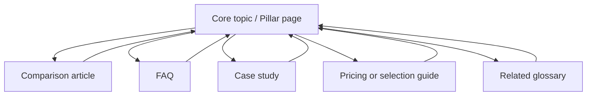

A practical working model is:

1. pillar pages  
   Main services, categories, or core topics
2. support pages  
   Comparisons, FAQs, definitions, implementation guides, case studies
3. conversion pages  
   Pricing, contact, demos, request forms, sign-up flows

This structure helps users and search engines recognize topical depth. Internal links are not only navigation. They also signal topical relationships.[^links]

### 2.5 On JavaScript-heavy sites, verify what Google actually sees

With JavaScript-heavy sites, "it shows up in the browser" is not enough.  
Google's JavaScript SEO guidance explains the crawl -> render -> index sequence explicitly.[^js-seo]

The URL Inspection tool is also important because it shows index status, live inspection results, and what Google renders.[^url-inspection]

At minimum, check these:

- the main content exists in rendered HTML
- important links are real `<a href>` links
- title, canonical, and structured data remain stable
- lazy loading or client-side-only patterns are not hiding critical text or images

### 2.6 Page experience matters, but it is not the whole game

Google presents Core Web Vitals as real-user metrics for loading, responsiveness, and visual stability. In Search Console, the Core Web Vitals report groups URLs based on **LCP, INP, and CLS**.[^core-web-vitals][^cwv-report]

At the same time, Google is clear that strong CWV numbers alone do not guarantee high rankings. Relevance and usefulness still matter first.[^page-experience]

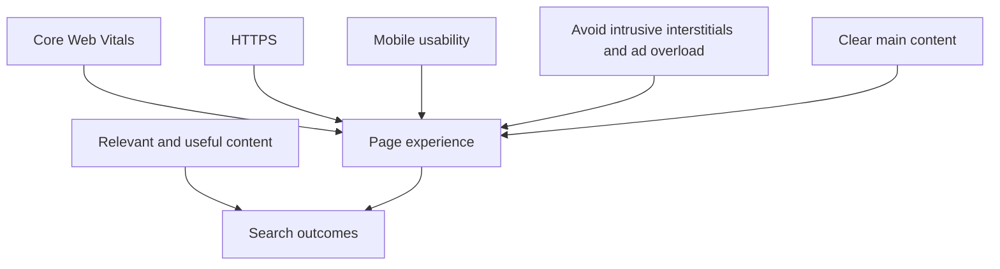

The practical order of operations is:

1. content that matches intent
2. discovery, crawl, and indexability
3. search appearance that earns clicks
4. page experience that supports conversion

### 2.7 AI search features do not replace the basics

In 2026, many teams are focused on AI Overviews and AI Mode.  
The important point is that Google says **you do not need special AI-only optimization** for these features. The baseline SEO practices still apply.[^ai-features]

Google's own guidance still points back to familiar foundations:[^ai-features]

- do not block crawling through robots or CDN settings
- make discovery easier with internal links
- provide a good page experience
- keep important information in text
- use high-quality images and video
- keep structured data aligned with visible text

Traffic from AI Overviews and AI Mode is also included in Search Console's **Web** performance reporting. If visibility needs to be limited, the controls are still the usual ones such as `nosnippet`, `data-nosnippet`, `max-snippet`, and `noindex`.[^ai-features][^robots]

## 3. Google Ads best practices

### 3.1 Start with measurement, not bidding tricks

Google Ads programs often break first at the measurement layer, not in ad copy. Google's account setup best practices emphasize **one campaign per primary goal**, and if Smart Bidding is in play, **accurate conversion data** becomes essential. Google also recommends a strong tagging foundation, enhanced conversions, Consent Mode, and conversion value signals.[^ads-account-best]

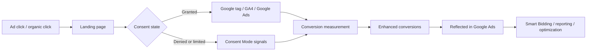

Three pieces matter especially early.

#### Consent Mode

Consent Mode communicates user consent status to Google and adjusts tag behavior accordingly. It is not the banner itself. It is the signaling layer that works with the banner or CMP.[^ads-consent]

#### Enhanced conversions

Enhanced conversions strengthen existing measurement by using hashed first-party data to improve conversion accuracy and give automated bidding better signals.[^ads-enhanced]

#### Conversion value

If one lead is worth much more than another, optimization should know that. Google explicitly promotes value-based bidding when businesses can send meaningful value differences such as revenue, margin, or lead score.[^conversion-values][^ads-value-bidding]

### 3.2 Prefer meaningful account structure over excessive granularity

Older operating habits often pushed very fine segmentation by match type, device, or geography.  
Google's current guidance leans toward **simpler, tightly themed structures** that give automation enough signal density to work well.[^ads-account-structure][^ads-account-best][^ads-structure]

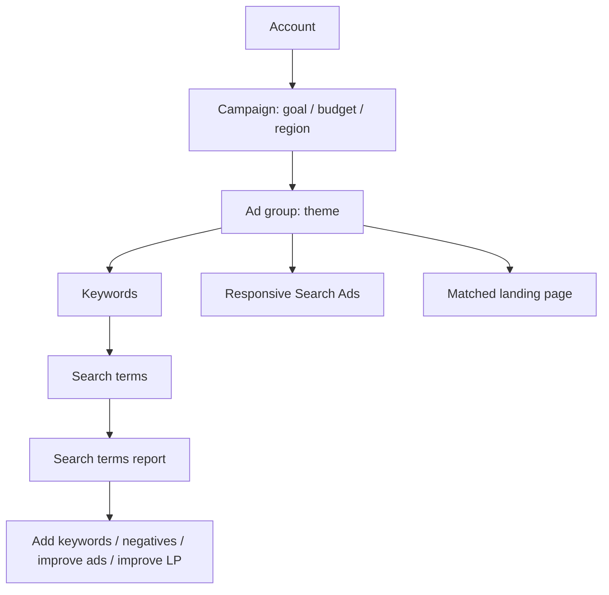

In practice, this is a stable split:

- campaign  
  Goal, budget, geography, language, media policy
- ad group  
  One clear theme
- ads  
  Multiple messaging angles for that theme
- landing page  
  A page that directly answers that search intent

Google's own explanation of ad groups points to the same logic: related keywords and related ads help deliver more relevant ads for similar searches.[^ads-structure]

### 3.3 Any setup that ignores search terms eventually drifts

Keywords alone are not enough.  
The real operating loop comes from the actual queries that triggered impressions and clicks.

Google's help on the search terms report also points back to a familiar rule: exclude irrelevant terms with negative keywords.[^ads-search-terms][^ads-negative][^ads-keyword-match]

That makes the core loop simple:

1. expand the search terms you actually want
2. exclude the ones you do not want
3. move the landing page and ad message closer to the real query language

When an account gets clicks but not business results, the reason usually becomes obvious inside the search terms report.

### 3.4 Write ads for RSA reality

In modern search campaigns, **Responsive Search Ads (RSA)** are the standard text ad format. Google recommends at least one RSA per ad group and an Ad Strength of Good or, ideally, Excellent. It also caps enabled RSAs per ad group at three.[^ads-rsa][^ads-ad-strength]

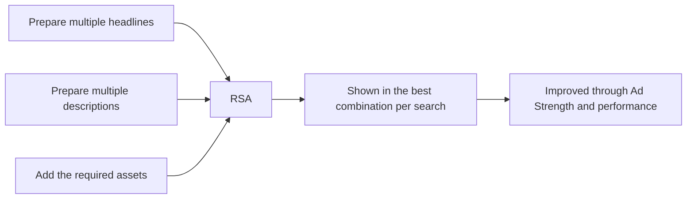

Because headlines and descriptions can be mixed in many ways, each asset should make sense both alone and in combination. Pinning should be reserved for cases where text truly must stay fixed.[^ads-rsa]

The best way to think about RSA is not "one perfect ad."  
It is "multiple clear persuasion angles":

- problem-solving
- comparative advantage
- pricing or condition
- trust or proof
- speed

### 3.5 The landing page is the continuation of the ad

Google explains that aligning keywords and ads with the landing page improves both **Ad relevance** and **landing page experience**.[^ads-landing]

That is why a promise like "same-day booking," "quick estimate," or "free first consultation" becomes weak if the user lands on a generic homepage and cannot find the next step.

At minimum, the landing page should line up with:

- search intent
- the promise made in the ad
- the first headline impression
- the CTA
- trust elements
- the form burden

### 3.6 Quality Score is diagnostic, not the business KPI

Quality Score is one of the most misunderstood metrics in Google Ads.  
Google explicitly describes it as a diagnostic tool, not as the KPI itself, and not as the direct auction input.[^ads-quality-score]

So instead of chasing the number, it is more useful to improve the three ideas behind it:

- Ad relevance
- Expected CTR
- Landing page experience

That is the level where operational gains usually happen.[^ads-quality-score-guide]

### 3.7 Smart Bidding is powerful, but only with strong inputs

Google defines Smart Bidding as auction-time bidding optimized toward conversions or conversion value.[^ads-smart]

It also strongly encourages a combination of:

- accurate conversion tracking
- conversion value signals
- broad match
- RSA
- simple, meaningful structure

That can work extremely well, but only if the underlying teaching data is trustworthy. Weak conversion definitions, flat lead values, and vague landing pages make automation much less useful.[^ads-account-best][^ads-value-bidding]

## 4. When to use SEO, Ads, or both

This is where strategy becomes practical.

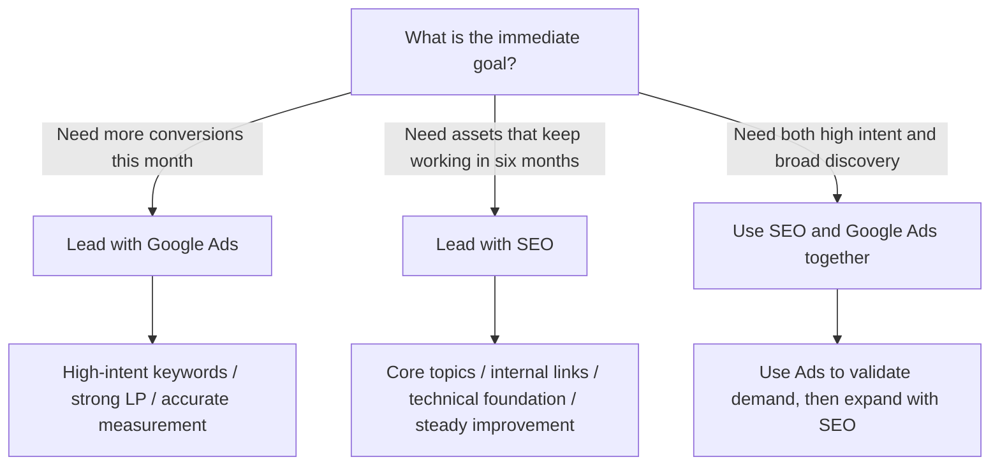

The simpler decision table looks like this:

| Situation | Primary channel | Why |
| --- | --- | --- |
| Need leads or sales quickly | Google Ads | Faster ramp-up |
| Need to test a new offer or message | Google Ads -> SEO | Faster validation |
| Need stronger long-term topic ownership | SEO | More compounding value |
| Need to win highly competitive money terms | Both | Broader coverage across paid and organic |
| Budget is limited but expertise is strong | SEO-led | Depth can outperform breadth |
| Need to protect branded demand | Both | Defensive coverage works better |

The strongest operating model is not to run SEO and Ads as isolated loops.  
It is to let them inform each other:

- use paid search terms to identify promising organic topics
- build SEO pages for the terms that repeatedly convert
- use Search Console query growth to shape paid expansion
- improve shared landing pages that both channels depend on

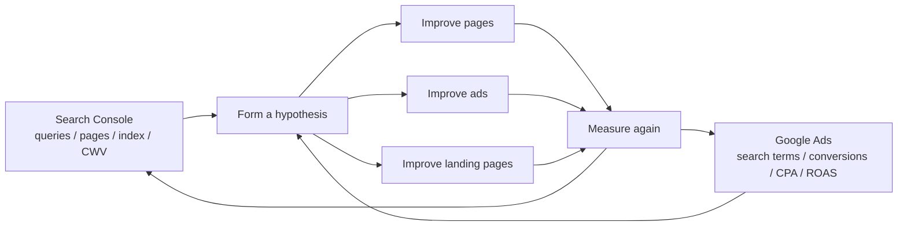

## 5. A practical first 90 days

For a typical site, the first 90 days can be simple.

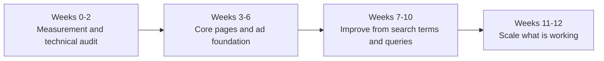

### 5.1 Weeks 0-2: measurement and technical audit

- set up Search Console
- submit the sitemap
- inspect priority URLs
- review Core Web Vitals and indexing status
- define Google Ads conversions clearly
- confirm Consent Mode and enhanced conversions
- design conversion values

### 5.2 Weeks 3-6: core pages and ad foundation

- create or strengthen pillar pages
- improve product, service, category, and inquiry landing pages
- simplify account structure
- group ad groups by theme
- create RSAs
- add the first negative keyword controls

### 5.3 Weeks 7-10: improve from real data

- review Search Console queries and pages
- inspect wasted spend in the search terms report
- improve titles, descriptions, headings, and landing pages
- repair weak CTR and CVR transitions

### 5.4 Weeks 11-12: scale the winners

- add related pages around winning topics
- rebalance budget
- refine value-based bidding
- strengthen internal linking
- remove duplicate or competing pathways

## 6. Common failure patterns

### 6.1 SEO-side failures

- publishing large amounts of thin content
- using the wrong page type for the query intent
- neglecting internal links
- leaving canonical and noindex handling vague
- reusing titles and descriptions across many pages
- never checking rendered HTML on a JS-heavy site
- letting structured data drift away from visible content
- chasing CWV numbers while postponing content quality work

Using generative AI is not inherently the problem.  
Google's concern is large-scale low-value output. If AI is used, quality control must cover not only the body text but also titles, descriptions, structured data, and alt text.[^gen-ai]

### 6.2 Google Ads-side failures

- vague conversion definitions
- mixing campaigns with different goals
- optimizing to clicks while ignoring business outcomes
- sending everything to the homepage
- never reading the search terms report
- using broad match without strong negatives or measurement
- treating Quality Score as the KPI
- delaying Consent Mode and enhanced conversions
- tweaking ad copy while leaving the landing page weak

## 7. Wrap-up

If this topic has one practical summary, it is this:

**design search acquisition as one system across content, discoverability, measurement, and landing pages.**

For SEO, that means:

- create genuinely useful pages
- make them easy for Google to discover and understand
- improve how they appear in search
- monitor them through Search Console
- support them with solid page experience

For Google Ads, that means:

- organize around goals
- prioritize measurement first
- match the landing page to the query intent
- refine with real search terms
- feed Smart Bidding with better data

The strongest version is not to separate the two.  
Use Ads to validate demand, use SEO to build durable assets, and improve the shared landing pages and shared measurement layer that both depend on.

## 8. References

[^search-essentials]: Google Search Central, [Search Essentials](https://developers.google.com/search/docs/essentials)
[^helpful-content]: Google Search Central, [Creating helpful, reliable, people-first content](https://developers.google.com/search/docs/fundamentals/creating-helpful-content)
[^links]: Google Search Central, [Link best practices for Google](https://developers.google.com/search/docs/crawling-indexing/links-crawlable)
[^sitemap]: Google Search Central, [Build and submit a sitemap](https://developers.google.com/search/docs/crawling-indexing/sitemaps/build-sitemap)
[^sitemaps-report]: Google Search Console Help, [Sitemaps report](https://support.google.com/webmasters/answer/7451001)
[^canonical]: Google Search Central, [How to specify a canonical URL with rel="canonical" and other methods](https://developers.google.com/search/docs/crawling-indexing/consolidate-duplicate-urls)
[^robots]: Google Search Central, [Robots meta tag, data-nosnippet, and X-Robots-Tag specifications](https://developers.google.com/search/docs/crawling-indexing/robots-meta-tag)
[^title-links]: Google Search Central, [Influencing title links in search results](https://developers.google.com/search/docs/appearance/title-link)
[^snippets]: Google Search Central, [Control your snippets in search results](https://developers.google.com/search/docs/appearance/snippet)
[^structured-data]: Google Search Central, [General structured data guidelines](https://developers.google.com/search/docs/appearance/structured-data/sd-policies)
[^structured-data-intro]: Google Search Central, [Introduction to structured data markup in Google Search](https://developers.google.com/search/docs/appearance/structured-data/intro-structured-data)
[^js-seo]: Google Search Central, [Understand JavaScript SEO basics](https://developers.google.com/search/docs/crawling-indexing/javascript/javascript-seo-basics)
[^url-inspection]: Google Search Console Help, [URL Inspection tool](https://support.google.com/webmasters/answer/9012289)
[^core-web-vitals]: Google Search Central, [Understanding Core Web Vitals and Google search results](https://developers.google.com/search/docs/appearance/core-web-vitals)
[^cwv-report]: Google Search Console Help, [Core Web Vitals report](https://support.google.com/webmasters/answer/9205520)
[^page-experience]: Google Search Central, [Understanding page experience in Google Search results](https://developers.google.com/search/docs/appearance/page-experience)
[^search-console]: Google Search Central, [How to use Search Console](https://developers.google.com/search/docs/monitor-debug/search-console-start)
[^ai-features]: Google Search Central, [AI features and your website](https://developers.google.com/search/docs/appearance/ai-features)
[^gen-ai]: Google Search Central, [Google Search's guidance on generative AI content on your website](https://developers.google.com/search/docs/fundamentals/using-gen-ai-content)

[^ads-account-best]: Google Ads Help, [Account setup best practices](https://support.google.com/google-ads/answer/6167145)
[^ads-structure]: Google Ads Help, [Organize your account with ad groups](https://support.google.com/google-ads/answer/6372655)
[^ads-account-structure]: Google Ads Help, [The ABCs of Account Structure](https://support.google.com/google-ads/answer/14752782)
[^ads-rsa]: Google Ads Help, [About responsive search ads](https://support.google.com/google-ads/answer/7684791)
[^ads-ad-strength]: Google Ads Help, [About Ad Strength for responsive search ads](https://support.google.com/google-ads/answer/9921843)
[^ads-smart]: Google Ads Help, [Smart Bidding: Definition](https://support.google.com/google-ads/answer/7066642)
[^ads-enhanced]: Google Ads Help, [About enhanced conversions](https://support.google.com/google-ads/answer/9888656)
[^ads-consent]: Google Ads Help, [About consent mode](https://support.google.com/google-ads/answer/10000067)
[^conversion-values]: Google Ads Help, [Conversion values best practices](https://support.google.com/google-ads/answer/14791574)
[^ads-value-bidding]: Google Ads Help, [Value-based Bidding best practices](https://support.google.com/google-ads/answer/14792795)
[^ads-landing]: Google Ads Help, [Optimize your ads and landing pages](https://support.google.com/google-ads/answer/6238826)
[^ads-search-terms]: Google Ads Help, [About the search terms report](https://support.google.com/google-ads/answer/2472708)
[^ads-keyword-match]: Google Ads Help, [About keyword matching options](https://support.google.com/google-ads/answer/7478529)
[^ads-negative]: Google Ads Help, [About negative keywords](https://support.google.com/google-ads/answer/2453972)
[^ads-quality-score]: Google Ads Help, [About Quality Score for Search campaigns](https://support.google.com/google-ads/answer/6167118)
[^ads-quality-score-guide]: Google Ads Help, [Using Quality Score to guide optimizations](https://support.google.com/google-ads/answer/6167123)
