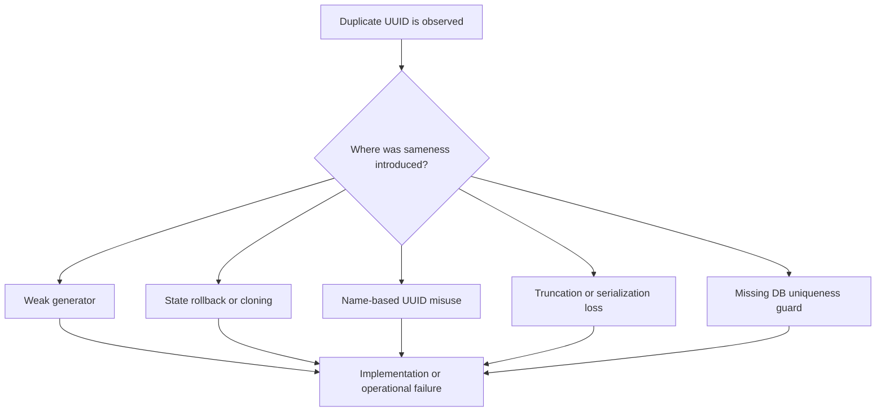

When a table uses UUID as its primary key and a `duplicate key` error still appears, the first reaction is often simple:

"So UUIDs do collide after all."

In practice, though, most UUID collision incidents are not caused by the UUID specification itself. They are caused by **implementation and operational choices that break the assumptions the specification relies on**. RFC 9562 defines UUIDv4 with 122 random bits, UUIDv7 with a time field plus 74 bits used for uniqueness, and UUIDv8 as explicitly implementation-specific. RFC 9562 is also very clear that UUIDv8 uniqueness **must not be assumed**. Python's standard `uuid` documentation likewise says `uuid4()` is generated in a cryptographically secure method. In other words, when teams use the standard forms correctly, the built-in assumptions are already quite strong.[^rfc-v4][^rfc-v7][^rfc-v8][^python-uuid]

This article focuses on **the bad operational and implementation patterns that turn UUID collisions into a real production problem**.  
The discussion is based on RFC 9562, Python documentation, and PostgreSQL documentation that could be verified as of **March 2026**.[^rfc-main][^python-uuid][^postgres-unique]

## 1. The short answer

These are the failure patterns worth suspecting first.

| Pattern | What actually goes wrong | First fix |
| --- | --- | --- |
| Building "UUIDv4-like" values with a weak or fixed-seed PRNG | Different processes or nodes reproduce the same sequence | Use the runtime or OS UUID API directly |
| Reusing generator state after fork, VM snapshot, or container cloning | Random or counter state gets replayed | Reseed after state changes and reinitialize cloned generators |
| Using UUIDv3 / UUIDv5 as if they were always-fresh IDs | Same namespace + same name yields the same UUID by design | Treat them as deterministic IDs and use them intentionally |
| Hand-rolling UUIDv1 / v6 / v7 / v8 logic | Clock rollback, node reuse, or bad counters create duplicates | Remove custom generators where possible |
| Truncating or collapsing UUIDs later | You throw away the 128-bit uniqueness you thought you had | Store and compare the full value |
| Omitting UNIQUE / PRIMARY KEY constraints | Duplicates enter silently and diagnosis arrives late | Keep a storage-layer uniqueness guard |

The common theme is simple: the collision is often not happening because UUID is weak. It is happening because **the system stops preserving the uniqueness properties UUID depends on**.

## 2. Start by checking the version and generation model

A lot of confusion comes from talking about "UUID" as if all UUIDs behaved the same way.

- **UUIDv4** is random-based. RFC 9562 defines 122 bits for random data after version and variant bits are reserved.[^rfc-v4]
- **UUIDv7** is time-ordered, with a Unix-millisecond timestamp and the remaining bits used for uniqueness through random data and, optionally, carefully seeded counters.[^rfc-v7]
- **UUIDv3 / v5** are name-based and deterministic. Same namespace plus same canonical name is supposed to produce the same UUID.[^rfc-name]
- **UUIDv8** is for experimental or vendor-specific layouts, and its uniqueness is implementation-specific.[^rfc-v8]

So before debugging a collision report, verify what is actually being generated:

- a standard-library `uuid4()`
- a library `uuid7()`
- a custom `timestamp + random` formatter
- a `uuid5(namespace, name)` call
- an in-house "UUIDv8-style" format

Those are not operationally equivalent.

In real incidents, this branch-based view is much faster than debating UUID probability in the abstract.

## 3. Pattern 1: A weak or fixed-seed PRNG is pretending to be UUIDv4

This is the most common implementation mistake.

Examples include:

- building 128 bits from a general-purpose PRNG
- seeding once from time or PID
- formatting 32 hex characters into a UUID-like string

The output may look like UUID, but if the random source is weak, **the sequence can repeat across processes, machines, or restarts**.

RFC 9562 recommends using a **CSPRNG** to get both low collision likelihood and low predictability. It also specifically says CSPRNG state should be properly reseeded after process-state changes such as forks.[^rfc-unguessability]  
Python's documentation mirrors the practical recommendation by stating that `uuid.uuid4()` generates a random UUID using a cryptographically secure method.[^python-uuid]

The practical rule is straightforward:

- do not hand-roll UUID generation
- do not manually manage randomness unless you truly have to
- prefer standard runtime UUID APIs over "lightweight" in-house helpers

When teams keep a custom UUID generator because it feels small and harmless, they are usually creating future incident debt.

## 4. Pattern 2: Generator state is replayed after fork, snapshot, or clone

The next dangerous class of failures is **state replay**.

RFC 9562 explicitly calls out two relevant ideas:

- CSPRNG state should be reseeded after process forks[^rfc-unguessability]
- when an implementation lacks stable generator state, the frequency of regenerating clock sequence, counters, or random data increases, which increases the probability of duplicates[^rfc-state]

From that, an important operational inference follows.

- a VM snapshot is taken and restored multiple times
- a container image boots many replicas with the same generator initialization path
- worker processes are forked while carrying shared random or counter state

In all of those cases, **the ID generation path can replay more state than the team expects**.

RFC 9562 does not literally say "VM snapshots will cause UUID collisions." That part is an inference. But it is a strong and practical one, because the RFC is very clear about reseeding after process-state changes and about the risks of poor generator-state handling.[^rfc-unguessability][^rfc-state]

The fix is usually operational, not mathematical:

- avoid long-lived custom generator state where possible
- reinitialize generators after fork, restore, or clone
- prefer UUID implementations that ask the OS for entropy instead of preserving too much internal state
- document what "cold start" and "restored start" mean for ID generation

## 5. Pattern 3: UUIDv3 or UUIDv5 is being used like a fresh ID allocator

UUIDv3 and UUIDv5 are not "collision-resistant new ID each time" functions.  
They are **deterministic name-to-ID mappings**.

RFC 9562 says that UUIDs generated from the same name, in the same namespace, using the same canonical format, **must be equal**.[^rfc-name] That means duplicates are expected when teams do things like:

- using `uuid5(namespace, url)` as if it were a fresh event ID
- generating IDs from customer email without including tenant scope in the namespace design
- retrying the same name-based generation while assuming a new UUID should appear

The opposite problem also happens: if canonicalization is inconsistent, the same logical item can receive different UUIDs. RFC 9562 spends a surprising amount of effort clarifying canonical name representation for exactly this reason.[^rfc-name][^rfc-v5]

The practical lessons are:

- UUIDv3 / v5 are deterministic, not random allocators
- namespace design must be explicit
- canonicalization rules must be treated as part of the ID specification

If the same input should always map to the same ID, v3 or v5 can be correct. If the goal is "give me a new unique value every time," they are the wrong tool.

## 6. Pattern 4: Time-based UUIDs or UUIDv8 are implemented by hand

UUIDv1, v6, v7, and v8 are especially dangerous when teams copy only the shape and ignore the behavioral rules.

### 6.1 UUIDv1 / v6 with careless node or clock-sequence handling

RFC 9562 explains UUIDv6 as a reordered UUIDv1 for improved database locality, while preserving clock sequence and node concepts.[^rfc-v6] It also discusses generator state, distributed generation, and node collision resistance in detail.[^rfc-state][^rfc-distributed]

One especially important point appears early in the RFC motivation section: with the rise of virtual machines and containers, **MAC address uniqueness can no longer be assumed**.[^rfc-main]

That makes several patterns dangerous:

- assuming MAC address means globally unique enough
- cloning machine images with embedded node IDs
- resetting clock sequence to a fixed value at each boot

### 6.2 UUIDv7 without proper rollover and rollback logic

UUIDv7 is very practical, but RFC 9562 is careful about monotonicity and counters. It explicitly says implementations must not knowingly return duplicates due to counter rollover, and it discusses rollback handling for clock and counter state.[^rfc-v7][^rfc-monotonic]

So these implementations are risky:

- generating many UUIDs per millisecond without a proper counter plan
- ignoring clock rollback entirely
- running multiple processes that each reinitialize the same internal generator logic independently

### 6.3 UUIDv8 treated as "the newer UUID"

UUIDv8 is often misunderstood. RFC 9562 says the uniqueness of UUIDv8 is **implementation specific and must not be assumed**.[^rfc-v8]

That means a format such as:

- timestamp bits
- shard bits
- business-category bits
- "whatever random is left"

is not automatically safe because it still looks like UUID.  
At that point, the real uniqueness contract is your design document, not the RFC.

## 7. Pattern 5: The UUID is shortened or collapsed later

Sometimes generation is correct, but the system destroys uniqueness later.

Typical examples:

- using only the first 8 characters as an external key
- folding a 128-bit UUID into a 64-bit integer
- storing UUID text in a column that is too short
- treating a display-friendly short form as the real unique identifier

The important distinction is that **not all representation changes are bad**.

These are usually fine because they preserve the full 128 bits:

- removing hyphens
- normalizing hex case
- storing the raw 16-byte binary form

The dangerous operations are the ones that **discard information**.  
Once the system starts comparing prefixes, shortened forms, or lossy hashes, it is no longer operating on the same uniqueness guarantee.

## 8. Pattern 6: The database has no uniqueness backstop

Even when UUID generation is strong, **storage should still defend itself** if duplicates are unacceptable.

PostgreSQL's documentation states that a unique constraint ensures the values in a column or group of columns are unique across the whole table, and that a primary key is both unique and not null.[^postgres-unique]

RFC 9562 makes the broader point too: UUIDs can provide practical uniqueness guarantees, but **true global uniqueness cannot be absolutely guaranteed without shared knowledge**, and applications should weigh the impact of collisions in context.[^rfc-collision]

So the practical baseline is:

- use UUIDs as low-collision identifiers
- keep UNIQUE or PRIMARY KEY constraints in the database
- design duplicate handling, retry logic, and idempotency intentionally

Using UUID does not remove the need for a uniqueness constraint. It reduces how often the constraint should fire.

## 9. Practical checklist

This is the condensed version that works well for audits and design reviews.

1. **Check whether UUID generation is custom**  
   If it can be replaced with `uuid4()` or `uuid7()` from a mature runtime or library, replace it first.
2. **Write down which UUID version is being used and why**  
   v4/v7 are random-oriented, v3/v5 are deterministic, and v8 is custom by definition.
3. **Audit seed and generator-state behavior**  
   Include forks, worker restarts, VM restores, and container cloning.
4. **Verify that the full UUID is preserved in storage and comparison**  
   Display shortcuts should stay display-only.
5. **Keep UNIQUE or PRIMARY KEY constraints at the storage layer**  
   UUID is not a substitute for constraints.
6. **Make duplicates observable**  
   When a duplicate happens, the team should be able to tell which generator, which node, and which deployment path produced it.

## 10. Wrap-up

Most UUID collision incidents are not really about UUID probability in the abstract. They are about **breaking the conditions that make UUID generation safe in practice**.

- weak randomness
- replayed generator state
- misuse of name-based UUIDs
- careless custom v7 or v8 designs
- truncation during storage or transport
- missing uniqueness constraints

So when duplicate UUIDs appear, the first question should usually not be "Did UUID fail?"  
It should be:

**Which part of our generator, state handling, serialization, or storage design removed the uniqueness guarantee we thought we had?**

That question tends to lead to the real fix much faster.

## 11. Related articles

- [How to Use FileSystemWatcher Safely - Lost Events, Duplicate Notifications, and the Traps Around Completion Detection](https://comcomponent.com/en/blog/2026/03/10/000-filesystemwatcher-safe-basics/)
- [Safe File Integration Locking - Best Practices for File Locks, Atomic Claims, and Idempotent Processing](https://comcomponent.com/en/blog/2026/03/07/001-file-integration-locking-best-practices-komurasoft-style/)

## 12. References

[^rfc-main]: IETF RFC 9562, [Universally Unique IDentifiers (UUIDs)](https://www.rfc-editor.org/rfc/rfc9562). The main standards document for UUID layouts and best practices.
[^rfc-v4]: IETF RFC 9562, [Section 5.4 UUID Version 4](https://www.rfc-editor.org/rfc/rfc9562#section-5.4). Defines the random-bit layout used by UUIDv4.
[^rfc-v5]: IETF RFC 9562, [Section 5.5 UUID Version 5](https://www.rfc-editor.org/rfc/rfc9562#section-5.5). Defines namespace-plus-name generation and canonical input handling.
[^rfc-v6]: IETF RFC 9562, [Section 5.6 UUID Version 6](https://www.rfc-editor.org/rfc/rfc9562#section-5.6). Covers UUIDv6 structure, node, and clock sequence behavior.
[^rfc-v7]: IETF RFC 9562, [Section 5.7 UUID Version 7](https://www.rfc-editor.org/rfc/rfc9562#section-5.7). Covers the timestamp plus uniqueness layout of UUIDv7.
[^rfc-v8]: IETF RFC 9562, [Section 5.8 UUID Version 8](https://www.rfc-editor.org/rfc/rfc9562#section-5.8). Explains that UUIDv8 uniqueness is implementation specific and must not be assumed.
[^rfc-monotonic]: IETF RFC 9562, [Section 6.2 Monotonicity and Counters](https://www.rfc-editor.org/rfc/rfc9562#section-6.2). Covers counter rollover, clock rollback, and batch generation concerns.
[^rfc-state]: IETF RFC 9562, [Section 6.3 UUID Generator States](https://www.rfc-editor.org/rfc/rfc9562#section-6.3). Covers stable generator state and duplicate-risk implications.
[^rfc-distributed]: IETF RFC 9562, [Section 6.4 Distributed UUID Generation](https://www.rfc-editor.org/rfc/rfc9562#section-6.4). Discusses node collision resistance in distributed systems.
[^rfc-name]: IETF RFC 9562, [Section 6.5 Name-Based UUID Generation](https://www.rfc-editor.org/rfc/rfc9562#section-6.5). Explains equality rules for same namespace and same canonical name.
[^rfc-collision]: IETF RFC 9562, [Sections 6.7 and 6.8](https://www.rfc-editor.org/rfc/rfc9562#section-6.7). Covers collision resistance and practical uniqueness guarantees.
[^rfc-unguessability]: IETF RFC 9562, [Section 6.9 Unguessability](https://www.rfc-editor.org/rfc/rfc9562#section-6.9). Recommends CSPRNG use and proper reseeding after forks.
[^python-uuid]: Python 3.14 documentation, [`uuid` module](https://docs.python.org/3/library/uuid.html). Describes `uuid4()` as cryptographically secure and documents `uuid5()`, `uuid7()`, and `uuid8()` behavior.
[^postgres-unique]: PostgreSQL documentation, [Constraints](https://www.postgresql.org/docs/current/ddl-constraints.html). Defines UNIQUE constraints and PRIMARY KEY behavior.
