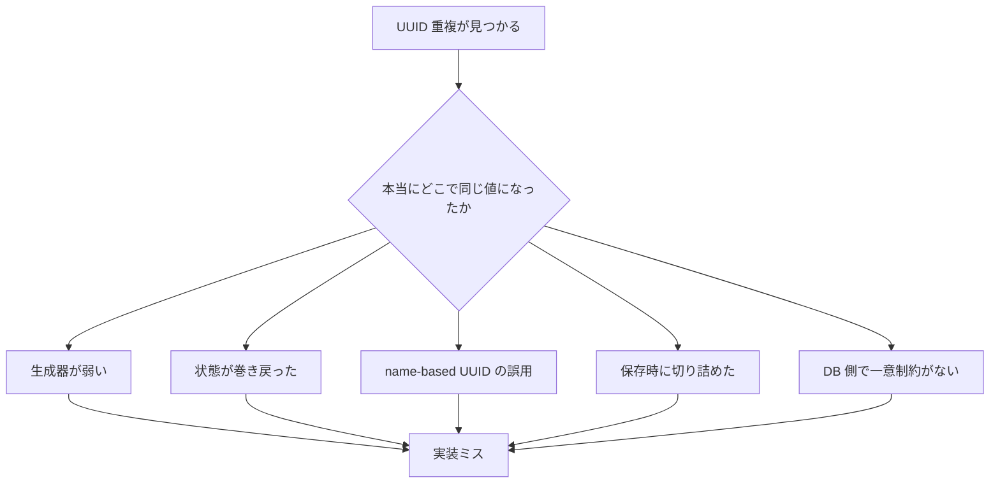

UUID を主キーにしていたのに、ある日 `duplicate key` が出る。  
この瞬間、かなりの確率で「UUID って結局ぶつかるのでは」という話になります。

ただ、実務で起きる UUID 重複の多くは、**UUID という規格そのものの問題** というより、**規格が前提にしている生成条件を実装や運用で壊している** ケースです。RFC 9562 では UUIDv4 は 122 ビットのランダム領域を持ち、UUIDv7 もタイムスタンプ以外の 74 ビットを一意性のための乱数やカウンタに使う前提で定義されています。一方で、UUIDv8 は「実装依存であり、一意性を前提にしてはいけない」と明記されています。[^rfc-v4][^rfc-v7][^rfc-v8]  
また、Python 標準ライブラリでも `uuid4()` は暗号学的に安全な方法で生成されると説明されており、少なくとも「ちゃんとした実装を普通に使う」限り、UUID 側の前提はかなり強いです。[^python-uuid]

この記事では、**間違った運用や実装で UUID が衝突してしまう典型パターン** を、再発防止策とセットで整理します。  
内容は **2026 年 3 月時点** で確認できる RFC 9562、Python 公式ドキュメント、PostgreSQL 公式ドキュメントをもとにしています。[^rfc-main][^python-uuid][^postgres-unique]

## 1. まず結論

先に短くまとめると、危ないのは次のパターンです。

| パターン | 何が起きるか | まずやるべき対策 |
| --- | --- | --- |
| 固定 seed や弱い PRNG で UUIDv4 っぽい値を自作する | 別プロセスや別ノードで同じ系列が再現される | OS / ランタイム標準の UUID API を使う |
| fork、VM snapshot、コンテナ複製後に生成状態をそのまま引き継ぐ | 乱数やカウンタの状態が巻き戻り、重複が出る | fork 後の再 seed、clone 後の再初期化、永続状態の扱いを見直す |
| UUIDv3 / v5 を「毎回新しい ID」と誤解して使う | 同じ namespace と same name から同じ UUID が再生成される | 決定論的 ID だと理解し、用途を限定する |
| UUIDv1 / v6 / v7 / v8 を自前実装し、clock rollback や node/counter を雑に扱う | 高頻度生成や複数ノードで重複しやすくなる | 既存ライブラリを使い、独自生成器を減らす |
| UUID を途中で切り詰めたり、別形式に潰したりする | 元の 128 ビットの一意性を自分で捨てる | 保存・比較はフル長で行う |
| DB 側に UNIQUE / PRIMARY KEY を置かない | 重複が静かに混入し、原因調査が遅れる | ストレージ層で一意制約を持つ |

要するに、**UUID が衝突した** というより、**UUID に期待していた一意性を、途中の設計で削っている** ことが多いです。

## 2. まず疑うべきは「UUID の数学」ではなく「生成と運用」

UUID の話がややこしくなるのは、バージョンごとに性質が違うからです。

- **UUIDv4** はランダムベースです。RFC 9562 では version / variant を除く 122 ビットが乱数で埋まります。[^rfc-v4]
- **UUIDv7** は時系列ソートしやすい構造で、Unix ミリ秒タイムスタンプに加えて、残りを乱数や carefully seeded counter で構成します。[^rfc-v7]
- **UUIDv3 / v5** は name-based です。同じ namespace と同じ canonical name なら、同じ UUID が出るのが正しい挙動です。[^rfc-name]
- **UUIDv8** は実験用・ベンダー独自用であり、一意性は実装依存です。RFC は「一意性を前提にしてはいけない」としています。[^rfc-v8]

つまり、「UUID を使っている」と言っても、その中身が

- 標準ライブラリの `uuid4()` なのか
- 自前の `timestamp + random` なのか
- `uuid5(namespace, name)` なのか
- 見た目だけ UUIDv8 の独自フォーマットなのか

で、話がまったく変わります。

実務では、この図の右側から見ていくほうが早いです。

## 3. パターン1: UUIDv4 を名乗りながら、実際は弱い PRNG を使っている

一番ありがちなのはこれです。

- `Math.random()` 相当の一般用途 PRNG で 128 ビット分作る
- 起動時に `time()` や PID で seed を入れる
- 「UUID 形式っぽい 32 hex 桁」を自前で組み立てる

見た目は UUID でも、**乱数源が弱ければ、同じ系列が別プロセスや別ノードで再現** されます。

RFC 9562 は、UUID の一意性と予測困難性の両方のために、**CSPRNG を使うべき** としています。さらに、**process fork のような状態変化時には CSPRNG 状態を適切に再 seed すべき** と書いています。[^rfc-unguessability]  
Python の `uuid.uuid4()` も、暗号学的に安全な方法でランダム UUID を生成すると説明しています。[^python-uuid]

ここでの実務上の結論は単純です。

- UUID を自作しない
- 乱数 seed を手でいじらない
- 標準ライブラリか、広く使われた実装をそのまま使う

「軽いから」「昔から使っているから」で独自生成器を持ち続けると、あとで最も高くつきます。

## 4. パターン2: fork、snapshot、clone で生成状態を巻き戻す

二番目に危ないのは、**生成器の状態が複製・巻き戻しされる運用** です。

RFC 9562 は、fork 後の再 seed を明示的に勧めていますし、stable storage を持たない実装は **clock sequence、counter、random data の生成頻度が増え、重複確率が上がる** と説明しています。[^rfc-unguessability][^rfc-state]

ここから自然に出てくる実務上の推論があります。

- VM snapshot 取得後に同じイメージを複数復元する
- コンテナイメージ起動時に同じ初期状態から独自生成器が立ち上がる
- worker fork 後に PRNG 状態やカウンタ状態を共有してしまう

こうした運用では、**UUID の生成系列が意図せず再現** されえます。  
これは RFC がそのまま「snapshot は危険」と書いているわけではありませんが、fork 後の再 seed と generator state の扱いに関する注意から導ける、かなり実務的な注意点です。[^rfc-unguessability][^rfc-state]

対策は次です。

- 独自の UUID 生成状態を長く持たない
- fork / clone / restore の直後に再初期化する
- 可能なら OS 由来の乱数を毎回利用する実装に寄せる
- 高頻度生成器なら、状態管理と再 seed の仕様を明文化する

## 5. パターン3: UUIDv3 / v5 を「毎回新しい ID」と誤解する

UUIDv3 / v5 は collision しにくいランダム ID ではありません。  
**同じ名前から同じ ID を再生成できる決定論的 ID** です。

RFC 9562 では、**同じ canonical format の same name を same namespace で生成した UUID は等しくなければならない** と書かれています。[^rfc-name]  
つまり、次のような使い方をすると、重複は事故ではなく仕様通りです。

- `uuid5(NAMESPACE_URL, "https://example.com/users/42")` を毎回「新規採番」として使う
- tenant を namespace に入れず、全顧客共通 namespace + email で発番する
- 同じ論理名を retry ごとに再発番しても、別 ID になると思い込む

逆に、name の canonicalization がぶれていると、**同じ対象なのに別 UUID** になります。RFC も canonical representation の扱いをかなり強調しています。[^rfc-name][^rfc-v5]

この系統で大事なのは、

- UUIDv3 / v5 は「重複しない採番」ではなく「同じ入力なら同じ ID」
- namespace 設計を曖昧にしない
- name の canonicalization を仕様化する

の 3 点です。

## 6. パターン4: 時刻系 UUID や UUIDv8 を自前実装している

UUIDv1 / v6 / v7 / v8 は、**見た目だけ真似すると危ない** です。

### 6.1 UUIDv1 / v6 で node や clock sequence を雑に扱う

RFC 9562 では、UUIDv6 は DB locality 改善のために UUIDv1 を並べ替えたもので、clock sequence や node を扱います。さらに、分散環境の node collision resistance や state 保持について、いくつも注意があります。[^rfc-v6][^rfc-state][^rfc-distributed]

しかも RFC は、**仮想マシンやコンテナの登場により、MAC address の一意性はもはや保証されない** とまで書いています。[^rfc-main]

なので、

- MAC アドレスだから一意だろうと決め打ちする
- node ID をイメージ焼き込みで複製する
- clock sequence を再起動ごとに固定値へ戻す

のような設計は危険です。

### 6.2 UUIDv7 を自作して counter rollover や clock rollback を放置する

UUIDv7 はかなり実用的ですが、RFC は高頻度生成時の monotonicity と counter handling を丁寧に書いています。**clock rollback や counter rollover で重複を knowingly return してはいけない** とも明示されています。[^rfc-v7][^rfc-monotonic]

つまり、

- 同一ミリ秒内で大量発番するのに counter 設計がない
- 時刻が戻ったときに何もせず生成を続ける
- 複数プロセスが同じ internal counter を別々に初期化する

といった実装は危ないです。

### 6.3 UUIDv8 を「新しい UUID 規格」くらいの軽い気持ちで使う

UUIDv8 は便利そうに見えますが、RFC 9562 はかなりはっきりしていて、**UUIDv8 の一意性は実装依存であり、前提にしてはいけない** としています。[^rfc-v8]

つまり、

- timestamp を埋め込む
- shard id を埋め込む
- 何か業務意味を埋め込む
- 残りは適当に random を入れる

という「自社独自 UUID」は、**その設計書が UUID の一意性仕様そのもの** です。  
レビューなしで入れるには、かなり危険です。

## 7. パターン5: UUID を途中で短くしてしまう

生成までは正しくても、保存や比較の段階で壊してしまうことがあります。

典型例は次です。

- 先頭 8 文字だけを外部キー代わりに使う
- 128 ビット UUID を 64 ビット整数へ潰す
- 文字列カラム長が足りず、末尾が切れる
- ログや画面表示の短縮表現を、そのまま一意キー扱いする

ここで大事なのは、**表現を変えること自体が悪いわけではない** ことです。

- ハイフンを外す
- 小文字 / 大文字をそろえる
- バイナリ 16 バイトで持つ

のように、**128 ビットを落とさない変換** は問題ありません。  
危ないのは、**一意性の材料そのものを削る変換** です。

特に「人が見やすい短縮 ID」を別途作ったのに、それがいつのまにか本来の UUID より優先される設計は事故になりやすいです。

## 8. パターン6: DB 側に一意制約がない

最後に、かなり重要なのがこれです。

UUID が十分衝突しにくいとしても、**本当に重複を許容できないなら、保存先でも一意制約を持つべき** です。

PostgreSQL の公式ドキュメントでは、unique constraint は列や列集合の値が表全体で一意であることを保証し、primary key は **unique かつ not null** な行識別子になると説明されています。[^postgres-unique]

RFC 9562 も、UUID は実装上十分な一意性を提供できる一方で、**真の global uniqueness を絶対保証することはできない** としています。さらに collision impact が高い用途では、より強い対策を取るべきとしています。[^rfc-collision]

なので、実務では次の組み合わせが基本です。

- UUID は衝突しにくい ID として使う
- DB は UNIQUE / PRIMARY KEY で最終防衛線を持つ
- 重複時の retry / idempotency / incident logging を設計する

UUID を使うことと、一意制約を置かないことは、同義ではありません。

## 9. 実務向けチェックリスト

最後に、導入や監査でそのまま使いやすい形にまとめます。

1. **UUID を自前生成していないか確認する**  
   `uuid4()` / `uuid7()` のような標準 API に寄せられるなら、まず寄せます。
2. **UUID の version を仕様として決める**  
   v4/v7 はランダム系、v3/v5 は決定論的、v8 は独自仕様と明記します。
3. **seed と generator state の扱いを棚卸しする**  
   fork、worker 再起動、snapshot、clone 後に同じ状態を引き継がないようにします。
4. **保存時にフル長を維持しているか確認する**  
   prefix 比較や短縮表示を、本来キーとして使わないようにします。
5. **DB に UNIQUE / PRIMARY KEY を置く**  
   UUID は確率を下げる仕組みであり、制約そのものではありません。
6. **重複を観測できるようにする**  
   duplicate key を握りつぶさず、どの generator / node / deployment で出たか追えるようにします。

## 10. まとめ

UUID の衝突事故は、たいてい **UUID が弱い** のではなく、**UUID の前提を実装や運用で壊している** ところから始まります。

- 弱い乱数で自作する
- fork や snapshot 後の状態を巻き戻す
- name-based UUID を採番用途に使う
- v7 や v8 を軽く自前実装する
- 途中で短縮して一意性を捨てる
- DB 側の一意制約を外す

このあたりをやると、「UUID が衝突した」というより、**こちらから衝突しやすい状況を作っている** に近くなります。

重複を見つけたら、まず疑うべきは UUID の数学より、**生成器、状態管理、保存形式、制約設計** です。  
その順で見れば、たいてい原因はかなり絞れます。

## 11. 関連記事

- [FileSystemWatcher の使い方と注意点 - 取りこぼし、重複通知、完了判定の落とし穴](https://comcomponent.com/blog/2026/03/10/000-filesystemwatcher-safe-basics/)
- [ファイル連携の排他制御の基礎知識 - ファイルロックと原子的 claim のベストプラクティス](https://comcomponent.com/blog/2026/03/07/001-file-integration-locking-best-practices-komurasoft-style/)

## 12. 参考資料

[^rfc-main]: IETF RFC 9562, [Universally Unique IDentifiers (UUIDs)](https://www.rfc-editor.org/rfc/rfc9562). UUID の形式、各 version、best practices 全体の基準文書です。
[^rfc-v4]: IETF RFC 9562, [Section 5.4 UUID Version 4](https://www.rfc-editor.org/rfc/rfc9562#section-5.4). UUIDv4 の 122 ビット乱数領域について。
[^rfc-v5]: IETF RFC 9562, [Section 5.5 UUID Version 5](https://www.rfc-editor.org/rfc/rfc9562#section-5.5). namespace + canonical name に基づく name-based UUID の仕様について。
[^rfc-v6]: IETF RFC 9562, [Section 5.6 UUID Version 6](https://www.rfc-editor.org/rfc/rfc9562#section-5.6). UUIDv6 の node / clock sequence / DB locality について。
[^rfc-v7]: IETF RFC 9562, [Section 5.7 UUID Version 7](https://www.rfc-editor.org/rfc/rfc9562#section-5.7). UUIDv7 の timestamp、random bits、counter の考え方について。
[^rfc-v8]: IETF RFC 9562, [Section 5.8 UUID Version 8](https://www.rfc-editor.org/rfc/rfc9562#section-5.8). UUIDv8 の一意性は実装依存で、前提にしてはいけないことについて。
[^rfc-monotonic]: IETF RFC 9562, [Section 6.2 Monotonicity and Counters](https://www.rfc-editor.org/rfc/rfc9562#section-6.2). clock rollback、counter rollover、batch generation 時の注意について。
[^rfc-state]: IETF RFC 9562, [Section 6.3 UUID Generator States](https://www.rfc-editor.org/rfc/rfc9562#section-6.3). stable storage や generator state の扱いについて。
[^rfc-distributed]: IETF RFC 9562, [Section 6.4 Distributed UUID Generation](https://www.rfc-editor.org/rfc/rfc9562#section-6.4). 分散環境での node collision resistance について。
[^rfc-name]: IETF RFC 9562, [Section 6.5 Name-Based UUID Generation](https://www.rfc-editor.org/rfc/rfc9562#section-6.5). same namespace + same name が同じ UUID になること、canonicalization の重要性について。
[^rfc-collision]: IETF RFC 9562, [Sections 6.7 and 6.8](https://www.rfc-editor.org/rfc/rfc9562#section-6.7). collision resistance と global uniqueness の考え方について。
[^rfc-unguessability]: IETF RFC 9562, [Section 6.9 Unguessability](https://www.rfc-editor.org/rfc/rfc9562#section-6.9). CSPRNG 利用と fork 後の再 seed について。
[^python-uuid]: Python 3.14 documentation, [`uuid` module](https://docs.python.org/3/library/uuid.html). `uuid4()` の cryptographically-secure generation、`uuid5()` の deterministic behavior、`uuid7()` / `uuid8()` の性質について。
[^postgres-unique]: PostgreSQL documentation, [Constraints](https://www.postgresql.org/docs/current/ddl-constraints.html). UNIQUE 制約と PRIMARY KEY による一意性担保について。
