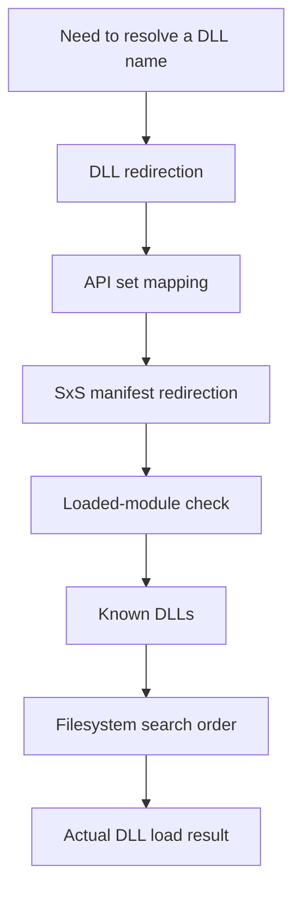

Windows DLL loading discussions often collapse into a misleadingly simple question:

- "Which folder does Windows search first?"

That is not the full model.

In practice, teams usually get stuck on more specific issues:

- `LoadLibrary("foo.dll")` works on one machine but loads a different module on another
- a DLL placed next to the EXE still loses to another resolution path
- `System32`, the application directory, manifests, API sets, and Known DLLs get mixed together
- `SetDllDirectory`, `AddDllDirectory`, and `LoadLibraryEx` are used without a clear understanding of their side effects
- a deployment problem turns into a security problem because the process is still loading by bare DLL name

The practical point is this:

**Windows does not start by blindly walking directories.**  
Before ordinary filesystem probing, the loader evaluates several higher-level resolution rules.

This article organizes DLL name resolution on Windows in a practical way, including **DLL search order, Known DLLs, loaded-module checks, API sets, side-by-side manifests, the effect of `LoadLibraryEx`-family APIs, and the difference between packaged and unpackaged apps**.  
The discussion is based on Microsoft Learn documentation available as of **March 2026**.[^search-order][^dll-security][^api-sets][^setdefault][^adddlldirectory][^loadlibraryex][^dll-redirection][^manifests][^sxs]

## 1. The short answer

If we compress the real-world answer aggressively, it looks like this:

- Windows DLL name resolution is **not just a filesystem search order**. DLL redirection, API sets, SxS manifest redirection, the loaded-module list, and Known DLLs are all part of resolution before ordinary directory walking. [^search-order]
- For unpackaged desktop apps in the default safe-DLL-search configuration, the application directory is still high in the order, but it is **not the first thing that always decides the result**. [^search-order]
- Even if you load the first DLL by **full path**, dependent DLLs are still searched **as if they were loaded by module name only**. That is a common source of environment-specific failures. [^search-order]
- Known DLLs are not just "System32 wins first." They are a specific loader mechanism that binds certain module names to the system copy defined for that Windows version. [^search-order]
- API sets are **virtual contract names**, not ordinary physical DLL filenames. Reading an `api-ms-win-...` name as a normal disk file lookup leads to the wrong mental model. [^api-sets]
- `SetDllDirectory` does more than add a directory. Microsoft explicitly notes that it effectively disables safe DLL search mode while its directory remains active in the search path. [^search-order]
- In modern code, it is usually safer to narrow the search space deliberately with **full paths, `SetDefaultDllDirectories`, `AddDllDirectory`, and `LoadLibraryEx` with `LOAD_LIBRARY_SEARCH_*` flags**. [^setdefault][^adddlldirectory][^loadlibraryex][^dll-security]

The practical model is:

**DLL resolution on Windows depends on both the pre-filesystem resolution rules and the APIs that reshape the search space.**

## 2. Resolution starts before ordinary directory search

Microsoft's DLL search order documentation explicitly lists several factors that should be treated as part of resolution itself. [^search-order]

For desktop scenarios, the loader considers these early factors:

1. DLL redirection
2. API sets
3. SxS manifest redirection
4. The loaded-module list
5. Known DLLs

Only after that does the process move into ordinary directory search such as the application folder, `System32`, the Windows directory, the current directory, and `PATH`. [^search-order]

That is why the statement "Windows always checks the app folder first" is incomplete. It skips the part of the model that often explains the surprising result.

## 3. The standard search order for unpackaged apps

For unpackaged apps, Microsoft documents the standard order separately. With safe DLL search mode enabled, the main flow is: [^search-order]

1. DLL redirection
2. API sets
3. SxS manifest redirection
4. Loaded-module list
5. Known DLLs
6. On Windows 11 version 21H2 and later, the process package dependency graph
7. The folder from which the application loaded
8. `System32`
9. The 16-bit system folder
10. The Windows folder
11. The current folder
12. `PATH`

The practical implications are:

- the current directory is **not early by default**
- but being later does **not** automatically make the process safe
- if an attacker controls any searched directory, a bare-name load can still become a DLL preloading problem [^dll-security]
- older mental models often miss the package dependency graph note that now appears for unpackaged apps on newer Windows versions [^search-order]

## 4. Packaged and unpackaged apps are not the same loading model

Microsoft documents packaged apps separately for a reason. The package dependency graph participates differently, and the overall search model is not identical to classic unpackaged desktop loading. [^search-order]

This matters in practice when a team moves from:

- local unpackaged development
- to MSIX or other packaged deployment
- or to Windows App SDK scenarios that introduce package-based dependencies

If an article or design review presents "the Windows DLL search order" as one timeless flat list, it is likely oversimplifying the problem.

## 5. What the loaded-module list and Known DLLs really mean

Two parts of the model often surprise people because they are not ordinary directory search.

### 5.1 Loaded-module list

Microsoft states that the system can check whether a DLL with the same module name is **already loaded into memory**, regardless of which folder it originally came from. [^search-order]

That means a troubleshooting session can go wrong if you ignore prior loads of the same module name in the process.

### 5.2 Known DLLs

Microsoft also documents Known DLLs as a per-version Windows list under:

`HKEY_LOCAL_MACHINE\SYSTEM\CurrentControlSet\Control\Session Manager\KnownDLLs` [^search-order]

If the module name is on that list, the system uses its copy of that known DLL. So this is not just a normal race between the app directory and another disk folder. It is a loader-level mechanism.

## 6. API sets are contracts, not ordinary disk filenames

Microsoft describes an API set name as a **virtual alias for a physical DLL file**. Its purpose is to separate the contract from the actual host DLL implementation. [^api-sets]

That is why a name such as `api-ms-win-core-...` should not be read with the same mental model as a normal application DLL placed beside an EXE.

The engineering point is important:

- implementations can move between host DLLs across Windows versions and device families
- callers can still target the contract
- compatibility improves because code is not tied to one concrete host DLL name [^api-sets]

## 7. Manifests and side-by-side assemblies solve a different class of problem

DLL redirection and SxS manifests are often mentioned together, but they are not identical ideas.

Microsoft documents manifests as XML files that describe side-by-side assemblies or isolated applications, including identity, binding, activation information, and the files that make up the assembly. [^manifests]

Microsoft also explains that side-by-side assemblies are used as units of naming, binding, versioning, deployment, and configuration, and that manifests plus version identity let the loader bind the correct assembly version for the application. [^sxs]

So in practice, it is useful to distinguish between:

- private DLL placement in the application directory
- DLL redirection
- manifest-driven side-by-side binding

All three affect what gets loaded, but they are not the same design tool.

## 8. What `SetDllDirectory`, `AddDllDirectory`, and `LoadLibraryEx` change

### 8.1 `SetDllDirectory`

`SetDllDirectory` changes the search order, but the critical security point is that Microsoft states it **effectively disables safe DLL search mode** while the specified path remains active. [^search-order]

That means it is not a harmless convenience API.

There is another subtle point: Microsoft notes that a parent process calling `SetDllDirectory` can affect the standard search order of the child process. [^search-order]

For most modern code, this is a good reason not to reach for `SetDllDirectory` first.

### 8.2 `AddDllDirectory`

`AddDllDirectory` adds directories that participate via `LOAD_LIBRARY_SEARCH_USER_DIRS`. Microsoft also notes that if more than one path has been added, **the search order among them is unspecified**. [^search-order][^adddlldirectory]

So if your design requires a strict left-to-right search among multiple custom directories, that is a weak assumption.

### 8.3 `SetDefaultDllDirectories`

Microsoft describes `SetDefaultDllDirectories` as a way to define a process-wide default DLL search path that removes the most vulnerable directories from the standard search path. [^setdefault]

Practically, that means:

- it applies to the calling process
- it persists for the life of that process
- it is intended to reduce DLL preloading exposure

It is one of the clearest APIs for moving a process toward a safer default loading posture. [^setdefault]

### 8.4 `LoadLibraryEx`

`LoadLibraryEx` lets you influence search behavior with flags such as `LOAD_WITH_ALTERED_SEARCH_PATH` and the `LOAD_LIBRARY_SEARCH_*` family. [^loadlibraryex][^search-order]

In practice, that helps when you need to:

- restrict the allowed search space
- include only known-safe directories
- ensure dependency lookup includes the DLL load directory when appropriate

## 9. Full-path loading does not automatically pin dependent DLLs

This is one of the most important practical details in the Microsoft documentation.

Even when the first DLL is loaded by full path, the system searches that DLL's dependencies **as if they were loaded by module name only**. [^search-order][^setdefault]

That means this assumption is unsafe:

- "I loaded `C:\MyApp\plugins\foo.dll` explicitly"
- "therefore its dependency `bar.dll` must also come from the same folder"

Not necessarily.

This single misunderstanding explains many cases of:

- works on the build machine
- fails on the customer machine
- loads the wrong dependency after another product is installed

## 10. Avoiding DLL preloading and hijacking problems

Microsoft's DLL security guidance is straightforward: if an app dynamically loads a DLL without a fully qualified path, and an attacker controls a directory on the search path, the attacker can plant a malicious copy there. Microsoft calls this a DLL preloading attack or binary planting attack. [^dll-security]

The practical baseline is:

- avoid bare-name dynamic loading where possible
- prefer full paths when you know the allowed module location
- narrow the process search path with `SetDefaultDllDirectories`
- add only explicit trusted directories with `AddDllDirectory`
- use `LoadLibraryEx` with `LOAD_LIBRARY_SEARCH_*` flags to make intent explicit
- avoid accidental dependence on the current directory or broad `PATH` contents

This is especially important for elevated processes, because the malicious DLL executes with the privileges of the hosting process. [^dll-security]

## 11. Practical review checklist

When reviewing a Windows application that loads DLLs, these questions catch many real issues early:

1. Is the app packaged or unpackaged?
2. Which DLLs are static dependencies and which are dynamically loaded?
3. Are loads done by full path or by bare module name?
4. Is `SetDllDirectory` used anywhere?
5. Can the process move to `SetDefaultDllDirectories` plus `LOAD_LIBRARY_SEARCH_*` flags?
6. Are multiple `AddDllDirectory` paths being used with hidden order assumptions?
7. Is dependency management based on private DLL placement, manifests, SxS, or redirection?
8. Does the process still depend on the current directory or wide `PATH` entries?
9. Could a dependency resolve differently on another machine even when the first DLL is loaded by full path?

If a team works through those nine questions clearly, many "DLL not found," "wrong DLL loaded," "only fails in production," and "security review blocked this release" cases become much easier to prevent.

## 12. Wrap-up

Windows DLL name resolution is not just a list of folders.  
It is the combination of **pre-filesystem resolution rules, package context, loaded-module state, Known DLL handling, API-set indirection, manifest-based binding, and the APIs that alter the search space**. [^search-order][^api-sets][^setdefault]

The practical conclusions are:

- do not memorize a single flat search-order table and stop there
- separate packaged from unpackaged behavior
- remember that full-path loading does not automatically pin dependent DLLs
- avoid casual use of `SetDllDirectory`
- move toward `SetDefaultDllDirectories` and explicit `LoadLibraryEx` search flags when you need safer behavior

DLL name resolution is where startup reliability, deployment differences, and security exposure frequently meet. That is why it is worth understanding not only **which directory is searched when**, but also **which resolution rules Windows applies before ordinary directory search even begins**.

## Related articles

- [Minimum Windows application security checklist]()
- [How far can a Windows app really be a single binary?]()
- [When does a Windows app really need administrator privileges?]()
- [What is Reg-Free COM?]()

## References

1. [Microsoft Learn: Dynamic-link library search order](https://learn.microsoft.com/en-us/windows/win32/dlls/dynamic-link-library-search-order)
2. [Microsoft Learn: Dynamic-Link Library Security](https://learn.microsoft.com/en-us/windows/win32/dlls/dynamic-link-library-security)
3. [Microsoft Learn: Windows API sets](https://learn.microsoft.com/en-us/windows/win32/apiindex/windows-apisets)
4. [Microsoft Learn: SetDefaultDllDirectories function](https://learn.microsoft.com/en-us/windows/win32/api/libloaderapi/nf-libloaderapi-setdefaultdlldirectories)
5. [Microsoft Learn: AddDllDirectory function](https://learn.microsoft.com/en-us/windows/win32/api/libloaderapi/nf-libloaderapi-adddlldirectory)
6. [Microsoft Learn: LoadLibraryEx function](https://learn.microsoft.com/en-us/windows/win32/api/libloaderapi/nf-libloaderapi-loadlibraryexa)
7. [Microsoft Learn: Dynamic-link library redirection](https://learn.microsoft.com/en-us/windows/win32/dlls/dynamic-link-library-redirection)
8. [Microsoft Learn: Manifests](https://learn.microsoft.com/en-us/windows/win32/sbscs/manifests)
9. [Microsoft Learn: About Side-by-Side Assemblies](https://learn.microsoft.com/en-us/windows/win32/sbscs/about-side-by-side-assemblies-)

[^search-order]: Microsoft Learn, "Dynamic-link library search order", accessed March 24, 2026, https://learn.microsoft.com/en-us/windows/win32/dlls/dynamic-link-library-search-order
[^dll-security]: Microsoft Learn, "Dynamic-Link Library Security", accessed March 24, 2026, https://learn.microsoft.com/en-us/windows/win32/dlls/dynamic-link-library-security
[^api-sets]: Microsoft Learn, "Windows API sets", accessed March 24, 2026, https://learn.microsoft.com/en-us/windows/win32/apiindex/windows-apisets
[^setdefault]: Microsoft Learn, "SetDefaultDllDirectories function", accessed March 24, 2026, https://learn.microsoft.com/en-us/windows/win32/api/libloaderapi/nf-libloaderapi-setdefaultdlldirectories
[^adddlldirectory]: Microsoft Learn, "AddDllDirectory function", accessed March 24, 2026, https://learn.microsoft.com/en-us/windows/win32/api/libloaderapi/nf-libloaderapi-adddlldirectory
[^loadlibraryex]: Microsoft Learn, "LoadLibraryEx function", accessed March 24, 2026, https://learn.microsoft.com/en-us/windows/win32/api/libloaderapi/nf-libloaderapi-loadlibraryexa
[^dll-redirection]: Microsoft Learn, "Dynamic-link library redirection", accessed March 24, 2026, https://learn.microsoft.com/en-us/windows/win32/dlls/dynamic-link-library-redirection
[^manifests]: Microsoft Learn, "Manifests", accessed March 24, 2026, https://learn.microsoft.com/en-us/windows/win32/sbscs/manifests
[^sxs]: Microsoft Learn, "About Side-by-Side Assemblies", accessed March 24, 2026, https://learn.microsoft.com/en-us/windows/win32/sbscs/about-side-by-side-assemblies-
