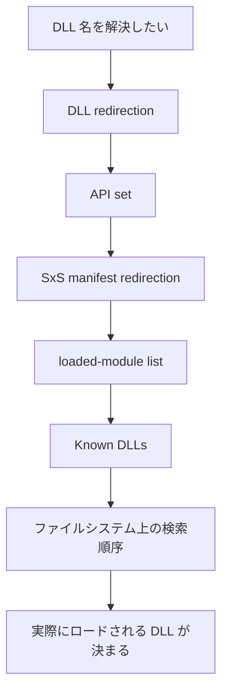

Windows でネイティブ DLL を扱う話になると、かなりの頻度で次のような混乱が起きます。

- `LoadLibrary("foo.dll")` と書いたら、実際にはどこを見に行くのか
- 実行ファイルと同じフォルダに置いたのに、なぜ別の DLL が読み込まれるのか
- `System32` が優先されるのか、アプリフォルダが優先されるのか
- manifest や API set や Known DLLs は、どの段階で効くのか
- `SetDllDirectory` や `AddDllDirectory` を使うと、何が変わるのか
- DLL 植え込み攻撃や DLL hijacking は、何をすると起きやすいのか

この話は、単に「検索順序を 1 行で覚える」だけでは実務で役に立ちません。  
実際には、**Windows のローダーは、ファイルシステムを順番に舐める前に、いくつかの特別ルールを先に評価します。**

この記事では、Windows での DLL の名前解決を、**unpackaged app と packaged app の違い、Known DLLs、loaded-module list、API set、side-by-side manifest、`LoadLibraryEx` 系 API の影響** まで含めて、実務向けに整理します。  
内容は **2026 年 3 月時点** で Microsoft Learn の公開情報を前提にしています。[^search-order][^dll-security][^api-sets][^setdefault][^adddlldirectory][^loadlibraryex][^dll-redirection][^manifests][^sxs]

## 1. まず結論

先に実務向けの結論だけ並べると、次です。

- Windows の DLL 名前解決は、**「まずファイルシステム検索」ではありません**。DLL redirection、API set、SxS manifest、loaded-module list、Known DLLs といった要素が、検索順序の前段に入ります。[^search-order]
- unpackaged app で safe DLL search mode が有効な標準形では、**アプリケーションフォルダは上位** にありますが、その前に上記の特別ルールが評価されます。[^search-order]
- DLL をフルパス指定でロードしても、**その DLL の依存 DLL までは自動で同じフルパス固定になるわけではありません**。依存 DLL はモジュール名だけで検索される扱いになるため、別の場所から解決されることがあります。[^search-order]
- `Known DLLs` は、OS が既知の特定 DLL をシステム側のコピーへ結び付ける仕組みで、通常のアプリ側配置で上書きする話ではありません。[^search-order]
- API set は「実体 DLL 名そのもの」ではなく、**実装 DLL を隠蔽する仮想エイリアス** です。`api-ms-win-...` のような名前を見て、通常の DLL 検索と同じ感覚で考えると誤解しやすいです。[^api-sets]
- `SetDllDirectory` は検索順序を変えるだけでなく、**safe DLL search mode を実質的に無効化する** 振る舞いを持つため、安易に使うとセキュリティ面で逆効果になることがあります。[^search-order]
- 実務では、**フルパス指定、`SetDefaultDllDirectories`、`AddDllDirectory`、`LoadLibraryEx` の `LOAD_LIBRARY_SEARCH_*` フラグ** を組み合わせて、検索範囲を明示的に狭めるのが安全です。[^setdefault][^adddlldirectory][^loadlibraryex][^dll-security]

要するに、**Windows の DLL 名前解決は「どのフォルダが何番目か」だけではなく、「名前を何に解決する前段ルールがあるか」と「API で検索空間をどう変えたか」で決まる** と考えるのが実務的です。

## 2. DLL の名前解決は「フォルダ探索」の前に前段ルールがある

Microsoft Learn の DLL search order の説明では、DLL のロード時にはまず次のような要素が検索順序の一部として扱われます。[^search-order]

1. DLL redirection
2. API sets
3. SxS manifest redirection
4. loaded-module list
5. Known DLLs

その後で、app folder、`System32`、Windows フォルダ、`PATH` などのファイルシステム上の探索に入ります。[^search-order]

ここを見落とすと、たとえば「アプリフォルダより先に何かが決まるのはおかしい」と感じますが、Windows ローダーの説明としてはむしろそちらが本筋です。

## 3. unpackaged app の標準検索順序

いわゆる普通のデスクトップアプリで、DLL をフルパス指定せずにロードする場合、Microsoft Learn では unpackaged app の標準検索順序が説明されています。safe DLL search mode が有効な既定状態では、主に次の流れです。[^search-order]

1. DLL redirection
2. API sets
3. SxS manifest redirection
4. loaded-module list
5. Known DLLs
6. Windows 11 21H2 以降では package dependency graph
7. アプリケーションがロードされたフォルダ
8. `System32`
9. 16-bit system folder
10. Windows folder
11. current folder
12. `PATH`

実務で特に重要なのは次です。

- **current folder は既定ではかなり後ろ** です。safe DLL search mode により、current folder を前に出しにくくしています。[^search-order]
- ただし **後ろにあるから安全という意味ではありません**。攻撃者が支配できるディレクトリが検索対象に残っている時点で、DLL preloading の余地は残ります。[^dll-security]
- Windows 11 21H2 以降では、unpackaged app の検索説明にも package dependency graph が入っています。古い説明だけを覚えていると見落としやすい差分です。[^search-order]

## 4. packaged app と unpackaged app は同じではない

Microsoft Learn では、packaged app については別の検索順序が定義されています。packaged app では package dependency graph がより前段で効き、検索の考え方自体が少し違います。[^search-order]

この差を見落とすと、MSIX 化や Windows App SDK 導入後に次のような混乱が起きます。

- 開発中の unpackaged 実行では見つかる DLL が、本番 package では見つからない
- package manifest による依存関係と、昔ながらの `PATH` 依存が混ざって再現条件が変わる
- 「Windows の DLL 検索順序はこう」と単一の表だけで説明してしまい、packaged app の挙動差を落とす

記事や設計レビューでは、**「packaged app の話か、unpackaged app の話か」** を最初に分けるのが安全です。[^search-order]

## 5. Known DLLs と loaded-module list は何をしているのか

DLL の解決で直感に反しやすいのが、`loaded-module list` と `Known DLLs` です。

### 5.1 loaded-module list

Microsoft Learn では、**同じモジュール名の DLL がすでにメモリにロードされているか** をシステムが確認できると説明されています。[^search-order]

つまり、ファイルシステム検索の前に、

- その DLL 名は、すでにロード済みではないか
- その結果として、今から探しに行く必要自体があるのか

という判定が入ります。

そのため、調査中に「このプロセスでは別フォルダの同名 DLL が先にロード済みだった」という事実を落とすと、再現条件を読み違えます。

### 5.2 Known DLLs

`Known DLLs` は、Windows がそのバージョンで既知とみなす DLL の一覧で、`HKLM\\SYSTEM\\CurrentControlSet\\Control\\Session Manager\\KnownDLLs` で確認できます。該当する DLL なら、システムはその既知 DLL のコピーを使います。[^search-order]

ここで大事なのは、**Known DLLs は「一般アプリが同名 DLL をアプリフォルダへ置けば勝てる」種類の話ではない** という点です。  
`System32` との単純な先着争いとして理解すると、挙動を誤解します。

## 6. API set は「実体 DLL 名」ではなく契約名

`api-ms-win-core-...` のような名前を見ると、つい「その DLL ファイルをどこから探すのか」と考えがちです。ですが Microsoft Learn では、API set は**物理 DLL への仮想エイリアス**であり、実装と契約を分離する仕組みだと説明されています。[^api-sets]

つまり、

- API set 名 = そのまま物理 DLL ファイル名
- API set の解決 = 通常 DLL と同じファイル探索

と考えるのは不正確です。

API set の考え方を入れておくと、

- Windows のバージョンやデバイス種別で実装 DLL 名が違っても整合する
- 呼び出し側は「どのホスト DLL が実装しているか」を固定で知らなくてよい

という説明がしやすくなります。[^api-sets]

## 7. manifest と side-by-side (SxS) は DLL versioning 問題への別解

DLL redirection や SxS manifest は、単なる検索順序の小技ではなく、**DLL versioning の衝突を避けるための仕組み** として説明されています。[^dll-redirection][^manifests][^sxs]

Microsoft Learn では、

- manifest は side-by-side assembly や isolated application を記述する XML
- side-by-side assembly は命名、binding、versioning、deployment の単位
- manifest に記された依存関係で、どのバージョンへ bind するかをローダーが判断する

という整理です。[^manifests][^sxs]

そのため、実務では次を分けて考える必要があります。

- 単に private DLL を app folder に置く話
- `.local` などの DLL redirection を使う話
- manifest による side-by-side binding を使う話

どれも「DLL の解決に影響する」点では近いですが、設計意図は同じではありません。

## 8. `LoadLibraryEx`、`SetDllDirectory`、`AddDllDirectory` で何が変わるか

### 8.1 `SetDllDirectory`

`SetDllDirectory` は検索順序を変えますが、Microsoft Learn では **safe DLL search mode を実質的に無効化する** と明記されています。[^search-order]

つまり、「アプリ専用フォルダを 1 つ足したいだけ」のつもりで使っても、結果として current folder の扱いなどを含めた検索空間が変わります。

さらに、親プロセスで `SetDllDirectory` を呼ぶと、その影響が子プロセス側の標準検索順序にも及ぶことがあります。[^search-order]

このため、実務では `SetDllDirectory` を雑に常用するより、

- `SetDefaultDllDirectories`
- `AddDllDirectory`
- `LoadLibraryEx` の `LOAD_LIBRARY_SEARCH_*`

に寄せる方が安全です。[^setdefault][^adddlldirectory][^loadlibraryex]

### 8.2 `AddDllDirectory`

`AddDllDirectory` で追加したパスは、`LOAD_LIBRARY_SEARCH_USER_DIRS` と組み合わせて使います。  
Microsoft Learn では、複数追加した場合の検索順序は **未規定** です。[^search-order][^adddlldirectory]

つまり、

- 複数ディレクトリを追加した
- その探索順まで厳密に期待した

という設計は避けた方がよいです。

### 8.3 `SetDefaultDllDirectories`

`SetDefaultDllDirectories` は、標準の DLL search path から脆弱になりやすいディレクトリを外し、検索対象を限定するための API として説明されています。[^setdefault]

特に重要なのは次です。

- プロセス単位で効く
- 呼び出し後はプロセスの寿命中継続する
- 一度設定した標準検索パスを、そのまま元の標準形へ戻すことはできない

セキュリティ面を考えるなら、「起動直後に安全寄りの検索空間へ寄せる」設計が取りやすい API です。[^setdefault]

### 8.4 `LoadLibraryEx`

`LoadLibraryEx` は、`LOAD_WITH_ALTERED_SEARCH_PATH` や `LOAD_LIBRARY_SEARCH_*` フラグで検索挙動を変えられます。[^loadlibraryex][^search-order]

実務的には、

- 依存 DLL を含めて、ロード元 DLL のフォルダも探索対象にしたい
- アプリフォルダ、`System32`、明示追加したユーザーディレクトリだけに絞りたい

といった要求に対応しやすい API です。

## 9. フルパス指定しても依存 DLL までは固定されない

このテーマで実務上かなり重要なのに見落とされやすいのがここです。  
Microsoft Learn では、**最初の DLL をフルパス指定でロードしても、その DLL の依存 DLL はモジュール名だけで検索される** と説明されています。[^search-order][^setdefault]

つまり、

- `C:\\MyApp\\plugins\\foo.dll` を明示ロードした
- だから `foo.dll` が依存する `bar.dll` も同じフォルダから必ず取られる

とは限りません。

この誤解があると、

- 開発環境では動く
- 配布先では別の `bar.dll` が解決される
- 依存 DLL の衝突が再現環境依存になる

という、少し厄介な障害になります。

## 10. DLL preloading / hijacking を避けるには

Microsoft Learn の DLL security では、フルパスなしの動的ロードと、攻撃者が支配できる検索対象ディレクトリの組み合わせが、DLL preloading attack や binary planting attack につながると説明されています。[^dll-security]

実務では次を基本にすると整理しやすいです。

- `LoadLibrary("foo.dll")` のような裸の名前ロードを減らす
- 必要ならフルパス指定を使う
- プロセス既定の検索パスを `SetDefaultDllDirectories` で絞る
- 明示的に許可したディレクトリだけ `AddDllDirectory` で追加する
- `LOAD_LIBRARY_SEARCH_SYSTEM32`、`LOAD_LIBRARY_SEARCH_APPLICATION_DIR`、`LOAD_LIBRARY_SEARCH_USER_DIRS` などを使って探索範囲を明示する
- current folder や不用意な `PATH` 依存を避ける

特に、**管理者権限で動くプロセスが曖昧な検索パスを持つ** 状況は危険です。Microsoft Learn でも、悪意ある DLL がロードされると、その DLL はそのプロセスの権限で実行されると説明されています。[^dll-security]

## 11. 実務での判断チェックリスト

Windows で DLL ロード設計をレビューする時は、最低限次を確認すると事故が減ります。

1. そのアプリは packaged app か unpackaged app か
2. どの DLL が静的リンク由来で、どれが動的ロードか
3. フルパス指定か、モジュール名だけか
4. `SetDllDirectory` を使っていないか
5. `SetDefaultDllDirectories` と `LOAD_LIBRARY_SEARCH_*` を使える構成か
6. `AddDllDirectory` を複数使っていて、順序依存を暗黙に期待していないか
7. manifest / SxS / private DLL / redirection のどれで依存関係を管理しているか
8. current folder や `PATH` にセキュリティ上の弱い前提がないか
9. 依存 DLL が別環境で別の場所から解決されないか

この 9 点を分けて確認すると、「DLL が見つからない」「違う DLL が読まれた」「本番だけ起動しない」「脆弱性レビューで止まる」といった問題を、かなり前段で潰せます。

## 12. まとめ

Windows での DLL の名前解決は、単なる「フォルダの探索順」ではありません。  
実際には、**DLL redirection、API set、SxS manifest、loaded-module list、Known DLLs、そして API 呼び出しで変更される検索空間** が重なって決まります。[^search-order][^api-sets][^setdefault]

実務で一番大事なのは次です。

- 検索順序を 1 枚の表として暗記しない
- packaged / unpackaged を分ける
- フルパス指定でも依存 DLL は別扱いになりうると理解する
- `SetDllDirectory` を安易に使わない
- 安全側へ寄せるなら `SetDefaultDllDirectories` と `LoadLibraryEx` の検索フラグを使う

DLL 名の解決は、起動障害、環境差異、セキュリティ問題がまとめて表面化しやすい場所です。  
だからこそ、**「Windows がどの順番で探すか」だけでなく、「Windows がそもそも何を名前解決の前提として扱っているか」まで理解しておく価値があります。**

## Related articles

- [Windows アプリの最低限のセキュリティ対策チェックリスト]()
- [Windows アプリを本当にシングルバイナリにできる範囲はどこまでか]()
- [Windows の管理者特権が必要になるのはいつなのか]()
- [Reg-Free COM とは何か]()

## References

1. [Microsoft Learn: Dynamic-link library search order](https://learn.microsoft.com/en-us/windows/win32/dlls/dynamic-link-library-search-order)
2. [Microsoft Learn: Dynamic-Link Library Security](https://learn.microsoft.com/en-us/windows/win32/dlls/dynamic-link-library-security)
3. [Microsoft Learn: Windows API sets](https://learn.microsoft.com/en-us/windows/win32/apiindex/windows-apisets)
4. [Microsoft Learn: SetDefaultDllDirectories function](https://learn.microsoft.com/en-us/windows/win32/api/libloaderapi/nf-libloaderapi-setdefaultdlldirectories)
5. [Microsoft Learn: AddDllDirectory function](https://learn.microsoft.com/en-us/windows/win32/api/libloaderapi/nf-libloaderapi-adddlldirectory)
6. [Microsoft Learn: LoadLibraryEx function](https://learn.microsoft.com/en-us/windows/win32/api/libloaderapi/nf-libloaderapi-loadlibraryexa)
7. [Microsoft Learn: Dynamic-link library redirection](https://learn.microsoft.com/en-us/windows/win32/dlls/dynamic-link-library-redirection)
8. [Microsoft Learn: Manifests](https://learn.microsoft.com/en-us/windows/win32/sbscs/manifests)
9. [Microsoft Learn: About Side-by-Side Assemblies](https://learn.microsoft.com/en-us/windows/win32/sbscs/about-side-by-side-assemblies-)

[^search-order]: Microsoft Learn, "Dynamic-link library search order", accessed March 24, 2026, https://learn.microsoft.com/en-us/windows/win32/dlls/dynamic-link-library-search-order
[^dll-security]: Microsoft Learn, "Dynamic-Link Library Security", accessed March 24, 2026, https://learn.microsoft.com/en-us/windows/win32/dlls/dynamic-link-library-security
[^api-sets]: Microsoft Learn, "Windows API sets", accessed March 24, 2026, https://learn.microsoft.com/en-us/windows/win32/apiindex/windows-apisets
[^setdefault]: Microsoft Learn, "SetDefaultDllDirectories function", accessed March 24, 2026, https://learn.microsoft.com/en-us/windows/win32/api/libloaderapi/nf-libloaderapi-setdefaultdlldirectories
[^adddlldirectory]: Microsoft Learn, "AddDllDirectory function", accessed March 24, 2026, https://learn.microsoft.com/en-us/windows/win32/api/libloaderapi/nf-libloaderapi-adddlldirectory
[^loadlibraryex]: Microsoft Learn, "LoadLibraryEx function", accessed March 24, 2026, https://learn.microsoft.com/en-us/windows/win32/api/libloaderapi/nf-libloaderapi-loadlibraryexa
[^dll-redirection]: Microsoft Learn, "Dynamic-link library redirection", accessed March 24, 2026, https://learn.microsoft.com/en-us/windows/win32/dlls/dynamic-link-library-redirection
[^manifests]: Microsoft Learn, "Manifests", accessed March 24, 2026, https://learn.microsoft.com/en-us/windows/win32/sbscs/manifests
[^sxs]: Microsoft Learn, "About Side-by-Side Assemblies", accessed March 24, 2026, https://learn.microsoft.com/en-us/windows/win32/sbscs/about-side-by-side-assemblies-
