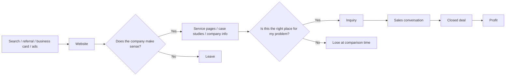

> This article answers a question that comes up often in real projects: do business websites actually matter, and if so, how do they turn into profit?  
> The short answer is that a website is not just a brochure. It is a sales foundation that helps people find you, understand what you do, and move toward an inquiry.

Website conversations often drift into design first.  
But in practice, design alone is not the real issue.

After a name is exchanged, after a referral is made, or after someone finds you through search, the next step is usually a website check.  
If that site leaves people wondering,

- what kind of company this is
- what they can actually request
- whether their own problem fits
- why they should contact you now

then opportunities slip away before a sales conversation even starts.

When the homepage, service pages, company information, and contact flow are organized well, the interest created by sales, ads, or referrals has a much better chance of becoming a real conversation.  
That is where the profit connection comes from: fewer leaks in the path from attention to inquiry.

This article is written against the public Google Search Central and Google Ads guidance available as of March 2026. [^search-essentials][^links][^ads-groups]

## 1. The short answer

If we make the answer practical, it looks like this:

1. **A business website is a sales foundation, not a brochure**
2. **It helps increase revenue and reduce avoidable costs at the same time**
3. **The first pages to organize are the homepage, service pages, company information, and contact flow**
4. **Sites that can handle both search traffic and referrals usually connect to profit more reliably**

The reason to build a website is not "because every company has one."  
The more practical reason is to avoid losing business opportunities.

Business cards, referrals, social media, paid search, organic search, trade shows, comparison sites: the entry points vary, but many people still check the company website afterward.

At that moment, the site needs three things more than it needs visual flair:

- it must be clear who the company is for and what it does
- it must lead people to the page that matches their problem
- it must make inquiry feel safe and worthwhile

When those pieces are in place, the website stops being a static signboard and becomes a real entry point for consultation.

## 2. How a website turns into profit

There are two main paths from website to profit:

1. **Increase revenue**
2. **Reduce cost**

The site does not generate profit by itself.  
What it does do is reduce friction across the path from search, comparison, inquiry, and sales to closed business.

### 2.1 The revenue path

On the revenue side, the site usually helps in these ways:

- more people arrive from search or ads
- fewer people leave the homepage immediately
- service pages increase inquiry rate
- case studies and company information improve close rate
- a clearer scope reduces price mismatch

The biggest gains often come not from raw inquiry volume, but from **lead quality, sales conversation rate, and close rate**.  
If the website is weak, interested visitors stop before they inquire.  
If the page roles are clear, a casual browser is more likely to become someone who is willing to talk.

### 2.2 The cost-reduction path

Profit is not only about revenue. Cost matters too.

When the website is organized well, it can reduce:

- repetitive explanation in sales calls
- time spent on inquiries that were never a fit
- rework caused by unclear scope
- wasted ad spend caused by weak landing pages
- the high acquisition cost that comes from depending only on branded search

As articles and key pages accumulate, the site also becomes a long-term search asset.  
If you need quick impact, Google Ads can help. If you want an asset that keeps working six months later, SEO matters. If you want both, running them in parallel is often the most natural approach.

### 2.3 A simple profit mapping

| Website function | Metric that tends to improve | Profit impact |
| --- | --- | --- |
| Explain what the company does on the homepage | Lower bounce rate, more key-page visits | Fewer missed opportunities |
| Clarify scope on service pages | Inquiry rate, sales conversation rate | More closed business |
| Reinforce trust with case studies and company info | Close rate, comparison win rate | Better margin protection |
| Grow search traffic with content and SEO | Non-branded traffic, acquisition cost | Less dependence on ads |
| Improve the contact page | Form completion rate | Fewer lost leads |
| Add FAQ and pre-qualification content | Sales effort, estimate effort | Lower overhead |

In short, websites contribute to profit by **creating more useful entry points and reducing avoidable waste**.

## 3. Five reasons a company should have a website

### 3.1 It tells people who you are in one pass

When a company site fails to communicate, the problem is usually not a lack of information. It is usually **a lack of structure**.

If the homepage tries to carry business overview, company history, achievements, recruiting, and news all at once, the reader still cannot tell what the company actually does.  
The website should not just store information. It should create the order in which the reader understands that information.

### 3.2 It becomes the landing area for search, ads, and referrals

If there is no website, or if the important pages are weak, search and ads also struggle.

Google's guidance recommends using the words people actually use in prominent places like the title and main heading, and connecting important pages through crawlable links. [^search-essentials][^links]

Ads work the same way.  
Running ads without a landing page that explains the offer clearly is just paying to create confusion.

### 3.3 It reduces drop-off during comparison

Even when the lead comes from a referral, people almost always inspect the website.  
What they compare is more than appearance:

- is the scope clear?
- are there case studies or examples?
- can I see who is behind the company?
- is there enough reassurance before contacting them?

When those answers are easy to find, the site holds up better during comparison.  
When they are missing, even a good referral can fail to become a deal.

### 3.4 It lowers the cost of explanation

If the website is structured well, sales and meetings do not need to start from zero every time.

When the page already explains:

- which kind of customer is a fit
- what the company handles
- how the work usually proceeds
- what the deliverables look like

the first conversation can start as a real consultation instead of a general company introduction.

### 3.5 It improves inquiry quality

A website is not only for getting more inquiries.  
It also helps **shape better inquiries**.

If the site explains fit, non-fit, common requests, and what information to prepare, it reduces mismatched leads.  
That saves sales time, estimation time, and back-and-forth that does not move the business forward.

## 4. What weak profit-contributing websites usually have in common

When a website is not helping profit, the cause is often one of these:

- the homepage copy is too abstract to explain the company
- there is no clear service page, so everything is crammed together
- trust signals such as case studies or company details are thin
- the contact page does not explain what to ask for
- articles exist, but there is no path back to the service pages
- measurement is weak across Search Console, GA4, or Google Ads

Even when the design looks polished, weak flows do not convert.  
For B2B and technical companies especially, the core problem is often not visuals. It is the difficulty of explaining the business clearly.

## 5. Where to start if you want a small site first

You do not need a large site on day one.  
In many cases, a small number of important pages does more work than a large but blurry site.

The minimum starting set is:

1. **Homepage**  
   Say briefly who the company serves and what it does

2. **Main service pages**  
   Make it clear what can be requested and who the service is for

3. **Company information page**  
   Show who is actually responsible for the work

4. **Case study or portfolio page**  
   Show how similar problems were handled

5. **Contact page**  
   Explain what to write and what happens after submission

Once that foundation exists, content and SEO can be added in a way that supports the sales flow instead of distracting from it.  
If you need leads quickly, ads can help. If you want a lower long-term acquisition cost, content and key pages become the asset.

## 6. Why the effect is stronger for technical B2B companies

The gap tends to be larger for technical B2B companies because the services are more complex.

- similar-looking services may actually be different projects
- the decision maker and the operator are often not the same person
- a one-line explanation is rarely enough
- the comparison period is usually longer

For this kind of business, a homepage cannot say everything.  
It works better when each page has a clear role:

- the homepage gives the overall picture
- service pages act as the entry point for specific consultations
- case studies provide comparison material
- company information builds confidence
- the contact page nudges people to take the next step

That structure is especially valuable when the company offers something that is hard to explain to a general-purpose agency in one short call.

## 7. Quick checks you can use right away

When you review the site, the following order is usually the easiest:

- can the H1 on the homepage say what the company does in one sentence?
- does the opening of the service page make it clear what kind of inquiry is welcome?
- does the company information page explain who does the work and what they are good at?
- does the contact page make it clear what people should ask for?
- does the blog link back to service pages naturally?

When those five items are in place, the site starts to feel less like a brochure and more like a consultation entry point.

## 8. Summary

A company website is not just a company brochure.  
It is a sales foundation that helps people find you, understand you, and start a conversation.

The profit link is simple:

- increase the number of useful entry points
- reduce avoidable waste in sales and marketing

So when you build or redesign a website, the key is not only making it look better.  
The key is making sure it explains what the company does, what it can handle, and how people can move into a contact flow naturally.

If you start by reviewing the homepage, the main service pages, and the contact page, the path to profit usually becomes much clearer.

## Related articles

- [Why a Technical Company Website Fails to Communicate What the Company Does]()
- [What to Fix First on a Site That Gets No Inquiries]()
- [How to Build a Service Page for Technical B2B]()
- [How to Connect Articles and Service Pages with Internal Links]()

## References

[^search-essentials]: Google Search Central, [Search Essentials](https://developers.google.com/search/docs/essentials)
[^links]: Google Search Central, [Link best practices for Google](https://developers.google.com/search/docs/crawling-indexing/links-crawlable)
[^ads-groups]: Google Ads Help, [How ad groups work](https://support.google.com/google-ads/answer/2375404?hl=en)
