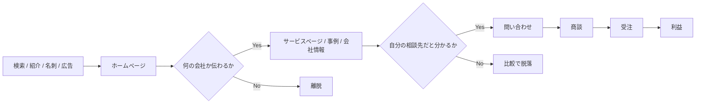

> この記事は、「企業のホームページは本当に必要なのか」「作っても利益につながるのか」という疑問を整理するものです。  
> 先に結論を言うと、ホームページは単なる会社案内ではなく、**見つけてもらう、何の会社かを伝える、相談につなげる**ための営業基盤です。

ホームページの話になると、見た目やデザインの話だけで終わりやすいです。  
でも実際には、それだけではありません。

営業で会社名を伝えたあと、紹介を受けたあと、検索で見つけてもらったあと、相手はかなり高い確率でホームページを見ます。  
そのときに、

- 何の会社か分からない
- 何を頼めるか分からない
- 自分の相談内容に近いページがない
- 問い合わせる理由が弱い

という状態だと、商談の手前で機会が落ちます。

逆に、トップページ、サービスページ、会社情報、問い合わせ導線が整理されていると、営業や広告や紹介で生まれた関心を、相談まで運びやすくなります。  
ホームページが利益につながるのは、この**取りこぼしを減らす働き**が大きいからです。

この記事では、2026 年 3 月時点で確認できる Google Search Central と Google Ads の公開情報を前提に、企業のホームページがどう利益につながるかを実務目線で整理します。[^search-essentials][^links][^ads-groups]

## 1. まず結論

かなり雑に、でも実務で使いやすい言い方をすると、こうです。

1. **ホームページは会社案内ではなく営業の土台です**
2. **売上を増やすだけでなく、営業や集客の無駄も減らします**
3. **まずはトップ、サービスページ、会社情報、問い合わせ導線を分けて考えます**
4. **検索と紹介の両方を受け止められる構成にすると、利益へつながりやすくなります**

ホームページを作るべき理由は、「今どきあるのが当たり前だから」ではありません。  
もっと実務的に言うと、**営業機会を漏らさないため**です。

名刺交換、紹介、SNS、検索広告、自然検索、展示会、比較サイト。  
入り口は色々ありますが、多くの人はそのあとに企業サイトを見て確認します。

その確認の場で必要なのは、派手さよりも次の 3 点です。

- 誰向けの何の会社かが分かる
- 自分の相談内容に近いページへ進める
- 安心して問い合わせできる

この 3 つが揃うと、ホームページは「あるだけの看板」ではなく「相談の入口」に変わります。

## 2. ホームページがどう利益につながるのか

ホームページが利益につながる経路は、大きく 2 つです。

1. **売上を増やす**
2. **コストを下げる**

ホームページそのものが自動で利益を生むわけではありません。  
ただし、検索、比較検討、問い合わせ、商談、受注の流れの中で摩擦を減らすことで、利益にかなり効きます。

### 2.1 売上を増やす経路

売上側では、主に次の流れで効きます。

- 検索や広告からの流入が増える
- トップページで離脱しにくくなる
- サービスページで問い合わせ率が上がる
- 事例や会社情報で受注率が上がる
- 対応範囲が伝わることで単価のズレが減る

特に大きいのは、**問い合わせ数**よりも**商談化率**と**受注率**です。  
ホームページが弱いと、興味を持った人が問い合わせ前に止まります。  
逆に、ページの役割が整理されていると、「とりあえず見る」人が「相談してみる」人に変わりやすくなります。

### 2.2 コストを下げる経路

利益を見るときは、売上だけでなくコスト側も重要です。

ホームページが整っていると、次のような無駄を減らせます。

- 毎回同じ説明を繰り返す営業工数
- 向いていない問い合わせへの対応工数
- 内容が伝わらないことで発生する見積のやり直し
- LP や広告の質が弱いために起きる広告費の無駄
- 指名検索以外から見つからないことによる獲得コストの高さ

記事や重要ページが蓄積していけば、検索流入の土台にもなります。  
即効性が必要なら Google 広告、半年後も効く資産を作りたいなら SEO、両方を取りたいなら並行運用、という考え方が自然です。

### 2.3 利益とのつながりを表にするとこうなります

| ホームページの機能 | 改善しやすい指標 | 利益へのつながり |
| --- | --- | --- |
| トップページで何の会社かを伝える | 直帰の減少、重要ページ到達率 | 機会損失を減らす |
| サービスページで対応範囲を明確にする | 問い合わせ率、商談化率 | 受注数が増える |
| 事例・会社情報で信頼を補強する | 受注率、比較検討の勝率 | 粗利を守りやすくなる |
| 記事・SEOで検索流入を増やす | 指名以外の流入、獲得単価 | 広告依存を下げやすい |
| 問い合わせページを整える | フォーム送信率 | 取りこぼしを減らす |
| FAQ や事前説明を置く | 営業工数、見積工数 | 販管費を下げやすい |

要するに、ホームページが利益につながるのは、**売上の入り口を増やし、同時に無駄なコストを減らせるから**です。

## 3. 企業がホームページを作るべき5つの理由

### 3.1 何の会社かを一言で伝えられる

企業の強みがそのまま伝わらない最大の原因は、情報不足よりも**整理不足**です。

トップページに事業内容、会社紹介、実績、採用、お知らせを全部詰め込むと、結局「何の会社か」がぼやけます。  
だからこそ、ホームページは単に情報を置く場所ではなく、**相手が最初に理解する順番を作る場所**として必要です。

### 3.2 検索・広告・紹介の受け皿になる

ホームページがない、または重要ページが弱い状態だと、検索や広告の効果も伸びにくくなります。

Google は、ユーザーが実際に使う言葉を title や main heading などの目立つ場所に置くこと、そして重要ページ同士をクロール可能なリンクでつなぐことを基本として案内しています。[^search-essentials][^links]

広告でも同じです。  
広告だけ出しても、遷移先のページで内容が伝わらなければ問い合わせにはつながりません。  
つまりホームページは、SEO と Google 広告のどちらにとっても**受け皿**です。

### 3.3 比較検討で落とされにくくなる

紹介案件でも、相手はほぼ必ずホームページを見ます。  
そのときに比較されるのは、見た目だけではありません。

- 対応範囲が明確か
- 実績や事例があるか
- 会社情報や代表情報が見えるか
- 問い合わせ前に不安が残らないか

この材料が揃っていると、比較の場で落ちにくくなります。  
逆に、紹介があるのに受注につながらない会社は、ホームページ側で安心材料を落としていることがあります。

### 3.4 営業の説明コストを下げられる

ホームページが整っていると、営業や打ち合わせのたびに最初から全部説明しなくてよくなります。

たとえば、

- どんな会社に向いているか
- 何を対応するのか
- どんな進め方か
- 何が成果物になるのか

がページに整理されていれば、相手は事前に読んだうえで相談できます。  
その結果、初回打ち合わせが「会社説明」ではなく「具体的な相談」から始めやすくなります。

### 3.5 問い合わせの質を上げられる

ホームページは、問い合わせ数を増やすためだけのものではありません。  
**問い合わせの質を上げる**役割もあります。

向いている案件、向いていない案件、よくある相談内容、必要な準備をページに書いておくと、ミスマッチな相談が減ります。  
これは売上だけでなく、営業工数や見積工数の削減にも効きます。

## 4. 利益につながりにくいホームページの共通点

ホームページを作っても利益につながりにくい場合、よくある原因は次のあたりです。

- トップページのコピーが抽象的で、何の会社か分からない
- サービスページがなく、事業説明が 1 ページに混ざっている
- 事例、会社情報、代表情報などの判断材料が弱い
- 問い合わせページで何を相談してよいか分からない
- 記事はあるが、サービスページへ戻る導線がない
- Search Console、GA4、Google 広告などの計測が弱い

見た目が整っていても、導線が弱ければ利益にはつながりません。  
特に B2B や技術系の会社では、**説明が難しいこと自体**が課題なので、デザインより先にページの役割整理が必要になることが多いです。

## 5. 小さく始めるならどこから作るか

最初から大規模サイトを作る必要はありません。  
むしろ、重要なページを少数でしっかり作るほうが効果が出やすいです。

最低限の出発点は、次の 5 つです。

1. **トップページ**  
   誰向けの何の会社かを短く伝える

2. **主要サービスページ**  
   何を頼めるか、どんな会社に向いているかを明確にする

3. **会社情報ページ**  
   どこの誰が対応するかを見せる

4. **事例または実績ページ**  
   似た相談にどう対応したかを見せる

5. **問い合わせページ**  
   何を書けばよいか、送ったあとどうなるかを明確にする

この順で土台を作ってから、必要に応じて記事や SEO を追加するほうが自然です。  
問い合わせが早く欲しいなら広告を併用し、長期の獲得単価を下げたいなら記事や重要ページを資産化していく、という考え方が分かりやすいです。

## 6. 技術系・B2B企業ほど効果が大きい理由

技術系・B2B の会社ほど、ホームページの差が大きく出ます。

理由は単純で、サービス内容が複雑だからです。

- 似て見えるが実際には別の相談が多い
- 決裁者と実務担当者が別である
- その場の一言では説明しきれない
- 比較検討の期間が長い

このタイプの会社では、トップページだけで全部を言い切るのは難しいです。  
だからこそ、

- トップページは全体像
- サービスページは相談入口
- 事例は比較材料
- 会社情報は安心材料
- 問い合わせページは送信の後押し

と役割を分けると、かなり伝わりやすくなります。

特に「説明が複雑で、一般的な制作会社にうまく伝えにくい」会社ほど、ホームページの構成整理そのものが価値になります。

## 7. すぐに直せるチェックポイント

実際に見直すときは、次の順で見ると整理しやすいです。

- トップページの H1 で、何をしている会社かが一文で分かるか
- サービスページの冒頭で、相談できる内容が明確か
- 会社情報ページで、誰が何を得意としているかが伝わるか
- 問い合わせページで、どんな相談をしてよいかが分かるか
- ブログからサービスページへ、自然に戻れるか

この 5 点が揃うと、ホームページは「きれいな会社案内」から「相談の入口」に変わります。

## 8. まとめ

企業のホームページは、単なる会社案内ではありません。  
**見つけてもらい、理解してもらい、相談してもらうための営業基盤**です。

利益とのつながりを一言で言うなら、次の 2 つです。

- 売上の入り口を増やす
- 営業や集客の無駄を減らす

そのため、ホームページを作るときに一番大事なのは「見た目を整えること」だけではありません。  
**何の会社かが伝わること、何を頼めるかが分かること、問い合わせまでの流れが自然であること**の 3 点です。

まずは、トップページ、主要サービスページ、問い合わせページの 3 つから見直すだけでも、利益へのつながり方はかなり変わります。

## 関連記事

- [技術系企業のホームページで「何をしている会社か」が伝わらない理由]()
- [問い合わせが来ないサイトで、先に直すべき3つの場所]()
- [サービスページをどう作るか - 技術系・B2B向けの整理手順]()
- [記事とサービスページをどうつなぐか - 内部リンク設計の基本]()

## 参考資料

[^search-essentials]: Google Search Central, [Search Essentials](https://developers.google.com/search/docs/essentials)
[^links]: Google Search Central, [Link best practices for Google](https://developers.google.com/search/docs/crawling-indexing/links-crawlable)
[^ads-groups]: Google Ads Help, [How ad groups work](https://support.google.com/google-ads/answer/2375404?hl=en)
