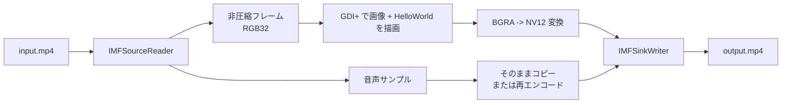

# Media Foundation で MP4 動画の各フレームに画像と文字を焼き込む方法 - Source Reader / 描画 / 色変換 / Sink Writer の整理と .cpp にそのまま貼れる 1 ファイル完結版

2026年03月16日 10:00 · 小村 豪 · Media Foundation, C++, Windows開発, GDI+, Direct2D, DirectWrite, H.264

ロゴ透かし、検査結果、装置番号、作業者名、タイムスタンプ。  
こうした情報を **MP4 動画の全フレームへ焼き込んだ新しい MP4 を作りたい**、という要件は監視、検査、証跡、分析 UI ではかなり普通にあります。

ただ、Media Foundation を触り始めると `IMFSourceReader`、`IMFSample`、`IMFMediaBuffer`、`IMFTransform`、`IMFSinkWriter` が並び、**結局どこで文字や PNG を重ねればよいのか** が急に見えにくくなります。

この記事では、まず **`Source Reader -> 描画 -> 色変換 -> Sink Writer`** という全体像を整理し、そのあとで **Visual Studio の C++ コンソールアプリにそのまま貼れる 1 ファイル完結サンプル** を載せます。  
サンプルは、指定した MP4 を読み、指定した画像と `HelloWorld` を各フレームに描き込み、出力 MP4 を作る構成です。

なお、このサンプルは **まずそのまま貼って動かすこと** を優先して、**映像だけを再エンコードする構成** にしています。  
音声 remux まで 1 本に詰め込むこともできますが、記事の主題は「各フレームに画像と文字を焼き込むこと」なので、まずはそこに絞ります。

## 1. まず結論

- MP4 の各フレームに画像や文字を入れる基本形は、**`Source Reader でデコード -> 非圧縮フレームに合成 -> 必要なら色変換 -> Sink Writer で再エンコード`** です。
- **画像や文字を置く処理そのものは Media Foundation の仕事ではありません。** ここは `GDI+`、`Direct2D`、`DirectWrite`、`WIC` などの描画 API で考えるほうが素直です。
- `MP4(H.264)` に戻すなら、描きやすい `RGB32 / ARGB32` と、エンコーダーが受けやすい `NV12 / I420 / YUY2` のあいだをつなぐ変換段が必要になりやすいです。
- **最初の 1 本を動かす** なら、`Source Reader -> RGB32 -> GDI+ で描画 -> NV12 -> Sink Writer` という構成が分かりやすいです。
- **速度や拡張性を優先する** なら、`D3D11 / DXGI surface -> Direct2D / DirectWrite -> Video Processor MFT -> Sink Writer` へ寄せると伸びしろがあります。

## 2. この問題が少しややこしい理由

「動画に文字を入れる」は、実際には次の 4 つの話が混ざっています。

1. **コンテナとコーデックの話**  
   `mp4` はコンテナであって、フレームそのものではありません。中身はたいてい `H.264` や `H.265` の圧縮データです。

2. **デコード / エンコードの話**  
   圧縮済みのままでは、普通の 2D 描画 API で文字や PNG をそのまま載せられません。まず非圧縮フレームに戻す必要があります。

3. **描画の話**  
   文字、ロゴ、PNG の透明合成、アンチエイリアス付きのテキスト描画は、Media Foundation 本体の役割ではありません。ここは `GDI+` や `Direct2D / DirectWrite / WIC` の仕事です。

4. **色空間とピクセル形式の話**  
   描画しやすい形式と、エンコーダーが好む形式は一致しません。ここが地味に詰まりやすいところです。

雑に 1 行で言うと、**「Media Foundation で文字を入れる」ではなく、「Media Foundation でフレームを回し、描画 API で載せ、必要な色変換を入れてからエンコードする」** と考えるのがいちばん整理しやすいです。

## 3. まず見る整理表

| 方針 | 構成 | 向いている場面 | 気をつける点 |
|---|---|---|---|
| まず正しく動かす | `Source Reader -> RGB32 -> 合成 -> NV12 -> Sink Writer` | バッチ処理、社内ツール、初期実装 | CPU 側のコピーや変換が増えやすい |
| 速度を上げる | `D3D11 / DXGI surface -> Direct2D / DirectWrite -> Video Processor MFT -> Sink Writer` | 長尺動画、高解像度、大量処理 | D3D11 と DXGI の管理が増える |
| 再利用できる部品にする | custom `MFT` として実装して topology に差し込む | 複数アプリで使うエフェクト、MF パイプラインへ組み込みたい場合 | 実装、登録、デバッグの難度が上がる |

この記事のサンプルは、まずいちばん上の **「まず正しく動かす」構成** に絞っています。

### 3.1 処理イメージ



ここで大事なのは、**描画そのものは Media Foundation の仕事ではない** ことです。  
Media Foundation はフレームを出し入れする担当で、画像と文字を載せるのは描画 API に任せます。

## 4. パイプラインをどう分けて考えるか

### 4.1 入力は `IMFSourceReader` で受ける

入力がファイルパスなら `MFCreateSourceReaderFromURL`、メモリ上の動画データなら `IMFByteStream` を作って `MFCreateSourceReaderFromByteStream` を使う構成が分かりやすいです。

ここで最初に決めるべきなのは、**描画しやすい形式で受けるか、エンコーダー向けの形式で受けるか** です。

- 実装を簡単にしたいなら `RGB32` または `ARGB32`
- エンコード効率を優先するなら `NV12` などの YUV

ただし、**文字や PNG の合成は RGB 系のほうが圧倒的に考えやすい** ので、初手は `RGB32 / ARGB32` を受ける構成がかなり扱いやすいです。

`MF_SOURCE_READER_ENABLE_VIDEO_PROCESSING` を有効にすると、`Source Reader` は `YUV -> RGB32` 変換とインターレース解除をしてくれます。  
これは「まずフレームを取り出して扱いたい」段階では便利ですが、長い動画や高解像度動画では重くなりやすいので、本番で速度が必要なら後で構成を見直す価値があります。

### 4.2 画像や文字の合成は `GDI+` か `Direct2D / DirectWrite` で考える

Media Foundation で受け取った `IMFSample` からバッファーを取り出し、その上にロゴ画像やテキストを載せます。

今回のサンプルは **1 ファイル完結で貼りやすいこと** を優先して、描画に `GDI+` を使っています。

- 画像読み込みができる
- 文字描画ができる
- 追加の準備が比較的少ない
- コンソールアプリの `.cpp` 1 本に収めやすい

一方で、長尺動画や 4K を大量処理する用途では、`D3D11 + Direct2D + DirectWrite` のほうが伸びしろがあります。  
最初の実装では `GDI+`、速度を詰める段階で `Direct2D / DirectWrite` へ移る、という流れはかなり自然です。

### 4.3 `RGB32` のまま `H.264` へ書けるとは限らない

ここがいちばん詰まりやすいところです。

`MP4(H.264)` に戻すとき、Microsoft の H.264 エンコーダーは **`I420 / IYUV / NV12 / YUY2 / YV12` などの YUV 系入力** を前提にすることが多いです。  
つまり、**描きやすい `RGB32 / ARGB32` で合成したあと、そのまま `IMFSinkWriter` に投げれば終わり** とは限りません。

そのため、実装では次のどちらかが必要になります。

- `Video Processor MFT` を挟んで `RGB32 / ARGB32 -> NV12`
- 自前で `RGB -> NV12` 変換を入れる

今回のサンプルは **1 ファイル完結** を優先して、後者の **自前変換** を入れています。  
本番では、色空間変換、サイズ変更、インターレース解除までまとめて扱える `Video Processor MFT` を挟む構成もかなり有力です。

### 4.4 出力は `IMFSinkWriter` で書く

動画出力は `IMFSinkWriter` が扱いやすいです。

考え方は単純で、

- **出力ストリーム型** … ファイルに書きたい形式  
  例: `MFVideoFormat_H264`
- **入力ストリーム型** … アプリが `Sink Writer` に渡す形式  
  例: `MFVideoFormat_NV12`

を分けて設定します。

つまり `Sink Writer` から見ると、

- アプリ側は `NV12` の非圧縮フレームを渡す
- `Sink Writer` はそれを H.264 にエンコードして MP4 に書く

という関係になります。

### 4.5 音声は最初は分けて考えると整理しやすい

動画にロゴや文字を入れたいだけで、音声そのものは変えたくない、ということはかなり多いです。

実務では、

- 映像 stream だけ `Source Reader -> 合成 -> Sink Writer`
- 音声 stream は compressed のまま remux

という構成がかなり使いやすいです。

ただし、今回のサンプルは **フレームに画像と文字を焼き込むところ** に焦点を合わせるため、**出力は映像のみの MP4** にしています。  
音声を残す版は、このあと拡張する段階で足すほうが全体を追いやすくなります。

## 5. このサンプルの前提と使い方

このコードは、次の前提で書いています。

- Windows 10 / 11
- Visual Studio 2022 の C++ コンソールアプリ
- `x64` ビルド
- この `.cpp` ファイルは **プリコンパイル済みヘッダーを使わない**
- 入力動画の幅と高さは偶数
- 入力は普通の MP4 動画ファイル
- 出力は **映像のみの MP4**
- 画像は PNG / JPEG / BMP / GIF など、GDI+ が読める形式

`NV12` は 4:2:0 なので、**幅・高さが偶数** である必要があります。  
そのため、このサンプルでは条件を満たさない場合は明示的にエラーにしています。

### 5.1 使い方

1. Visual Studio で **Console App** を作る
2. この `.cpp` を丸ごと貼る
3. その `.cpp` の **プリコンパイル済みヘッダーを「使用しない」** にする
4. `x64` でビルドする
5. 次のように実行する

```bat
OverlayMp4.exe input.mp4 overlay.png output.mp4
```

- `input.mp4`  
  元動画
- `overlay.png`  
  重ねたい画像
- `output.mp4`  
  出力先

文字列はコード先頭の `kOverlayText` に固定で `HelloWorld` を入れています。  
位置や大きさもコード内の定数を触れば変えられます。

## 6. `.cpp` にそのまま貼れる 1 ファイル完結コード

```cpp
#define NOMINMAX
#include <windows.h>
#include <mfapi.h>
#include <mfidl.h>
#include <mfreadwrite.h>
#include <mferror.h>
#include <gdiplus.h>
#include <wrl/client.h>

#include <algorithm>
#include <cstdio>
#include <cstdlib>
#include <cstring>
#include <cwchar>
#include <iostream>
#include <stdexcept>
#include <string>
#include <vector>

#pragma comment(lib, "mfplat.lib")
#pragma comment(lib, "mfreadwrite.lib")
#pragma comment(lib, "mfuuid.lib")
#pragma comment(lib, "mf.lib")
#pragma comment(lib, "gdiplus.lib")

using Microsoft::WRL::ComPtr;

namespace
{
    const wchar_t* kOverlayText = L"HelloWorld";
    const float kMarginRatio = 0.03f;
    const float kImageMaxWidthRatio = 0.20f;
    const float kImageMaxHeightRatio = 0.20f;
    const float kMinFontPx = 24.0f;

    std::string HrToHex(HRESULT hr)
    {
        char buf[32]{};
        std::snprintf(buf, sizeof(buf), "0x%08X", static_cast<unsigned int>(hr));
        return std::string(buf);
    }

    void ThrowIfFailed(HRESULT hr, const char* message)
    {
        if (FAILED(hr))
        {
            throw std::runtime_error(std::string(message) + " failed. HRESULT=" + HrToHex(hr));
        }
    }

    void ThrowIfGdiplusError(Gdiplus::Status status, const char* message)
    {
        if (status != Gdiplus::Ok)
        {
            char buf[128]{};
            std::snprintf(buf, sizeof(buf), "%s failed. GDI+ status=%d", message, static_cast<int>(status));
            throw std::runtime_error(buf);
        }
    }

    BYTE ClampToByte(int value)
    {
        if (value < 0) return 0;
        if (value > 255) return 255;
        return static_cast<BYTE>(value);
    }

    class ScopedGdiplus
    {
    public:
        ScopedGdiplus()
        {
            Gdiplus::GdiplusStartupInput input;
            ThrowIfGdiplusError(Gdiplus::GdiplusStartup(&token_, &input, nullptr), "GdiplusStartup");
        }

        ~ScopedGdiplus()
        {
            if (token_ != 0)
            {
                Gdiplus::GdiplusShutdown(token_);
            }
        }

    private:
        ULONG_PTR token_ = 0;
    };

    class ScopedMf
    {
    public:
        ScopedMf()
        {
            ThrowIfFailed(CoInitializeEx(nullptr, COINIT_MULTITHREADED), "CoInitializeEx");
            comInitialized_ = true;

            ThrowIfFailed(MFStartup(MF_VERSION), "MFStartup");
            mfStarted_ = true;
        }

        ~ScopedMf()
        {
            if (mfStarted_)
            {
                MFShutdown();
            }

            if (comInitialized_)
            {
                CoUninitialize();
            }
        }

    private:
        bool comInitialized_ = false;
        bool mfStarted_ = false;
    };

    class BufferLock
    {
    public:
        explicit BufferLock(IMFMediaBuffer* buffer)
            : buffer_(buffer)
        {
            if (!buffer_)
            {
                throw std::runtime_error("BufferLock received a null buffer.");
            }

            buffer_.As(&buffer2D_);
        }

        HRESULT LockBuffer(LONG defaultStride, DWORD heightInPixels, BYTE** scanline0, LONG* actualStride)
        {
            if (scanline0 == nullptr || actualStride == nullptr)
            {
                return E_POINTER;
            }

            HRESULT hr = S_OK;

            if (buffer2D_)
            {
                hr = buffer2D_->Lock2D(scanline0, actualStride);
            }
            else
            {
                BYTE* data = nullptr;
                hr = buffer_->Lock(&data, nullptr, nullptr);
                if (SUCCEEDED(hr))
                {
                    *actualStride = defaultStride;
                    if (defaultStride < 0)
                    {
                        *scanline0 = data + (static_cast<LONG>(heightInPixels) - 1) * std::abs(defaultStride);
                    }
                    else
                    {
                        *scanline0 = data;
                    }
                }
            }

            locked_ = SUCCEEDED(hr);
            return hr;
        }

        ~BufferLock()
        {
            if (!locked_)
            {
                return;
            }

            if (buffer2D_)
            {
                buffer2D_->Unlock2D();
            }
            else
            {
                buffer_->Unlock();
            }
        }

    private:
        ComPtr<IMFMediaBuffer> buffer_;
        ComPtr<IMF2DBuffer> buffer2D_;
        bool locked_ = false;
    };

    struct VideoFormatInfo
    {
        UINT32 width = 0;
        UINT32 height = 0;
        UINT32 fpsNum = 0;
        UINT32 fpsDen = 0;
        UINT32 parNum = 1;
        UINT32 parDen = 1;
        LONG sourceStride = 0;
        LONGLONG defaultFrameDuration = 0;
        UINT32 bitrate = 0;
    };

    LONG GetDefaultStride(IMFMediaType* type)
    {
        LONG stride = 0;

        HRESULT hr = type->GetUINT32(MF_MT_DEFAULT_STRIDE, reinterpret_cast<UINT32*>(&stride));
        if (SUCCEEDED(hr))
        {
            return stride;
        }

        GUID subtype = GUID_NULL;
        UINT32 width = 0;
        UINT32 height = 0;

        ThrowIfFailed(type->GetGUID(MF_MT_SUBTYPE, &subtype), "GetGUID(MF_MT_SUBTYPE)");
        ThrowIfFailed(MFGetAttributeSize(type, MF_MT_FRAME_SIZE, &width, &height), "MFGetAttributeSize(MF_MT_FRAME_SIZE)");
        ThrowIfFailed(MFGetStrideForBitmapInfoHeader(subtype.Data1, width, &stride), "MFGetStrideForBitmapInfoHeader");
        ThrowIfFailed(type->SetUINT32(MF_MT_DEFAULT_STRIDE, static_cast<UINT32>(stride)), "SetUINT32(MF_MT_DEFAULT_STRIDE)");

        return stride;
    }

    UINT32 ChooseBitrate(IMFMediaType* nativeType, UINT32 width, UINT32 height, UINT32 fpsNum, UINT32 fpsDen)
    {
        UINT32 srcBitrate = 0;
        if (SUCCEEDED(nativeType->GetUINT32(MF_MT_AVG_BITRATE, &srcBitrate)) && srcBitrate > 0)
        {
            return srcBitrate;
        }

        const double fps = static_cast<double>(fpsNum) / static_cast<double>(fpsDen);
        double estimated = static_cast<double>(width) * static_cast<double>(height) * fps * 0.07;

        if (estimated < 1500000.0)
        {
            estimated = 1500000.0;
        }

        if (estimated > 25000000.0)
        {
            estimated = 25000000.0;
        }

        return static_cast<UINT32>(estimated);
    }

    VideoFormatInfo ConfigureSourceReader(IMFSourceReader* reader)
    {
        ThrowIfFailed(reader->SetStreamSelection(MF_SOURCE_READER_ALL_STREAMS, FALSE), "SetStreamSelection(all,false)");
        ThrowIfFailed(reader->SetStreamSelection(MF_SOURCE_READER_FIRST_VIDEO_STREAM, TRUE), "SetStreamSelection(video,true)");

        ComPtr<IMFMediaType> nativeType;
        ThrowIfFailed(reader->GetNativeMediaType(MF_SOURCE_READER_FIRST_VIDEO_STREAM, 0, &nativeType), "GetNativeMediaType(video)");

        ComPtr<IMFMediaType> requestedType;
        ThrowIfFailed(MFCreateMediaType(&requestedType), "MFCreateMediaType(video requested)");
        ThrowIfFailed(requestedType->SetGUID(MF_MT_MAJOR_TYPE, MFMediaType_Video), "SetGUID(video requested major)");
        ThrowIfFailed(requestedType->SetGUID(MF_MT_SUBTYPE, MFVideoFormat_RGB32), "SetGUID(video requested subtype RGB32)");
        ThrowIfFailed(reader->SetCurrentMediaType(MF_SOURCE_READER_FIRST_VIDEO_STREAM, nullptr, requestedType.Get()), "SetCurrentMediaType(video RGB32)");

        ComPtr<IMFMediaType> currentType;
        ThrowIfFailed(reader->GetCurrentMediaType(MF_SOURCE_READER_FIRST_VIDEO_STREAM, &currentType), "GetCurrentMediaType(video)");

        VideoFormatInfo info;
        ThrowIfFailed(MFGetAttributeSize(currentType.Get(), MF_MT_FRAME_SIZE, &info.width, &info.height), "Get video frame size");

        HRESULT hr = MFGetAttributeRatio(currentType.Get(), MF_MT_FRAME_RATE, &info.fpsNum, &info.fpsDen);
        if (FAILED(hr))
        {
            ThrowIfFailed(MFGetAttributeRatio(nativeType.Get(), MF_MT_FRAME_RATE, &info.fpsNum, &info.fpsDen), "Get video frame rate");
        }

        if (info.fpsNum == 0 || info.fpsDen == 0)
        {
            throw std::runtime_error("Video frame rate is zero.");
        }

        hr = MFGetAttributeRatio(currentType.Get(), MF_MT_PIXEL_ASPECT_RATIO, &info.parNum, &info.parDen);
        if (FAILED(hr) || info.parNum == 0 || info.parDen == 0)
        {
            info.parNum = 1;
            info.parDen = 1;
        }

        info.sourceStride = GetDefaultStride(currentType.Get());
        info.defaultFrameDuration = (10000000LL * info.fpsDen) / info.fpsNum;
        if (info.defaultFrameDuration <= 0)
        {
            throw std::runtime_error("Calculated frame duration is invalid.");
        }

        info.bitrate = ChooseBitrate(nativeType.Get(), info.width, info.height, info.fpsNum, info.fpsDen);
        return info;
    }

    ComPtr<IMFSinkWriter> CreateSinkWriter(const std::wstring& outputPath, const VideoFormatInfo& videoInfo, DWORD* streamIndex)
    {
        if (streamIndex == nullptr)
        {
            throw std::runtime_error("streamIndex is null.");
        }

        ComPtr<IMFAttributes> attributes;
        ThrowIfFailed(MFCreateAttributes(&attributes, 1), "MFCreateAttributes(sink)");
        ThrowIfFailed(attributes->SetUINT32(MF_READWRITE_ENABLE_HARDWARE_TRANSFORMS, TRUE), "SetUINT32(MF_READWRITE_ENABLE_HARDWARE_TRANSFORMS)");

        ComPtr<IMFSinkWriter> writer;
        ThrowIfFailed(MFCreateSinkWriterFromURL(outputPath.c_str(), nullptr, attributes.Get(), &writer), "MFCreateSinkWriterFromURL");

        ComPtr<IMFMediaType> outputType;
        ThrowIfFailed(MFCreateMediaType(&outputType), "MFCreateMediaType(video output)");
        ThrowIfFailed(outputType->SetGUID(MF_MT_MAJOR_TYPE, MFMediaType_Video), "SetGUID(output major)");
        ThrowIfFailed(outputType->SetGUID(MF_MT_SUBTYPE, MFVideoFormat_H264), "SetGUID(output subtype H264)");
        ThrowIfFailed(outputType->SetUINT32(MF_MT_AVG_BITRATE, videoInfo.bitrate), "SetUINT32(output bitrate)");
        ThrowIfFailed(outputType->SetUINT32(MF_MT_INTERLACE_MODE, MFVideoInterlace_Progressive), "SetUINT32(output interlace)");
        ThrowIfFailed(MFSetAttributeSize(outputType.Get(), MF_MT_FRAME_SIZE, videoInfo.width, videoInfo.height), "MFSetAttributeSize(output frame size)");
        ThrowIfFailed(MFSetAttributeRatio(outputType.Get(), MF_MT_FRAME_RATE, videoInfo.fpsNum, videoInfo.fpsDen), "MFSetAttributeRatio(output fps)");
        ThrowIfFailed(MFSetAttributeRatio(outputType.Get(), MF_MT_PIXEL_ASPECT_RATIO, videoInfo.parNum, videoInfo.parDen), "MFSetAttributeRatio(output PAR)");
        ThrowIfFailed(writer->AddStream(outputType.Get(), streamIndex), "AddStream(video)");

        ComPtr<IMFMediaType> inputType;
        ThrowIfFailed(MFCreateMediaType(&inputType), "MFCreateMediaType(video input)");
        ThrowIfFailed(inputType->SetGUID(MF_MT_MAJOR_TYPE, MFMediaType_Video), "SetGUID(input major)");
        ThrowIfFailed(inputType->SetGUID(MF_MT_SUBTYPE, MFVideoFormat_NV12), "SetGUID(input subtype NV12)");
        ThrowIfFailed(inputType->SetUINT32(MF_MT_INTERLACE_MODE, MFVideoInterlace_Progressive), "SetUINT32(input interlace)");
        ThrowIfFailed(MFSetAttributeSize(inputType.Get(), MF_MT_FRAME_SIZE, videoInfo.width, videoInfo.height), "MFSetAttributeSize(input frame size)");
        ThrowIfFailed(MFSetAttributeRatio(inputType.Get(), MF_MT_FRAME_RATE, videoInfo.fpsNum, videoInfo.fpsDen), "MFSetAttributeRatio(input fps)");
        ThrowIfFailed(MFSetAttributeRatio(inputType.Get(), MF_MT_PIXEL_ASPECT_RATIO, videoInfo.parNum, videoInfo.parDen), "MFSetAttributeRatio(input PAR)");
        ThrowIfFailed(writer->SetInputMediaType(*streamIndex, inputType.Get(), nullptr), "SetInputMediaType(video)");

        ThrowIfFailed(writer->BeginWriting(), "BeginWriting");
        return writer;
    }

    void CopySampleToTopDownBgra(IMFSample* sample, const VideoFormatInfo& videoInfo, std::vector<BYTE>& bgra)
    {
        ComPtr<IMFMediaBuffer> buffer;
        ThrowIfFailed(sample->ConvertToContiguousBuffer(&buffer), "ConvertToContiguousBuffer");

        BufferLock lock(buffer.Get());

        BYTE* scanline0 = nullptr;
        LONG actualStride = 0;
        ThrowIfFailed(lock.LockBuffer(videoInfo.sourceStride, videoInfo.height, &scanline0, &actualStride), "LockBuffer");

        const size_t dstStride = static_cast<size_t>(videoInfo.width) * 4;
        bgra.resize(dstStride * videoInfo.height);

        for (UINT32 y = 0; y < videoInfo.height; ++y)
        {
            const BYTE* srcRow = scanline0 + static_cast<LONG>(y) * actualStride;
            BYTE* dstRow = bgra.data() + static_cast<size_t>(y) * dstStride;
            std::memcpy(dstRow, srcRow, dstStride);
        }
    }

    void DrawOverlay(std::vector<BYTE>& bgra, UINT32 width, UINT32 height, Gdiplus::Image& overlayImage)
    {
        const INT stride = static_cast<INT>(width * 4);

        Gdiplus::Bitmap frameBitmap(
            static_cast<INT>(width),
            static_cast<INT>(height),
            stride,
            PixelFormat32bppRGB,
            bgra.data());
        ThrowIfGdiplusError(frameBitmap.GetLastStatus(), "Create frame bitmap");

        Gdiplus::Graphics graphics(&frameBitmap);
        ThrowIfGdiplusError(graphics.GetLastStatus(), "Create graphics");

        graphics.SetCompositingMode(Gdiplus::CompositingModeSourceOver);
        graphics.SetCompositingQuality(Gdiplus::CompositingQualityHighQuality);
        graphics.SetInterpolationMode(Gdiplus::InterpolationModeHighQualityBicubic);
        graphics.SetSmoothingMode(Gdiplus::SmoothingModeAntiAlias);
        graphics.SetTextRenderingHint(Gdiplus::TextRenderingHintAntiAliasGridFit);

        const Gdiplus::REAL margin = std::max<Gdiplus::REAL>(16.0f, static_cast<Gdiplus::REAL>(height) * kMarginRatio);
        const Gdiplus::REAL maxImageW = static_cast<Gdiplus::REAL>(width) * kImageMaxWidthRatio;
        const Gdiplus::REAL maxImageH = static_cast<Gdiplus::REAL>(height) * kImageMaxHeightRatio;

        const Gdiplus::REAL srcW = static_cast<Gdiplus::REAL>(overlayImage.GetWidth());
        const Gdiplus::REAL srcH = static_cast<Gdiplus::REAL>(overlayImage.GetHeight());
        if (srcW <= 0.0f || srcH <= 0.0f)
        {
            throw std::runtime_error("Overlay image has invalid size.");
        }

        const Gdiplus::REAL imageScale =
            std::min<Gdiplus::REAL>(1.0f, std::min(maxImageW / srcW, maxImageH / srcH));

        const Gdiplus::REAL drawW = srcW * imageScale;
        const Gdiplus::REAL drawH = srcH * imageScale;

        Gdiplus::RectF imageRect(margin, margin, drawW, drawH);
        Gdiplus::SolidBrush imagePlate(Gdiplus::Color(96, 0, 0, 0));
        graphics.FillRectangle(
            &imagePlate,
            imageRect.X - 8.0f,
            imageRect.Y - 8.0f,
            imageRect.Width + 16.0f,
            imageRect.Height + 16.0f);

        graphics.DrawImage(&overlayImage, imageRect);

        const Gdiplus::REAL fontPx =
            std::max<Gdiplus::REAL>(kMinFontPx, static_cast<Gdiplus::REAL>(height) * 0.06f);

        Gdiplus::Font font(L"Segoe UI", fontPx, Gdiplus::FontStyleBold, Gdiplus::UnitPixel);
        ThrowIfGdiplusError(font.GetLastStatus(), "Create font");

        Gdiplus::StringFormat stringFormat;
        stringFormat.SetAlignment(Gdiplus::StringAlignmentNear);
        stringFormat.SetLineAlignment(Gdiplus::StringAlignmentNear);

        Gdiplus::RectF measureLayout(
            margin,
            static_cast<Gdiplus::REAL>(height) - margin - fontPx * 2.0f,
            static_cast<Gdiplus::REAL>(width) - margin * 2.0f,
            fontPx * 2.0f);

        Gdiplus::RectF measured;
        graphics.MeasureString(kOverlayText, -1, &font, measureLayout, &stringFormat, &measured);

        Gdiplus::RectF textBg(
            measured.X - 12.0f,
            measured.Y - 8.0f,
            measured.Width + 24.0f,
            measured.Height + 16.0f);

        Gdiplus::SolidBrush textPlate(Gdiplus::Color(128, 0, 0, 0));
        graphics.FillRectangle(&textPlate, textBg);

        Gdiplus::SolidBrush shadowBrush(Gdiplus::Color(220, 0, 0, 0));
        Gdiplus::RectF shadowLayout = measureLayout;
        shadowLayout.X += 2.0f;
        shadowLayout.Y += 2.0f;
        graphics.DrawString(kOverlayText, -1, &font, shadowLayout, &stringFormat, &shadowBrush);

        Gdiplus::SolidBrush textBrush(Gdiplus::Color(235, 255, 255, 255));
        graphics.DrawString(kOverlayText, -1, &font, measureLayout, &stringFormat, &textBrush);
    }

    void BgraToNv12(const BYTE* bgra, UINT32 width, UINT32 height, BYTE* nv12)
    {
        const bool useBt709 = (width > 1024 || height > 576);

        const int yR = useBt709 ? 47 : 66;
        const int yG = useBt709 ? 157 : 129;
        const int yB = useBt709 ? 16 : 25;

        const int uR = useBt709 ? -26 : -38;
        const int uG = useBt709 ? -87 : -74;
        const int uB = 112;

        const int vR = 112;
        const int vG = useBt709 ? -102 : -94;
        const int vB = useBt709 ? -10 : -18;

        BYTE* yPlane = nv12;
        BYTE* uvPlane = nv12 + static_cast<size_t>(width) * height;

        const size_t srcStride = static_cast<size_t>(width) * 4;

        for (UINT32 y = 0; y < height; ++y)
        {
            const BYTE* srcRow = bgra + static_cast<size_t>(y) * srcStride;
            BYTE* dstY = yPlane + static_cast<size_t>(y) * width;

            for (UINT32 x = 0; x < width; ++x)
            {
                const BYTE b = srcRow[x * 4 + 0];
                const BYTE g = srcRow[x * 4 + 1];
                const BYTE r = srcRow[x * 4 + 2];

                const int Y = ((yR * r + yG * g + yB * b + 128) >> 8) + 16;
                dstY[x] = ClampToByte(Y);
            }
        }

        for (UINT32 y = 0; y < height; y += 2)
        {
            const BYTE* row0 = bgra + static_cast<size_t>(y) * srcStride;
            const BYTE* row1 = bgra + static_cast<size_t>(y + 1) * srcStride;
            BYTE* dstUV = uvPlane + static_cast<size_t>(y / 2) * width;

            for (UINT32 x = 0; x < width; x += 2)
            {
                int b = 0;
                int g = 0;
                int r = 0;

                for (UINT32 dy = 0; dy < 2; ++dy)
                {
                    const BYTE* row = (dy == 0) ? row0 : row1;
                    for (UINT32 dx = 0; dx < 2; ++dx)
                    {
                        const UINT32 ix = x + dx;
                        b += row[ix * 4 + 0];
                        g += row[ix * 4 + 1];
                        r += row[ix * 4 + 2];
                    }
                }

                b = (b + 2) / 4;
                g = (g + 2) / 4;
                r = (r + 2) / 4;

                const int U = ((uR * r + uG * g + uB * b + 128) >> 8) + 128;
                const int V = ((vR * r + vG * g + vB * b + 128) >> 8) + 128;

                dstUV[x + 0] = ClampToByte(U);
                dstUV[x + 1] = ClampToByte(V);
            }
        }
    }

    ComPtr<IMFSample> CreateNv12Sample(
        const std::vector<BYTE>& bgra,
        const VideoFormatInfo& videoInfo,
        LONGLONG sampleTime,
        LONGLONG sampleDuration)
    {
        const DWORD bufferSize =
            static_cast<DWORD>(videoInfo.width * videoInfo.height * 3 / 2);

        ComPtr<IMFMediaBuffer> buffer;
        ThrowIfFailed(MFCreateMemoryBuffer(bufferSize, &buffer), "MFCreateMemoryBuffer");

        BYTE* dst = nullptr;
        DWORD maxLength = 0;
        DWORD currentLength = 0;
        ThrowIfFailed(buffer->Lock(&dst, &maxLength, &currentLength), "Lock(NV12 buffer)");

        try
        {
            BgraToNv12(bgra.data(), videoInfo.width, videoInfo.height, dst);
        }
        catch (...)
        {
            buffer->Unlock();
            throw;
        }

        ThrowIfFailed(buffer->Unlock(), "Unlock(NV12 buffer)");
        ThrowIfFailed(buffer->SetCurrentLength(bufferSize), "SetCurrentLength(NV12 buffer)");

        ComPtr<IMFSample> sample;
        ThrowIfFailed(MFCreateSample(&sample), "MFCreateSample");
        ThrowIfFailed(sample->AddBuffer(buffer.Get()), "AddBuffer(output sample)");
        ThrowIfFailed(sample->SetSampleTime(sampleTime), "SetSampleTime");
        ThrowIfFailed(sample->SetSampleDuration(sampleDuration), "SetSampleDuration");

        return sample;
    }
}

int wmain(int argc, wchar_t* argv[])
{
    if (argc != 4)
    {
        std::wcerr << L"Usage: OverlayMp4.exe <input.mp4> <overlayImage.png> <output.mp4>" << std::endl;
        return 1;
    }

    const std::wstring inputPath = argv[1];
    const std::wstring imagePath = argv[2];
    const std::wstring outputPath = argv[3];

    try
    {
        if (_wcsicmp(inputPath.c_str(), outputPath.c_str()) == 0)
        {
            throw std::runtime_error("Input and output paths must be different.");
        }

        ScopedMf mf;
        ScopedGdiplus gdiplus;

        ComPtr<IMFAttributes> readerAttributes;
        ThrowIfFailed(MFCreateAttributes(&readerAttributes, 1), "MFCreateAttributes(reader)");
        ThrowIfFailed(
            readerAttributes->SetUINT32(MF_SOURCE_READER_ENABLE_VIDEO_PROCESSING, TRUE),
            "SetUINT32(MF_SOURCE_READER_ENABLE_VIDEO_PROCESSING)");

        ComPtr<IMFSourceReader> reader;
        ThrowIfFailed(
            MFCreateSourceReaderFromURL(inputPath.c_str(), readerAttributes.Get(), &reader),
            "MFCreateSourceReaderFromURL");

        VideoFormatInfo videoInfo = ConfigureSourceReader(reader.Get());

        if ((videoInfo.width % 2) != 0 || (videoInfo.height % 2) != 0)
        {
            throw std::runtime_error(
                "This sample requires even video width and height because NV12 is 4:2:0.");
        }

        Gdiplus::Image overlayImage(imagePath.c_str());
        ThrowIfGdiplusError(overlayImage.GetLastStatus(), "Load overlay image");

        DWORD videoStreamIndex = 0;
        ComPtr<IMFSinkWriter> writer =
            CreateSinkWriter(outputPath, videoInfo, &videoStreamIndex);

        std::vector<BYTE> bgra;
        LONGLONG firstTimestamp = -1;
        unsigned long long frameCount = 0;

        while (true)
        {
            DWORD flags = 0;
            LONGLONG timestamp = 0;
            ComPtr<IMFSample> inputSample;

            ThrowIfFailed(
                reader->ReadSample(
                    MF_SOURCE_READER_FIRST_VIDEO_STREAM,
                    0,
                    nullptr,
                    &flags,
                    &timestamp,
                    &inputSample),
                "ReadSample(video)");

            if ((flags & MF_SOURCE_READERF_CURRENTMEDIATYPECHANGED) != 0)
            {
                throw std::runtime_error("Dynamic video format change is not supported in this sample.");
            }

            if ((flags & MF_SOURCE_READERF_NATIVEMEDIATYPECHANGED) != 0)
            {
                throw std::runtime_error("Native video format change is not supported in this sample.");
            }

            if ((flags & MF_SOURCE_READERF_STREAMTICK) != 0)
            {
                if (firstTimestamp < 0)
                {
                    firstTimestamp = timestamp;
                }

                ThrowIfFailed(
                    writer->SendStreamTick(videoStreamIndex, timestamp - firstTimestamp),
                    "SendStreamTick");
            }

            if (inputSample)
            {
                if (firstTimestamp < 0)
                {
                    firstTimestamp = timestamp;
                }

                LONGLONG duration = 0;
                if (FAILED(inputSample->GetSampleDuration(&duration)) || duration <= 0)
                {
                    duration = videoInfo.defaultFrameDuration;
                }

                CopySampleToTopDownBgra(inputSample.Get(), videoInfo, bgra);
                DrawOverlay(bgra, videoInfo.width, videoInfo.height, overlayImage);

                ComPtr<IMFSample> outputSample =
                    CreateNv12Sample(bgra, videoInfo, timestamp - firstTimestamp, duration);

                ThrowIfFailed(
                    writer->WriteSample(videoStreamIndex, outputSample.Get()),
                    "WriteSample(video)");

                ++frameCount;
            }

            if ((flags & MF_SOURCE_READERF_ENDOFSTREAM) != 0)
            {
                break;
            }
        }

        ThrowIfFailed(writer->Finalize(), "Finalize");

        std::wcout
            << L"Done. frames=" << frameCount
            << L", output=" << outputPath
            << std::endl;

        return 0;
    }
    catch (const std::exception& ex)
    {
        std::cerr << ex.what() << std::endl;
        return 1;
    }
}
```

## 7. この実装を読むときに押さえておきたいポイント

### 7.1 描画しやすい形式と、エンコーダーが受けやすい形式は別

このサンプルでは、

- `Source Reader` 出力: `RGB32`
- 描画: `GDI+`
- `Sink Writer` 入力: `NV12`

という流れを取っています。

理由は単純で、**文字や PNG を載せるなら RGB 系が扱いやすく、H.264 エンコードへ渡すなら NV12 が扱いやすい** からです。

実装を読むときは、ここを **「描く段」と「エンコード前に整える段」** に分けて見ると追いやすくなります。

### 7.2 stride と上下向きを先に吸収してから描いている

動画フレームは、見た目どおりにメモリへ並んでいるとは限りません。

- stride が `width * 4` と一致しないことがある
- 上下向きが逆になっていることがある
- `IMF2DBuffer` と `IMFMediaBuffer` で扱いが少し違う

そのため、このコードではいったん **top-down の BGRA バッファーへ正規化してから描画** しています。  
ここを先にそろえておくと、描画側のコードをかなり素直にできます。

### 7.3 `ReadSample` は `HRESULT` だけでなく flags と `sample` を見る

`ReadSample` は `S_OK` でも `sample == nullptr` になることがあります。  
典型例は、

- `MF_SOURCE_READERF_STREAMTICK`
- `MF_SOURCE_READERF_ENDOFSTREAM`
- そのほかストリームイベント

です。

そのため、ループでは **`HRESULT`、`flags`、`inputSample`** の 3 つをそろえて見る必要があります。  
特に `STREAMTICK` と `ENDOFSTREAM` を見落とすと、後段のタイムライン処理が崩れやすくなります。

### 7.4 timestamp と duration は入力を引き継ぐほうが安全

タイムスタンプは 100ns 単位です。  
また、duration は別に `IMFSample` から取る必要があります。

固定 fps 前提で毎回決め打ち加算するより、**入力 sample の timestamp / duration をできるだけ引き継ぐ** ほうが崩れにくいです。  
このサンプルでも、duration が取れないときだけ `fps` から計算した既定値へフォールバックしています。

### 7.5 `GDI+` は導入が軽いが、長尺や高解像度では次の段階がある

`GDI+` は 1 ファイル完結サンプルにはかなり向いていますが、長尺動画や 4K を大量処理する用途では、`D3D11 + Direct2D + DirectWrite` のほうが有利になることがあります。

- まずは `GDI+` で全体を通す
- そのあと必要になれば `Direct2D / DirectWrite` へ置き換える
- 色変換は `Video Processor MFT` や GPU 側へ寄せる

という段階的な進め方にすると、設計を崩さずに拡張しやすくなります。

### 7.6 このサンプルは映像だけに絞っている

音声まで同じ記事に全部盛りにすると、話の軸が散りやすくなります。  
そのため、このサンプルでは **映像フレームに画像と文字を焼き込むこと** に焦点を合わせ、出力は映像のみの MP4 にしています。

実務では、次の段階として

- 映像だけ `Source Reader -> 合成 -> Sink Writer`
- 音声は compressed のまま remux

という構成へ伸ばすのが扱いやすいです。

## 8. 「与えられた動画データ」がファイルではなくメモリ上の MP4 バイト列なら

今回のコードは `MFCreateSourceReaderFromURL` を使っているので、入力はファイルパスです。

ただし、要件が「API でもらった mp4 のバイト列に対して同じことをしたい」なら、考え方は変わりません。  
変えるのは入口だけです。

- `IStream` か独自ストリームを用意する
- それを `IMFByteStream` として `Source Reader` に渡す
- 以降は同じく `RGB32 -> 描画 -> NV12 -> Sink Writer`

つまり本質は、**動画データの持ち方ではなく、デコード後の各フレームへどう描き込むか** にあります。

## 9. 本番で伸ばすなら

### 9.1 音声 remux を足す

最初の拡張先としていちばん実務的なのは、**音声をそのまま残す** ことです。  
動画だけ再エンコードし、音声は compressed のまま同一形式で書き戻す構成にすると、要件を満たしながら実装を大きく増やさずに済みます。

### 9.2 `Video Processor MFT` を挟む

今回のサンプルは 1 ファイル完結を優先して `BGRA -> NV12` を自前で変換していますが、本番では `Video Processor MFT` を挟む構成もかなり有力です。

`Video Processor MFT` を使うと、

- 色空間変換
- サイズ変更
- インターレース解除
- フレームレート変換

をまとめて扱いやすくなります。

### 9.3 `GDI+` を `Direct2D / DirectWrite` へ置き換える

ロゴ画像、字幕、タイムスタンプのようなオーバーレイは `GDI+` でも十分な場面が多いですが、性能を詰めるなら `Direct2D / DirectWrite` のほうが有利です。

とくに、

- 高解像度
- 長尺
- 大量本数
- 将来的に GPU パスへ寄せたい

といった条件があるなら、`D3D11 / DXGI surface` を使う構成が視野に入ります。

### 9.4 custom `MFT` は「使い回したい動画エフェクト」になったら検討する

Media Foundation ではエフェクトを `IMFTransform` として実装できます。  
そのため、複数アプリや pipeline で同じオーバーレイ処理を使い回したいなら、custom `MFT` はきれいな選択肢です。

ただし、最初の 1 本目としては、

- `IMFTransform` 契約を満たす必要がある
- 入出力メディアタイプ管理が増える
- 登録やデバッグの難度が上がる

ので、**まずは `Source Reader + 合成 + Sink Writer` で正しく動かし、必要になったら `MFT` として切り出す** ほうが実務では進めやすいことが多いです。

## 10. まとめ

Media Foundation で MP4 動画の全フレームに画像や文字を焼き込むときは、次の分解で考えると整理しやすくなります。

- 取り出す: `IMFSourceReader`
- 描く: `GDI+` か `Direct2D / DirectWrite`
- エンコーダーが受けやすい形へ直す: `NV12` など
- 書き戻す: `IMFSinkWriter`

そして、「1 個の `.cpp` に全部貼って、そのまま動くサンプル」がほしいなら、今回のように

**`Source Reader -> RGB32 -> GDI+ で画像 + HelloWorld -> BGRA to NV12 -> Sink Writer`**

という構成はかなり素直です。

本番で次に伸ばすなら、この順で考えると崩れにくいです。

1. 音声 remux を足す
2. `GDI+` を `Direct2D / DirectWrite` へ置き換える
3. `NV12` 変換を `Video Processor MFT` や GPU 側へ寄せる
4. 長尺・高解像度向けに `D3D11 surface` ベースへ進む
5. 再利用性が必要なら custom `MFT` へ切り出す

いきなり全部盛りにすると、COM、stride、色空間、サーフェス管理が一気に押し寄せます。  
最初は段を分けて通し、あとで必要なところだけを強くするほうが、設計もデバッグもかなり楽です。

## 11. 関連記事

- [Media Foundation とは何か - COM と Windows メディア API の顔が見えてくる理由](https://comcomponent.com/blog/2026/03/09/002-media-foundation-why-it-feels-like-com/)
- [Media Foundation で MP4 動画の指定時刻から静止画を取り出す方法 - .cpp にそのまま貼れる 1 ファイル完結版](https://comcomponent.com/blog/2026/03/15/000-media-foundation-extract-still-image-from-mp4-at-specific-time/)

## 12. 参考資料

- Microsoft Learn: [Using the Source Reader to Process Media Data](https://learn.microsoft.com/en-us/windows/win32/medfound/processing-media-data-with-the-source-reader)
- Microsoft Learn: [MFCreateSourceReaderFromByteStream](https://learn.microsoft.com/ja-jp/windows/win32/api/mfreadwrite/nf-mfreadwrite-mfcreatesourcereaderfrombytestream)
- Microsoft Learn: [MFCreateMFByteStreamOnStream](https://learn.microsoft.com/ja-jp/windows/win32/api/mfidl/nf-mfidl-mfcreatemfbytestreamonstream)
- Microsoft Learn: [IMFSourceReader::SetCurrentMediaType](https://learn.microsoft.com/ja-jp/windows/win32/api/mfreadwrite/nf-mfreadwrite-imfsourcereader-setcurrentmediatype)
- Microsoft Learn: [MF_SOURCE_READER_ENABLE_VIDEO_PROCESSING](https://learn.microsoft.com/ja-jp/windows/win32/medfound/mf-source-reader-enable-video-processing)
- Microsoft Learn: [MF_SOURCE_READER_ENABLE_ADVANCED_VIDEO_PROCESSING](https://learn.microsoft.com/ja-jp/windows/win32/medfound/mf-source-reader-enable-advanced-video-processing)
- Microsoft Learn: [IMFSourceReader::ReadSample](https://learn.microsoft.com/ja-jp/windows/win32/api/mfreadwrite/nf-mfreadwrite-imfsourcereader-readsample)
- Microsoft Learn: [Working with Media Samples](https://learn.microsoft.com/ja-jp/windows/win32/medfound/working-with-media-samples)
- Microsoft Learn: [IMF2DBuffer::Lock2D](https://learn.microsoft.com/ja-jp/windows/win32/api/mfobjects/nf-mfobjects-imf2dbuffer-lock2d)
- Microsoft Learn: [Video Subtype GUIDs](https://learn.microsoft.com/ja-jp/windows/win32/medfound/video-subtype-guids)
- Microsoft Learn: [H.264 Video Encoder](https://learn.microsoft.com/en-us/windows/win32/medfound/h-264-video-encoder)
- Microsoft Learn: [Video Processor MFT](https://learn.microsoft.com/en-us/windows/win32/medfound/video-processor-mft)
- Microsoft Learn: [Using the Sink Writer](https://learn.microsoft.com/en-us/windows/win32/medfound/using-the-sink-writer)
- Microsoft Learn: [Tutorial: Using the Sink Writer to Encode Video](https://learn.microsoft.com/en-us/windows/win32/medfound/tutorial--using-the-sink-writer-to-encode-video)
- Microsoft Learn: [Interoperability Overview (Direct2D)](https://learn.microsoft.com/ja-jp/windows/win32/direct2d/interoperability-overview)
- Microsoft Learn: [Text Rendering with Direct2D and DirectWrite](https://learn.microsoft.com/en-us/windows/win32/direct2d/direct2d-and-directwrite)
- Microsoft Learn: [Writing a Custom MFT](https://learn.microsoft.com/ja-jp/windows/win32/medfound/writing-a-custom-mft)
