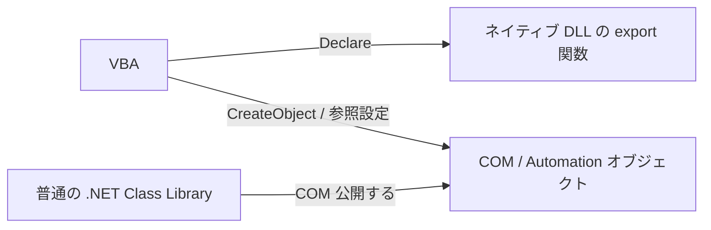
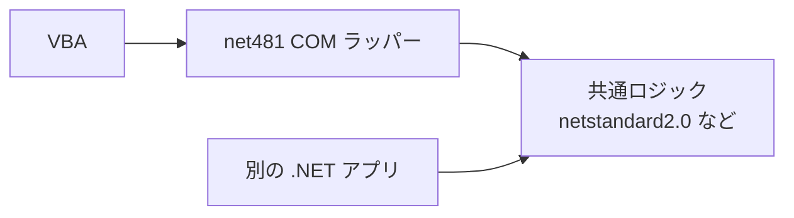

Excel や Access の VBA から、既存の C# ロジックを呼びたい。  
この要件はかなり普通です。

- 文字列処理や暗号化だけ .NET 側へ逃がしたい
- JSON / HTTP / XML まわりを VBA から切り離したい
- 既に社内にある C# ライブラリを Excel マクロから再利用したい

ただ、ここで最初に転びやすいのが、`.NET の DLL をそのまま参照すれば呼べるのでは` という期待です。  
ここは少しだけ路面がぬかるみます。

VBA から普通の `.NET` クラスライブラリを使うときの王道は、**COM として公開する** ことです。  
この記事では、まず一番摩擦が少ない **.NET Framework 4.8.x + COM 公開** を中心に、`.NET 8 以降でやる場合との違いも整理します。

> 誤解のないように先に書くと、これは「新規開発全体を .NET Framework にしましょう」という話ではありません。  
> **VBA との接続面だけを見ると**、いまでも `.NET Framework 4.8.x` がかなり素直、という話です。

## 1. まず結論（ひとことで）

- VBA から **任意の .NET DLL を直接呼ぶ** ことはできません
- VBA の `Declare` が向いているのは、**ネイティブ DLL のエクスポート関数** です
- 普通の C# クラスライブラリを VBA から使うなら、**COM / Automation として公開** します
- **最短で安定しやすいのは `net481` の COM ラッパー** です
- `.NET 8` 以降でも COM 公開はできますが、**VBA の早期バインディングに必要な type library 周りが少し重く** なります
- 32bit / 64bit が絡むと急に転びやすくなるので、**Office の bitness と依存 DLL の bitness** は最初に揃えます

要するに、`.NET の DLL を VBA で使う` という話は、実務ではだいたい次のどちらかです。

1. **ネイティブ DLL を `Declare` で呼ぶ話**
2. **マネージド DLL を COM 公開して使う話**

この 2 つを `DLL` という 1 単語でまとめると、会話がかなりぬかるみます。  
この記事で扱うのは、主に **2 の COM 公開ルート** です。

## 2. この記事の対象

この記事の対象は、たとえば次のようなケースです。

- Excel / Access / Word の VBA から、自作の C# ロジックを呼びたい
- 既存の社内 .NET ライブラリを、マクロから再利用したい
- VBE の **[参照設定]** で DLL を選んでもうまく追加できず困っている
- `CreateObject` で使える形にしたい
- 早期バインディングで補完も効かせたい

逆に、この記事の中心ではないものは次です。

- VSTO アドインや COM アドインとして Office に常駐させる話
- ワークシート関数専用の XLL を作る話
- C/C++ のネイティブ DLL を `Declare` で呼ぶ話

## 3. なぜ `.NET DLL` をそのまま VBA から呼べないのか

VBA 側の入り口は、実務ではだいたい次の 2 本です。

- `Declare Function ... Lib "xxx.dll"` で **DLL のエクスポート関数** を呼ぶ
- `CreateObject` や **[参照設定]** で **COM オブジェクト** を使う

普通の C# クラスライブラリは、前者の **ネイティブ DLL の export** と同じ姿ではありません。  
なので、VBA から使いたいなら、後者の **COM オブジェクト** として見せるのが基本になります。



ここでのポイントはかなり単純です。

- `Declare` は **ネイティブ関数呼び出し**
- VBA が得意なのは **COM / Automation**
- なので、普通の `.NET DLL` は **COM の顔** を付けて渡す

この順番で見ると、かなり霧が晴れます。

## 4. いちばん実務で安定する方法 - `net481` の薄い COM ラッパー

VBA との接続だけが目的なら、いちばん素直なのは **`.NET Framework 4.8.1` のクラスライブラリを COM 公開** する方法です。

理由はかなり実務的です。

- `RegAsm.exe` で **登録** と **type library 生成** を進めやすい
- VBA の **[参照設定]** と相性がよい
- 既存 Office / VBA / COM の文脈では、まだかなり扱いやすい

### 4.1. おすすめの考え方

いきなり業務ロジック全部を COM 公開するのは、だいたい重いです。  
おすすめは、**COM 境界を薄くする** ことです。


つまり、

- VBA から見えるのは **少数の安定したクラス**
- 内部実装は .NET 側へ寄せる
- COM に見せる型は **できるだけ単純にする**

この形が一番平和です。

### 4.2. サンプル構成

ここでは、`TextTools` という小さなクラスを VBA から使えるようにします。  
ファイルは次の 3 つです。

- `KomuraSoft.VbaBridge.csproj`
- `Properties/AssemblyInfo.cs`
- `TextTools.cs`

### 4.3. `KomuraSoft.VbaBridge.csproj`

```xml
<Project Sdk="Microsoft.NET.Sdk">
  <PropertyGroup>
    <TargetFramework>net481</TargetFramework>
    <AssemblyName>KomuraSoft.VbaBridge</AssemblyName>
    <RootNamespace>KomuraSoft.VbaBridge</RootNamespace>
    <GenerateAssemblyInfo>false</GenerateAssemblyInfo>
    <Nullable>disable</Nullable>
    <LangVersion>latest</LangVersion>
  </PropertyGroup>
</Project>
```

### 4.4. `Properties/AssemblyInfo.cs`

```csharp
using System.Reflection;
using System.Runtime.InteropServices;

[assembly: AssemblyTitle("KomuraSoft.VbaBridge")]
[assembly: AssemblyDescription("COM bridge for VBA")]
[assembly: AssemblyCompany("KomuraSoft")]
[assembly: AssemblyProduct("KomuraSoft.VbaBridge")]
[assembly: AssemblyVersion("1.0.0.0")]
[assembly: AssemblyFileVersion("1.0.0.0")]

// まずは全体を閉じて、公開したい型だけ個別に開ける
[assembly: ComVisible(false)]

// Type Library ID 用の GUID
[assembly: Guid("2E9A38C7-7E9B-4E0D-8A9F-6C7DAB0A6101")]
```

### 4.5. `TextTools.cs`

```csharp
using System;
using System.IO;
using System.Runtime.InteropServices;
using System.Security.Cryptography;
using System.Text;

namespace KomuraSoft.VbaBridge
{
    [ComVisible(true)]
    [Guid("E1B2D8C2-9A8A-4D5C-A7A3-0E8F4D690102")]
    [InterfaceType(ComInterfaceType.InterfaceIsDual)]
    public interface ITextTools
    {
        [DispId(1)]
        int Add(int a, int b);

        [DispId(2)]
        string JoinPath(string basePath, string childName);

        [DispId(3)]
        string NormalizeLineEndings(string value);

        [DispId(4)]
        string Sha256Hex(string value);
    }

    [ComVisible(true)]
    [Guid("8E0F14F9-6F0F-4F1A-9C2D-1A8D8E4F0103")]
    [ProgId("KomuraSoft.VbaBridge.TextTools")]
    [ClassInterface(ClassInterfaceType.None)]
    public sealed class TextTools : ITextTools
    {
        public TextTools()
        {
        }

        public int Add(int a, int b)
        {
            return checked(a + b);
        }

        public string JoinPath(string basePath, string childName)
        {
            if (basePath == null)
            {
                throw new ArgumentNullException(nameof(basePath));
            }

            if (childName == null)
            {
                throw new ArgumentNullException(nameof(childName));
            }

            return Path.Combine(basePath, childName);
        }

        public string NormalizeLineEndings(string value)
        {
            if (value == null)
            {
                throw new ArgumentNullException(nameof(value));
            }

            string normalized = value.Replace("\r\n", "\n").Replace("\r", "\n");
            return normalized.Replace("\n", Environment.NewLine);
        }

        public string Sha256Hex(string value)
        {
            if (value == null)
            {
                throw new ArgumentNullException(nameof(value));
            }

            byte[] bytes = Encoding.UTF8.GetBytes(value);

            using (SHA256 sha = SHA256.Create())
            {
                byte[] hash = sha.ComputeHash(bytes);
                StringBuilder sb = new StringBuilder(hash.Length * 2);

                foreach (byte b in hash)
                {
                    sb.Append(b.ToString("x2"));
                }

                return sb.ToString();
            }
        }
    }
}
```

このコードで大事なのは次です。

- **インターフェースを明示的に定義** している
- クラスは **`ClassInterfaceType.None`** にしている
- VBA から触らせたいメソッドだけを **`DispId` 付きで公開** している
- `ProgId` を固定して、`CreateObject` しやすくしている

> `GUID` はサンプルでは固定値を書いています。  
> 実プロジェクトでは **自分の GUID を発行して置き換えてください**。  
> ここを使い回すと、あとで本当に妙な事故になります。

### 4.6. なぜ `ClassInterfaceType.None` にするのか

COM 公開でありがちなのが、クラスをそのまま雑に露出してしまうことです。  
これは最初は動いても、あとでメンバー追加や並び替えで地味に痛みやすいです。

なので、

- **公開面はインターフェースで固定**
- クラス側は **`ClassInterfaceType.None`**
- `AutoDual` には寄らない

のほうが安全です。  
COM 境界は、雑に広げるとあとでちゃんと反撃してきます。

### 4.7. ビルドと登録

ビルド後、出力フォルダで `RegAsm.exe` を使って登録します。

#### 32bit Office の場合

```bat
C:\Windows\Microsoft.NET\Framework\v4.0.30319\RegAsm.exe KomuraSoft.VbaBridge.dll /codebase /tlb:KomuraSoft.VbaBridge.tlb
```

#### 64bit Office の場合

```bat
C:\Windows\Microsoft.NET\Framework64\v4.0.30319\RegAsm.exe KomuraSoft.VbaBridge.dll /codebase /tlb:KomuraSoft.VbaBridge.tlb
```

ポイントは次です。

- **Office の bitness に合う側** を使う
- `/tlb` で **type library** を作っておくと、VBA の **[参照設定]** で使いやすい
- `/codebase` は手軽ですが、**登録時のファイルパスを記録する** ので、あとで DLL を動かすとアクティブ化に失敗します

登録解除は次です。

#### 32bit Office の場合

```bat
C:\Windows\Microsoft.NET\Framework\v4.0.30319\RegAsm.exe KomuraSoft.VbaBridge.dll /u /tlb:KomuraSoft.VbaBridge.tlb
```

#### 64bit Office の場合

```bat
C:\Windows\Microsoft.NET\Framework64\v4.0.30319\RegAsm.exe KomuraSoft.VbaBridge.dll /u /tlb:KomuraSoft.VbaBridge.tlb
```

> 開発中の疎通確認だけなら、Visual Studio の **[COM の相互運用機能に登録]** を使う方法もあります。  
> ただ、配布手順としては **明示的な `RegAsm` コマンド** にしておくほうが再現しやすいです。

### 4.8. まずは late binding で疎通確認する

最初の確認は、**参照設定なしの late binding** が楽です。

```vb
Option Explicit

Public Sub Sample_UseDotNetDll_LateBinding()
    Dim tools As Object
    Set tools = CreateObject("KomuraSoft.VbaBridge.TextTools")

    Debug.Print tools.Add(10, 20)
    Debug.Print tools.JoinPath("C:\Work", "report.csv")
    Debug.Print tools.NormalizeLineEndings("A" & vbLf & "B")
    Debug.Print tools.Sha256Hex("hello")
End Sub
```

これで動けば、

- COM 登録
- ProgID
- オブジェクト生成

の大きいところは通っています。

### 4.9. 次に early binding に寄せる

次は VBE の **[ツール] → [参照設定]** から、生成した `KomuraSoft.VbaBridge.tlb` を追加します。  
すると、オブジェクトブラウザーにクラスが見えるようになります。

そのうえで、たとえば次のように書けます。

```vb
Option Explicit

Public Sub Sample_UseDotNetDll_EarlyBinding()
    Dim tools As TextTools
    Set tools = New TextTools

    Debug.Print tools.Add(3, 4)
    Debug.Print tools.JoinPath("C:\Temp", "sample.txt")
End Sub
```

early binding の利点は次です。

- 入力補完が効く
- メソッド名の typo に早く気づける
- どの API を公開しているかが VBA 側から見やすい

最初は late binding で疎通確認、落ち着いたら early binding に寄せる、がかなり実務向きです。  
なお、型名は追加された type library の表示名に従うので、実際にはオブジェクトブラウザーに見える名前に合わせてください。

## 5. `.NET 8` 以降でやる場合

`.NET 8` 以降でも COM 公開はできます。  
ただ、**VBA との相性だけを見ると少し手順が増えます**。

### 5.1. 最小の `csproj`

```xml
<Project Sdk="Microsoft.NET.Sdk">
  <PropertyGroup>
    <TargetFramework>net8.0-windows</TargetFramework>
    <EnableComHosting>true</EnableComHosting>
    <Nullable>disable</Nullable>
  </PropertyGroup>
</Project>
```

クラス側では、`.NET Framework` のときと同じように、

- `Guid`
- `ComVisible(true)`
- `ProgId`
- 明示的なインターフェース

を付けます。  
`.NET Framework` と違って、**COM でアクティブ化したいクラスの CLSID は明示** しておく前提です。

### 5.2. ビルド結果と登録

ビルドすると、通常の DLL に加えて **`ProjectName.comhost.dll`** が出ます。  
登録はこれに対して行います。

```bat
regsvr32 ProjectName.comhost.dll
```

必要なら、次の設定で **Registry-Free COM 用の manifest** も出せます。

```xml
<EnableRegFreeCom>true</EnableRegFreeCom>
```

なお、`.NET 5+ / 6+ / 8+` の COM コンポーネントは、**自己完結型配置ではなく framework-dependent 配置** が前提です。

### 5.3. VBA 観点での注意点

ここが少し大事です。

`.NET Framework` と違って、`.NET 5+ / 6+ / 8+` では、**アセンブリから type library を自動生成する流れが素直ではありません**。  
`.NET 6` 以降なら **事前に作った TLB を埋め込む** ことはできますが、`IDL` / `MIDL` を含む別手順が入ります。

つまり、VBA から見たときは次の感じです。

- **late binding だけなら `.NET 8` でもいける**
- **early binding を素直にやりたいなら `net481` のほうがかなり楽**

ここはけっこう本質です。  
`.NET 8` が悪いわけではなく、**VBA 側が欲しいものが COM / type library 文脈** だからです。

### 5.4. では今から新規で作るならどっちか

かなり実務寄りに言うと、次です。

- **VBA から呼ぶ入口を早く安定させたい**  
  → `net481` の薄い COM ラッパー

- **中の業務ロジックは今どきの .NET で育てたい**  
  → **共通ロジックを別ライブラリへ寄せて、COM 境界だけ薄いラッパーにする**

たとえば次の構成はかなり扱いやすいです。



この形だと、

- VBA との接続は古い顔に任せる
- 中身のロジックは使い回せる
- 将来 VBA を外すときも、COM ラッパーだけ剥がせる

ので、かなり息がしやすいです。

## 6. ハマりどころ

### 6.1. 32bit / 64bit を後回しにしない

ここはかなり重要です。

- **64bit Office は 32bit バイナリを読み込めません**
- **32bit Office は 64bit DLL を読み込めません**
- bitness をまたいで使いたいなら、**アウトプロセス COM** など、構成を変える必要があります

純マネージドだけなら `AnyCPU` で済む場面もあります。  
ただし、VBA 連携では **登録する RegAsm の側**、**依存するネイティブ DLL**、**配布先 Office の bitness** が絡んで、ここがすぐぬかるみます。

最初はかなり素直に、

- 32bit Office なら 32bit 前提
- 64bit Office なら 64bit 前提

でそろえるのが安全です。

### 6.2. COM に見せる型は単純にする

COM 境界に向いているのは、たとえば次のような型です。

- `string`
- `int`
- `double`
- `bool`
- 1 次元配列
- 単純な引数と戻り値

逆に、最初から境界に出さないほうがよいものは次です。

- `Task`
- `List<T>`
- `Dictionary<TKey, TValue>`
- 雑なオーバーロード
- indexer
- 深い入れ子のオブジェクトグラフ
- .NET 専用色の強い API

COM は契約が命です。  
**薄く、粗く、単純に** がかなり効きます。

### 6.3. public でないものは見えない

COM に公開したいなら、基本はかなり素直です。

- クラスは `public`
- メソッド / プロパティも `public`
- **引数なしの public コンストラクター** を持つ
- `abstract` にしない

ここを外すと、VBA 側からは見えなかったり、生成できなかったりします。

### 6.4. 例外はそのまま投げっぱなしにしない

.NET 側で例外が飛ぶと、VBA 側では「実行時エラー」として見えます。  
開発中はそれでもよいのですが、運用に入ると少しつらいです。

なので、境界面では次のどちらかが扱いやすいです。

- .NET 側で例外メッセージを整理して投げ直す
- 戻り値を `成功/失敗 + メッセージ` の形に寄せる

VBA 利用者が開発者ではないなら、後者のほうが親切なことも多いです。

### 6.5. `/codebase` は楽だが、配置を動かすと死にやすい

`/codebase` はかなり便利です。  
ただし、登録時の DLL パスが使われるので、**あとから DLL を別フォルダへ移動すると壊れます**。

開発中はこれで十分です。  
ただ、本番配布では次を決めたほうが安全です。

- 固定のインストール先へ置く
- セットアップ時に再登録する
- 配布手順書へ登録コマンドを明記する

技術的には動くのに、配布で死ぬ。  
ここはわりと COM あるあるです。

### 6.6. `参照を追加できません` はだいたい COM 入口の問題

VBE の **[参照設定]** で DLL を選んでも追加できないときは、だいたい次のどれかです。

- その DLL は **普通の .NET アセンブリ** で、COM として公開されていない
- 登録が足りない
- type library がない
- bitness が合っていない
- DLL を移動して `/codebase` がずれている

要するに、VBA が欲しいのは **.NET メタデータそのものではなく、COM の入口** です。  
ここが分かると、症状がかなり読みやすくなります。

## 7. どう選ぶべきか

かなりざっくり使い分けると、次です。

### 7.1. まず動かしたい

**`net481` の COM ラッパー** です。

- `RegAsm`
- `/tlb`
- VBA の参照設定
- `CreateObject`

この流れが一番素直です。

### 7.2. 中身はモダン .NET で育てたい

**COM 境界だけ `net481`、中身は共通ロジック** に分けるのがおすすめです。

- VBA 入口は安定
- 中身は別の .NET アプリからも使える
- 将来の置き換えも楽

### 7.3. bitness が噛み合わない

**アウトプロセス COM** や **別プロセスのブリッジ** を考えます。

- 32bit Office から 64bit DLL をそのまま in-proc で読む
- 64bit Office から 32bit ActiveX をそのまま使う

このへんは気合いで越える種類の壁ではありません。  
構成を変える話です。

## 8. まとめ

`.NET の DLL を VBA で使う` という話の本質は、**VBA が何を呼べるのか** を先に分けることです。

- `Declare` は **ネイティブ DLL**
- 普通の C# クラスライブラリは **COM 公開**
- VBA との相性だけを見るなら **`net481` の薄い COM ラッパー** がかなり素直
- `.NET 8` 以降でも可能だが、**VBA の early binding / TLB まわりは一段重い**
- 難所はコードそのものより、**bitness、登録、配布、境界設計** に出やすい

実務では、COM 境界だけを薄く作るのが効きます。  
VBA 側に全部を見せず、**少数の coarse-grained な API** にまとめるほうが、あとでかなり平和です。

## 関連トピック

- [COM とは何か - Windows COM の設計が今でも美しい理由](https://comcomponent.com/blog/2026/01/25/001-why-com-is-beautiful/)
- [32bit アプリから 64bit DLL を呼び出す方法 - COM ブリッジが役立つケーススタディ](https://comcomponent.com/blog/2026/01/25/002-com-case-study-32bit-to-64bit/)
- [COM STA/MTA の基礎知識 - スレッドモデルとハングを避ける考え方](https://comcomponent.com/blog/2026/01/31/000-sta-mta-com-relationship/)
- [COM / ActiveX / OCX とは何か - 違いと関係をまとめて解説](https://comcomponent.com/blog/2026/03/13/000-what-is-com-activex-ocx/)

## 参考資料

- [Regasm.exe (アセンブリ登録ツール) - .NET Framework](https://learn.microsoft.com/ja-jp/dotnet/framework/tools/regasm-exe-assembly-registration-tool)
- [COM へのアセンブリの登録 - .NET Framework](https://learn.microsoft.com/ja-jp/dotnet/framework/interop/registering-assemblies-with-com)
- [COM への .NET Core コンポーネントの公開](https://learn.microsoft.com/ja-jp/dotnet/core/native-interop/expose-components-to-com)
- [COM 相互運用のために .NET 型を修飾する](https://learn.microsoft.com/ja-jp/dotnet/standard/native-interop/qualify-net-types-for-interoperation)
- [ClassInterfaceType 列挙型](https://learn.microsoft.com/ja-jp/dotnet/api/system.runtime.interopservices.classinterfacetype)
- [COM クラスの例 - C#](https://learn.microsoft.com/ja-jp/dotnet/csharp/advanced-topics/interop/example-com-class)
- [Access DLLs in Excel](https://learn.microsoft.com/en-us/office/client-developer/excel/how-to-access-dlls-in-excel)
- [Calling DLL Functions from Visual Basic Applications](https://learn.microsoft.com/en-us/cpp/build/calling-dll-functions-from-visual-basic-applications?view=msvc-170)
- [Office の 32 ビット バージョンと 64 ビット バージョン間の互換性](https://learn.microsoft.com/ja-jp/office/client-developer/shared/compatibility-between-the-32-bit-and-64-bit-versions-of-office)
