# SEO対策とGoogle広告のベストプラクティス - 一般論でつかむ検索集客の設計図

2026年03月24日 10:00 · 小村 豪 · SEO, Google広告, Webマーケティング, 検索集客, デジタル広告

> この記事は特定のサイトや業種に寄せず、一般論として書いています。  
> 図は概念図です。Mermaid 対応の Markdown 環境では図として表示されます。

SEO と Google 広告は、しばしば別々の話として扱われます。  
でも、ユーザー側から見ると違いはもっと単純です。

- 検索結果に出会う
- 気になる見出しや広告をクリックする
- ページを見て比較する
- 問い合わせる、買う、予約する、資料請求する

つまり、SEO も Google 広告も、**検索意図からコンバージョンへつなぐ一本の導線の別ルート**です。  
この前提で整理すると、やるべきことがかなり見えやすくなります。Google は SEO の基本線として **helpful, reliable, people-first content**、クロール可能なリンク、適切な検索結果表示、Search Console による監視などを案内しており、Google 広告では **目的ベースの構成、正確なコンバージョン計測、enhanced conversions、Consent Mode、Smart Bidding** を重視しています。[^helpful-content][^search-essentials][^links][^search-console][^ads-account-best][^ads-enhanced][^ads-consent][^ads-smart]

## 目次

1. まず結論
2. SEO と Google 広告の役割を一枚で見る
3. SEO のベストプラクティス
4. Google 広告のベストプラクティス
5. どんな時に SEO、広告、両方を使うべきか
6. 90 日で土台を作る進め方
7. よくある失敗
8. まとめ
9. 参考資料

---

## 1. まず結論

先に結論だけ置くと、実務ではだいたい次の順で考えると崩れません。

- SEO は **人に役立つページを作り、それを Google が見つけて理解しやすい形にすること** が中心です。検索エンジンだけを見た小手先より、コンテンツの役立ち方、内部リンク、発見性、重複整理、検索結果での見え方、ページ体験が土台になります。[^helpful-content][^search-essentials][^links][^canonical][^title-links][^snippets][^page-experience]
- Google 広告は **「今この検索をしている人」を取りに行く仕組み** です。ただし勝ち筋は広告文の小手先ではなく、**目的の切り分け、正確なコンバージョン計測、検索意図に合ったランディングページ、適切な構造、継続的な検索語句の見直し** にあります。[^ads-account-best][^ads-structure][^ads-landing][^ads-search-terms]
- 2026 年時点でも、AI Overviews や AI Mode に出すための **特別な AI 用ファイルや特別な schema は不要** です。Google は、通常の SEO 基本動作を続けることを勧めています。[^ai-features]
- SEO と広告は二者択一ではなく、**時間軸と検索意図で役割分担** するのが自然です。  
  早く取りたい需要、高意図の語句、新規オファー検証は広告。  
  中長期で積み上がる需要、比較検討、指名以外の発見、テーマの網羅は SEO。  
  そして収益性の高い重要テーマでは、両方を併用するのがいちばん強いです。[^search-essentials][^ads-account-best]

---

## 2. SEO と Google 広告の役割を一枚で見る

まずは全体像です。

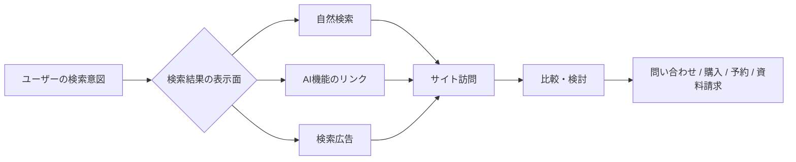

この図で大事なのは、**入口は複数でも、出口は同じ** という点です。  
SEO は自然検索や AI 機能に出るための土台を作り、Google 広告は高意図の検索を今すぐ取りに行きます。どちらも最終的には同じ LP や商品ページ、サービスページ、フォームへ流れます。だから本当は、SEO チームと広告運用を分断するより、**同じ検索需要を別ルートで取りに行く統合設計** の方が合理的です。[^ai-features][^ads-account-best]

役割の違いをざっくり表にするとこうなります。

| 観点 | SEO | Google 広告 |
| --- | --- | --- |
| 立ち上がり | 遅い | 早い |
| 継続性 | 蓄積しやすい | 出稿停止で止まりやすい |
| 主戦場 | 情報収集・比較・指名・問題解決 | 高意図・即時需要・商談直前 |
| 成功条件 | 良いページ、内部リンク、発見性、技術基盤、改善継続 | 計測、LP、アカウント構造、検索語句管理、入札 |
| 向いている用途 | 資産化、テーマの網羅、比較検討の刈り取り | 即効性、需要検証、利益語句の拡張 |

---

## 3. SEO のベストプラクティス

### 3.1 まず「検索エンジン向け」ではなく「人向け」で設計する

Google は、役立ち、信頼でき、人のために作られた情報を優先する方向を明確にしています。さらに Search Essentials では、ユーザーが実際に検索に使う言葉を、ページの **title、見出し、alt text、link text** といった目立つ場所に置くことを勧めています。[^helpful-content][^search-essentials]

ここで重要なのは、単にキーワードを入れることではありません。  
**検索意図に合ったページ型を作ること** です。

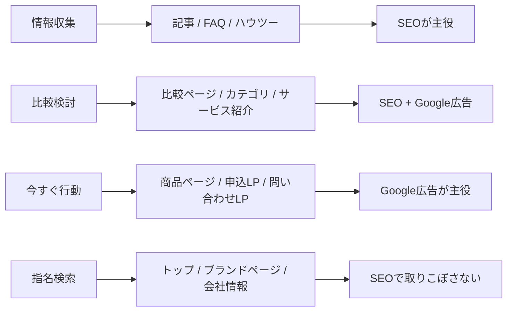

この図の感覚で、ページを次のように作り分けると自然です。

- 情報収集: 用語解説、ハウツー、FAQ、トラブル解決
- 比較検討: 比較表、選び方、カテゴリ、サービス紹介、事例
- 今すぐ行動: 商品ページ、価格ページ、問い合わせ LP、申込導線
- 指名検索: トップ、会社情報、ブランド名ページ、サポート

SEO が伸びないサイトは、しばしば **検索意図とページ型がズレています**。  
たとえば「比較したい」検索に対して、いきなり売り込みの LP だけを出しても弱いです。逆に「今すぐ申し込みたい」検索へ、長すぎる啓発記事だけを出しても弱いです。

### 3.2 発見される、クロールされる、理解される、の順で考える

どんなに良いページでも、Google が見つけられず、読めず、重複整理できなければ結果に出ません。  
SEO の技術面は、この流れで考えると整理しやすいです。Google はリンクを新しいページの発見や関連性理解に使っており、内部リンクは極めて重要です。[^links]

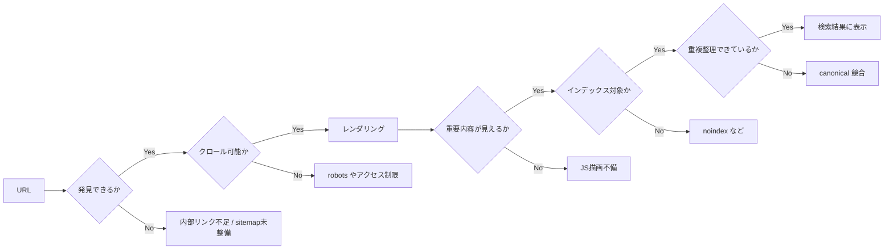

この流れで見ると、やるべきことは次の通りです。

#### 内部リンクを本気で作る

Google はリンクをクロールと関連性理解に使います。  
特に内部リンクでは、**`<a href="...">` でクロール可能なリンクを置くこと**、**曖昧な「こちら」「詳しくはこちら」ではなく文脈のある anchor text を使うこと** が重要です。さらに Google は、重要なページは少なくともサイト内のどこか 1 ページ以上からリンクされているべきだと案内しています。[^links]

#### サイトマップを出す

Google は多くのページを自力で発見できますが、XML サイトマップは依然として有効です。特に新規公開ページ、深い階層、大規模サイト、更新頻度の高いサイトでは、発見と監視を助けます。Search Console の Sitemaps レポートでは、取得時刻や処理エラーも見られます。[^sitemap][^sitemaps-report]

#### canonical で重複を整理する

同じ内容が複数 URL で見えるサイトは珍しくありません。  
並び替え、パラメータ違い、トラッキング付き URL、カテゴリ違いなどです。Google は `rel="canonical"` などで正規 URL の希望を伝える方法を案内しています。[^canonical]

#### robots と noindex を混同しない

検索結果での表示制御には、`robots meta` や `X-Robots-Tag`、`nosnippet`、`data-nosnippet`、`max-snippet` などがあります。  
これらは「何を表示してよいか」「索引対象にしてよいか」を制御する手段であり、単純に「検索に出したくないなら robots.txt で全部止める」という話ではありません。[^robots][^snippets]

### 3.3 検索結果での見え方も設計する

SEO は順位だけの話ではありません。  
**同じ順位でも、見え方でクリック率は変わります。**

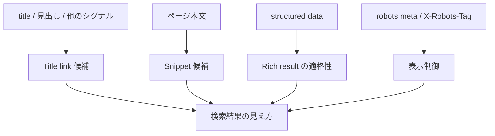

#### title link

Google は title link を複数の情報源から自動決定します。こちらが書いた `<title>` だけで完全に固定できるわけではありませんが、ベストプラクティスに沿って「そのページ固有の内容が伝わるタイトル」を作る意義は大きいです。[^title-links]

#### snippet と meta description

スニペットは主にページ本文から自動生成されますが、meta description がページ内容をより正確に表すと判断されれば使われることがあります。Google は、**ページごとに固有で、短く、関連情報を含む description** を推奨しています。[^snippets]

#### structured data

構造化データは順位を魔法のように上げるものではありません。  
しかし Google は、構造化データをページ理解やリッチリザルト表示に利用しており、ガイドラインに合っていれば検索結果での見え方を改善できる可能性があります。重要なのは **表示されている本文と一致していること**、**ガイドライン違反をしないこと**、**アクセス制御で Googlebot に見えなくしないこと** です。[^structured-data][^structured-data-intro]

### 3.4 サイト構造は「点」ではなく「塊」で作る

SEO で強いサイトは、単発記事の集合ではなく、**主要テーマを中心にページ群がつながっているサイト** です。

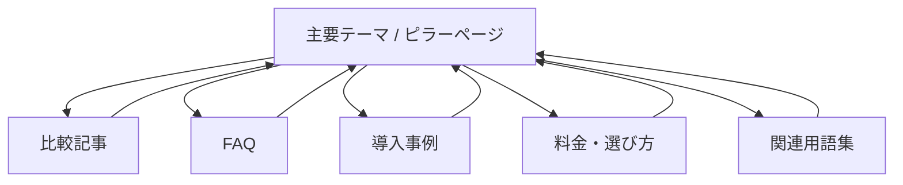

この構造が強い理由は、ユーザーにとっても Google にとっても「このサイトはこのテーマを体系的に扱っている」と分かりやすいからです。内部リンクは単なる回遊導線ではなく、**テーマのまとまりを伝える信号** にもなります。[^links]

実務では、次の 3 層で作ると整理しやすいです。

1. ピラーページ  
   主要サービス、主要カテゴリ、重要テーマのハブ
2. 支援ページ  
   比較、選び方、FAQ、用語解説、導入手順、事例
3. CV ページ  
   価格、問い合わせ、資料請求、申込、デモ予約

### 3.5 JavaScript サイトは「見えているはず」を捨てる

JavaScript を多用したサイトでは、「ブラウザで見えているから Google にも見えているはず」と考えるのが危険です。Google は JavaScript SEO 基本ガイドで、**crawling → rendering → indexing** の三段階を説明しています。[^js-seo]

さらに URL Inspection では、Google が見たインデックス状態、ライブ URL の検査結果、レンダリング後の見え方を確認できます。[^url-inspection]

実務では、少なくとも次を確認しておくと安全です。

- 主要本文がレンダリング後 HTML に存在するか
- 主要リンクが `<a href>` になっているか
- title、canonical、structured data が安定しているか
- lazy load や client-side only な実装で本文や画像が消えていないか

### 3.6 ページ体験は「満点を取るゲーム」ではない

Google は Core Web Vitals を、読み込み、操作性、視覚安定性を測る実ユーザーデータ指標として案内しています。Search Console の Core Web Vitals レポートでは **LCP、INP、CLS** をもとに URL グループの状態を見られます。[^core-web-vitals][^cwv-report]

ただし、ここでよくある誤解があります。  
Google は、**Core Web Vitals は大事だが、それだけで上位表示が保証されるわけではない** と明言しています。関連性の高い役立つコンテンツが優先される前提は変わりません。[^page-experience]

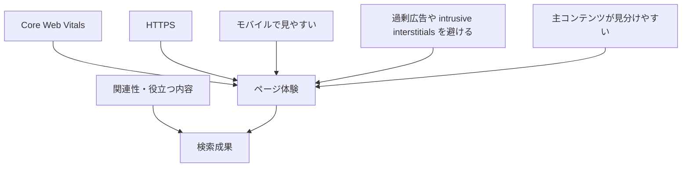

つまり、正しい優先順位はこうです。

1. 検索意図に合う内容
2. 発見・クロール・インデックスの成立
3. クリックされる見え方
4. 使いやすいページ体験

### 3.7 AI 検索時代でも、やることはまず基本

2026 年の文脈では、AI Overviews や AI Mode が気になる人は多いと思います。  
ここで大事なのは、Google 自身が「**AI 機能向けに特別な最適化は不要**」と説明していることです。通常の SEO 基本動作を続ければよい、という立場です。[^ai-features]

Google は AI 機能に向けた一般的なポイントとして、次を挙げています。[^ai-features]

- robots.txt や CDN 側でクロールを阻害しない
- 内部リンクで見つけやすくする
- 良いページ体験を提供する
- 重要情報をテキストで持つ
- 画像や動画を高品質にする
- structured data を可視テキストと一致させる

さらに、AI Overviews / AI Mode 由来の流入も Search Console の **Web** パフォーマンスに含まれます。  
逆に表示制御したい場合は、`nosnippet`、`data-nosnippet`、`max-snippet`、`noindex` など、従来からある制御手段を使います。[^ai-features][^robots]

---

## 4. Google 広告のベストプラクティス

### 4.1 最初にやるのは「入札」ではなく「計測」

Google 広告の運用で最初に壊れやすいのは、広告文よりも計測です。Google は account setup best practices の中で、**1 キャンペーンは基本的に 1 目的**、そして Smart Bidding を使うなら **正確なコンバージョンデータ** を入れることが重要だと案内しています。さらに、**強いタグ基盤、enhanced conversions、Consent Mode、コンバージョン値の反映** を推奨しています。[^ads-account-best]

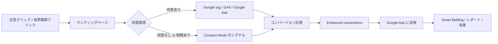

この図の中で特に重要なのは次です。

#### Consent Mode

Consent Mode は、ユーザーの同意状態を Google に伝え、タグの挙動をそれに合わせて調整する仕組みです。  
同意バナーそのものではなく、バナーと連携して動く層です。[^ads-consent]

#### enhanced conversions

Enhanced conversions は、既存のコンバージョン計測を補強する機能で、ハッシュ化されたファーストパーティデータを使って計測精度を改善し、より強い自動入札につなげます。[^ads-enhanced]

#### conversion value

問い合わせも購入も同じ 1 件として扱うのではなく、売上や粗利、リードスコアなどの **価値差** を扱えるなら、Google は value-based bidding を推しています。価値が違うのに全件同じ重みで最適化すると、広告は簡単に歪みます。[^conversion-values][^ads-value-bidding]

### 4.2 アカウント構造は「細かく分ける」より「意味で分ける」

昔の運用ノウハウでは、マッチタイプ別、デバイス別、地域別に細かく切る作法が強く語られがちでした。  
しかし Google は、AI を活かす観点から **simpler structures with consolidated, tightly-themed setups** を推しています。つまり、細分化しすぎるより、**意味の近いテーマでまとめる** 方がうまくいきやすい、ということです。[^ads-account-structure][^ads-account-best][^ads-structure]

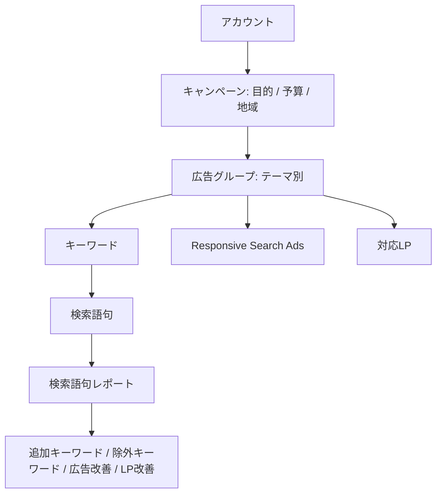

実務上は、次の粒度が扱いやすいです。

- キャンペーン  
  目的、予算、地域、言語、媒体方針などで切る
- 広告グループ  
  1 つの明確なテーマでまとめる
- 広告  
  そのテーマに対する訴求のバリエーション
- LP  
  その検索意図に直接答えるページ

Google は ad groups について、**関連キーワードと関連広告をまとめることで、似た検索に対してより関連性の高い広告を出せる** と説明しています。[^ads-structure]

### 4.3 検索語句を見ない運用は、ほぼ必ず崩れる

Google 広告では、キーワードを設定して終わりではありません。  
実際にどんな検索語句で表示・クリックされたかを見て、除外や追加を繰り返す必要があります。

Google の検索語句レポートの説明でも、**関連性の低い検索語句は negative keyword として除外する** ことが推奨されています。[^ads-search-terms][^ads-negative][^ads-keyword-match]

ここでの基本は 3 つです。

1. 取りたい検索語句を増やす
2. いらない検索語句を除外する
3. LP や広告文の訴求を、実際の検索語句に寄せる

「クリックは出るのに売れない」アカウントの多くは、検索語句を見ると理由が分かります。  
意味がズレている、情報収集語を大量に踏んでいる、LP が約束に合っていない、このどれかです。

### 4.4 広告文は RSA 前提で考える

現在の検索広告のテキスト面は、基本的に **Responsive Search Ads (RSA)** が中心です。Google は、**1 広告グループに 1 本以上の RSA を置き、Ad Strength を Good 以上、できれば Excellent にすること** を勧めています。また、1 広告グループでは **有効な RSA は最大 3 本** までです。[^ads-rsa][^ads-ad-strength]

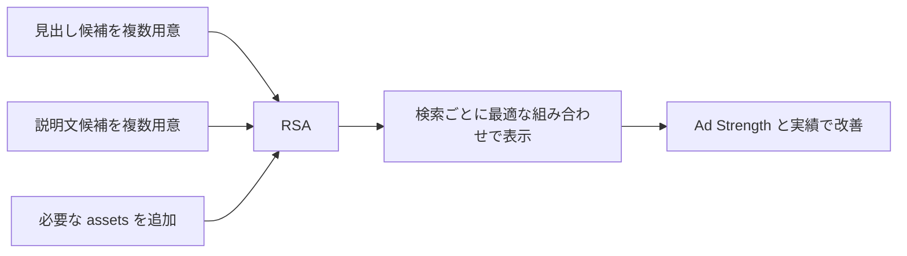

RSA では、見出しや説明文がさまざまな組み合わせで出ます。  
そのため、Google も **各 asset は単独でも、他と組み合わせても意味が通るように作るべき** と案内しています。固定表示したいテキストがある場合だけ pin を使います。[^ads-rsa]

コツは、「1 本の完璧な広告文」を作るより、**訴求の軸を複数持つ** ことです。

- 問題解決型
- 比較優位型
- 価格・条件型
- 実績・安心型
- スピード型

### 4.5 LP は広告の続きである

Google は、広告とキーワードに近いランディングページを選ぶことが、**Ad relevance** と **landing page experience** の改善につながると案内しています。[^ads-landing]

逆に言えば、広告で「最短 3 分で見積」「初回無料相談」「即日予約」などと言っているのに、LP がトップページで、目的の情報が見つからない状態はかなり厳しいです。

LP で最低限合わせるべきものは次です。

- 検索意図
- 広告文の約束
- 見出しの第一印象
- CTA
- 信頼要素
- フォームの重さ

### 4.6 Quality Score は KPI ではなく診断値

Quality Score はよく誤解されますが、Google は **Quality Score は KPI ではなく、広告品質を見る診断ツール** だと明言しています。しかも **広告オークションの入力値そのものではない** としています。[^ads-quality-score]

だから、Quality Score の数字そのものを追いかけるより、そこで見えてくる

- Ad relevance
- Expected CTR
- Landing page experience

の 3 つを改善する方が本質的です。[^ads-quality-score-guide]

### 4.7 Smart Bidding は強いが、前提条件つき

Google は Smart Bidding を、**各オークションごとにコンバージョンまたはコンバージョン値へ最適化する自動入札** と説明しています。[^ads-smart]

さらに Google は、

- 正確なコンバージョン計測
- conversion value の反映
- broad match
- RSA
- シンプルで意味の通る構造

を組み合わせる方向を強く勧めています。[^ads-account-best][^ads-value-bidding]

ただし、ここで大事なのは、**計測が弱いまま自動化だけ強くしても改善しにくい** ということです。  
誤った CV 設定、価値差を無視した最適化、曖昧な LP のままでは、AI に渡す教師データが弱すぎます。

---

## 5. どんな時に SEO、広告、両方を使うべきか

ここは一般論として一番実務に効くところです。

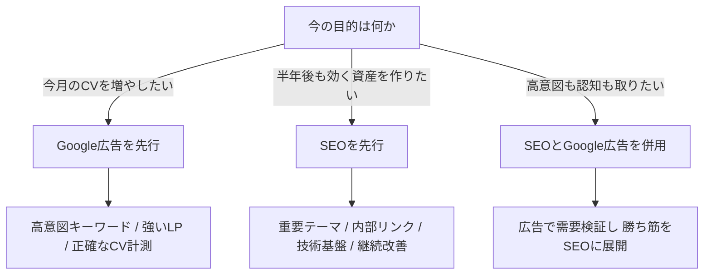

より具体的には、次の使い分けがしやすいです。

| 状況 | 主役 | 理由 |
| --- | --- | --- |
| すぐにリードや売上が欲しい | Google 広告 | 立ち上がりが早い |
| 新しいオファーや訴求を試したい | Google 広告 → SEO | 先に需要検証しやすい |
| 中長期で強いテーマを育てたい | SEO | 資産化しやすい |
| 競争が強い利益語句を取りたい | 両方 | 広告と自然検索で面を取れる |
| 予算が限られ、専門性は強い | SEO中心 | 深いコンテンツが効きやすい |
| 指名検索を取りこぼしたくない | 両方 | 防衛線として有効 |

強い運用は、SEO と広告を別々に回しません。  
たとえば、

- 広告の検索語句レポートで反応の良い語句を見つける
- その語句向けに SEO ページを作る
- Search Console で伸びるクエリを見て広告に展開する
- 両方で勝つ LP を共通改善する

という循環を作ります。

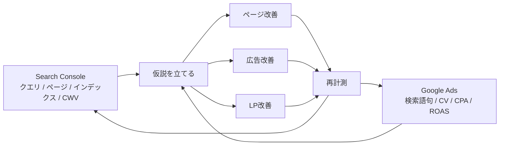

---

## 6. 90 日で土台を作る進め方

一般的なサイトなら、最初の 90 日はこのくらいの順で十分です。

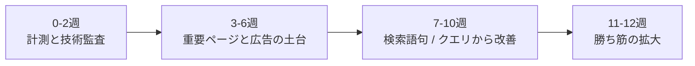

### 0-2週: 計測と技術監査

- Search Console 設定
- サイトマップ送信
- 主要 URL の URL Inspection
- Core Web Vitals とインデックス状況確認
- Google Ads のコンバージョン定義整理
- Consent Mode と enhanced conversions の導入確認
- CV 値の設計

### 3-6週: 重要ページと広告の土台

- 主要テーマのピラーページ作成
- 商品 / サービス / カテゴリ / 問い合わせ LP 整備
- アカウント構造の整理
- 広告グループをテーマ別に整理
- RSA 作成
- 最低限の除外キーワード設計

### 7-10週: 実データで改善

- Search Console でクエリとページを確認
- 検索語句レポートで無駄打ち確認
- title / description / 見出し / LP の初期改善
- クリック率と CVR の悪い導線を修正

### 11-12週: 勝ち筋の拡大

- 勝っているテーマの関連ページ追加
- 広告予算の再配分
- value-based bidding の調整
- 内部リンクの強化
- 不要ページ、競合 URL、重複導線の整理

---

## 7. よくある失敗

### SEO 側の失敗

- 薄い記事を大量公開する
- 検索意図に合わないページ型を出す
- 内部リンクをほとんど張らない
- canonical や noindex の整理が曖昧
- title と description を全ページで使い回す
- JS サイトなのに rendered HTML を確認しない
- structured data が可視本文とズレる
- Core Web Vitals だけを追って内容改善を後回しにする

生成 AI を使うこと自体は問題ではありませんが、Google は **価値を加えずに大量生成すること** をスパムポリシー上の問題にしうると案内しています。自動生成コンテンツを使うなら、本文だけでなく title、meta description、structured data、alt text まで含めて **精度・品質・関連性** を担保する必要があります。[^gen-ai]

### Google 広告側の失敗

- 何を CV とするか曖昧
- すべてのキャンペーンを同じ目的で混ぜる
- クリックだけを最適化して売上を見ない
- トップページに全部流す
- 検索語句レポートを見ない
- broad match を使うのに除外や計測が弱い
- Quality Score を KPI にしてしまう
- Consent Mode や enhanced conversions を後回しにする
- 広告文だけをいじって LP を放置する

---

## 8. まとめ

SEO と Google 広告のベストプラクティスを一言で言うなら、**検索流入を「コンテンツ」「発見性」「計測」「LP」の 4 点で統合設計すること** です。

SEO では、

- 人向けの価値ある内容を作る
- Google が見つけて理解しやすい構造にする
- 検索結果での見え方を整える
- Search Console で監視する
- ページ体験を改善する

Google 広告では、

- 目的ごとに整理する
- 計測を最優先で整える
- 検索意図に合う LP を当てる
- 検索語句を見て除外と拡張を繰り返す
- Smart Bidding に良い教師データを渡す

この 2 つを別々にやるのではなく、

- 広告で需要を検証し
- SEO で資産化し
- 共通 LP と共通計測で改善を回す

この形に持っていくのが、いちばん強い運用です。

---

## 9. 参考資料

[^search-essentials]: Google Search Central, [Search Essentials](https://developers.google.com/search/docs/essentials)
[^helpful-content]: Google Search Central, [Creating helpful, reliable, people-first content](https://developers.google.com/search/docs/fundamentals/creating-helpful-content)
[^links]: Google Search Central, [Link best practices for Google](https://developers.google.com/search/docs/crawling-indexing/links-crawlable)
[^sitemap]: Google Search Central, [Build and submit a sitemap](https://developers.google.com/search/docs/crawling-indexing/sitemaps/build-sitemap)
[^sitemaps-report]: Google Search Console Help, [Sitemaps report](https://support.google.com/webmasters/answer/7451001)
[^canonical]: Google Search Central, [How to specify a canonical URL with rel="canonical" and other methods](https://developers.google.com/search/docs/crawling-indexing/consolidate-duplicate-urls)
[^robots]: Google Search Central, [Robots meta tag, data-nosnippet, and X-Robots-Tag specifications](https://developers.google.com/search/docs/crawling-indexing/robots-meta-tag)
[^title-links]: Google Search Central, [Influencing title links in search results](https://developers.google.com/search/docs/appearance/title-link)
[^snippets]: Google Search Central, [Control your snippets in search results](https://developers.google.com/search/docs/appearance/snippet)
[^structured-data]: Google Search Central, [General structured data guidelines](https://developers.google.com/search/docs/appearance/structured-data/sd-policies)
[^structured-data-intro]: Google Search Central, [Introduction to structured data markup in Google Search](https://developers.google.com/search/docs/appearance/structured-data/intro-structured-data)
[^js-seo]: Google Search Central, [Understand JavaScript SEO basics](https://developers.google.com/search/docs/crawling-indexing/javascript/javascript-seo-basics)
[^url-inspection]: Google Search Console Help, [URL Inspection tool](https://support.google.com/webmasters/answer/9012289)
[^core-web-vitals]: Google Search Central, [Understanding Core Web Vitals and Google search results](https://developers.google.com/search/docs/appearance/core-web-vitals)
[^cwv-report]: Google Search Console Help, [Core Web Vitals report](https://support.google.com/webmasters/answer/9205520)
[^page-experience]: Google Search Central, [Understanding page experience in Google Search results](https://developers.google.com/search/docs/appearance/page-experience)
[^search-console]: Google Search Central, [How to use Search Console](https://developers.google.com/search/docs/monitor-debug/search-console-start)
[^ai-features]: Google Search Central, [AI features and your website](https://developers.google.com/search/docs/appearance/ai-features)
[^gen-ai]: Google Search Central, [Google Search's guidance on generative AI content on your website](https://developers.google.com/search/docs/fundamentals/using-gen-ai-content)

[^ads-account-best]: Google Ads Help, [Account setup best practices](https://support.google.com/google-ads/answer/6167145)
[^ads-structure]: Google Ads Help, [Organize your account with ad groups](https://support.google.com/google-ads/answer/6372655)
[^ads-account-structure]: Google Ads Help, [The ABCs of Account Structure](https://support.google.com/google-ads/answer/14752782)
[^ads-rsa]: Google Ads Help, [About responsive search ads](https://support.google.com/google-ads/answer/7684791)
[^ads-ad-strength]: Google Ads Help, [About Ad Strength for responsive search ads](https://support.google.com/google-ads/answer/9921843)
[^ads-smart]: Google Ads Help, [Smart Bidding: Definition](https://support.google.com/google-ads/answer/7066642)
[^ads-enhanced]: Google Ads Help, [About enhanced conversions](https://support.google.com/google-ads/answer/9888656)
[^ads-consent]: Google Ads Help, [About consent mode](https://support.google.com/google-ads/answer/10000067)
[^conversion-values]: Google Ads Help, [Conversion values best practices](https://support.google.com/google-ads/answer/14791574)
[^ads-value-bidding]: Google Ads Help, [Value-based Bidding best practices](https://support.google.com/google-ads/answer/14792795)
[^ads-landing]: Google Ads Help, [Optimize your ads and landing pages](https://support.google.com/google-ads/answer/6238826)
[^ads-search-terms]: Google Ads Help, [About the search terms report](https://support.google.com/google-ads/answer/2472708)
[^ads-keyword-match]: Google Ads Help, [About keyword matching options](https://support.google.com/google-ads/answer/7478529)
[^ads-negative]: Google Ads Help, [About negative keywords](https://support.google.com/google-ads/answer/2453972)
[^ads-quality-score]: Google Ads Help, [About Quality Score for Search campaigns](https://support.google.com/google-ads/answer/6167118)
[^ads-quality-score-guide]: Google Ads Help, [Using Quality Score to guide optimizations](https://support.google.com/google-ads/answer/6167123)
