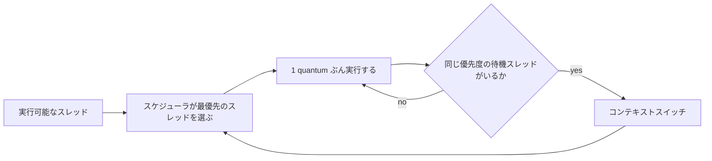
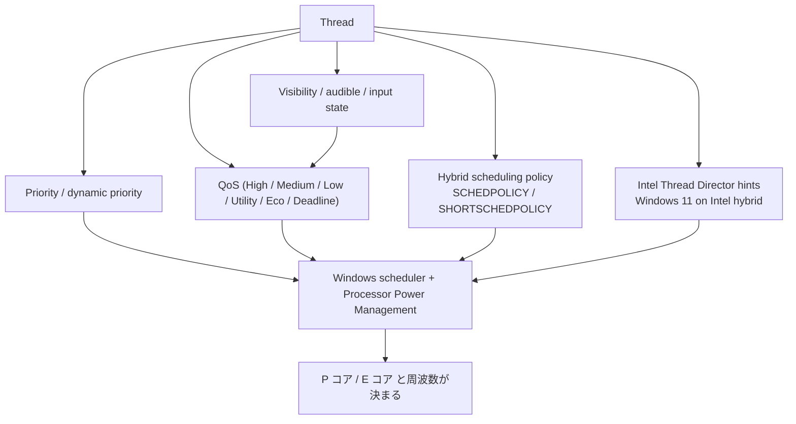

# Windows の「プロセッサのスケジュール」を「バックグラウンド サービス」に変えると何が起きるのか - 量子時間、優先度ブースト、P コア / E コアまで整理

「アプリを前面から外すと音がプチプチする」
「`プロセッサのスケジュール` を `バックグラウンド サービス` にすると安定した」

Windows では昔からこういう話が出ます。特にオーディオ、映像、計測、配信、常駐処理のように、UI よりも継続処理のほうが大事な場面では気になります。

ただ、この設定は魔法の高速化スイッチではありません。CPU のクロックを直接上げる設定でも、アプリを Windows サービスに変える設定でも、P コアに固定する設定でもありません。主に変わるのは、前面アプリと背後で動く処理のあいだで、CPU 時間をどう配るかです。

この記事では、`プログラム` と `バックグラウンド サービス` で何が変わるのかを、Windows スケジューラの基本、quantum（タイムスライス）、foreground の優遇、そして P コア / E コアを持つ CPU の挙動までつなげて整理します。

## 目次

1. まず結論
2. そもそもこの設定は何を変えているのか
3. `プログラム` と `バックグラウンド サービス` で何が変わるか
4. なぜ音声や連続処理で効くことがあるのか
5. 原理 - quantum と foreground の優遇
6. P コア / E コア CPU ではどう効くか
   * 6.1. 名前が似ているが別物
   * 6.2. Windows 11 の QoS と visibility
   * 6.3. Thread Director と hybrid scheduling
7. どういうときに効き、どういうときには効かないか
8. 実務での見方
9. まとめ
10. 参考資料

---

## 1. まず結論

先に結論だけ並べると、ポイントは次です。

* この設定が直接変えるのは、CPU の「馬力」よりも、CPU 時間の「配り方」です。
* `プログラム` は前面アプリを優遇しやすく、`バックグラウンド サービス` は前面と背後の処理をより均等に扱う方向です。
* そのため、前面 UI よりも裏で動く継続処理の締切が大事なワークロードでは、`バックグラウンド サービス` が効くことがあります。
* ただし、P コア / E コア CPU で「どのコアに載るか」は、今ではこの設定だけでなく、QoS、電源ポリシー、hybrid scheduling、Intel Thread Director などのほうが強く効きます。
* つまり、`バックグラウンド サービス` にしたからといって、「背景処理は P コアへ」「サービスは E コアへ」のような単純な話にはなりません。
* オーディオのプチプチやドロップアウトが、DPC / ISR、USB 省電力、ドライバ、thermal throttling、EcoQoS 由来なら、この設定だけでは直りません。

ひとことで言うと、この設定は **CPU の周波数設定ではなく、順番待ちのルールを変える設定** です。

## 2. そもそもこの設定は何を変えているのか

設定画面の `プロセッサのスケジュール` は、Windows の古くからあるスケジューリング方針のひとつです。内部的には `Win32PrioritySeparation` と結び付いた、かなり歴史のある設定です。

ここでまず押さえたいのは、Windows が CPU を使うときの基本です。

* スケジューラは、まず **実行可能なスレッドの中から、優先度の高いもの** を選びます。
* 同じ優先度なら、**一定時間ずつ順番に** 実行します。
* この「一定時間」が quantum（タイムスライス）です。

`プロセッサのスケジュール` が主に触っているのは、この **quantum の配り方** と、**foreground をどれだけ優遇するか** です。

Microsoft のドキュメントでは、クライアント向け Windows は **variable length quantum** を既定とし、foreground application の quantum が background application より長くなる方向だと説明されています。さらに `ForegroundApplicationBoost` は、foreground application へ **more execution time slices (quantum lengths)** を与える仕組みとして説明されています。

ここでいう foreground は、いまユーザーが触っている前面のアプリです。逆に、裏へ回った処理、別プロセスの worker、Windows サービス、補助プロセス、常駐処理などは background 側に寄りやすくなります。

重要なのは、`バックグラウンド サービス` を選んでも、自分のアプリが Windows サービスになるわけではない、という点です。変わるのは **サービスという名前の種類** ではなく、**foreground と background の CPU 配分ルール** です。ここ、名前がかなり紛らわしいです。

## 3. `プログラム` と `バックグラウンド サービス` で何が変わるか

ざっくり整理すると、違いは次のように見ると分かりやすいです。

| 観点 | `プログラム` | `バックグラウンド サービス` |
|---|---|---|
| 基本の考え方 | 前面アプリの体感を上げやすい | 前面と背後の処理をより均等に扱う |
| foreground の優遇 | 強い | 小さくなる |
| CPU が詰まったとき | UI は気持ちよく動きやすい | 裏の継続処理が押し負けにくい |
| 向きやすい場面 | 対話中心のデスクトップ操作 | サービス、キャプチャ、エンコード、継続処理 |
| ありがちな副作用 | 背景処理の締切を落としやすい | 前面 UI のキビキビ感は少し落ちることがある |

クライアント向け Windows は、基本的に前面アプリを気持ちよく動かす方向です。だから普通のデスクトップ操作では `プログラム` が自然です。

一方で、たとえば次のようなケースでは話が変わります。

* 裏でずっとバッファを埋め続けるオーディオ処理
* UI は軽いが、別スレッド / 別プロセスで継続実行しているキャプチャや解析
* 前面にブラウザや IDE を出していても、裏の処理の締切を守りたいケース
* サーバ寄り、サービス寄り、常駐寄りのワークロード

こういうときは、foreground だけを強く優遇するより、裏の処理が CPU を取り返しやすいほうが安定します。その意味で `バックグラウンド サービス` は理にかなうことがあります。

サーバ製品向けのドキュメントでも、「foreground program に background services より多くの CPU time を与えるのは望ましくない」ケースでは `Background services` を選ぶ、という整理がされています。つまりこれは昔から、**対話性重視か、継続処理の公平性重視か** のスイッチとして扱われてきた、ということです。

## 4. なぜ音声や連続処理で効くことがあるのか

オーディオのプチプチやドロップアウトを例にすると分かりやすいです。

音声処理は、「平均で速い」だけでは足りません。数ミリ秒ごと、あるいはもっと短い単位で、**必要なタイミングまでにバッファを埋める** 必要があります。平均 CPU 使用率が低くても、たまたまその瞬間に走れなければ音切れします。

たとえば次のような状況を考えます。

* 前面にはブラウザや DAW の UI や別アプリがある
* 裏では音声処理スレッドが一定周期で動いて、バッファを供給している
* 音声処理スレッドは高優先度すぎず、MMCSS や QoS も十分には使えていない
* CPU がそこそこ混んでいる

このとき `プログラム` だと、前面アプリ側が長めに走りやすく、裏の音声処理が「平均では問題ないのに、その瞬間だけ遅れる」ことがあります。これが続くと underrun になり、プチプチにつながります。

逆に `バックグラウンド サービス` へ振ると、裏の継続処理が CPU を取り返しやすくなり、締切を落としにくくなることがあります。

つまり、効いているときに起きているのは「CPU が速くなった」ではなく、

* 前面アプリの優遇が少し弱くなる
* 裏の継続処理が割り込める回数やタイミングが改善する
* 結果として deadline miss が減る

という流れです。

ここはかなり泥くさい話で、いかにも Windows らしい世界です。平均使用率だけ見ていると分かりません。

## 5. 原理 - quantum と foreground の優遇

もう少しだけ低レイヤ寄りに見ると、効き方の筋道はこうです。

### 5.1. quantum が長いと、同じ優先度の相手は待たされやすい

同じ優先度帯で競っているスレッドが複数あるとき、ひとつのスレッドが長めの quantum をもらうほど、他のスレッドはそのぶん待ちやすくなります。

前面アプリが優遇される設定では、foreground 側が長めに連続実行しやすくなります。すると、同じくらいの優先度の background 側は、その分だけ「今じゃない」を食らいやすくなります。

音声、映像、周期計測、ポーリング、監視のように、**少しずつでも定期的に走りたい処理** では、この差が効きます。

### 5.2. Windows は foreground に複数の形で気を遣う

Windows はもともと foreground にかなり気を遣います。代表的には次のようなものがあります。

* 前面に来たプロセスの優遇
* 入力を受けたウィンドウを持つスレッドの優遇
* I/O 完了後のスレッドへの動的優先度ブースト

つまり、アプリを前面から外すだけで、スケジューリング上の扱いは普通に変わります。`バックグラウンド サービス` は、この foreground 優遇のうち、特に **CPU 時間の配り方の偏り** を小さくする方向だと考えると理解しやすいです。

### 5.3. 「CPU をサボらせない」は半分正しく、半分ずれている

「CPU をサボらせない」という言い方は、感覚としては分かります。裏の処理が後回しになりにくい、という意味ではたしかにそうです。

ただ、技術的にはもう少し正確に言ったほうがよくて、実際に変わっているのは **CPU のアイドル制御や周波数そのもの** より、**スレッドをどの順で、どれくらいの長さ走らせるか** です。

だからこの設定は、

* turbo boost を上げる設定ではない
* C-state を切る設定ではない
* core parking を直接変える設定ではない
* P コア固定の設定ではない

ということになります。

ここを取り違えると、別の問題をこの設定で直そうとして、どんどん沼になります。

## 6. P コア / E コア CPU ではどう効くか

ここがいちばん誤解されやすいところです。

`バックグラウンド サービス` にしたからといって、Windows が「背景処理だから E コア」「前面だから P コア」と単純に決めるわけではありません。現代の Windows、特に Windows 11 の hybrid CPU では、P コア / E コアの選択はもっと多段です。

### 6.1. 名前が似ているが別物

まず、似た名前の別物が 2 つあります。

1. **`プロセッサのスケジュール` の `バックグラウンド サービス`**
   * 古い UI にある設定
   * 主に foreground / background の CPU 時間の配り方に効く
   * quantum と foreground boost の系統の話

2. **QoS の `Utility` / `Eco` / `Low` など**
   * 現代の Windows の power / performance 分類
   * core 選択や周波数制御にも効く
   * P コア / E コアの挙動に直接関わりやすい

この 2 つは同じではありません。

つまり、設定画面で `バックグラウンド サービス` を選んだことと、Windows 11 があるスレッドを `Utility` QoS と見なして efficient core 寄りに置くことは、**別の仕組み** です。

この違いを意識しておかないと、「同じ言葉だから同じ意味だろう」と思って話がねじれます。こういうところがコンピュータ界の困ったところです。

### 6.2. Windows 11 の QoS と visibility

現代の Windows では、priority だけでなく QoS も効きます。特に heterogenous processor、つまり P コア / E コアのような構成では、QoS が **どの種類のコアを好むか** に影響します。

ざっくり見ると、Windows 11 では次のような分類があります。

| 状態 / クラス | QoS のイメージ | P / E コアへの影響 |
|---|---|---|
| 前面かつ focus 中の windowed app | High | 高性能寄り |
| 表示はされているが focus ではない app | Medium | 中間 |
| 最小化 / 完全に隠れた app | Low | バッテリー時は efficient core 寄り |
| background services | Utility | バッテリー時は efficient cores 寄り |
| 明示的に EcoQoS を付けた処理 | Eco | efficient cores 寄り |
| 音声 deadline を持つ multimedia thread | Deadline | 高性能寄り |

ここで大事なのは、**最小化しただけで QoS が変わることがある** という点です。つまり、ハイブリッド CPU のノート PC では、

* アプリを前面から外した
* さらに最小化した
* その結果、QoS が下がった
* efficient core 寄りに置かれやすくなった
* 体感や締切が悪化した

ということが普通に起きます。

この挙動は、古い `プロセッサのスケジュール` 設定とは別系統です。だから P / E コア環境では、`バックグラウンド サービス` を選ぶだけでは足りないことがあります。

逆にいうと、音声をちゃんと扱う処理には救済もあります。Windows では、**音を出しているプロセスは HighQoS 扱いになり得る** し、MMCSS が `Deadline` としてタグ付けした音声スレッドは高性能寄りに扱われます。

なので、きちんと MMCSS や QoS を使っている音声処理なら、単に前面から外しただけでは落ちにくくできます。ここが今どきの正攻法です。

### 6.3. Thread Director と hybrid scheduling

Intel の 12th Gen 以降の hybrid CPU では、Intel Thread Director が OS にヒントを出します。Windows 11 はこれを使って、P コア / E コアの割り当てをより賢く決めます。Windows 10 でも動きはしますが、Intel 自身が「Windows 11 のほうが最適化されている」と案内しています。

加えて、Windows 側には heterogenous scheduling のポリシーがあります。

* `SchedulingPolicy` - 長く走るスレッドをどの core class へ寄せるか
* `ShortSchedulingPolicy` - 短く走るスレッドをどの core class へ寄せるか
* `ShortThreadRuntimeThreshold` - 短時間スレッドと長時間スレッドの境目

これらは `Automatic` にしておくと、**QoS とシステム構成を見て OS が決める** 仕組みです。さらに、その裏では processor power management 側の core parking engine や performance state engine も動いています。

全体像としては、だいたい次のように考えると分かりやすいです。

ここで分かる通り、古い `プロセッサのスケジュール` はこの中の **foreground と background の CPU 配分** には効きますが、P コア / E コア選択の全部を支配しているわけではありません。

だから hybrid CPU では、同じ `バックグラウンド サービス` でも、

* AC 給電かバッテリーか
* 電源モードが何か
* app が visible か minimized か
* audible かどうか
* MMCSS を使っているか
* Windows 10 か Windows 11 か

で結果が変わりえます。

## 7. どういうときに効き、どういうときには効かないか

実務的には、効きやすいケースと、別問題のケースを分けて見たほうが早いです。

### 7.1. 効きやすいケース

次のようなときは、`バックグラウンド サービス` が筋のよい対策になりえます。

* 前面アプリへフォーカスを移すと、裏の継続処理だけ不安定になる
* CPU 使用率は飽和していないのに、周期処理の締切だけ落ちる
* クリティカルな処理が legacy app / helper process / worker thread 側にあり、MMCSS や QoS の使い方が十分ではない
* サービスや常駐処理が主役で、前面 UI の気持ちよさより、裏処理の安定が大事

このとき起きているのは、だいたい **foreground 優遇が強すぎて、background 側が押し負けている** という構図です。

### 7.2. 効きにくい、または別問題のケース

逆に、次のような問題には、この設定だけでは足りません。

* DPC / ISR 遅延が大きい
* USB controller や audio driver の不具合
* USB selective suspend やデバイス省電力の影響
* thermal throttling
* battery saver や power throttling、EcoQoS の影響
* バッファサイズが小さすぎる
* アプリがすでに MMCSS / Deadline を正しく使っており、問題が別の場所にある

特に Windows 11 + hybrid CPU のノート PC では、**visibility と QoS の変化** がかなり効きます。最小化で遅くなる、バッテリーでだけ悪くなる、というなら、`プロセッサのスケジュール` より QoS / power 側を疑ったほうが当たりやすいです。

## 8. 実務での見方

実際に切り分けるなら、順番としては次が分かりやすいです。

1. **条件を固定する**
   * AC 給電か、バッテリーか
   * 電源モード
   * バッファサイズ
   * foreground / visible / minimized の状態

2. **`プログラム` と `バックグラウンド サービス` を同じ条件で比べる**
   * 体感だけでなく、dropout 回数、glitch 回数、処理遅延を記録する

3. **Windows 11 / hybrid CPU なら、QoS 側を疑う**
   * 最小化でだけ悪化するか
   * audible 状態で変わるか
   * バッテリーでだけ悪化するか

4. **音声や映像なら、MMCSS を先に見る**
   * 重要スレッドが Windows に「これは締切が大事だ」と伝わっているか

5. **それでも直らなければ、DPC / ISR / USB / driver を掘る**
   * ここはスケジューラ以前の話になる

この順番で見ると、「本当に `バックグラウンド サービス` が効いているのか」「たまたま別の要因が揺れていただけなのか」が見やすくなります。

P コア / E コアのあるマシンなら、さらに次の視点も有効です。

* Windows 10 か Windows 11 か
* 背景化した瞬間に E コア寄りへ落ちていないか
* 前面 UI と裏の worker が同じプロセスか、別プロセスか
* CPU 飽和ではなく、短い deadline miss が起きていないか

実務では、平均 CPU 使用率より **「締切に間に合ったか」** のほうが大事です。ここ、かなり本質です。

## 9. まとめ

`プロセッサのスケジュール` を `バックグラウンド サービス` に変えると何が起きるかを、かなり短く言い直すとこうです。

* 変わるのは CPU の速さそのものではなく、foreground と background のあいだの CPU 時間の配り方
* `プログラム` は前面アプリを気持ちよくしやすい
* `バックグラウンド サービス` は裏の継続処理が押し負けにくくなる
* そのため、音声、映像、キャプチャ、監視、常駐処理のように、裏の締切が大事なケースでは効くことがある
* ただし、P コア / E コア CPU では、実際の core 配置は QoS、power policy、hybrid scheduling、Thread Director なども強く効く
* だから今どきの Windows では、この設定は **効くことはあるが、単独の主役ではない** と見るのが自然

要するに、これは **CPU の馬力を上げるつまみではなく、仕事の割り振りを変えるつまみ** です。

前面アプリのキビキビ感を優先するか、裏の継続処理の締切を守りやすくするか。そのバランスを、少し background 側へ寄せる設定だと考えると、かなり腑に落ちます。

そして hybrid CPU 時代には、その上にさらに QoS と P / E コア選択の層が載っています。ここまで含めて見ると、「なぜ効くことがあるのか」「なぜ効かないこともあるのか」が見えてきます。

## 10. 参考資料

* [Sawady: バックグラウンドサービスを優先する設定（CPUをサボらせない）](https://note.com/sawady1815/n/n4960ba9b3fb0)
* [Microsoft Learn: Win32_OperatingSystem class](https://learn.microsoft.com/en-us/windows/win32/cimwin32prov/win32-operatingsystem)
* [Microsoft Learn: Priority Boosts](https://learn.microsoft.com/en-us/windows/win32/procthread/priority-boosts)
* [Microsoft Learn: Window Features](https://learn.microsoft.com/en-us/windows/win32/winmsg/window-features)
* [Microsoft Learn: Quality of Service](https://learn.microsoft.com/en-us/windows/win32/procthread/quality-of-service)
* [Microsoft Learn: SetThreadInformation function](https://learn.microsoft.com/en-us/windows/win32/api/processthreadsapi/nf-processthreadsapi-setthreadinformation)
* [Microsoft Learn: SetProcessInformation function](https://learn.microsoft.com/en-us/windows/win32/api/processthreadsapi/nf-processthreadsapi-setprocessinformation)
* [Microsoft Learn: Multimedia Class Scheduler Service](https://learn.microsoft.com/en-us/windows/win32/procthread/multimedia-class-scheduler-service)
* [Microsoft Learn: Processor power management options overview](https://learn.microsoft.com/en-us/windows-hardware/customize/power-settings/configure-processor-power-management-options)
* [Microsoft Learn: SchedulingPolicy](https://learn.microsoft.com/en-us/windows-hardware/customize/power-settings/configuration-for-hetero-power-scheduling-schedulingpolicy)
* [Microsoft Learn: ShortSchedulingPolicy](https://learn.microsoft.com/en-us/windows-hardware/customize/power-settings/configuration-for-hetero-power-scheduling-shortschedulingpolicy)
* [Microsoft Learn: ShortThreadRuntimeThreshold](https://learn.microsoft.com/en-us/windows-hardware/customize/power-settings/configuration-for-hetero-power-scheduling-shortthreadruntimethreshold)
* [Intel Support: Is Windows 10 Task Scheduler Optimized for 12th Generation Intel Core Processors?](https://www.intel.com/content/www/us/en/support/articles/000091284/processors.html)
* [Intel White Paper: Intel performance hybrid architecture & software optimizations, Part Two](https://cdrdv2-public.intel.com/685865/211112_Hybrid_WP_2_Developing_v1.2.pdf)
