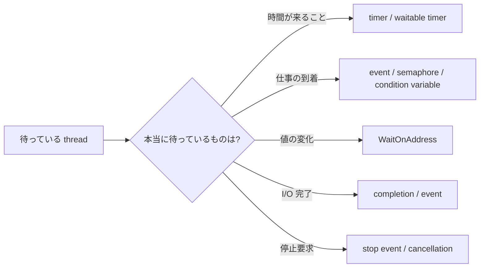

# Windows でタイマー待機よりイベント待機を優先する理由 - 約15.6ms 粒度のポーリングを避ける

前回の[Windows ソフトリアルタイムの実践ガイド](https://comcomponent.com/blog/2026/03/09/000-windows-soft-realtime-practical-guide-natural/)では、`Sleep` 任せの周期ループを避ける話を書きました。  
今回はその中でも、なぜ **短い timer wait より event wait を優先したいのか** を 1 点に絞って整理します。

Windows では、`Sleep(1)` や短い timeout 付きの wait を使って「一定時間ごとに様子を見る」設計をすると、どうしても **system clock の粒度** と **その後のスケジューリング遅延** の影響を受けます。  
普通の設定では 15.6ms 級の platform timer resolution が前提になることが多いので、「1ms 後にもう一回見よう」というつもりでも、実際にはかなり雑な待ちになりやすいです。

一方で、仕事の到着、I/O 完了、停止要求、状態変化のように、本当に待ちたいものが「時間」ではなく「出来事」なら、一定間隔で見に行く必要はありません。  
**イベントが起きた側が signal し、待つ側は event を待つ** ほうが、遅延にも CPU にも電力にも素直です。

この記事では、次の問いに答える形で整理します。

- `Sleep(1)` や短い timer wait が、なぜ思ったより正確でないのか
- なぜ event wait はその制限を受けにくいのか
- どういう場面で timer ではなく event を選ぶべきか
- それでも timer を使うべき場面は何か

## 目次

1. まず結論（ひとことで）
2. 何が問題なのか  
   * 2.1. timed wait は system clock の粒度に縛られる  
   * 2.2. 期限が来ても、すぐ実行されるとは限らない  
   * 2.3. `Sleep(1)` は 1ms 周期の意味にならない
3. なぜイベント待機が有利なのか  
   * 3.1. 待ちの終了条件が「時間切れ」ではなく「signal」になる  
   * 3.2. 何を待ちたいのかで道具を分ける  
   * 3.3. event も魔法ではない
4. 典型的なアンチパターン  
   * 4.1. `Sleep(1)` でキューをポーリングする  
   * 4.2. `Thread.Sleep(1)` / `Task.Delay(1)` で状態を監視する
5. こう直す  
   * 5.1. producer が到着時に signal する  
   * 5.2. `WaitForMultipleObjects` で work と stop を同時に待つ  
   * 5.3. 同一プロセスなら `WaitOnAddress` も候補
6. それでも timer を使う場面  
   * 6.1. 時間そのものが条件のとき  
   * 6.2. waitable timer を使う  
   * 6.3. `timeBeginPeriod` を常用しない
7. レビュー時のチェックリスト
8. まとめ
9. 参考資料
10. 関連記事

* * *

## 1. まず結論（ひとことで）

- **仕事の到着や I/O 完了を待つなら、timer ではなく event を待つ** ほうがよいです。
- Windows の timed wait は、どうしても system clock の粒度の影響を受けます。
- `Sleep(1)` は「1ms 後に正確に起きる」意味ではありません。
- しかも timeout が過ぎても、thread はまず ready になるだけで、即実行は保証されません。
- だから **「本当は出来事を待っているのに、timer で様子を見に行く」設計は、遅延にも電力にも不利** です。
- timer を使うのは、**本当に時間そのものが条件** のときだけに絞ったほうがきれいです。

実務での言い方にすると、ほぼこれです。

- 「5 秒おきに metrics を送る」  
  → timer の仕事
- 「キューに仕事が入ったらすぐ動く」  
  → event / semaphore / condition variable / `WaitOnAddress` の仕事
- 「I/O が終わったら続きを実行する」  
  → completion / event の仕事
- 「停止要求が来たら止まる」  
  → stop event / cancellation の仕事

つまり、**待ちたい理由を、時間と出来事で分ける** のが先です。  
ここが混ざると、設計がじわじわ荒れます。

## 2. 何が問題なのか

### 2.1. timed wait は system clock の粒度に縛られる

Windows の wait functions の timeout 精度は、system clock resolution に依存します。  
`Sleep` も同じで、指定したミリ秒がそのまま「その通りの長さ」で保証されるわけではありません。

ここで大事なのは、**1ms を指定したから 1ms 後に起きるとは限らない** という点です。

Windows の電力評価ドキュメントでは、既定の system timer resolution は 15.6ms とされていて、多くのハードウェアでも最大 timer period はだいたい 15.6ms 級です。  
つまり、特に何もしていない普通の環境では、短い timed wait はかなり粗い粒度の世界に乗っています。

> `Sleep()` Timer does not coalesce. Avoid writing idle loops based on sleep. Convert to event driven implementation.

Microsoft のドキュメントがここまで直球で書いているので、わりと話は明快です。  
「短い sleep で様子を見る idle loop」は、Windows の都合にも合っていません。

### 2.2. 期限が来ても、すぐ実行されるとは限らない

さらにややこしいのは、timeout が過ぎた瞬間に thread が即実行されるわけではないことです。

`Sleep` の説明にもある通り、待ち時間が終わったあと thread は **ready** にはなりますが、**今すぐ CPU をもらって走れる保証はありません**。  
ほかの thread、priority、CPU の idle state、DPC/ISR、lock 競合などの影響を受けます。

つまり、短い timer wait には少なくとも 2 段階の不確実さがあります。

1. そもそも timeout の判定自体が timer 粒度に引っ張られる
2. timeout 後も、実行開始は scheduler 次第になる

このため、「1ms ごとに起きて確認する」つもりの loop は、実際にはかなり雑な起床になります。

### 2.3. `Sleep(1)` は 1ms 周期の意味にならない

`Sleep(1)` を見ると、つい「1ms ごとに回る loop」っぽく見えます。  
でも実際には、そう読んではいけません。

たとえば次のような loop です。

```cpp
while (!g_stop)
{
    Step();
    Sleep(1);
}
```

この loop は、実際には次のようなものです。

- `Step()` の実行時間が毎回足される
- `Sleep(1)` の待ち時間自体が粒度に引っ張られる
- 目が覚めても、すぐ走れるとは限らない

なので、周期はすぐにぶれます。  
`Sleep(1)` は 1ms 周期の実装ではなく、**「少なくとも少し休む」** くらいに読んだほうが実態に近いです。

.NET の `Thread.Sleep(1)` でも事情は同じです。  
ドキュメントにも、実際の timeout は clock ticks に合わせて調整されると書かれています。

## 3. なぜイベント待機が有利なのか

### 3.1. 待ちの終了条件が「時間切れ」ではなく「signal」になる

event wait が有利なのは、待ちの意味が変わるからです。

timer wait は、こうです。

- まだ何も起きていなくても
- 一定時間が来たら起きる
- 起きてから「何か起きたか」を確認する

event wait は、こうです。

- 何かが起きた側が signal する
- signal されたら待ちが満たされる
- 起きた時点で、もう理由がある



この違いはかなり大きいです。  
**「起きる理由がないのに、定期的に起きて見に行く」** のが polling で、  
**「理由ができた側が、待っている相手を起こす」** のが event-driven です。

後者のほうが自然なのは、まあそうだろう、という話です。

### 3.2. 何を待ちたいのかで道具を分ける

まずの判断は、だいたい次の表で足ります。

| 待ちたいもの | よくない例 | まずの選択 |
| --- | --- | --- |
| キューに仕事が入ること | `Sleep(1)` で `TryPop` する | event / semaphore |
| I/O が完了すること | timer で状態を見に行く | overlapped I/O の event / IOCP |
| 停止要求が来ること | 100ms ごとに stop flag を見る | stop event / cancellation |
| 同一プロセス内の値変化 | `while (flag == 0) Sleep(1)` | `WaitOnAddress` |
| 時刻が来ること | event に無理やり寄せる | timer / waitable timer |

この表で大事なのは、API 名より **何を待ちたいのか** を先に見ることです。

本当はキュー到着を待っているのに timer を使うのは、  
「宅配便を待っているのに、1 分ごとに玄関を開けて道路を見る」みたいなものです。  
届いたらチャイムを鳴らしてもらったほうが、そりゃ筋がよいです。

### 3.3. event も魔法ではない

ここは 1 つだけ注意です。

event wait は、**timer 粒度で起きる必要がない** という意味で有利ですが、  
**signal された瞬間に絶対ゼロ遅延で走る** わけではありません。

event wait でも、実際には次の影響は受けます。

- scheduler latency
- thread priority
- CPU の power state
- lock 競合
- page fault
- DPC / ISR

なので、event は魔法の粉ではありません。  
ただし少なくとも、**「次の timer tick まで寝ている」という余計な待ち方は外せます**。  
これだけでも設計上のノイズがかなり減ります。

## 4. 典型的なアンチパターン

### 4.1. `Sleep(1)` でキューをポーリングする

いちばんよく見るのはこれです。

```cpp
for (;;)
{
    if (g_stop)
    {
        break;
    }

    WorkItem item;
    if (TryPop(item))
    {
        Process(item);
        continue;
    }

    Sleep(1);
}
```

この書き方は、一見単純ですが、問題が 3 つあります。

1. **queue が空でも定期的に起きる**  
   何もないのに CPU を起こします。

2. **latency が timer 粒度に引っ張られる**  
   item が到着しても、次に polling するまで気づけません。

3. **power 的にも損**  
   idle loop を短い sleep で回すと、CPU を無駄に起こしやすくなります。

これを `Sleep(1)` から `Sleep(10)` に変えると、今度は latency が悪化します。  
つまりこの設計は、**CPU か latency のどちらかを必ず犠牲にする** 方向へ寄りやすいです。

### 4.2. `Thread.Sleep(1)` / `Task.Delay(1)` で状態を監視する

C# / .NET でも同じ匂いは出ます。

```csharp
while (!stoppingToken.IsCancellationRequested)
{
    if (_queue.TryDequeue(out WorkItem? item))
    {
        await ProcessAsync(item, stoppingToken);
        continue;
    }

    await Task.Delay(1, stoppingToken);
}
```

見た目は async で穏やかでも、設計の本質は polling です。

- queue が空でも起きる
- 仕事が来ても、次の poll まで反応できない
- delay を短くすると CPU / power に効く
- delay を長くすると反応が鈍る

つまり、`Task.Delay(1)` は event-driven になったわけではなく、  
**async 版の定期巡回** を書いているだけです。

## 5. こう直す

### 5.1. producer が到着時に signal する

queue 到着待ちなら、polling ではなく **producer が signal する** 形に変えます。

考え方はこうです。

- producer が queue に item を入れる
- item を入れた直後に `SetEvent` する
- consumer は `WaitForSingleObject` または `WaitForMultipleObjects` で待つ
- 起きたら queue を drain する

これなら、**何もないときは寝たまま** で、**仕事が来たときだけ起きる** ようになります。

### 5.2. `WaitForMultipleObjects` で work と stop を同時に待つ

単純な worker なら、次の形が分かりやすいです。

```cpp
#include <windows.h>
#include <cstdio>
#include <mutex>
#include <queue>
#include <stdexcept>

class WorkQueue
{
public:
    WorkQueue()
        : _workEvent(CreateEventW(nullptr, FALSE, FALSE, nullptr)),
          _stopEvent(CreateEventW(nullptr, TRUE, FALSE, nullptr))
    {
        if (_workEvent == nullptr || _stopEvent == nullptr)
        {
            throw std::runtime_error("CreateEventW failed.");
        }
    }

    ~WorkQueue()
    {
        CloseHandle(_workEvent);
        CloseHandle(_stopEvent);
    }

    void Enqueue(int value)
    {
        {
            std::lock_guard<std::mutex> lock(_mutex);
            _queue.push(value);
        }

        if (!SetEvent(_workEvent))
        {
            throw std::runtime_error("SetEvent(work) failed.");
        }
    }

    void RequestStop()
    {
        if (!SetEvent(_stopEvent))
        {
            throw std::runtime_error("SetEvent(stop) failed.");
        }
    }

    void WorkerLoop()
    {
        HANDLE waits[2] = { _stopEvent, _workEvent };

        for (;;)
        {
            DWORD rc = WaitForMultipleObjects(2, waits, FALSE, INFINITE);

            if (rc == WAIT_OBJECT_0)
            {
                return;
            }

            if (rc != WAIT_OBJECT_0 + 1)
            {
                throw std::runtime_error("WaitForMultipleObjects failed.");
            }

            for (;;)
            {
                int value = 0;

                {
                    std::lock_guard<std::mutex> lock(_mutex);
                    if (_queue.empty())
                    {
                        break;
                    }

                    value = _queue.front();
                    _queue.pop();
                }

                std::printf("processing %d\n", value);
            }
        }
    }

private:
    HANDLE _workEvent;
    HANDLE _stopEvent;
    std::mutex _mutex;
    std::queue<int> _queue;
};
```

この例のポイントは 3 つです。

- `Sleep(1)` が消えている
- item 到着時に producer が `SetEvent` している
- worker は `stop` と `work` を同時に待っている

これで、queue が空のときに定期的に起きる必要がなくなります。  
到着時だけ signal すればよいので、latency も CPU も素直です。

なお、**到着数を数えたい**、**複数 consumer で work count を正確に表したい** なら、event より semaphore のほうが自然なこともあります。  
大事なのは、timer poll をやめて **signal-based design** にすることです。

### 5.3. 同一プロセスなら `WaitOnAddress` も候補

同じプロセス内で、単に「ある値が変わるまで待ちたい」だけなら、`WaitOnAddress` もかなり有力です。

`WaitOnAddress` は、`Sleep` を `while` loop の中で回すより効率がよく、event object より簡単に書けることがあると、Microsoft のドキュメントでも説明されています。

たとえば次のような場面です。

- `readyFlag` が 0 から 1 になるのを待つ
- 状態 enum が変わるのを待つ
- 小さい共有値の変化を待つ

ただし、`WaitOnAddress` は **戻ったあとに値を再確認する** 前提の API です。  
早めに返ることもあり得るので、ここは event object と少し感触が違います。

使い分けの感覚としては、だいたいこうです。

- **プロセス間や一般的な待機対象**  
  → event / semaphore / waitable object
- **同一プロセスの軽い値変化**  
  → `WaitOnAddress`

## 6. それでも timer を使う場面

### 6.1. 時間そのものが条件のとき

もちろん、timer を使う場面はちゃんとあります。

たとえば次のようなものです。

- 5 秒ごとに metrics を送る
- 200ms 後に retry する
- 1 分ごとにキャッシュを掃除する
- 期限時刻まで待って timeout にする

ここでは待ちたいものが **本当に時間** です。  
この場合にまで event を無理やり主役にする必要はありません。

ただし、ここでも区別は大事です。

- **仕事が来るまで待つ** のに timer を使わない
- **時間が来るまで待つ** ときだけ timer を使う

この線引きがはっきりすると、コードの意図がかなり読みやすくなります。

### 6.2. waitable timer を使う

Windows で「時間そのもの」を待つなら、`Sleep` を雑に積むより、waitable timer を使ったほうが意味がはっきりします。

waitable timer は、due time が来ると timer object 自体が signaled state になります。  
つまり、timer であっても waitable object として扱えます。

しかも最近の Windows では、`CreateWaitableTimerExW` に `CREATE_WAITABLE_TIMER_HIGH_RESOLUTION` を指定して、数 ms 級の短い expiration delay が unacceptable な場面向けに high resolution timer を作れます。

ただし、ここでも主役はあくまで **time-based wait** です。  
queue 到着待ちや I/O 完了待ちを、high resolution timer で polling してよい理由にはなりません。

### 6.3. `timeBeginPeriod` を常用しない

短い timer wait の精度が気になると、つい `timeBeginPeriod(1)` を足したくなります。  
でも、これは常用の第一選択にしないほうがよいです。

理由は 3 つあります。

1. **power / performance のコストがある**  
   Microsoft の energy assessment では、system timer period を 15.6ms から 1ms に shorten すると、battery drains at least 20 percent faster と説明されています。

2. **最近の Windows では挙動が少し複雑**  
   Windows 10 version 2004 以降では、`timeBeginPeriod` は昔のような単純な global knob としては振る舞いません。  
   さらに Windows 11 では、window-owning process が fully occluded / minimized / invisible / inaudible になると、高い resolution が保証されない場合があります。

3. **根本原因を直していないことが多い**  
   本当は event で待つべき場所を timer poll のままにして、粒度だけ上げても、設計の臭いは残ります。

つまり、`timeBeginPeriod(1)` は「設計のズレ」を「電力コスト」で隠す方向へ行きやすいです。  
本当に時間待ちが必要で、その精度要件も厳しいなら、まずは waitable timer など **time を待つ専用の道具** を選んだほうが筋がよいです。

> UI thread の話は別です。  
> window を持つ thread は message pump が必要なので、`WaitForSingleObject(INFINITE)` をそのまま置くのではなく、framework-native な async/callback や message-aware な wait を使うほうが安全です。

## 7. レビュー時のチェックリスト

レビューでまず見たいのは、次の点です。

- `Sleep(1)` / `Thread.Sleep(1)` / `Task.Delay(1)` で様子見 loop を作っていないか
- 本当は queue 到着、I/O 完了、停止要求を待っているのに timer poll していないか
- producer / completion 側から signal できる設計になっているか
- `stop` と `work` を 1 回の wait でまとめて待てないか
- 同一プロセスの値変化なら `WaitOnAddress` で書けないか
- 到着回数を数えたいのに event を使っていないか  
  （この場合は semaphore のほうが自然なことがあります）
- `timeBeginPeriod` が根本対策ではなく、応急処置として増えていないか
- timer を使っている場所で、本当に待ちたいものが「時間」なのか

このチェックだけでも、polling のにおいはかなり見つかります。

## 8. まとめ

Windows で短い timer wait を使って「一定時間ごとに様子を見る」設計は、どうしても timer 粒度と scheduler の影響を受けます。  
そのため、`Sleep(1)` や短い timeout は、見た目ほど正確な待ちではありません。

一方で、仕事の到着、I/O 完了、停止要求、状態変化のように、本当に待ちたいものが「出来事」なら、event wait のほうが自然です。

まとめると、次の 1 行です。

**時間を待つなら timer、出来事を待つなら event。**

この線引きがはっきりするだけで、

- latency が読みやすくなる
- 無駄な periodic wakeup が減る
- power 的にもましになる
- コードの意図が分かりやすくなる

という形で効いてきます。

「1ms ごとに見に行く」より、  
「起きる理由ができたら起こしてもらう」ほうを先に選ぶ。  

Windows では、だいたいこちらが正解です。

## 9. 参考資料

- [Sleep function (Win32)](https://learn.microsoft.com/en-us/windows/win32/api/synchapi/nf-synchapi-sleep)
- [Wait Functions](https://learn.microsoft.com/en-us/windows/win32/sync/wait-functions)
- [WaitForSingleObject function](https://learn.microsoft.com/en-us/windows/win32/api/synchapi/nf-synchapi-waitforsingleobject)
- [Event Objects (Synchronization)](https://learn.microsoft.com/en-us/windows/win32/sync/event-objects)
- [Using Event Objects](https://learn.microsoft.com/en-us/windows/win32/sync/using-event-objects)
- [WaitOnAddress function](https://learn.microsoft.com/en-us/windows/win32/api/synchapi/nf-synchapi-waitonaddress)
- [WakeByAddressSingle function](https://learn.microsoft.com/en-us/windows/win32/api/synchapi/nf-synchapi-wakebyaddresssingle)
- [timeBeginPeriod function](https://learn.microsoft.com/en-us/windows/win32/api/timeapi/nf-timeapi-timebeginperiod)
- [CreateWaitableTimerExW function](https://learn.microsoft.com/en-us/windows/win32/api/synchapi/nf-synchapi-createwaitabletimerexw)
- [SetWaitableTimer function](https://learn.microsoft.com/en-us/windows/win32/api/synchapi/nf-synchapi-setwaitabletimer)
- [Thread.Sleep Method (.NET)](https://learn.microsoft.com/en-us/dotnet/api/system.threading.thread.sleep)
- [Application Verifier - Perf stop codes](https://learn.microsoft.com/en-us/windows-hardware/drivers/devtest/application-verifier-stop-codes-perf)
- [Results for the Idle Energy Efficiency Assessment](https://learn.microsoft.com/en-us/windows-hardware/test/assessments/results-for-the-idle-energy-efficiency-assessment)

## 10. 関連記事

- [Windows ソフトリアルタイムの実践ガイド - 遅延を減らすためのチェックリスト](https://comcomponent.com/blog/2026/03/09/000-windows-soft-realtime-practical-guide-natural/)
- [PeriodicTimer / System.Threading.Timer / DispatcherTimer の使い分け - .NET の定期実行をまず整理](https://comcomponent.com/blog/2026/03/12/002-periodictimer-system-threading-timer-dispatchertimer-guide/)
