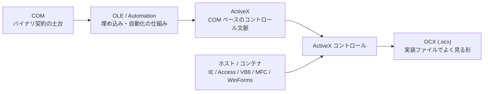

COM / ActiveX / OCX という 3 つの単語は、Windows のレガシー案件でだいたいセットで出てきます。

- ベンダーから `.ocx` が送られてくる
- Access や VB6 の画面に謎の部品が乗っている
- 「これは COM です」と言われた直後に「ActiveX ですね」と言われる
- そのあと `regsvr32`、32bit / 64bit、IE モードあたりの単語が一斉に走ってくる

この流れ、だいたい会話の路面が急にぬかるみます。

用語が近い上に、歴史的にもかなり重なっているからです。  
ただ、実務ではここを分けて理解できると、調査、移行、説明のしやすさがかなり変わります。

この記事では、`COM とは何か`、`ActiveX とは何か`、`OCX とは何か` を、違いと関係が見える順番で整理します。  
特に、**どれが土台で、どれが部品で、どれがファイルなのか** をはっきりさせます。

## 目次

1. まず結論（ひとことで）
2. この記事でいう COM / ActiveX / OCX
3. まず一枚で整理
   - 3.1. 関係図
   - 3.2. 用語の最短整理
4. COM とは何か
   - 4.1. ひとことで言うと
   - 4.2. COM で重要なもの
5. ActiveX とは何か
   - 5.1. ひとことで言うと
   - 5.2. ActiveX はブラウザ専用ではない
6. OCX とは何か
   - 6.1. ひとことで言うと
   - 6.2. `.dll` とどう違うのか
7. 違いを表で整理
8. どこで使われていたのか
9. なぜ混同されやすいのか
10. いまの実務でどう捉えるべきか
11. よくある誤解
12. 調べるときのチェックポイント
13. まとめ
14. 参考資料

* * *

## 1. まず結論（ひとことで）

先に雑だけれど役に立つ言い方をすると、こうです。

- **COM は土台**です。Windows でコンポーネント同士がやり取りするためのバイナリ契約です
- **ActiveX は COM ベースの部品文脈**です。特に、ホストに埋め込んで使うコントロールとして出てきやすいです
- **OCX は ActiveX コントロールでよく見る実装ファイル**です。ファイル拡張子として遭遇します
- つまり、**COM = 仕組み、ActiveX = 部品の文脈、OCX = ファイル** くらいで捉えると、かなり整理しやすいです
- `ActiveX = 昔のブラウザの危ないやつ` という記憶は半分正しく、半分足りません。ActiveX はブラウザ専用ではありません
- `OCX = ActiveX` とほぼ同義で話されることは多いですが、厳密には概念とファイル拡張子を混ぜています
- いま新規開発で主役に据える技術ではありませんが、既存の Windows アプリ、Office、Access、機器 SDK、社内 Web ではまだ遭遇します

要するに、まずは次の 3 つを分けて考えるのが大事です。

1. それは **COM の話**なのか
2. それは **ActiveX コントロールの話**なのか
3. それは単に **`.ocx` ファイルを見てそう呼んでいるだけ**なのか

ここが分かると、かなり霧が晴れます。

## 2. この記事でいう COM / ActiveX / OCX

この 3 つは、実務ではしばしば雑に同居します。  
なので、この記事ではまず意味を固定します。

- **COM**: Windows のコンポーネントモデルそのもの。インターフェース、GUID、登録、呼び出しの土台
- **ActiveX**: COM を基盤にした、埋め込み可能なコントロールやその利用文脈。実務では特に **ActiveX コントロール** を指すことが多い
- **OCX**: ActiveX コントロール実装でよく見るファイル拡張子。`.ocx`

少しだけ補足すると、**歴史的には `ActiveX` という言葉はもう少し広く使われた時期があります**。  
ただ、今の実務で `ActiveX` と言ったときに困る場所の多くは、だいたい **コントロール、埋め込み、ホスト、ブラウザ、登録** あたりです。

なので、この記事でも基本は **ActiveX = ActiveX コントロール寄りの話** として進めます。

## 3. まず一枚で整理

### 3.1. 関係図

まずは、全体像を 1 枚で見るのが早いです。

ここで大事なのは、**COM と ActiveX は同じ言葉ではない** という点です。

- **COM** は土台です
- **OLE / Automation** は埋め込みや自動化のための仕組みです
- **ActiveX** は、その上で使われるコントロール文脈として出てきます
- **OCX** は、そのコントロール実装でよく見るファイルです

なので、`ActiveX は COM のことですか` と聞かれると、答えは **土台は COM だが、ActiveX は COM そのものではない** になります。

### 3.2. 用語の最短整理

言葉 | まずの理解
--- | ---
COM | 仕組み、契約、土台
ActiveX | COM ベースの埋め込み部品の文脈
ActiveX コントロール | 実際にホストへ載る部品そのもの
OCX | ActiveX コントロールでよく見るファイル拡張子
OLE / Automation | 埋め込み、自動化、連携の仕組み

最短で覚えるなら、これで十分です。

- **COM は仕組み**
- **ActiveX は部品の文脈**
- **OCX はファイル**

## 4. COM とは何か

### 4.1. ひとことで言うと

COM は **Component Object Model** の略で、Windows 上でコンポーネント同士がやり取りするための **バイナリ契約** です。

ここでいうバイナリ契約とは、ソースコードの都合や言語仕様ではなく、**コンパイル後の形でも約束が保たれるインターフェース** のことです。  
C++ で作った部品を、別の言語や別のアプリケーションから利用できるのは、この契約があるからです。

実務の感覚に寄せると、COM は `便利なライブラリの配り方` というより、**実装を隠して契約だけでつなぐ仕組み** です。

たとえば、次のようなものが COM の典型です。

- `IUnknown` による参照カウント
- `QueryInterface` によるインターフェース探索
- `IID` や `CLSID` といった GUID ベースの識別
- DLL によるインプロセス利用
- EXE によるアウトプロセス利用

要するに、COM は **Windows の部品化文化の土台** です。

### 4.2. COM で重要なもの

基本だけを押さえるなら、COM では次が重要です。

- **インターフェース中心**
  - 実装より先に、何を公開するかを決めます
- **GUID による識別**
  - クラスやインターフェースを一意に識別します
- **ホストと実装の分離**
  - 呼び出す側は内部実装を知る必要がありません
- **プロセスをまたげる**
  - 同一プロセスだけでなく、別プロセスの部品としても使えます

このへんが、COM をただの古い技術で終わらせない理由です。  
かなり早い時代から、**契約ベースで再利用する設計** をしっかり持っていました。

## 5. ActiveX とは何か

### 5.1. ひとことで言うと

ActiveX は、COM を基盤にした **再利用可能なソフトウェア部品**、特に **ホストやコンテナに埋め込んで使うコントロール** として理解するのが分かりやすいです。

実務で `ActiveX` と言うと、かなりの確率で **ActiveX コントロール** の話です。  
たとえば、ボタン、グリッド、グラフ、カレンダー、ビューア、機器連携部品のようなものが該当します。

つまり、ActiveX は **単独で偉そうに立っている巨大技術** というより、**何かのホストの中に埋め込んで働く部品** として捉えると外しにくいです。

### 5.2. ActiveX はブラウザ専用ではない

`ActiveX = Internet Explorer のやつ` という印象はかなり強いです。  
これは間違いではないのですが、**それだけではありません**。

ActiveX コントロールは、たとえば次のような場所でも使われてきました。

- Access フォーム
- VB6 アプリケーション
- MFC のコンテナ
- Office / VBA 周辺
- WinForms からの COM ラッパー利用
- Internet Explorer やその互換運用文脈

つまり、ActiveX は **ブラウザ専用技術ではなく、Windows アプリ側でも長く使われてきた部品技術** です。

ここが分からないと、社内 Web で見つけた ActiveX と、Access 画面に埋まっている ActiveX を別物に見てしまいます。  
実際には、どちらもかなり COM 寄りの親戚です。

## 6. OCX とは何か

### 6.1. ひとことで言うと

OCX は、**ActiveX コントロール実装でよく使われるファイル拡張子** です。  
Windows の現場で `.ocx` を見つけたら、かなりの確率で **埋め込みコントロール系の COM 部品** を疑ってよいです。

たとえば、次のような場面で出てきます。

- ベンダー SDK の配布物
- VB6 / Access / MFC の古いプロジェクト
- インストーラーに含まれる登録対象ファイル
- `regsvr32` が必要な部品

ここで大事なのは、**OCX はファイルの形であって、概念そのものではない** ことです。  
なので、`OCX とは何か` を雑に言うなら、**ActiveX コントロールの実体としてよく遭遇するファイル** です。

### 6.2. `.dll` とどう違うのか

ここも混乱しやすいところです。

- **`.ocx`** は、ActiveX コントロールであることをかなり強く匂わせます
- **`.dll`** は、普通のライブラリかもしれないし、COM サーバーかもしれないし、ActiveX 周辺の依存 DLL かもしれません

つまり、`.ocx` を見たらかなり ActiveX 寄りの話ですが、`.dll` を見ただけではまだ何者か分かりません。

実務でありがちなのは、

- `vendorcontrol.ocx`
- `vendorhelper.dll`
- `vendorcore.dll`

のように並んでいて、**主役は OCX、脇を DLL が支える** パターンです。

なので、`OCX = DLL の一種なのか` と聞かれたら、感覚としては近いですが、調査の場では **役割を分けて見る** のが安全です。

## 7. 違いを表で整理

言葉 | 何者か | 実務でよく見る単語 | よくある実体
--- | --- | --- | ---
COM | コンポーネントモデル、バイナリ契約の土台 | `IUnknown`, `QueryInterface`, `CLSID`, `IID`, Apartment | `.dll`, `.exe`, 登録情報
ActiveX | COM ベースのコントロール文脈 | コンテナ、埋め込み、プロパティ、イベント | ActiveX コントロール
ActiveX コントロール | 実際に配置される再利用部品 | グリッド、カレンダー、ビューア、機器連携 | `.ocx`, `.dll`
OCX | ActiveX コントロールでよく見るファイル拡張子 | `regsvr32`, ツールボックス, 32bit / 64bit | `xxx.ocx`
OLE / Automation | 埋め込みや自動化の仕組み | Office 連携、プロパティページ、オートメーション | COM ベースの各種機能

この表で覚えるなら、まずはこうです。

- **COM は基礎工事**
- **ActiveX はその上に載る部品文化**
- **OCX は現場で拾うファイル**

## 8. どこで使われていたのか

ActiveX / OCX は、ブラウザの記憶が強すぎて `昔の Web 技術` に見えがちです。  
ただ、実際にはもっと広く使われていました。

たとえば、次のような場所です。

- **デスクトップアプリ**
  - VB6
  - MFC / C++
  - Access フォーム
  - Office / VBA 周辺
- **ブラウザ / 社内 Web**
  - Internet Explorer に埋め込むビューア
  - 署名部品
  - ファイル転送部品
  - 周辺機器連携部品
- **既存 .NET アプリ**
  - WinForms からラップして使う既存 ActiveX コントロール
  - 既存 COM 資産を UI 部品として延命しているケース

ここで大事なのは、**ActiveX はインターネット専用ではない** ということです。  
IE で派手に目立ったので Web 技術っぽく見えるだけで、実態としては **Windows の埋め込み部品技術** と見るほうが実務ではしっくりきます。

## 9. なぜ混同されやすいのか

### 9.1. 言葉の階層が違うのに、同じ会話に出てくる

- COM は **土台** の話です
- ActiveX は **部品の文脈** の話です
- OCX は **ファイル** の話です

つまり、そもそも階層が違います。  
それなのに、実務では同じ現場で同時に出てくるので、会話がぐちゃっとなりやすいです。

### 9.2. `ActiveX` という言葉が少し広い

`COM` は比較的意味が固定されています。  
一方 `ActiveX` は、歴史的にも実務的にも少し広く使われます。

人によって、

- コントロールそのもの
- `.ocx` ファイル
- IE で動く古い部品
- COM ベースの埋め込み部品全般

のどれを指しているかがズレます。  
この時点で、会話はかなりぬかるみます。

### 9.3. `.ocx` を見た瞬間に全部 ActiveX と呼びたくなる

これは気持ちは分かります。  
普段はそれでだいたい通じます。

ただ、移行や調査の場面では、

- それは UI 部品なのか
- どのホストで動くのか
- 登録が必要なのか
- 32bit / 64bit はどうなっているのか
- ブラウザ依存があるのか

を分けて見ないと、あとでちゃんと転びます。

## 10. いまの実務でどう捉えるべきか

まず、COM / ActiveX / OCX を見つけたからといって、すぐに全面否定する必要はありません。  
ただし、全部を同じ温度で扱うのも危険です。

### ブラウザ側の ActiveX 依存

これは優先的に厳しめに見るほうが安全です。

- 現代のブラウザ開発の主流ではありません
- 互換運用の文脈では IE モードが話題になりますが、これは **後方互換のための橋** と見たほうがよいです
- 新規の前提技術として握るのはおすすめしにくいです

要するに、**Web 側の ActiveX は「どう延命するか」より「どこから剥がすか」** で考えるほうが現実的です。

### デスクトップ側の ActiveX / OCX 依存

こちらはもう少し現実的に判断できます。

- 既存ホストの中で安定稼働している
- 配布先が限定されている
- ベンダー保守か自社保守の見通しがある
- 登録、依存 DLL、bitness の前提が把握できている

この条件が揃うなら、**残す** 判断は普通にあります。

一方で、

- 32bit OCX を 64bit 側へそのまま読み込みたい
- 周辺だけ .NET 化したい
- 配布と登録で毎回こける
- ブラウザ依存が残っている

なら、**残す / 包む / 置き換える** を分けて考えるのが安全です。

つまり、いまの実務では `ActiveX だから悪` ではなく、**どこに境界を作るか** の問題です。  
古い技術というより、**既存システムの接合面** として見ると扱いやすくなります。

## 11. よくある誤解

### 誤解 1: COM = ActiveX

違います。  
COM は土台で、ActiveX はその上で使われるコントロール文脈です。

### 誤解 2: ActiveX = Internet Explorer

違います。  
IE で有名になったのは事実ですが、ActiveX はブラウザ専用ではありません。

### 誤解 3: ActiveX = OCX

実務ではかなり近い意味で使われますが、厳密には違います。  
ActiveX は文脈や部品の話で、OCX はファイル拡張子として遭遇する実体です。

### 誤解 4: OCX はただの DLL でしょ

雑に言えば近いですが、調査では雑にしないほうがよいです。  
`.dll` だけでは役割が読めませんが、`.ocx` はかなりコントロール寄りの匂いがします。

### 誤解 5: COM はもう死んだ技術

少なくとも Windows の世界では、そういう言い方は乱暴です。  
表舞台から少し下がって見えるだけで、設計や相互運用の文脈では今も出てきます。

## 12. 調べるときのチェックポイント

COM / ActiveX / OCX を見つけたら、まず次を確認すると整理しやすいです。

1. **それは何の部品か**
   - UI コントロールか
   - ビューアか
   - 機器連携か
   - Office / Access 連携か

2. **どこで動くか**
   - Access / VBA か
   - VB6 / MFC か
   - WinForms か
   - IE / IE モードか

3. **ファイルと識別子は何か**
   - `.ocx` / `.dll` / `.exe`
   - ProgID
   - CLSID
   - Type Library

4. **登録と配布はどうなっているか**
   - `regsvr32` が必要か
   - 依存 DLL はあるか
   - 管理者権限は必要か

5. **bitness は合っているか**
   - 32bit か
   - 64bit か
   - 同一プロセスで動く必要があるか

6. **将来どう扱うか**
   - そのまま残すか
   - 境界を作って包むか
   - 置き換えるか

このへんを見ずに、`ActiveX があるので全部新規実装します` と走ると、昔の罠をきれいに踏みます。  
地雷原で足つぼ健康法を始める必要はありません。

## 13. まとめ

COM / ActiveX / OCX の違いを、いちばん雑に、でも実務で役立つ形で言うならこうです。

- **COM は土台**
- **ActiveX は COM ベースの埋め込み部品の文脈**
- **OCX は ActiveX コントロールでよく見るファイル**

つまり、

- `COM` は仕組みの話
- `ActiveX` は部品の話
- `OCX` はファイルの話

です。

この 3 つを分けて考えられるようになると、

- これは単なる `.ocx` なのか
- COM 全体の問題なのか
- ブラウザ依存の ActiveX なのか
- デスクトップで残せる部品なのか

がかなり見えやすくなります。

レガシー技術は、名前が古いから難しいのではなく、**土台、部品、ファイルが同じ会話に出てくるからややこしい** のです。  
ただ、構造が見えれば、意外と扱える問題になります。

## 14. 参考資料

- [COM とは何か - Windows COM の設計が今でも美しい理由](https://comcomponent.com/blog/2026/01/25/001-why-com-is-beautiful/)
- [ActiveX / OCX を今どう扱うか - 残す・包む・置き換える判断表](https://comcomponent.com/blog/2026/03/12/001-activex-ocx-keep-wrap-replace-decision-table/)
- [コンポーネント オブジェクト モデル (COM) - Microsoft Learn](https://learn.microsoft.com/ja-jp/windows/win32/com/component-object-model--com--portal)
- [ActiveX コントロール - Win32 apps - Microsoft Learn](https://learn.microsoft.com/ja-jp/windows/win32/com/activex-controls)
- [ActiveX Controls | MFC - Microsoft Learn](https://learn.microsoft.com/en-us/cpp/mfc/activex-controls?view=msvc-170)
- [ActiveX Control - Access VBA - Microsoft Learn](https://learn.microsoft.com/en-us/office/vba/api/overview/activex-control)
- [Internet Explorer (IE) モードとは - Microsoft Learn](https://learn.microsoft.com/ja-jp/deployedge/edge-ie-mode)
- [DevTools を Internet Explorer モード (IE モード) で使用する - Microsoft Learn](https://learn.microsoft.com/ja-jp/microsoft-edge/devtools/ie-mode/)
